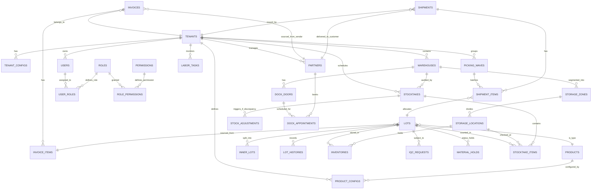

# PHASE 2: THIẾT KẾ CƠ SỞ DỮ LIỆU POSTGRESQL ĐỘC LẬP TOÀN DIỆN (COMPLETE DATABASE DESIGN)

Phase này thiết lập toàn bộ cấu trúc cơ sở dữ liệu vật lý của **Nexustock** trên **PostgreSQL**, hoạt động độc lập hoàn toàn làm Database duy nhất của hệ thống. Cơ sở dữ liệu được thiết kế theo mô hình chuẩn hóa 3NF, hỗ trợ đa nhà máy (Multi-Tenant), cấu hình động linh hoạt, hệ thống phân quyền chi tiết (RBAC) và tích hợp sẵn cấu trúc quản lý Đối tác, Kiểm kê định kỳ, Phân hoạch Vùng kho, Thuật toán cất hàng tối ưu (Slotting), Đợt gom hàng xuất (Wave Picking), Quản lý Năng suất lao động (Labor Tracking), Lịch hẹn cửa kho (Dock Doors) và Cấu hình Cảnh báo thông minh.

---

## 🗺️ 1. SƠ ĐỒ QUAN HỆ THỰC THỂ MỞ RỘNG TOÀN DIỆN (ERD COMPLETE SPECIFICATION)

---

## 🗂️ 2. CHI TIẾT CẤU TRÚC CÁC BẢNG DỮ LIỆU (DATABASE TABLES)

### A. Nhóm 1: Quản trị Hệ thống, Tài khoản & Phân quyền (Users & RBAC)

#### 1. Bảng `Tenants` (Danh sách Nhà máy / Chi nhánh)
* `id` (UUID, PK) - Định danh nhà máy.
* `name` (VARCHAR(100), NOT NULL) - Tên nhà máy.
* `code` (VARCHAR(20), UNIQUE, NOT NULL) - Mã viết tắt.
* `created_at` (TIMESTAMP, DEFAULT NOW()) - Thời gian tạo.

#### 2. Bảng `TenantConfigs` (Tham số vận hành nhà máy)
* `tenant_id` (UUID, PK, FK -> Tenants) - Liên kết nhà máy.
* `fifo_policy_level` (INT, NOT NULL, Dflt: 2) - Cấp độ kiểm FIFO (0: Tắt, 1: Cảnh báo, 2: Chặn cứng).
* `lot_no_pattern` (VARCHAR(100), NOT NULL) - Quy tắc sinh mã Lot tự động.
* `allow_negative_stock` (BOOLEAN, NOT NULL, Dflt: false) - Cho phép xuất âm kho.

#### 3. Bảng `Users` (Tài khoản người dùng)
* `id` (UUID, PK) - ID người dùng.
* `tenant_id` (UUID, FK -> Tenants) - Liên kết nhà máy.
* `username` (VARCHAR(50), UNIQUE, NOT NULL) - Tên đăng nhập.
* `password_hash` (VARCHAR(255), NOT NULL) - Mật khẩu băm.
* `full_name` (VARCHAR(100), NOT NULL) - Tên nhân viên.
* `email` (VARCHAR(100), UNIQUE) - Email.
* `is_active` (BOOLEAN, DEFAULT true) - Trạng thái hoạt động.
* `created_at` (TIMESTAMP, DEFAULT NOW()) - Thời gian tạo.

#### 4. Bảng `Roles` (Vai trò)
* `id` (UUID, PK), `name` (VARCHAR(50), NOT NULL), `code` (VARCHAR(50), UNIQUE, NOT NULL), `description` (TEXT).

#### 5. Bảng `Permissions` (Quyền chi tiết)
* `id` (UUID, PK), `name` (VARCHAR(100), NOT NULL), `code` (VARCHAR(50), UNIQUE, NOT NULL), `description` (TEXT).

#### 6. Bảng `UserRoles` (Liên kết User - Role)
* `user_id` (UUID, FK -> Users), `role_id` (UUID, FK -> Roles).

#### 7. Bảng `RolePermissions` (Liên kết Role - Permission)
* `role_id` (UUID, FK -> Roles), `permission_id` (UUID, FK -> Permissions).

---

### B. Nhóm 2: Thông tin Vật tư, Đối tác & Vị trí Kho (Master Data & Locations)

#### 8. Bảng `Products` (Mã vật tư / Linh kiện)
* `id` (UUID, PK), `code` (VARCHAR(50), UNIQUE, NOT NULL), `name` (VARCHAR(150), NOT NULL), `unit_name` (VARCHAR(20), NOT NULL).

#### 9. Bảng `ProductConfigs` (Cấu hình nghiệp vụ, Cảnh báo & Slotting của sản phẩm tại nhà máy)
| Trường | Kiểu dữ liệu | Thuộc tính | Mô tả |
|:---|:---|:---|:---|
| `id` | UUID | Primary Key | ID cấu hình |
| `product_id` | UUID | FK -> Products | Liên kết sản phẩm |
| `tenant_id` | UUID | FK -> Tenants | Liên kết nhà máy |
| `iqc_check_type` | VARCHAR(20) | NOT NULL | Loại kiểm QC (`FULL`, `SAMPLE`, `NONE`) |
| `vendor_inner_lot_ctl`| BOOLEAN | DEFAULT false | Nhà cung cấp tự quản lý mã Lot con |
| `is_wafer` | BOOLEAN | DEFAULT false | Có phải là Wafer để bật Wafer Map |
| `lot_validation_regex`| VARCHAR(255) | NULL | Regex kiểm tra định dạng Lot đặc thù |
| `min_stock` | NUMERIC(12,3) | DEFAULT 0 | Mức tồn tối thiểu để kích hoạt cảnh báo thiếu hàng |
| `max_stock` | NUMERIC(12,3) | DEFAULT 999999 | Mức tồn tối đa để kích hoạt cảnh báo thừa hàng |
| `weight_class` | VARCHAR(20) | DEFAULT 'MEDIUM'| Phân loại trọng lượng phục vụ Slotting (`HEAVY`, `MEDIUM`, `LIGHT`) |
| `rotation_speed` | VARCHAR(20) | DEFAULT 'SLOW' | Tốc độ luân chuyển phục vụ Slotting (`FAST`, `MEDIUM`, `SLOW`) |

#### 10. Bảng `Partners` (Danh sách Đối tác - Vendor & Customer)
* `id` (UUID, PK), `tenant_id` (UUID, FK -> Tenants), `name` (VARCHAR(150), NOT NULL), `code` (VARCHAR(50), UNIQUE, NOT NULL), `type` (VARCHAR(20), NOT NULL), `address` (TEXT), `created_at` (TIMESTAMP).

#### 11. Bảng `Warehouses` (Nhà kho)
* `id` (UUID, PK), `tenant_id` (UUID, FK -> Tenants), `name` (VARCHAR(100), NOT NULL), `description` (TEXT).

#### 12. Bảng `StorageZones` (Phân hoạch Vùng bảo quản trong kho)
* `id` (UUID, PK), `warehouse_id` (UUID, FK -> Warehouses), `name` (VARCHAR(100), NOT NULL), `code` (VARCHAR(50), UNIQUE, NOT NULL), `temperature_limit` (NUMERIC(5,2)), `description` (TEXT).

#### 13. Bảng `StorageLocations` (Vị trí Kệ hàng)
* `id` (UUID, PK), `warehouse_id` (UUID, FK -> Warehouses), `zone_id` (UUID, FK -> StorageZones), `code` (VARCHAR(50), NOT NULL), `max_capacity` (NUMERIC(12,3)).

---

### C. Nhóm 3: Tiếp nhận & Quản lý Lot Vật tư (Receipts & Lot Management)

#### 14. Bảng `Invoices` (PO / Hóa đơn nhập khẩu)
* `id` (UUID, PK), `tenant_id` (UUID, FK -> Tenants), `vendor_id` (UUID, FK -> Partners), `invoice_no` (VARCHAR(50), UNIQUE, NOT NULL), `po_no` (VARCHAR(50)), `received_date` (DATE).

#### 15. Bảng `InvoiceItems` (Chi tiết vật tư trong hóa đơn)
* `id` (UUID, PK), `invoice_id` (UUID, FK -> Invoices), `product_id` (UUID, FK -> Products), `expected_qty` (NUMERIC(12,3)), `received_qty` (NUMERIC(12,3)).

#### 16. Bảng `Lots` (Lô hàng chính - Outer Lot)
* `id` (UUID, PK), `invoice_item_id` (UUID, FK -> InvoiceItems), `product_id` (UUID, FK -> Products), `lot_no` (VARCHAR(50), UNIQUE, NOT NULL), `maker_lot_no` (VARCHAR(50), NOT NULL), `original_qty` (NUMERIC(12,3)), `current_qty` (NUMERIC(12,3)), `qc_status` (VARCHAR(20), Dflt: 'PENDING'), `hold_status` (BOOLEAN, Dflt: false), `manufacture_date` (DATE), `expiration_date` (DATE).

#### 17. Bảng `InnerLots` (Lot con khi chia nhỏ - Kowake)
* `id` (UUID, PK), `parent_lot_id` (UUID, FK -> Lots), `inner_lot_no` (VARCHAR(50), UNIQUE, NOT NULL), `quantity` (NUMERIC(12,3)), `created_at` (TIMESTAMP).

---

### D. Nhóm 4: Chất lượng & Lịch sử Vận hành (QC & Operations)

#### 18. Bảng `IqcRequests` (Yêu cầu kiểm tra chất lượng)
* `id` (UUID, PK), `lot_id` (UUID, FK -> Lots), `inspector_id` (UUID, FK -> Users), `requested_at` (TIMESTAMP), `status` (VARCHAR(20)).

#### 19. Bảng `IqcResults` (Kết quả kiểm chất lượng chi tiết)
* `id` (UUID, PK), `request_id` (UUID, FK -> IqcRequests), `judgement` (VARCHAR(20)), `defect_qty` (NUMERIC(12,3)), `remarks` (TEXT), `judged_at` (TIMESTAMP).

#### 20. Bảng `MaterialHolds` (Quản lý khóa/mở khóa vật tư lỗi)
* `id` (UUID, PK), `lot_id` (UUID, FK -> Lots), `reason` (TEXT), `held_by` (UUID, FK -> Users), `held_at` (TIMESTAMP), `released_by` (UUID, FK -> Users), `released_at` (TIMESTAMP).

#### 21. Bảng `LotHistories` (Lịch sử truy vết vòng đời của Lot)
* `id` (UUID, PK), `lot_id` (UUID, FK -> Lots), `event_type` (VARCHAR(50)), `description` (TEXT), `operator_id` (UUID, FK -> Users), `occurred_at` (TIMESTAMP).

---

### E. Nhóm 5: Tồn kho & Xuất kho (Inventories & Shipments)

#### 22. Bảng `Inventories` (Số lượng tồn chi tiết theo Vị trí)
* `id` (UUID, PK), `lot_id` (UUID, FK -> Lots), `location_id` (UUID, FK -> StorageLocations), `quantity` (NUMERIC(12,3)), `last_updated_at` (TIMESTAMP).

#### 23. Bảng `PickingWaves` (Quản lý Đợt gom nhiều đơn hàng xuất kho)
| Trường | Kiểu dữ liệu | Thuộc tính | Mô tả |
|:---|:---|:---|:---|
| `id` | UUID | Primary Key | ID đợt gom hàng |
| `tenant_id` | UUID | FK -> Tenants | Thuộc nhà máy nào |
| `wave_no` | VARCHAR(50) | UNIQUE, NOT NULL | Số hiệu đợt gom hàng |
| `status` | VARCHAR(20) | DEFAULT 'OPEN' | Trạng thái (`OPEN`, `PICKING`, `SORTING`, `COMPLETED`) |
| `created_by` | UUID | FK -> Users | Người tạo đợt gom hàng |
| `created_at` | TIMESTAMP | DEFAULT NOW() | Thời điểm tạo |

#### 24. Bảng `Shipments` (Yêu cầu vận chuyển / Xuất kho)
* `id` (UUID, PK), `tenant_id` (UUID, FK -> Tenants), `customer_id` (UUID, FK -> Partners), `shipment_no` (VARCHAR(50), UNIQUE, NOT NULL), `destination` (VARCHAR(150)), `shipped_at` (TIMESTAMP), `status` (VARCHAR(20)).

#### 25. Bảng `ShipmentItems` (Chi tiết các lô hàng xuất)
| Trường | Kiểu dữ liệu | Thuộc tính | Mô tả |
|:---|:---|:---|:---|
| `id` | UUID | Primary Key | ID chi tiết |
| `shipment_id` | UUID | FK -> Shipments | Thuộc vận đơn nào |
| `wave_id` | UUID | FK -> PickingWaves | Liên kết đợt gom hàng (Null nếu xuất đơn lẻ) |
| `lot_id` | UUID | FK -> Lots | Lot hàng được xuất |
| `quantity` | NUMERIC(12,3) | NOT NULL | Số lượng xuất |

---

### F. Nhóm 6: Kiểm kê & Điều chỉnh Tồn kho (Stocktaking & Adjustments)

#### 26. Bảng `Stocktakes` (Đợt kiểm kê định kỳ của nhà kho)
* `id` (UUID, PK), `tenant_id` (UUID, FK -> Tenants), `warehouse_id` (UUID, FK -> Warehouses), `title` (VARCHAR(100), NOT NULL), `status` (VARCHAR(20)), `created_by` (UUID, FK -> Users), `approved_by` (UUID, FK -> Users), `created_at` (TIMESTAMP), `approved_at` (TIMESTAMP).

#### 27. Bảng `StocktakeItems` (Chi tiết quét kiểm kê từng vị trí và Lot)
* `id` (UUID, PK), `stocktake_id` (UUID, FK -> Stocktakes), `location_id` (UUID, FK -> StorageLocations), `lot_id` (UUID, FK -> Lots), `system_qty` (NUMERIC(12,3)), `scanned_qty` (NUMERIC(12,3)), `scanned_by` (UUID, FK -> Users), `scanned_at` (TIMESTAMP).

#### 28. Bảng `StockAdjustments` (Yêu cầu điều chỉnh cân bằng kho sau kiểm kê)
* `id` (UUID, PK), `tenant_id` (UUID, FK -> Tenants), `stocktake_id` (UUID, FK -> Stocktakes), `reason` (TEXT), `status` (VARCHAR(20)), `created_by` (UUID, FK -> Users), `approved_by` (UUID, FK -> Users), `created_at` (TIMESTAMP).

#### 29. Bảng `StockAdjustmentItems` (Chi tiết vật tư điều chỉnh)
* `id` (UUID, PK), `adjustment_id` (UUID, FK -> StockAdjustments), `lot_id` (UUID, FK -> Lots), `location_id` (UUID, FK -> StorageLocations), `difference_qty` (NUMERIC(12,3)).

---

### G. Nhóm 7: Hiệu suất Lao động & Lập lịch Cửa kho (Labor & Docks)

#### 30. Bảng `LaborTasks` (Theo dõi thời gian thực hiện tác vụ của công nhân)
| Trường | Kiểu dữ liệu | Thuộc tính | Mô tả |
|:---|:---|:---|:---|
| `id` | UUID | Primary Key | ID tác vụ công việc |
| `tenant_id` | UUID | FK -> Tenants | Thuộc nhà máy nào |
| `user_id` | UUID | FK -> Users | Công nhân thực hiện |
| `task_type` | VARCHAR(50) | NOT NULL | Loại tác vụ (`INPUT`, `QC`, `SPLIT`, `PICK`, `MOVE`) |
| `reference_id` | UUID | NULL | ID của Lot, Stocktake hoặc Shipment tương ứng |
| `start_time` | TIMESTAMP | NOT NULL | Thời điểm bắt đầu nhận việc |
| `end_time` | TIMESTAMP | NULL | Thời điểm hoàn thành |
| `status` | VARCHAR(20) | DEFAULT 'IN_PROGRESS'| Trạng thái tác vụ (`IN_PROGRESS`, `COMPLETED`, `CANCELLED`) |

#### 31. Bảng `DockDoors` (Danh sách Cửa xuất nhập hàng của nhà kho)
| Trường | Kiểu dữ liệu | Thuộc tính | Mô tả |
|:---|:---|:---|:---|
| `id` | UUID | Primary Key | ID cửa kho |
| `warehouse_id` | UUID | FK -> Warehouses | Thuộc nhà kho nào |
| `door_no` | VARCHAR(20) | NOT NULL | Số hiệu cửa kho (Ví dụ: `DOCK-01`) |
| `status` | VARCHAR(20) | DEFAULT 'AVAILABLE' | Trạng thái cửa (`AVAILABLE`, `OCCUPIED`, `MAINTENANCE`) |

#### 32. Bảng `DockAppointments` (Lịch hẹn xe bốc dỡ hàng tại cửa kho)
| Trường | Kiểu dữ liệu | Thuộc tính | Mô tả |
|:---|:---|:---|:---|
| `id` | UUID | Primary Key | ID lịch hẹn |
| `dock_id` | UUID | FK -> DockDoors | Đăng ký tại cửa nào |
| `partner_id` | UUID | FK -> Partners | Thuộc nhà cung cấp / Khách hàng nào |
| `vehicle_plate` | VARCHAR(30) | NOT NULL | Biển số xe tải / Container |
| `scheduled_time`| TIMESTAMP | NOT NULL | Khung giờ hẹn đến bốc dỡ |
| `duration_minutes`| INT | DEFAULT 60 | Thời gian bốc dỡ dự kiến (phút) |
| `status` | VARCHAR(20) | DEFAULT 'SCHEDULED' | Trạng thái (`SCHEDULED`, `ACTIVE`, `COMPLETED`, `MISSED`) |

---

## 🔒 4. DANH MỤC PHÂN QUYỀN CHI TIẾT THEO CHỨC NĂNG (RBAC MAPPING)

Dưới đây là ánh xạ chi tiết giữa Vai trò (Roles) và Quyền hạn (Permissions) cho các phân hệ chức năng:

| Mã Quyền hạn (`Permission Code`) | Tên quyền | Nhân viên QC (`QC`) | Nhân viên Kho (`OPERATOR`) | Quản lý Kho (`MANAGER`) | Quản trị Hệ thống (`ADMIN`) |
|:---|:---|:---:|:---:|:---:|:---:|
| `tenant.manage` | Cấu hình nhà máy | ❌ | ❌ | ❌ | ✅ Yes |
| `user.manage` | Quản trị người dùng & vai trò | ❌ | ❌ | ❌ | ✅ Yes |
| `partner.manage` | Quản lý Vendor/Customer | ❌ | ❌ | ✅ Yes | ✅ Yes |
| `product.manage` | Quản lý danh mục vật tư | ❌ | ❌ | ✅ Yes | ✅ Yes |
| `location.manage` | Quản lý kho & sơ đồ kệ | ❌ | ❌ | ✅ Yes | ✅ Yes |
| `material.accept` | Quét nhập kho vật tư | ❌ | ✅ Yes | ✅ Yes | ❌ |
| `material.split` | Chia nhỏ Lot (Kowake) | ❌ | ✅ Yes | ✅ Yes | ❌ |
| `material.hold` | Khóa/Mở khóa Lot vật tư lỗi | ✅ Yes | ❌ | ✅ Yes | ❌ |
| `iqc.inspect` | Cập nhật kết quả kiểm QC | ✅ Yes | ❌ | ✅ Yes | ❌ |
| `stock.move` | Di chuyển vị trí kệ | ❌ | ✅ Yes | ✅ Yes | ❌ |
| `stock.transfer` | Tạo & duyệt chuyển kho | ❌ | ✅ Yes (Tạo) | ✅ Yes (Duyệt) | ❌ |
| `stocktake.manage` | Lên lịch & Duyệt kiểm kê | ❌ | ❌ | ✅ Yes | ❌ |
| `stocktake.scan` | Quét vạch kiểm đếm thực tế | ❌ | ✅ Yes | ✅ Yes | ❌ |
| `stock.adjust` | Tạo & duyệt cân bằng kiểm kê | ❌ | ❌ | ✅ Yes | ❌ |
| `wave.manage` | Tạo & điều phối đợt gom hàng | ❌ | ❌ | ✅ Yes | ❌ |
| `dock.manage` | Điều phối lịch hẹn bến bãi | ❌ | ❌ | ✅ Yes | ✅ Yes |
| `shipment.manage` | Quét đóng gói & kiểm FIFO | ❌ | ✅ Yes | ✅ Yes | ❌ |
| `fifo.bypass` | Phê duyệt bypass cảnh báo FIFO | ❌ | ❌ | ✅ Yes | ❌ |
