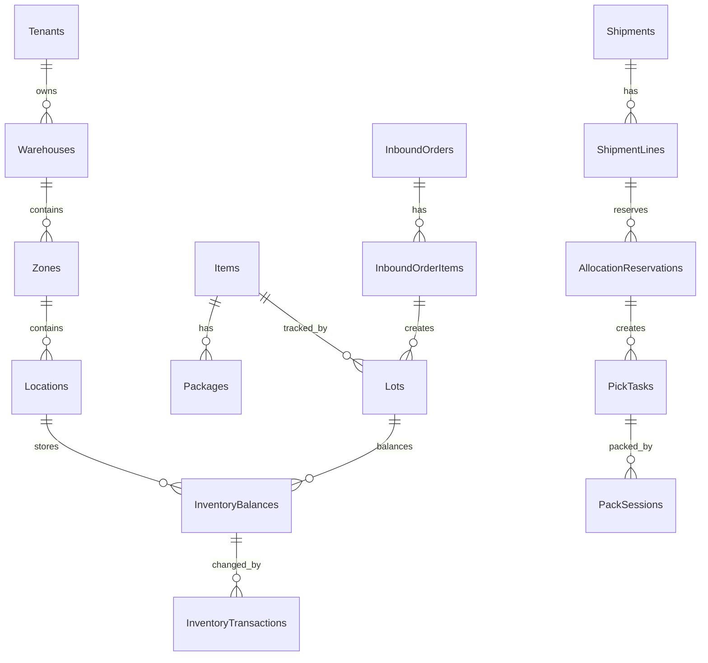

# Core ERD and schema

## ERD

## Schema rules

- `tenantId` required on all business tables.
- `warehouseId` required when record is warehouse-scoped.
- Quantity precision: `decimal(18,6)`.
- Money precision if needed later: `decimal(18,2)`.
- All mutable tables use `rowVersion` or equivalent optimistic concurrency token.
- Ledger tables are append-only.

## Canonical naming policy

Để tránh sự sai lệch giữa các tài liệu phase và code thực tế, tất cả các module phải tuân thủ nghiêm ngặt bảng tên chuẩn hóa sau:

| Khái niệm nghiệp vụ | Tên bảng Canonical | Khóa ngoại tham chiếu | Ghi chú |
|---|---|---|---|
| Số dư tồn kho | `InventoryBalances` | `warehouseId`, `locationId`, `itemId`, `lotId`, `lpnId` | Nguồn dữ liệu kiểm tra khả dụng |
| Giao dịch sổ cái kho | `InventoryTransactions` | `warehouseId`, `locationId`, `itemId`, `lotId`, `uomId` | Bảng append-only, ghi nhận lịch sử biến động |
| Phân bổ giữ hàng | `AllocationReservations` | `shipmentLineId`, `inventoryBalanceId` | Trạng thái giữ hàng cho xuất kho |
| Trạm Agent cục bộ | `AgentStations` | `tenantId` | Quản lý định danh trạm tại kho |
| Trạng thái thiết bị | `DeviceStatuses` | `stationId` | Giám sát cân, máy in trực thuộc trạm |
| Lịch sử in tem | `PrintJobs` | `stationId` | Nhật ký in tem nhãn (ZPL/TSPL) |
| Tin nhắn tích hợp | `IntegrationMessages` | `tenantId` | Log nhận đơn ERP và webhook |

## Core tables

| Table | Required fields | Main constraints | Indexes |
|---|---|---|---|
| Items | id, tenantId, itemCode, name, trackingPolicy, shelfLifeDays, status | unique tenantId+itemCode | tenantId+status, tenantId+itemCode |
| Uoms | id, tenantId, uomCode, name, baseUomId, conversionFactor | conversionFactor > 0 | tenantId+uomCode |
| Warehouses | id, tenantId, warehouseCode, name, status | unique tenantId+warehouseCode | tenantId+status |
| Zones | id, tenantId, warehouseId, zoneCode, zoneType, status | unique warehouseId+zoneCode | tenantId+warehouseId |
| Locations | id, tenantId, warehouseId, zoneId, locationCode, locationType, status, lockReason | unique warehouseId+locationCode | tenantId+warehouseId+status |
| InboundOrders | id, tenantId, warehouseId, orderNo, partnerId, status | unique tenantId+orderNo | tenantId+warehouseId+status |
| InboundOrderItems | id, tenantId, inboundOrderId, itemId, expectedQty, receivedQty, uomId, tolerancePct | receivedQty <= expectedQty + tolerance | inboundOrderId+itemId |
| Lots | id, tenantId, itemId, lotNo, manufactureDate, expiryDate, qcStatus | unique tenantId+itemId+lotNo | tenantId+itemId+qcStatus |
| InventoryBalances | id, tenantId, warehouseId, locationId, itemId, lotId, lpnId, inventoryStatus, qty | unique tenantId+warehouseId+locationId+itemId+lotId+lpnId+inventoryStatus | tenantId+itemId+inventoryStatus |
| InventoryTransactions | id, tenantId, warehouseId, transactionType, itemId, locationId, lotId, qty, uomId, sourceType, sourceId, traceId | append-only, qty != 0 | tenantId+sourceType+sourceId, tenantId+traceId |
| Shipments | id, tenantId, warehouseId, shipmentNo, partnerId, priority, status | unique tenantId+shipmentNo | tenantId+warehouseId+status |
| ShipmentLines | id, tenantId, shipmentId, itemId, requestedQty, allocatedQty, pickedQty, shippedQty | shippedQty <= requestedQty | shipmentId+itemId |
| AllocationReservations | id, tenantId, warehouseId, shipmentLineId, inventoryBalanceId, qty, status, expiresAt | qty > 0 | tenantId+status+expiresAt |
| PickTasks | id, tenantId, warehouseId, shipmentLineId, fromLocationId, itemId, lotId, qty, assignedTo, status | qty > 0 | tenantId+warehouseId+status |
| PackSessions | id, tenantId, warehouseId, shipmentId, cartonNo, weight, status | unique tenantId+cartonNo | tenantId+shipmentId+status |

## Inventory invariants

- Available quantity = balance qty - active reservations.
- No negative available quantity at commit boundary.
- Pick consumes reservation or creates audited short-pick exception.
- Ship posts immutable `SHIP` transaction.
- Count adjustment posts `COUNT_ADJUST`; direct balance edit forbidden.
