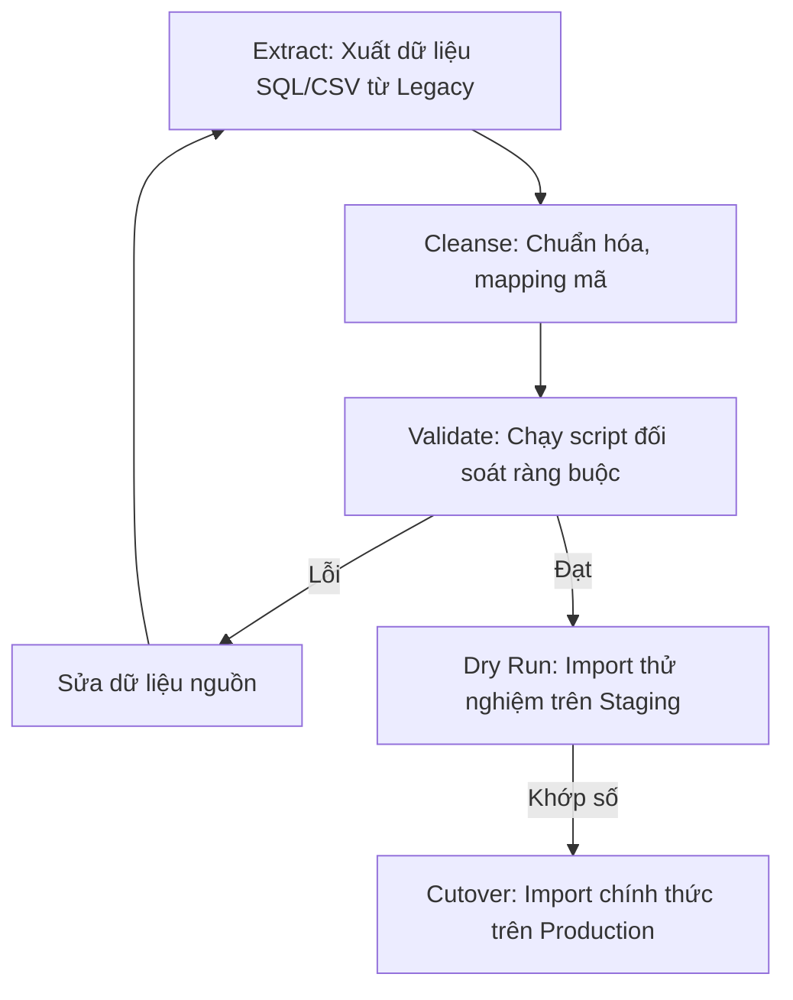

# Data Migration Plan - Nexustock WMS

Tài liệu đặc tả quy trình chuyển đổi và di chuyển dữ liệu (Data Migration) từ hệ thống desktop cũ/ERP sang hệ thống Nexustock WMS mới, đảm bảo tính toàn vẹn số liệu và không gây gián đoạn vận hành kho.

---

## 1. Phạm vi & Phân loại dữ liệu di chuyển

Quá trình di chuyển dữ liệu được phân chia thành 2 nhóm chính:

```text
+-----------------------------------------------------------------+
|                       DATA MIGRATION SCOPE                      |
+--------------------------------+--------------------------------+
                                 |
        +------------------------+------------------------+
        |                                                 |
        v Static Data (Dữ liệu tĩnh)                      v Dynamic Data (Dữ liệu động)
   - Warehouses, Zones, Locations                    - Số dư tồn kho đầu kỳ (Balances)
   - Items, Packages, UOMs, Partners                 - (Không di chuyển các GD lịch sử)
```

### 1.1 Dữ liệu tĩnh (Static Master Data)
- **Mã Kho/Khu vực/Vị trí (Warehouse, Zone, Location):** Import một lần trước cutover.
- **Danh mục Vật tư & Quy cách (Item, Package, UOM):** Đồng bộ từ ERP/Desktop cũ.
- **Danh mục Đối tác (Partner):** Nhà cung cấp, khách hàng, đơn vị vận chuyển.

### 1.2 Dữ liệu động (Dynamic Operational Data)
- **Số dư tồn kho đầu kỳ (Inventory Balances):** Số lượng thực tế theo Item, Lot, Vị trí tại thời điểm khóa kho cutover.
- **Lưu ý quan trọng:** *Không di chuyển các giao dịch lịch sử (Inventory Transactions cũ)* để giữ DB sạch. Lịch sử cũ sẽ được lưu trữ ở DB Read-Only legacy để tra cứu đối soát khi cần.

---

## 2. Quy trình Thực thi Di chuyển (Migration Pipeline)

Quy trình di chuyển trải qua 5 bước nghiêm ngặt:



### Bước 2.1: Trích xuất (Extract)
- Kết xuất dữ liệu từ SQL Server/Access của app cũ ra file CSV phẳng.
- Bắt buộc mã hóa UTF-8.

### Bước 2.2: Làm sạch & Áp dụng ánh xạ (Cleanse & Map)
- Loại bỏ các ký tự đặc biệt trong tên Item, chuyển mã đơn vị tính (UOM) về bảng chuẩn.
- Bảng ánh xạ vị trí (Location mapping table):

| Mã vị trí cũ (Legacy Loc) | Mã vị trí mới (WMS Loc Code) | Zone mới (WMS Zone) |
|---|---|---|
| K1-A1-T1 | WH01-A-01-01 | ZONE-DRY |
| QC-AREA | WH01-QC-01 | ZONE-QC |

### Bước 2.3: Đối soát trước khi nhập (Pre-validation)
Chạy script kiểm tra logic trước khi chèn vào DB mới:
- Kiểm tra tính duy nhất (Unique Constraints): Không trùng lặp cặp `tenantId + itemCode` hoặc `warehouseId + locationCode`.
- Kiểm tra khóa ngoại (Referential Integrity): Mọi vị trí import phải thuộc về một Zone đã tồn tại.
- Kiểm tra tính logic của tồn kho: `qty >= 0`, `expiryDate > manufactureDate`.

### Bước 2.4: Chạy thử nghiệm (Dry Run)
- Restore DB Staging về trạng thái trống.
- Chạy tool import dữ liệu mẫu.
- Thực hiện kiểm tra chênh lệch số SKU và tổng số lượng tồn giữa 2 hệ thống. Sai lệch cho phép = **0%**.

---

## 3. Kịch bản Cắt chuyển chính thức (Production Cutover Runbook)

Thời điểm thực hiện: **22:00 ngày Thứ Bảy** (khi kho dừng xuất nhập hàng).

| Thời gian | Bước thực hiện | Người phụ trách | Kết quả đầu ra (Deliverable) |
|---|---|---|---|
| T-3h | Khóa ghi dữ liệu trên hệ thống cũ. | Ops Lead | Không phát sinh phiếu mới. |
| T-2h | Dump dữ liệu SQL/CSV từ hệ thống cũ. | Dev chính | File CSV tĩnh và số dư tồn kho. |
| T-1h | Chạy đối soát tổng số lượng và số SKU. | Dev chính | Bảng so khớp Pivot. |
| T-0h | Chạy script Import dữ liệu tĩnh vào Prod WMS. | Dev chính | Nhập thành công Item, Location. |
| T+1h | Import số dư tồn kho đầu kỳ (`InventoryBalances`). | Dev chính | Tạo bản ghi số dư đầu kỳ. |
| T+2h | Tạo các bản ghi `InventoryTransactions` loại `INIT` | Dev chính | Log giao dịch đối chiếu. |
| T+3h | Chạy script kiểm toán chênh lệch chéo (Reconcile). | Dev chính | Báo cáo chênh lệch chéo = 0. |
| T+4h | Mở hệ thống cho thủ kho quét kiểm tra ngẫu nhiên 10 vị trí. | Thủ kho | Biên bản ký duyệt UAT. |
| T+5h | **Go-Live chính thức** | FOUNDER | Hệ thống hoạt động. |

---

## 4. Kịch bản Quay lui (Rollback Strategy)

Nếu quá trình import xảy ra lỗi nghiêm trọng vượt quá thời gian downtime (trước 04:00 sáng Chủ Nhật):

1. **Hủy bỏ giao dịch ghi:** Thực hiện `ROLLBACK` hoặc drop/create lại schema PostgreSQL trống.
2. **Khôi phục vận hành cũ:** Mở khóa ghi trên hệ thống cũ/desktop cũ để thủ kho tiếp tục làm việc vào ca sáng.
3. **Trace log:** Thu thập toàn bộ log import và mã lỗi để phân tích ngoại tuyến (Offline).

---

## 5. SQL Script Đối soát số liệu (Reconciliation Scripts)

Script chạy trên PostgreSQL WMS để kiểm tra tổng số lượng SKU và số lượng tồn đối sánh với hệ thống cũ:

```sql
-- 1. Kiểm tra SKU chưa được map vị trí
SELECT i."itemCode", i.name 
FROM "Items" i
LEFT JOIN "InventoryBalances" ib ON i.id = ib."itemId"
WHERE ib.id IS NULL AND i.status = 'Active';

-- 2. Đối chiếu tổng lượng tồn theo từng mặt hàng
SELECT 
    i."itemCode", 
    SUM(ib.qty) as "WmsTotalQty",
    legacy.total_qty as "LegacyTotalQty",
    (SUM(ib.qty) - legacy.total_qty) as "Variance"
FROM "InventoryBalances" ib
JOIN "Items" i ON ib."itemId" = i.id
JOIN (
    -- Bảng dữ liệu tạm thời import từ database cũ để đối soát
    SELECT item_code, SUM(quantity) as total_qty 
    FROM tmp_legacy_balances 
    GROUP BY item_code
) legacy ON i."itemCode" = legacy.item_code
GROUP BY i."itemCode", legacy.total_qty
HAVING SUM(ib.qty) != legacy.total_qty;
```
