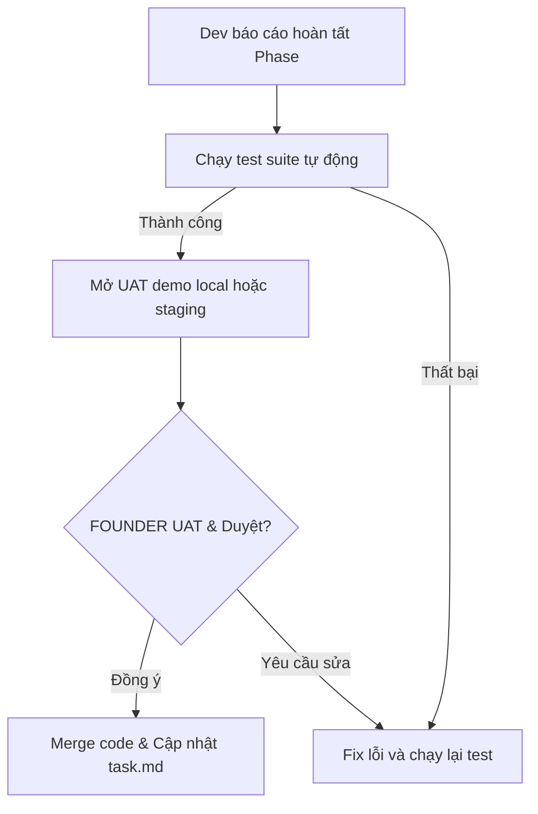

# Delivery governance (Quy trình quản trị dự án Nexustock WMS)

Tài liệu định nghĩa cơ chế phối hợp, bàn giao, kiểm soát chất lượng và quản trị thay đổi cho dự án Nexustock WMS, đặc biệt tối ưu cho mô hình **1 Developer chính** và **1 FOUNDER (Product Owner/Duyệt đầu ra)**.

---

## 1. Ma trận trách nhiệm (RACI Matrix)

Mặc dù việc lập trình do 1 Developer đảm nhiệm chính, việc phân định vai trò trách nhiệm trong các quyết định nghiệp vụ và bàn giao vận hành vẫn phải rõ ràng để tránh rủi ro:

| Vai trò trong dự án | Dev chính (1 người) | Product Owner (FOUNDER) | Ops Lead (Trưởng kho) |
|---|:---:|:---:|:---:|
| Lập kế hoạch & Roadmap | C / R | A / O | C |
| Thiết kế Database & API Contract | R / A | I | I |
| Viết mã nguồn (Backend/Frontend) | R / A | I | I |
| Phát triển Local Agent & Driver | R / A | I | I |
| Kiểm thử tự động (Unit/Integration) | R / A | I | I |
| Nghiệm thu thực tế (UAT Signoff) | C | A / O | R |
| Cắt chuyển vận hành (Cutover) | R | A / O | C |
| Xử lý lỗi khẩn cấp (Incident Level 1) | R | I | C |

*Ký hiệu:*
- **R (Responsible):** Người thực thi trực tiếp.
- **A (Accountable):** Người chịu trách nhiệm tối cao và phê duyệt kết quả.
- **C (Consulted):** Người được tham vấn ý kiến trước khi làm.
- **I (Informed):** Người được thông báo sau khi hoàn thành.
- **O (Owner):** Người sở hữu sản phẩm/quyết định.

---

## 2. Tiêu chuẩn Sẵn sàng & Hoàn thành (DoR & DoD)

Để đảm bảo việc phát triển diễn ra trơn tru mà không có downtime hoặc sửa đổi lớn sau khi code, dự án áp dụng quy tắc Gating nghiêm ngặt:

### 2.1 Tiêu chuẩn Sẵn sàng (Definition of Ready - DoR)

Một phase hoặc một task chỉ được phép bắt đầu phát triển khi:
1. **Rõ ràng nghiệp vụ:** Mô tả luồng đi của dữ liệu (execution flow) đã được ghi nhận trong file phase.
2. **Khóa Contract:** Database table schema và API endpoints của phase đó đã được chốt và khớp 100% với [core_erd_schema.md](file:///d:/1_Project/48_Nexustock/planning/enterprise/core_erd_schema.md).
3. **Môi trường sẵn sàng:** Các phase upstream phụ thuộc đã pass Acceptance Criteria.
4. **Phần cứng xác định:** (Đối với các phase tích hợp) Thiết bị cân hoặc máy in đã được xác định loại cổng COM/ZPL/TSPL và có công cụ giả lập test local.

### 2.2 Tiêu chuẩn Hoàn thành (Definition of Done - DoD)

Một phase chỉ được đánh giá là hoàn thành khi:
1. **Kiểm thử tự động vượt qua:** 100% Unit test và Integration test của module viết mới chạy thành công.
2. **Kiểm thử E2E đạt yêu cầu:** Chạy thử nghiệm luồng nghiệp vụ chính trên giao diện Web UI/RF mobile thành công.
3. **An sau dữ liệu:** Không phát sinh bất kỳ dòng tồn kho âm nào trong DB (`InventoryBalances`).
4. **Bảo mật:** Không chứa mã token, password hoặc database connection string dạng plain-text trong repo.
5. **Observability:** Mã nguồn ghi nhận đầy đủ Trace ID trong mọi transaction và log lỗi.
6. **Tài liệu hóa:** Cập nhật file `CHANGELOG.md` và `README.md` tại thư mục gốc.

---

## 3. Cổng kiểm soát Phase (Phase Gates Checklist)

Khi 1 Developer chính hoàn tất 1 phase, trước khi chuyển sang phase tiếp theo, bắt buộc phải chạy qua checklist sau cùng FOUNDER:

---

## 4. Quản lý Thay đổi Thiết kế (Change Control Process)

Do đặc thù dự án chỉ có 1 developer, việc thay đổi API contract hoặc database schema giữa chừng rất dễ gây hỏng các phase phụ thuộc downstream (tác động dây chuyền). Quy trình thay đổi bắt buộc:

1. **Đánh giá tác động (Impact Analysis):**
   - Developer liệt kê tất cả các file phase khác đang phụ thuộc vào bảng hoặc API dự kiến thay đổi (tra cứu bảng Dependency Table trong [phase_dependency_graph.md](file:///d:/1_Project/48_Nexustock/planning/enterprise/phase_dependency_graph.md)).
2. **Cập nhật Baseline tài liệu:**
   - Trước khi sửa code, bắt buộc phải cập nhật schema trong `core_erd_schema.md` hoặc `api_contracts_core.md`.
3. **Thông báo và Phê duyệt:**
   - Trình bày đề xuất thay đổi và danh sách phase bị ảnh hưởng cho FOUNDER qua chat để ký duyệt.
4. **Thực thi đồng bộ:**
   - Sửa đổi code và cập nhật đồng thời các test suite bị ảnh hưởng để tránh làm đứt gãy CI/CD build.
