# Domain state machines

## Global rules

- State values are stable enum strings, not free text.
- Every transition writes actor, timestamp, reason code when required, and trace ID.
- Invalid transition returns conflict, not silent correction.
- Completed, cancelled, rejected, voided states are terminal unless document states reopen path.
- `tenantId` is mandatory for every workflow entity; `warehouseId` is mandatory when operation happens inside warehouse.

## InboundOrder

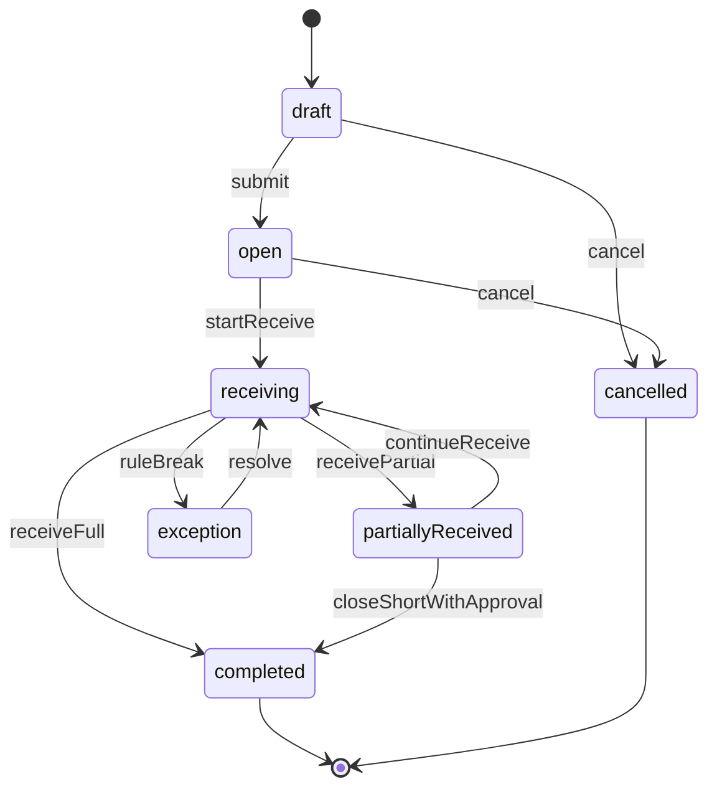

## Lot

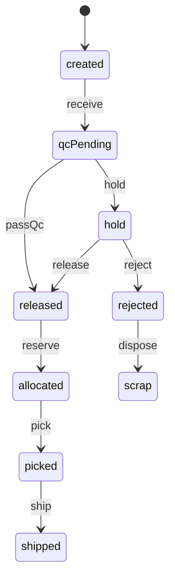

## InventoryBalance

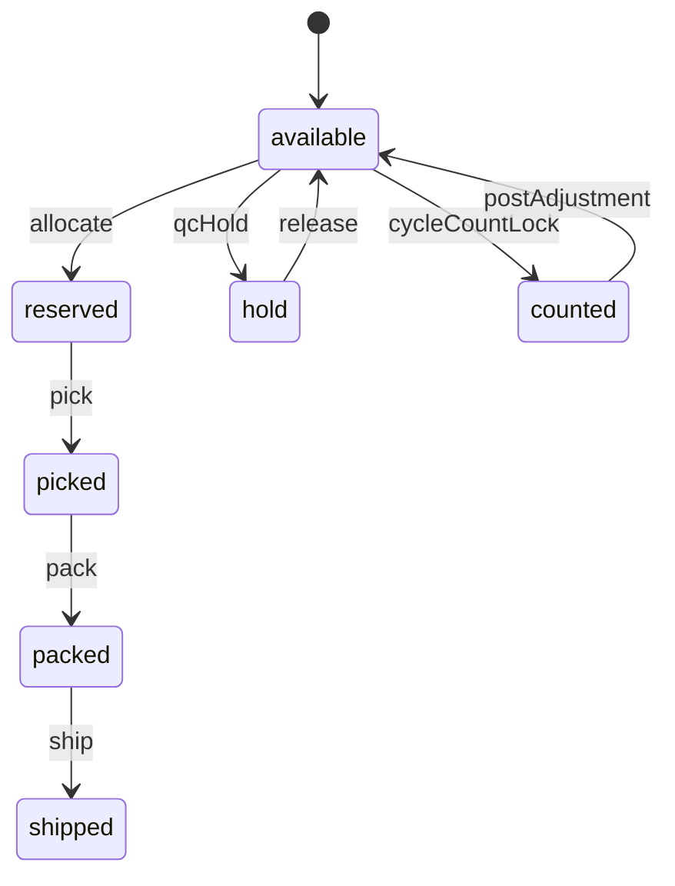

## InventoryTransaction

- Allowed types: RECEIVE, MOVE, HOLD, RELEASE, RESERVE, UNRESERVE, PICK, PACK, SHIP, COUNT_ADJUST, RETURN, SCRAP.
- Transaction rows are append-only.
- Wrong transaction is corrected by compensating transaction, never update/delete.
- Required fields: `tenantId`, `warehouseId`, `itemId`, `locationId`, `lotId`, `lpnId`, `qty`, `uomId`, `transactionType`, `sourceType`, `sourceId`, `traceId`.

## Shipment

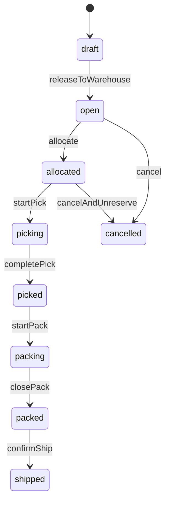

## PickTask

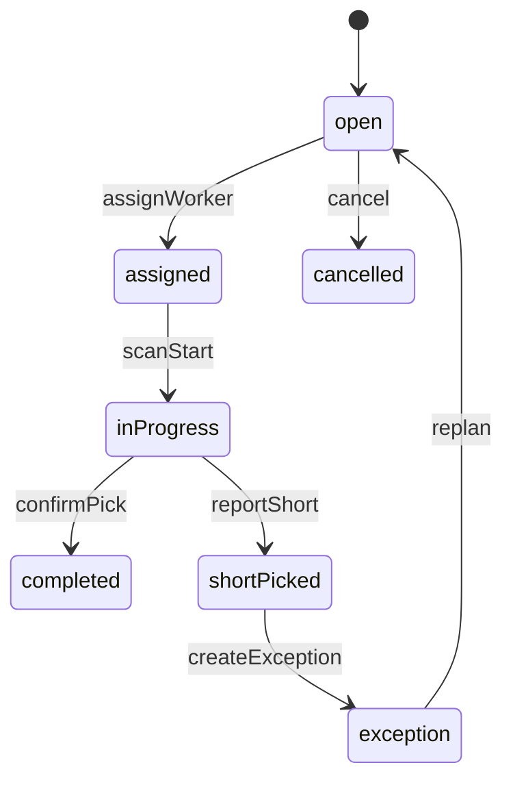

## PackSession

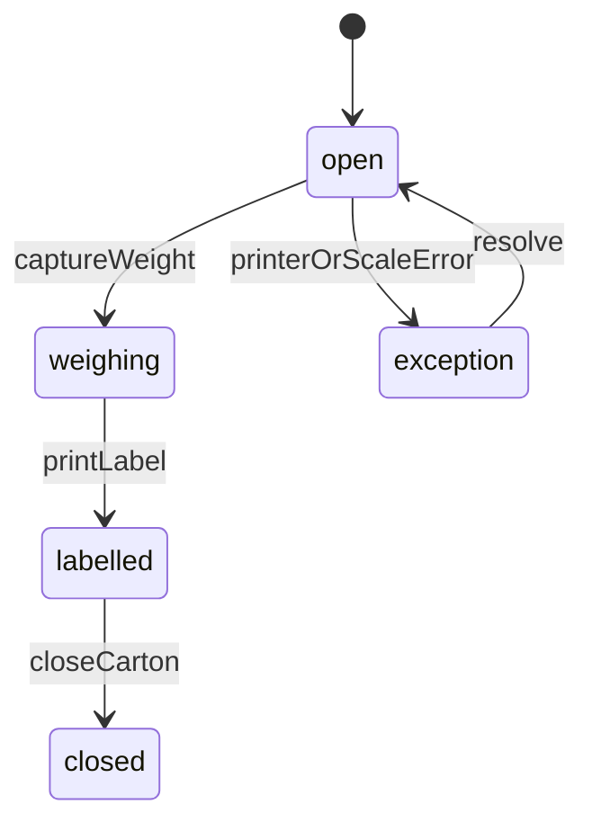

## AllocationReservation

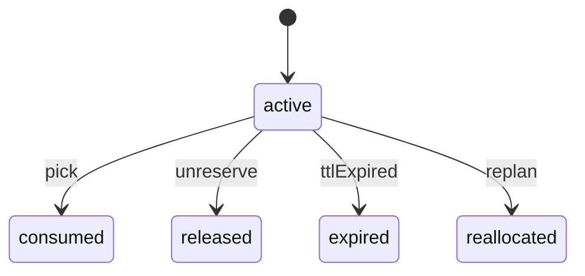

## OperationalException

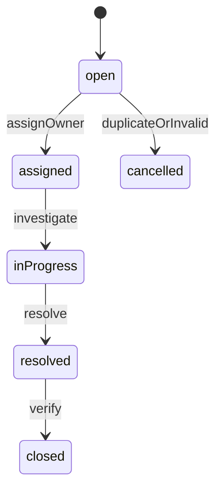

## WebhookDelivery

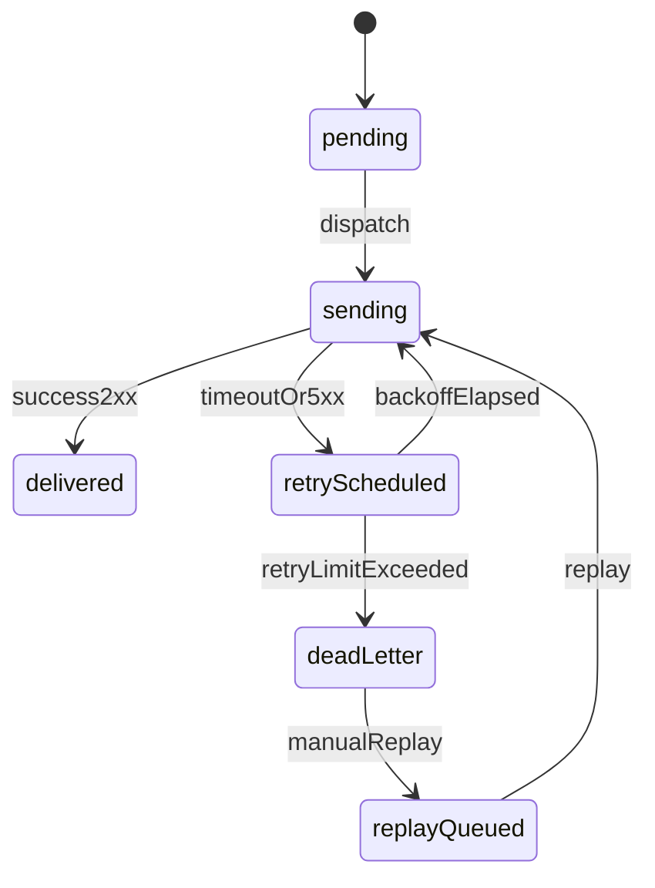

## PrintJob

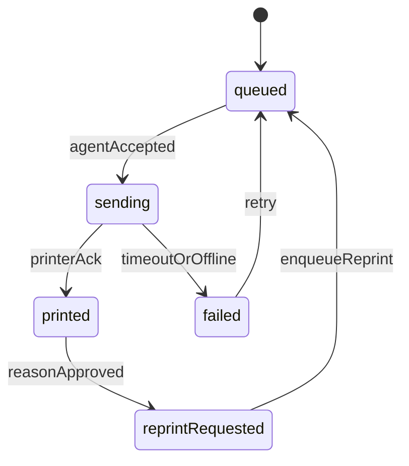

## DeviceSession

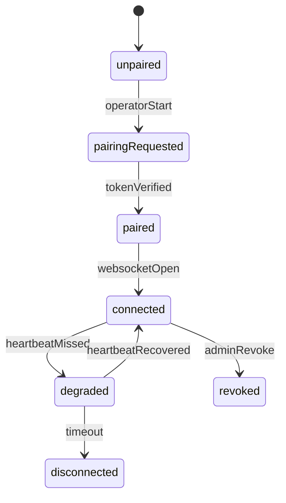
