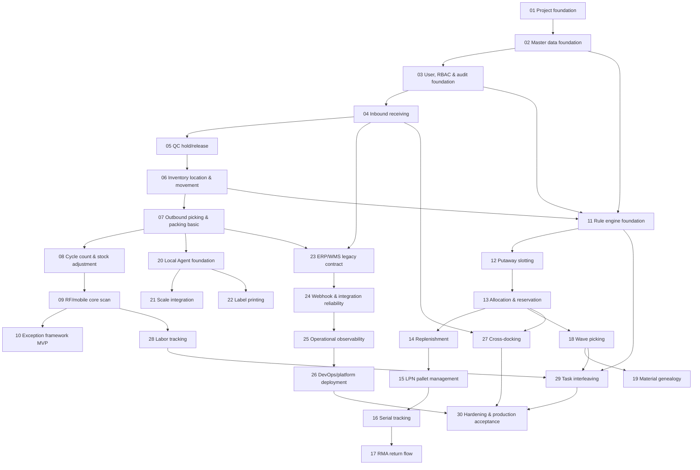

# Phase dependency graph

## Tenancy decision

- Default model: multi-warehouse cùng tenant.
- `tenantId` đại diện công ty/tổ chức.
- `warehouseId` đại diện kho vận hành trong công ty.
- Mọi bảng nghiệp vụ giữ `tenantId`.
- Bảng có ngữ cảnh kho phải có `warehouseId`.
- MVP không triển khai SaaS provisioning, billing hoặc self-service tenant onboarding.

## Device priority decision

1. Local agent Windows service.
2. Scanner keyboard wedge.
3. Scale COM.
4. Zebra ZPL printer.
5. TSC TSPL printer.

## Graph

## Phase dependency table

| Phase | Requires | Produces contract | Blocks | Risk if changed |
|---|---|---|---|---|
| 01 | None | Project structure, env, health convention | 02-30 | All downstream setup breaks |
| 02 | 01 | Item, UOM, warehouse, zone, location, partner, reason code | 03-30 | Master data FK and validation break |
| 03 | 01-02 | User, role, permission, audit, tenant scope | 04-30 | Security, audit and menu rules break |
| 04 | 01-03 | Inbound order, lot, receive transaction | 05, 06, 17, 19, 23, 27 | Receiving and lot source of truth breaks |
| 05 | 04 | QC status, hold/release/reject | 06, 07, 12, 13, 17, 19 | Bad stock may become allocatable |
| 06 | 05 | Inventory balance, movement, ledger | 07-19, 23, 27-30 | Inventory integrity breaks |
| 07 | 06 | Shipment, pick, pack, ship baseline | 08-10, 13, 18, 20-24, 27-30 | Outbound flow and integration break |
| 08 | 06-07 | Cycle count, adjustment approval | 09-10, 25, 30 | Inventory correction lacks control |
| 09 | 04, 06, 07, 08 | RF/mobile scan pattern | 10, 20, 28, 29, 30 | Warehouse UX and scan context break |
| 10 | 04-09 | Exception model and resolution path | 11-30 | Failures become ad-hoc |
| 11 | 02, 03, 06, 10 | Rule engine model | 12-14, 18, 29 | Rules hardcoded and hard to change |
| 12 | 11, 04-06 | Putaway suggestion | 13-15, 27 | Storage optimization breaks |
| 13 | 06, 07, 11-12 | Allocation and reservation | 14, 18, 27, 29 | Stock promise accuracy breaks |
| 14 | 13 | Replenishment task | 15, 18, 29 | Pick face stock may run out |
| 15 | 06, 12, 14 | LPN/pallet model | 16-19, 27 | Bulk movement traceability breaks |
| 16 | 15 | Serial tracking | 17, 19, 30 | Unit-level traceability breaks |
| 17 | 04-06, 16 | Return flow | 19, 30 | Returned inventory state breaks |
| 18 | 13-14 | Wave picking | 29, 30 | Batch picking optimization breaks |
| 19 | 04, 15-18 | Material genealogy | 30 | Recall/root-cause trace breaks |
| 20 | 07, 09, 10 | Local agent trust and device bridge | 21, 22, 25, 30 | Device access becomes insecure |
| 21 | 20 | Scale COM reading and manual fallback | 22, 25, 30 | Packing weight evidence breaks |
| 22 | 20-21 | ZPL/TSPL print jobs and reprint audit | 23, 25, 30 | Label traceability breaks |
| 23 | 04, 07, 22 | ERP/import/export contracts | 24, 25, 30 | External sync breaks |
| 24 | 23 | Retry, backoff, DLQ, replay | 25, 30 | Integration failures lose data |
| 25 | 03, 10, 20-24 | Observability, KPI, alert | 26, 30 | Production support is blind |
| 26 | 25 | DevOps/platform release runbook | 30 | Release and rollback unsafe |
| 27 | 04, 07, 13 | Cross-docking | 30 | Dock-to-ship flow unavailable |
| 28 | 09, 25 | Labor tracking | 29, 30 | Productivity optimization lacks data |
| 29 | 11, 18, 28 | Task interleaving | 30 | Work assignment remains manual |
| 30 | 01-29 | Hardening, UAT, cutover | Go-live | Production readiness unproven |

## Execution rule

- Không triển khai phase nếu upstream `requires` chưa pass acceptance criteria.
- Khi đổi contract phase upstream, bắt buộc cập nhật mọi phase trong cột `blocks`.
- Phase 26 là DevOps/platform workstream, không là business CRUD module.
