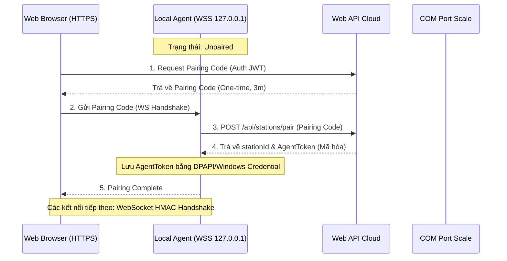

# Security Model - Nexustock WMS

Tài liệu thiết kế chi tiết mô hình bảo mật đa tầng, tối ưu hóa cho môi trường đám mây (Multi-tenant Cloud) kết hợp với vận hành thiết bị ngoại vi tại nhà kho (Local Agent).

---

## 1. Cơ chế Xác thực & Phân quyền (Authentication & Authorization)

### 1.1 Cấu trúc Token JWT (JSON Web Token)
Tất cả các API nghiệp vụ WMS đều được bảo vệ bởi JWT Token sử dụng thuật toán ký `HS256`. 
Cấu trúc Payload bắt buộc của JWT như sau:

```json
{
  "sub": "usr_01H7XZY...",
  "userId": "usr_01H7XZY...",
  "userName": "receiver.optimum",
  "tenantId": "tnt_vinamilk_01",
  "warehouseId": "wh_vsip_01",
  "roles": ["WmsReceiver"],
  "permissions": [
    "inbound_receiving.read",
    "inbound_receiving.create"
  ],
  "exp": 1782806400
}
```

> **Ghi chú thuật toán ký JWT:**  
> Phiên bản MVP sử dụng **HS256** (HMAC SHA-256 với shared secret) — phù hợp khi chỉ có 1 API server instance và không chia sẻ khóa xác thực với bên thứ ba.  
> **Upgrade sang RS256** (RSA asymmetric) bắt buộc khi xảy ra ít nhất 1 trong 3 điều kiện sau:  
> - Hệ thống scale lên từ 2 API node trở lên (cần chia sẻ public key thay vì shared secret giữa các node).  
> - Tích hợp SSO/OAuth2 với Identity Provider bên ngoài (Keycloak, Azure AD, Google Workspace).  
> - Cho phép hệ thống của đối tác (ERP/3PL) tự verify JWT token mà không cần gọi lại Nexustock API (federation).  
> *ponytail: RS256 migration không cần thay đổi database hay business logic — chỉ cần thay JWT signing config và phân phối public key endpoint. Ước tính 0.5 dev-day.*

### 1.2 Ma trận phân quyền chi tiết (RBAC Matrix)

Dưới đây là bảng phân quyền chi tiết cho 4 vai trò cốt lõi trong vận hành nhà kho:

| Quyền hạn (Permission Code) | Thủ kho nhận (WmsReceiver) | Kiểm soát QC (WmsQcInspector) | Nhân viên lấy hàng (WmsPicker) | Nhân viên đóng gói (WmsPacker) |
|---|:---:|:---:|:---:|:---:|
| `inbound_receiving.read` | ✅ | ✅ | ❌ | ❌ |
| `inbound_receiving.create` | ✅ | ❌ | ❌ | ❌ |
| `lot.hold` | ❌ | ✅ | ❌ | ❌ |
| `lot.release` | ❌ | ✅ | ❌ | ❌ |
| `inventory.move` | ✅ | ✅ | ✅ | ❌ |
| `pick.execute` | ❌ | ❌ | ✅ | ❌ |
| `pack.execute` | ❌ | ❌ | ❌ | ✅ |
| `print.execute` | ✅ | ✅ | ❌ | ✅ |
| `print.reprint` | ❌ | ❌ | ❌ | ✅ |

---

## 2. Bảo mật trạm Local Agent (Local Agent Security Model)

Local Agent chạy dưới dạng Windows Service và hoạt động như một WebSocket Secure (`wss://`) bridge kết nối trình duyệt với thiết bị ngoại vi.



### 2.1 Cơ chế mã hóa khóa AgentToken
- **Lưu trữ cục bộ:** `AgentToken` tuyệt đối không ghi dạng clear-text vào file JSON/XML phẳng. Trên hệ điều hành Windows, Agent bắt buộc phải gọi API **DPAPI (Data Protection API)** hoặc lưu vào **Windows Credential Manager** để mã hóa khóa bằng ngữ cảnh bảo mật của User chạy dịch vụ.
- **Xác thực WebSocket:** Mọi bản tin WS Client gửi lên Agent phải đính kèm:
  - `timestamp` (UTC ISO 8601).
  - `signature` = `HMAC-SHA256(payload, AgentToken)`.
  - Local Agent sẽ reject bản tin nếu `Time Skew` (độ lệch thời gian máy trạm và client) lớn hơn **30 giây** để chống tấn công phát lại (Replay Attack).

### 2.2 PowerShell Deployment Script cho Self-Signed Certificate
Để trình duyệt (HTTPS) không chặn WebSocket Secure (`wss://127.0.0.1:9000`), Local Agent builder phải sinh chứng chỉ SSL nội bộ và trust tự động trên máy trạm của thủ kho qua script sau:

```powershell
# 1. Tạo Root Certificate cục bộ
$cert = New-SelfSignedCertificate -Type Custom -KeySpec Signature `
    -Subject "CN=Nexustock Local CA" -KeyExportPolicy Exportable `
    -HashAlgorithm sha256 -KeyLength 2048 `
    -CertStoreLocation "Cert:\CurrentUser\My" `
    -KeyUsage PropertySign, CertSign

# 2. Export chứng chỉ để import vào Root Store
$certPath = "$env:TEMP\nexustock_ca.cer"
Export-Certificate -Cert -FilePath $certPath

# 3. Trust chứng chỉ tự ký hệ thống
Import-Certificate -FilePath $certPath -CertStoreLocation "Cert:\LocalMachine\Root"
Import-Certificate -FilePath $certPath -CertStoreLocation "Cert:\CurrentUser\Root"

# 4. Bind chứng chỉ vào Port 9000 cho WebSocket Server
# Lưu ý: $cert.Thumbprint là dấu vân tay của cert vừa tạo
$guid = [Guid]::NewGuid().ToString("B")
netsh http add sslcert ipport=127.0.0.1:9000 certhash=$cert.Thumbprint appid=$guid
```

---

## 3. Các biện pháp chống IDOR & CSRF (IDOR & CSRF Mitigations)

### 3.1 Chống IDOR (Insecure Direct Object Reference)
WMS áp dụng cơ chế tự động lọc theo Tenant (Global Query Filter) trong Entity Framework Core nhằm cách ly dữ liệu:

```csharp
// Cấu hình Entity Framework Core DbContext
protected override void OnModelCreating(ModelBuilder modelBuilder)
{
    base.OnModelCreating(modelBuilder);

    // Tự động áp dụng bộ lọc tenantId cho tất cả thực thể có Interface ITenantEntity
    foreach (var entityType in modelBuilder.Model.GetEntityTypes())
    {
        if (typeof(ITenantEntity).IsAssignableFrom(entityType.ClrType))
        {
            modelBuilder.Entity(entityType.ClrType)
                .HasQueryFilter(ConvertFilterExpression(entityType.ClrType));
        }
    }
}
```
Tại tầng API, Controller bắt buộc kiểm tra quyền sở hữu đối tượng trước khi thực hiện mutation:
- API `/api/inbound/orders/{orderId}/receive` bắt buộc kiểm tra:
  `inboundOrder.tenantId == userClaim.tenantId && inboundOrder.warehouseId == userClaim.warehouseId`

### 3.2 Phòng chống CSRF (Cross-Site Request Forgery)
- Mọi API Mutation (POST, PUT, DELETE) dùng cookie-based session bắt buộc phải đính kèm **X-CSRF-TOKEN** or **Antiforgery Token** trong header HTTP.
- Trong ASP.NET Core: Kích hoạt `[ValidateAntiForgeryToken]` hoặc cấu hình tự động tại DI:
  ```csharp
  services.AddAntiforgery(options => options.HeaderName = "X-XSRF-TOKEN");
  ```

---

## 4. Nhật ký Kiểm toán hệ thống (Audit Logging)

Bảng ghi log kiểm toán (`AuditLogs`) lưu vết bất biến các thay đổi trạng thái và hành vi override nhạy cảm:

| Trường dữ liệu (Field) | Kiểu dữ liệu | Mô tả |
|---|---|---|
| `Id` | Guid | Khóa chính |
| `TenantId` | String | Định danh Tenant |
| `TraceId` | String | Trace ID của API request |
| `Actor` | String | User thực hiện (`userId` hoặc `system_job`) |
| `ActionType` | String | Loại thao tác (`PERMISSION_CHANGE`, `WEIGH_OVERRIDE`, `REPRINT`) |
| `EntityName` | String | Tên thực thể chịu ảnh hưởng (`InventoryBalances`, `PrintJobs`) |
| `EntityId` | String | ID thực thể |
| `OldValues` | JSON | Dữ liệu cũ trước khi đổi (dùng cho debug và phục hồi) |
| `NewValues` | JSON | Dữ liệu mới sau khi đổi |
| `ReasonCode` | String | Mã lý do bắt buộc giải trình |
| `Timestamp` | DateTime | Thời gian ghi nhận (UTC) |
