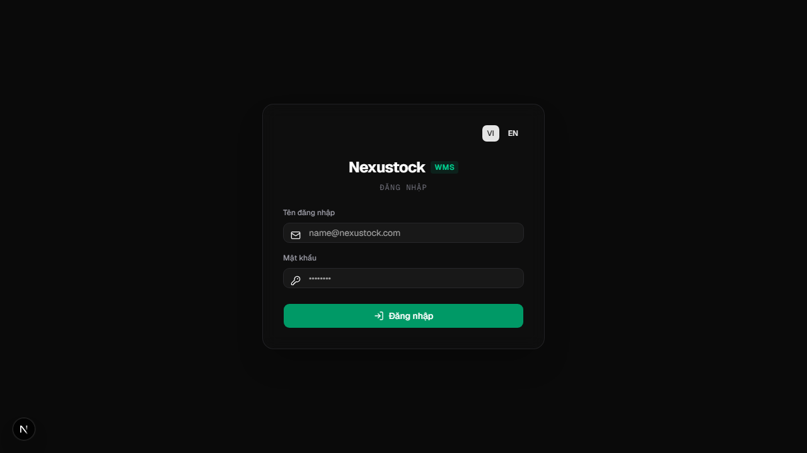
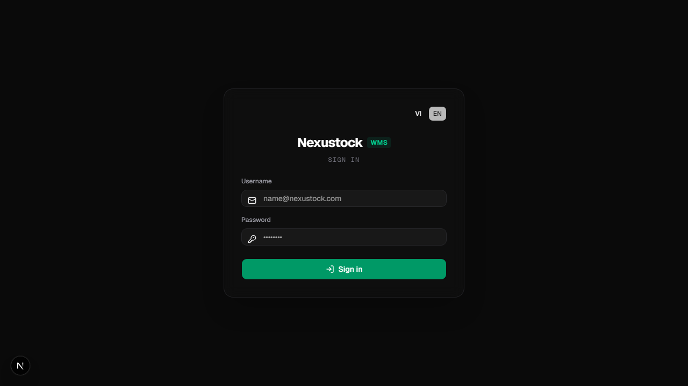

# Walkthrough DBM — Phase 31 + 31a Localization

**Ngày:** 2026-07-21  
**Workflow:** `dbm` · Playwright Chromium · MCP quality attested  

## Verdict: PASS

P31 switcher/cookie/lang + P31a module catalogs runtime — xác nhận bằng ảnh, video và `verify_i18n`.

## Evidence

| Artifact | Path |
|---|---|
| Screenshots | `planning/evidence/phase_31_31a_dbm/*.png` |
| Video | `planning/evidence/phase_31_31a_dbm/walkthrough-locale-switch.webm` |
| Result JSON | `planning/evidence/phase_31_31a_dbm/dbm_result.json` |
| Brain copy | `walkthrough_dbm_phase31_31a.md` (antigravity brain) |

### Login VI

### Login EN

### Checks (`dbm_result.json`)

- defaultLangVi ✅
- switchToEn ✅
- cookieNextLocale ✅
- persistReload ✅
- switchBackVi ✅
- noPageError (P31a catalogs) ✅

### Verify

- `tests/verify_i18n.ps1 -Phase 31a` PASS  
- `tests/verify_i18n.ps1 -Phase 31` PASS (1855 keys)

### Script

`tests/helpers/dbm_phase31_31a_browser.mjs`
