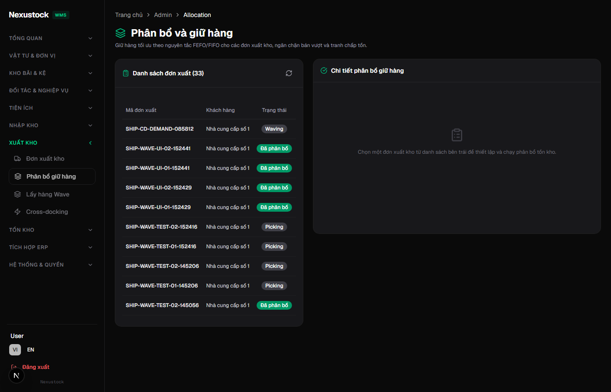
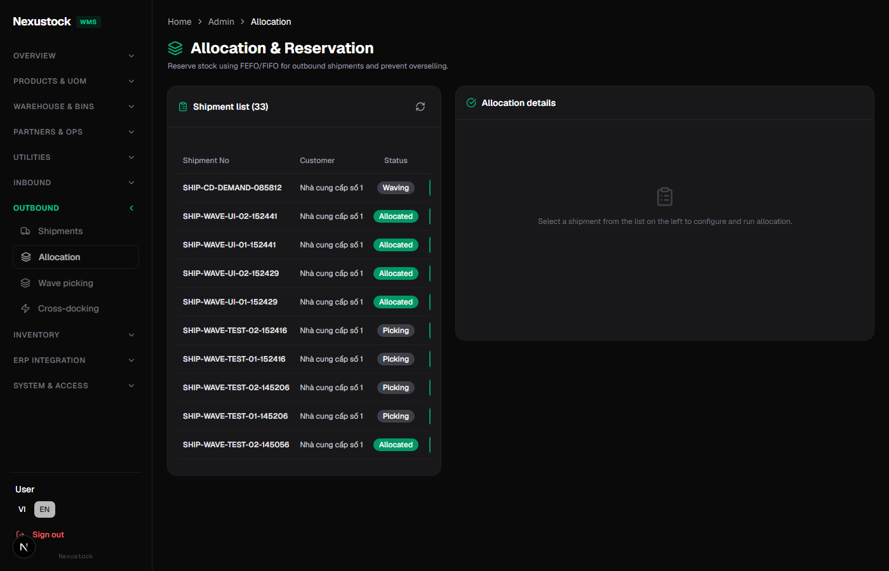

# Walkthrough DBM — Full P31 pages (admin) + P31a

**Ngày:** 2026-07-21  
**Admin:** `admin@nexustock.com` (README)  
**Script:** `tests/helpers/dbm_phase31_all_pages.mjs`  
**Evidence:** `planning/evidence/phase_31_31a_dbm_pages/`

## Verdict: PASS (0 FAIL)

| Metric | Value |
|---|---|
| Inventory target | **44** pages (§26.2) |
| Rows executed | 87 (login VI + hầu hết pages × VI/EN) |
| PASS/WARN | **83** |
| SKIP | **4** (2 routes × 2 locale — không có data seed) |
| FAIL | **0** |
| P31a | Không `pageerror` trên mọi page đã visit |

## SKIP (hợp lệ — thiếu dữ liệu)

| Route | Lý do |
|---|---|
| `admin/cross-docking/[id]` | List không có candidate link |
| `admin/genealogy/[lotNo]` | List không có lot link |

List pages tương ứng vẫn **PASS**.

## Sample evidence (VI ↔ EN)

### Allocation VI



### Allocation EN



Sidebar + title đổi ngôn ngữ; data nghiệp vụ (tên đối tác) giữ nguyên — đúng phạm vi P31 (không dịch DB).

## Artifacts

| File | Mô tả |
|---|---|
| `dbm_pages_result.json` | Tổng hợp ok/pass/skip/fail |
| `dbm_pages_detail.json` | Chi tiết từng visit |
| `matrix.md` | Bảng status |
| `shots/*.png` | Screenshot từng page/locale |
| `walkthrough-all-pages.webm` | Video full crawl |

## Xác nhận plan/phase

| Phase | Confirmed |
|---|---|
| P31 AC-01/02 switcher + cookie | ✅ (login + sidebar footer) |
| P31 AC-09 44 pages | ✅ visit matrix (SKIP chỉ dynamic thiếu data) |
| P31a merge catalogs | ✅ 0 pageerror / 0 missing-message crash |
| MCP quality_record | attested |

## Re-run

```powershell
# FE :3003 + API :5024
node tests/helpers/dbm_phase31_all_pages.mjs
```
