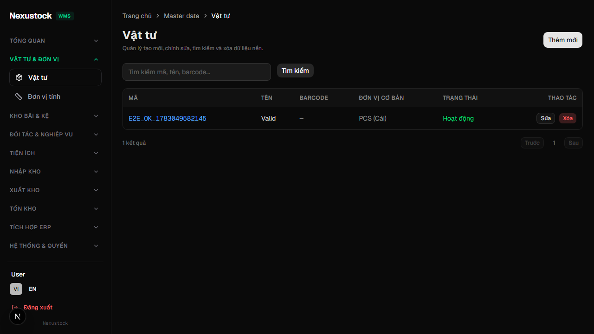
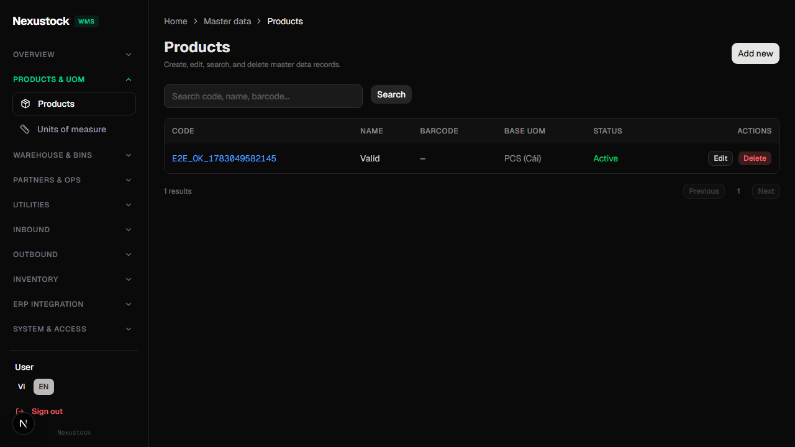
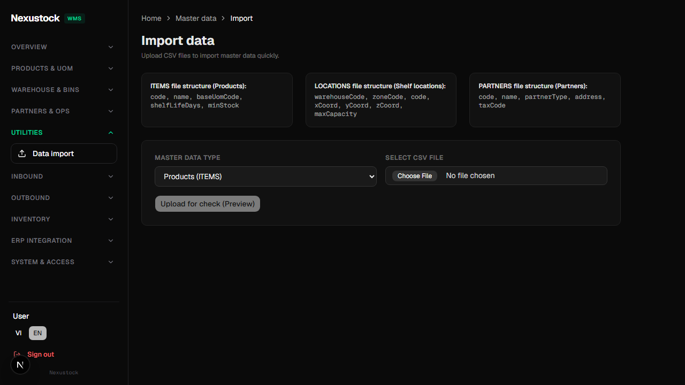

# Walkthrough DBM — Phase 32 Localization Master-data

**Ngày:** 2026-07-21  
**Workflow:** `dbm` · Playwright Chromium · MCP quality attested  
**FE:** `http://localhost:3003` · Admin seed

## Verdict: **PASS**

- Spot DoD: **products + import** VI↔EN ✅  
- Extended: **8/8** MD pages × **2** locales = **16/16** title checks ✅  
- Cookie `NEXT_LOCALE=en` sau switch ✅  
- `verify_i18n.ps1 -Phase 32` PASS (2018 keys)

## Evidence

| Artifact | Path |
|---|---|
| Screenshots | `planning/evidence/phase_32_dbm/shots/*-{vi\|en}.png` |
| Video | `planning/evidence/phase_32_dbm/walkthrough-master-data-i18n.webm` |
| Result JSON | `planning/evidence/phase_32_dbm/dbm_result.json` |
| Log | `planning/evidence/phase_32_dbm/dbm_log.txt` |
| Script | `tests/helpers/dbm_phase32_master_data_browser.mjs` |

### Products VI



### Products EN



### Import EN



## Checks (`dbm_result.json`)

| Check | Result |
|---|---|
| productsViEn | ✅ |
| importViEn | ✅ |
| all8BothLocales | ✅ 16/16 |
| cookieEnAfterSwitch | ✅ |

### Title matrix (h1)

| Page | VI | EN |
|---|---|---|
| products | Vật tư | Products |
| uoms | Đơn vị tính | Units of measure |
| warehouses | Nhà kho | Warehouses |
| zones | Vùng kho | Storage zones |
| locations | Vị trí kệ | Storage locations |
| partners | Đối tác | Partners |
| reasons | Mã lý do | Reason codes |
| import | Nhập dữ liệu | Import data |

## Self-heal

Lần 1: race AuthGuard `CHECKING SECURITY_` → h1 null trên warehouses/import EN.  
Fix script: `waitReady()` chờ hết security + có `h1` (timeout 45s) → re-run **16/16 PASS**.

## Verify CLI

```powershell
powershell -File tests/verify_i18n.ps1 -Phase 32
node tests/helpers/dbm_phase32_master_data_browser.mjs
```

## MCP

- `itfactory_quality_record_result` — attested (verify_i18n + DBM browser)
- `itfactory_quality_verify` auto chọn pytest (N/A monorepo) → dùng record_result + evidence browser

## Alignment plan/phase

| Nguồn | Khớp |
|---|---|
| phase_32 AC-32-01…08 | ✅ |
| brain EP5.2 spot | ✅ (vượt: full 8) |
| IMPLEMENTATION_PLAN P32 ✅ | ✅ + DBM evidence |
