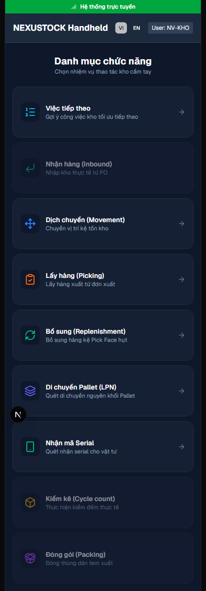
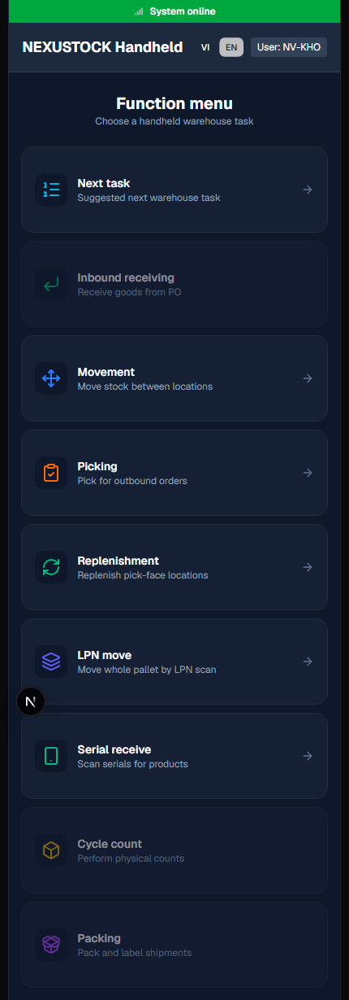
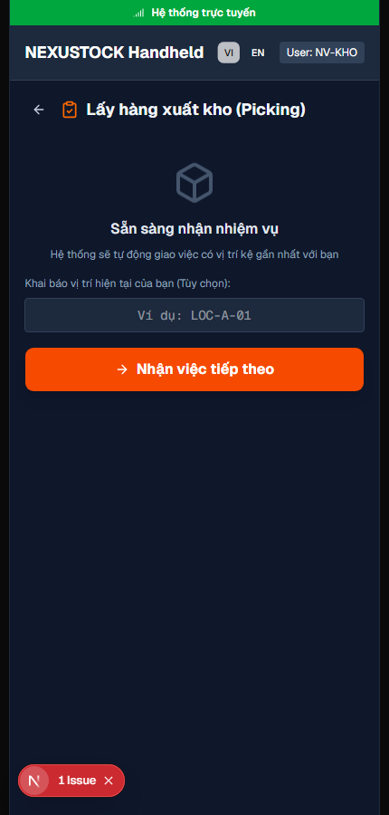
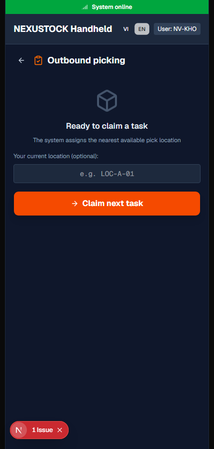
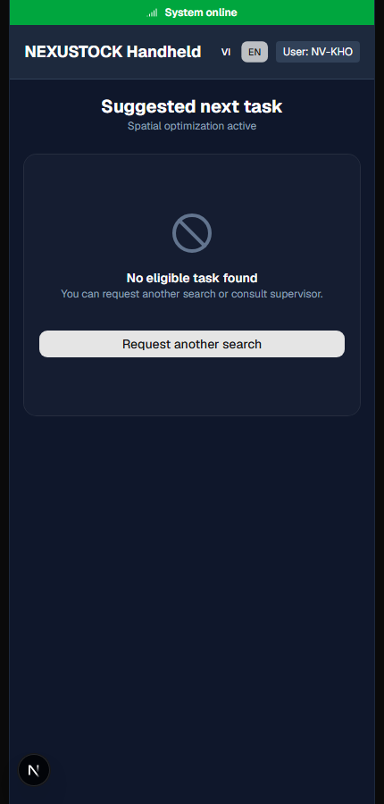
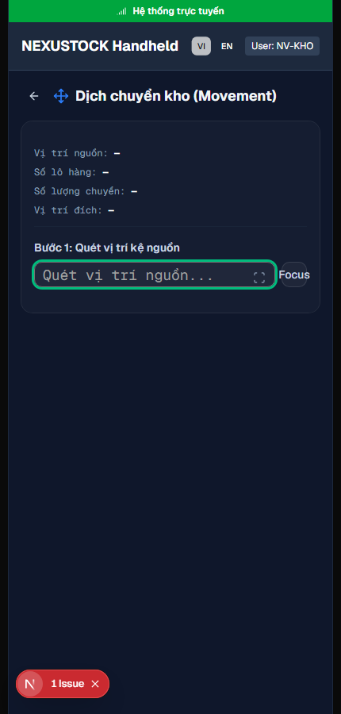
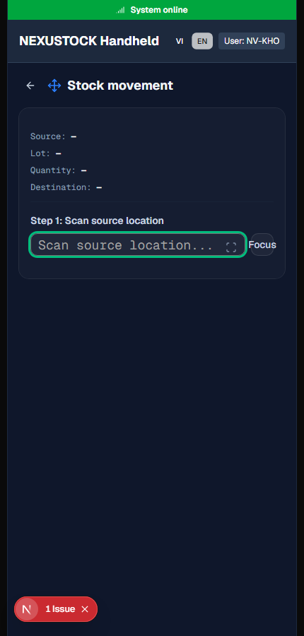
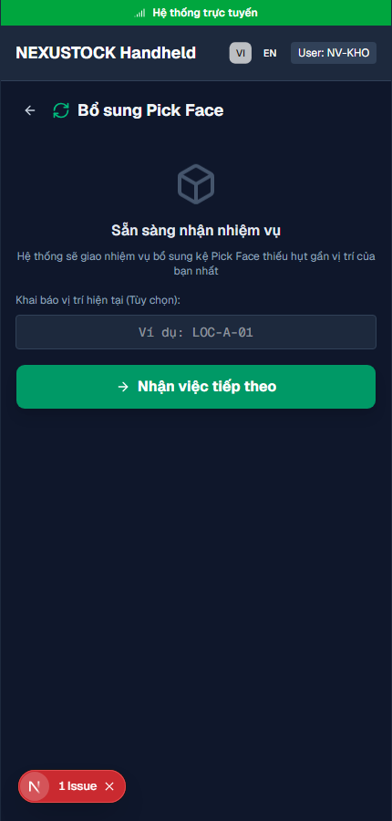
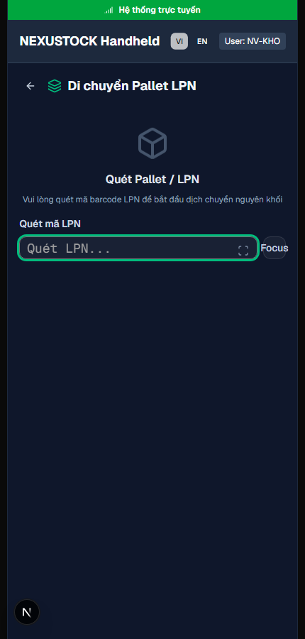
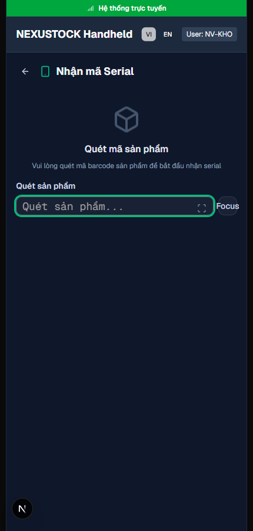

# Walkthrough DBM — Phase 33 Localization Mobile + Errors

**Ngày:** 2026-07-21  
**Workflow:** `dbm` · Playwright Chromium · MCP quality attested  
**FE:** `http://localhost:3003` · Admin seed

## Verdict: **PASS**

- Spot DoD: **home + picking + tasks/next** VI↔EN ✅  
- Extended: **7/7** mobile pages × **2** locales = **14/14** title + LanguageSwitcher ✅  
- Cookie `NEXT_LOCALE=en` sau switch ✅  
- `verify_i18n.ps1 -Phase 33` PASS (2252 keys, inventory **59/59**, 12 modules)  
- Milestone 5 product localization closed

## Evidence

| Artifact | Path |
|---|---|
| Screenshots | `planning/evidence/phase_33_dbm/shots/*-{vi\|en}.png` |
| Video | `planning/evidence/phase_33_dbm/walkthrough-mobile-i18n.webm` |
| Result JSON | `planning/evidence/phase_33_dbm/dbm_result.json` |
| Log | `planning/evidence/phase_33_dbm/dbm_log.txt` |
| Script | `tests/helpers/dbm_phase33_mobile_browser.mjs` |

### Home VI

### Home EN

### Picking VI (disk SoT)

### Picking EN

### Tasks next VI (disk SoT)

### Tasks next EN

### Movement VI / EN

### Replenishment / LPN / Serial

## Checks matrix

| Check | Result |
|---|---|
| home VI↔EN | PASS |
| picking VI↔EN | PASS |
| tasks VI↔EN | PASS |
| all 7 × 2 locales | **14/14 PASS** |
| switcher on MobileShell | PASS |
| cookie EN after switch | PASS |
| verify Phase 33 | PASS |

## AC map (Phase 33)

| AC | Evidence |
|---|---|
| AC-06 | 7/7 pages `useTranslations` + titles match catalog |
| AC-05c | Code path `resolveApiError` + `showApiErrorToast` (mobile grep clean) |
| AC-09 | inventory 59/59 via verify |
| AC-10 | Milestone 5 closed (master plan) |
| E2E | Video `walkthrough-mobile-i18n.webm` |
