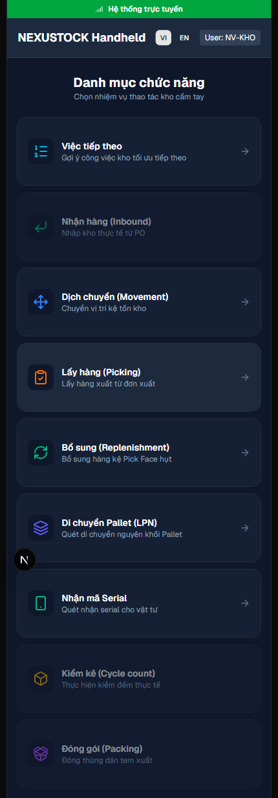
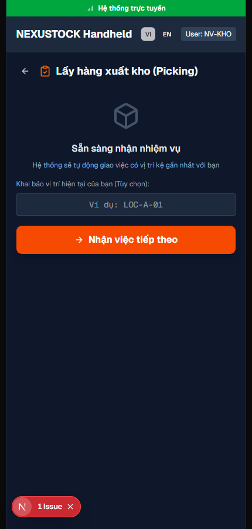
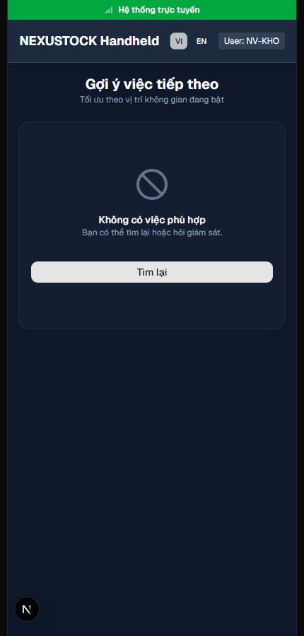

# Walkthrough Spot — Phase 33 Localization Mobile + Errors

**Ngày:** 2026-07-21  
**Workflow:** `/18-auto-execute` · Playwright spot · `verify_i18n.ps1 -Phase 33`  
**FE:** `http://localhost:3003`

## Verdict: **PASS**

- Inventory **59/59** + catalogs **12** modules + parity **2252** keys
- Mobile **7/7** i18n + MobileShell LanguageSwitcher
- Spot VI↔EN: `/mobile`, `/mobile/picking`, `/mobile/tasks/next`
- Cookie `NEXT_LOCALE=en` sau switch
- page.title disk SoT (picking / tasks)
- Errors nested keys cho `integration.*` / `validation.*` (next-intl)

## Evidence

| Artifact | Path |
|---|---|
| Screenshots | `planning/evidence/phase_33_spot/*.png` |
| Result JSON | `planning/evidence/phase_33_spot/spot_result.json` |
| Log | `planning/evidence/phase_33_spot/spot_log.txt` |
| Script | `tests/helpers/dbm_phase33_mobile_spot.mjs` |

### Mobile home VI

### Mobile home EN

### Picking VI (SoT)

### Tasks next VI (SoT)

