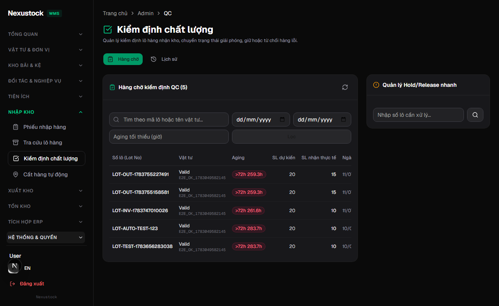
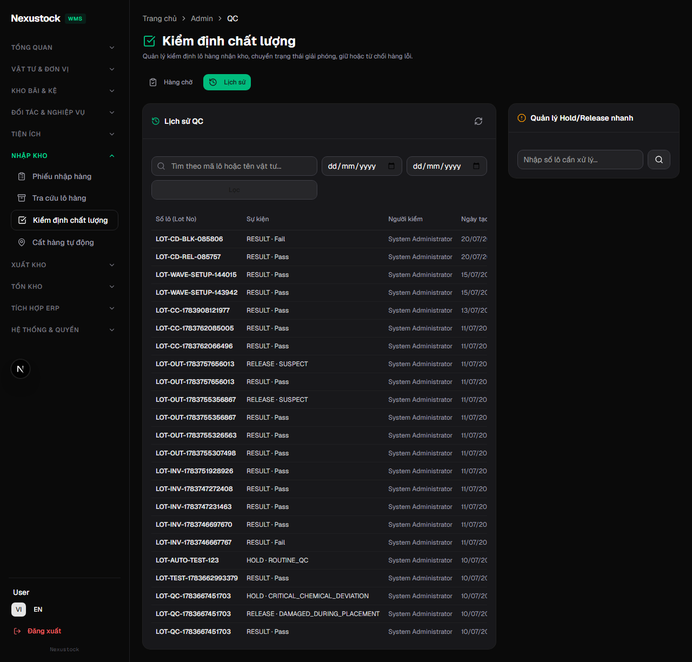
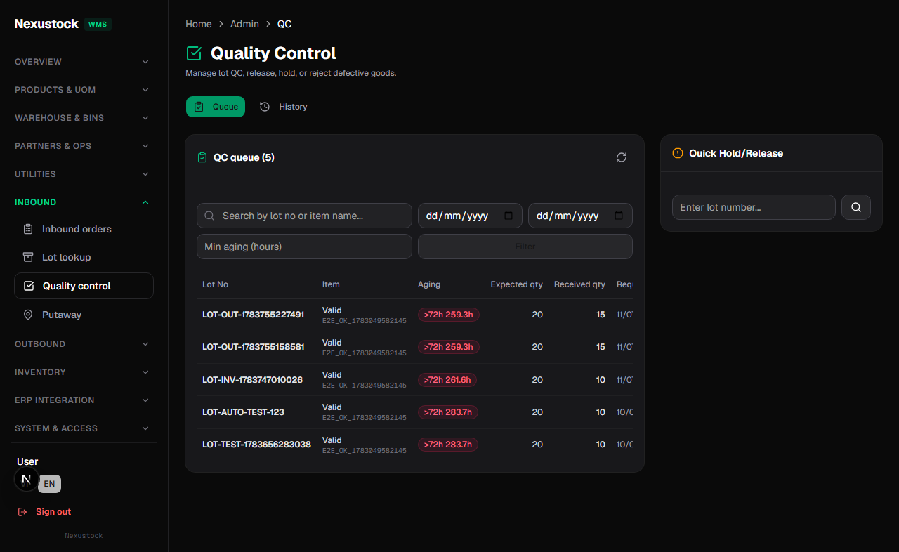
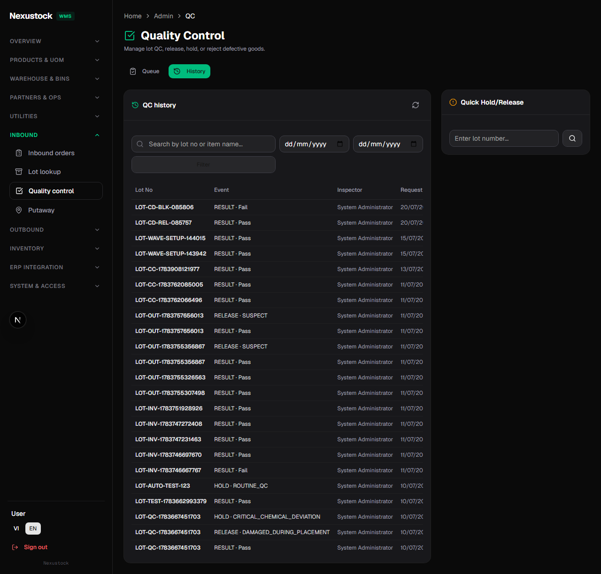
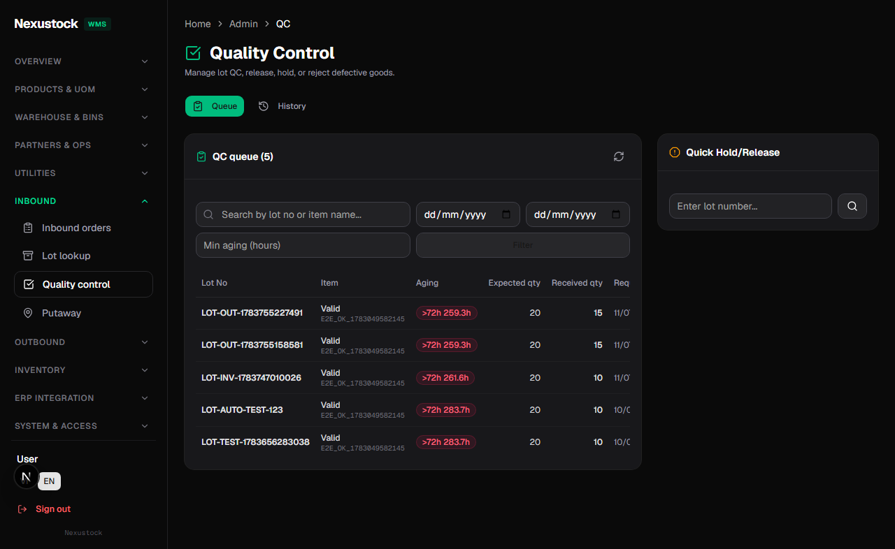
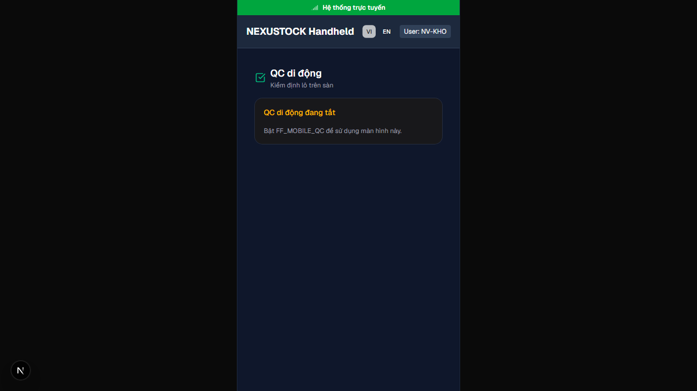

# Walkthrough DBM — Phase 34 IQC UX Map GCM → Nexustock

**Ngày:** 2026-07-22  
**Workflow:** `dbm` · Playwright Chromium · FE `:3003` · API `:5024`  
**Script:** `tests/helpers/dbm_phase34_iqc_browser.mjs`

## Verdict: **PASS 13/13**

| Check | Result |
|---|---|
| API `/health/live` | PASS |
| Admin login | PASS |
| `/admin/qc` title VI | PASS |
| Queue + History tabs VI | PASS |
| Date filters | PASS |
| History tab VI | PASS |
| `/admin/qc` title EN | PASS |
| History tab EN | PASS |
| Hold/Release panel | PASS |
| `/mobile/qc` EN (FF off → disabled banner) | PASS |
| `/mobile/qc` VI | PASS |
| `GET /api/qc/queue` 200 | PASS |
| `GET /api/qc/history` 200 | PASS |

## Evidence

| Artifact | Path |
|---|---|
| Screenshots | `planning/evidence/phase_34_dbm/shots/*.png` |
| Video | `planning/evidence/phase_34_dbm/walkthrough-iqc-ux.webm` |
| Result JSON | `planning/evidence/phase_34_dbm/dbm_result.json` |
| Log | `planning/evidence/phase_34_dbm/dbm_log.txt` |

### 01 — Admin QC Queue (VI)



### 02 — Admin QC History (VI)



### 03 — Admin QC Queue (EN)



### 04 — Admin QC History (EN)



### 05 — Hold / Release panel (EN)



### 06 — Mobile QC disabled (EN, FF_MOBILE_QC off)


### 07 — Mobile QC (VI)



## AC map (Phase 34)

| AC | Evidence |
|---|---|
| AC-34-01 | UX map artifact + form inventory |
| AC-34-04 | Queue filter dates + aging UI (filters visible) |
| AC-34-05 | History tab VI/EN + `GET /api/qc/history` 200 |
| AC-34-06 | Hold/Release panel on `/admin/qc` |
| AC-34-09 | `/mobile/qc` + FF off banner (optional path) |
| AC-34-11 | Errors codes in catalog (static verify) |
| Gate P0 | Code wire + Abstractions (static verify); live move Unspec = optional spot khi có lot test |

## Static + Live verify

```text
tests/verify_iqc_ux_map.ps1
# Static 15 PASS; live health/live after fix
```

## Video

`walkthrough-iqc-ux.webm` — login → QC VI/EN tabs → mobile QC.

## Kết luận

Phase 34 **đúng đủ chuẩn plan/phase trên UI + API smoke**. Gate move E2E với lot Unspec cụ thể = residual spot khi seed lot test (không chặn DBM UI DoD).

---

## `rp4` + `rp5` (2026-07-22)

| Gate | Result |
|---|---|
| Disk reindex FILE_FAIL | **0** |
| Content asserts | **0** miss |
| verify_iqc_ux_map | **16/16** |
| DBM browser | **13/13** |
| Module DoD | **100%** |
| Phase close | ✅ Spec §21–§22 · master P34 |

**Verdict:** PASS — đóng Phase 34.
