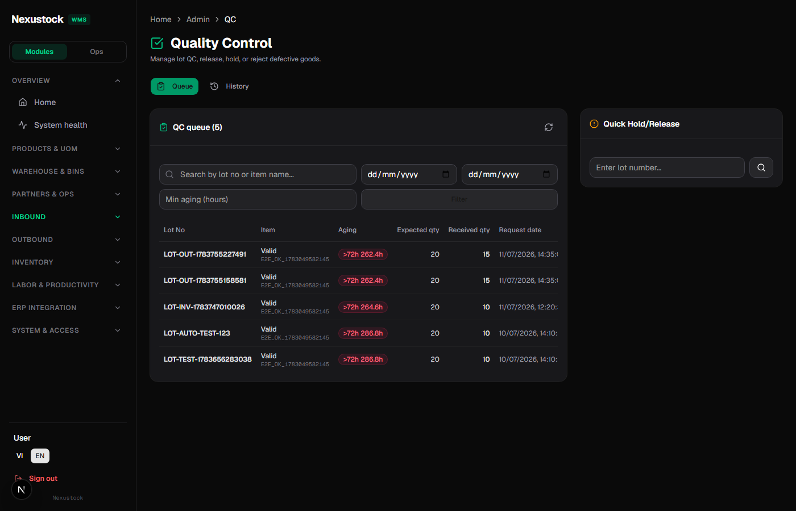
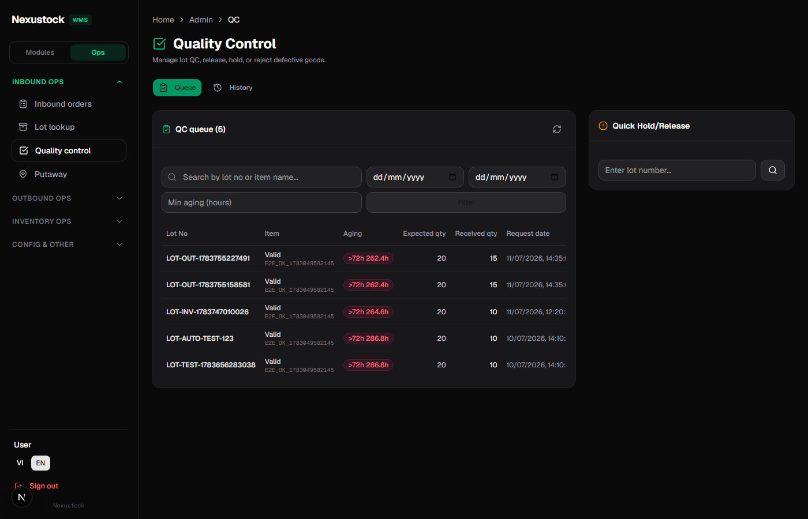
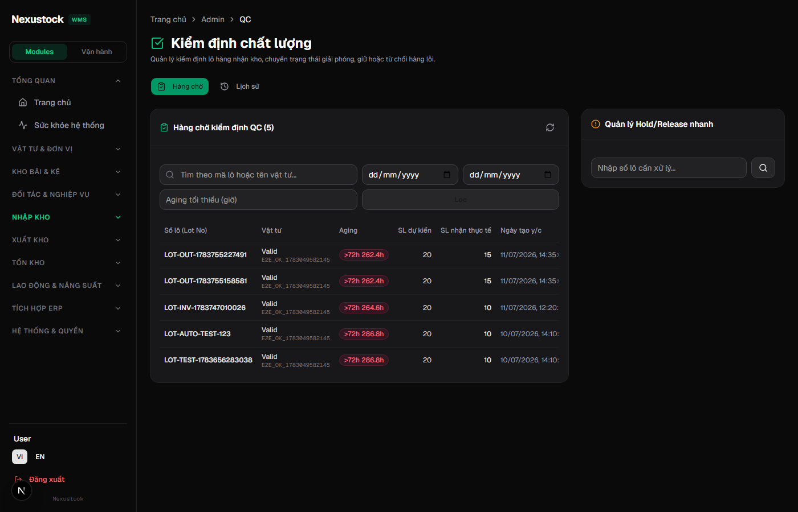
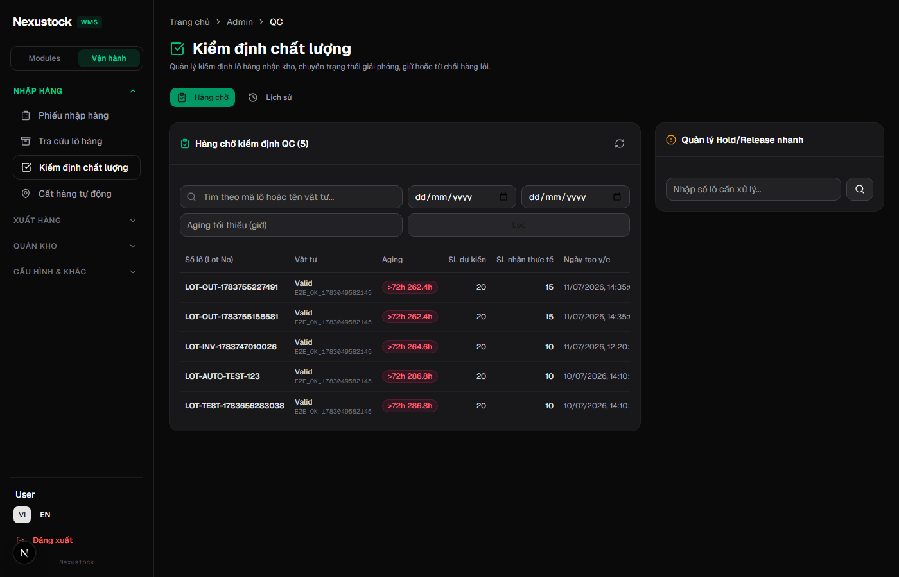
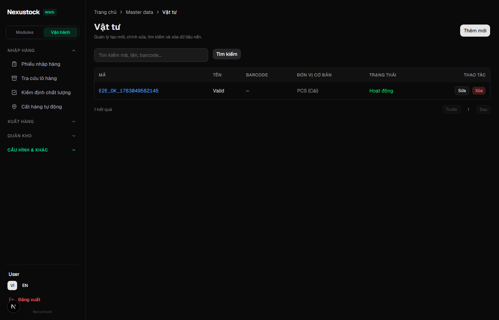

# Walkthrough DBM — Phase 35 Admin Nav Ops ↔ Modules Lens

**Ngày:** 2026-07-22  
**Workflow:** `dbm` · Playwright Chromium · FE `:3003` · API `:5024`  
**Script:** `tests/helpers/dbm_phase35_nav_browser.mjs`  
**Static:** `tests/verify_nav_lens.ps1` ALL PASS

## Verdict: **PASS 14/14** (browser) + static parity **PASS**

| Check | Result |
|---|---|
| API `/health/live` | PASS |
| Admin login | PASS |
| AC-35-01 Toggle Modules/Ops | PASS |
| AC-35-05 Labor + RMA + Import polish | PASS |
| AC-35-03 URL không đổi khi switch mode | PASS |
| AC-35-06 Ops 4 groups (Inbound/Outbound/Inventory/Other) | PASS |
| AC-35-02 localStorage = ops | PASS |
| Deep-link `/admin/qc` giữ URL + active | PASS |
| AC-35-02b Persist Modules sau F5 | PASS |
| AC-35-08a VI labor group | PASS |
| AC-35-08b VI Ops label «Vận hành» | PASS |
| AC-35-07 Admin vẫn thấy QC (permission) | PASS |
| Mount master-data có toggle | PASS |
| AC-35-10 Evidence shots + video | PASS |

## Evidence

| Artifact | Path |
|---|---|
| Screenshots | `planning/evidence/phase_35_dbm/shots/*.png` |
| Video | `planning/evidence/phase_35_dbm/walkthrough-nav-lens.webm` |
| Result JSON | `planning/evidence/phase_35_dbm/results.json` |
| Log | `planning/evidence/phase_35_dbm/run.log` |

### 01 — Modules (EN) · Labor group + Inbound active



### 02 — Ops (EN) · Inbound ops · QC deep-link



### 03 — Modules sau F5 (EN) · persist


### 04 — Modules (VI) · Lao động & Năng suất



### 05 — Ops (VI) · Vận hành · Nhập hàng



### 06 — Toggle trên master-data layout



## Video

File: [`walkthrough-nav-lens.webm`](./walkthrough-nav-lens.webm)

Luồng ghi: Login → `/admin/qc` EN → Modules polish → Ops 4 groups → F5 persist → VI Modules/Ops → master-data mount.

## AC map (Phase 35)

| AC | Evidence |
|---|---|
| AC-35-01 | Toggle testid + shot 01/02 |
| AC-35-02 / 02b | localStorage + F5 shot 03 |
| AC-35-03 | URL stable trên `/admin/qc` |
| AC-35-04 | `verify_nav_lens.ps1` set equality 44 |
| AC-35-05 | shot 01 + script polish asserts |
| AC-35-06 | shot 02/05 · 4 ops groups |
| AC-35-07 | Admin QC link visible (spot) |
| AC-35-08 | VI/EN shots 04/05 + i18n keys |
| AC-35-09 | verify grep mobile OOS |
| AC-35-10 | shots + webm |

## Static gate

```text
powershell -File tests/verify_nav_lens.ps1
# ALL PASS — 44 parity, polish A, i18n 8 keys, no mobile touch
```

## Residual (không chặn DoD)

- BS-35-07 / BS-R3-15: active path inventory vs stocktakes (pre-existing).  
- BS-R3-16: default Ops theo role = P1 OOS.

## Kết luận

**`dbm` PASS 100%** đối chiếu plan/phase §14 + §24–§25.  
**`rp4`+`rp5` PASS** — FILE_FAIL=0 · CONTENT_FAIL=0 · Module DoD **100%** (§26–§27).

**Phase 35 KHÓA ĐÓNG.**

---
JARVIS · `dbm` + `rp4`/`rp5` · 2026-07-22
