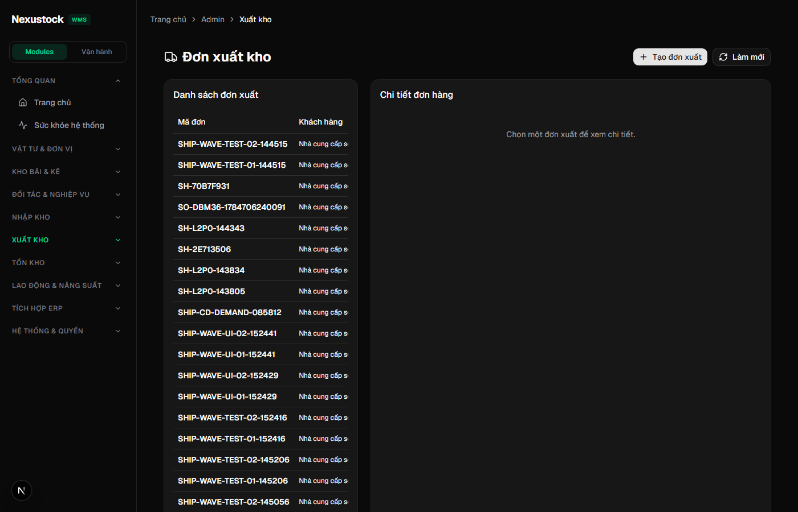
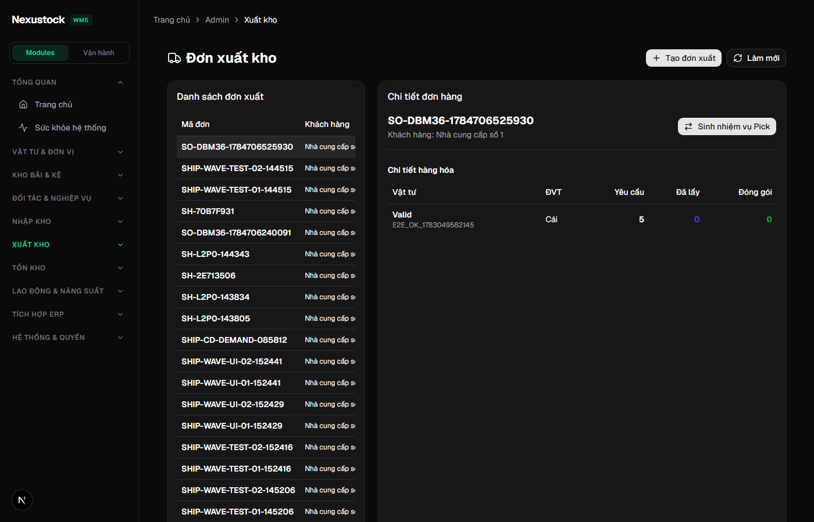
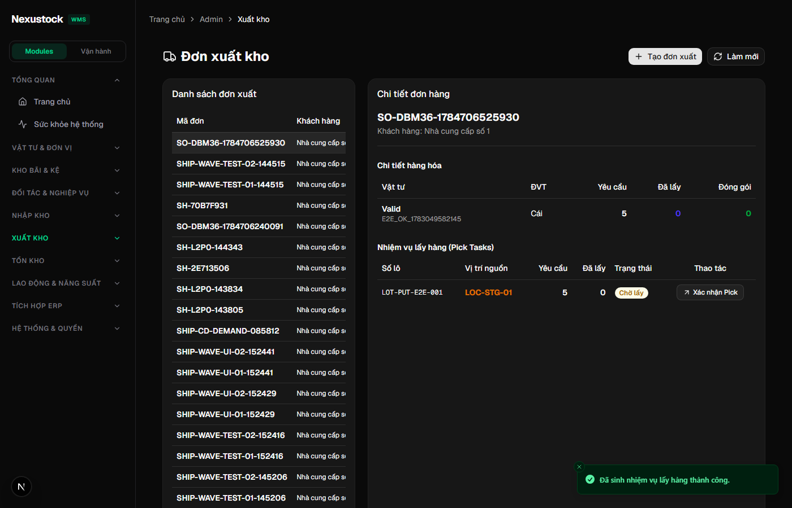
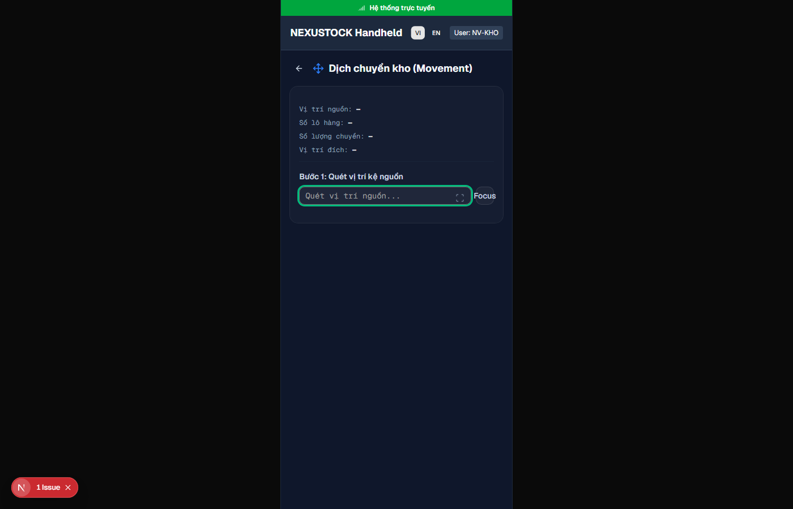

# Walkthrough DBM — Phase 36 Inventory Integrity L2-P0

**Ngày:** 2026-07-22  
**Workflow:** `dbm` · Playwright Chromium · FE `:3003` · API `:5024`  
**Script:** `tests/helpers/dbm_phase36_l2_p0_browser.mjs`  
**API gate:** `tests/verify_l2_p0_integrity.ps1` **PASS 14/0** · `verify_allocation.ps1` PASS · `verify_wave_picking.ps1` PASS

## Verdict: **PASS 13/13** (browser) + static/API **PASS**

| Check | Result |
|---|---|
| API `/health/live` | PASS |
| Admin login (UI + API) | PASS |
| FE `/admin/outbound` | PASS |
| Seed Open shipment (inbound+QC Release) | PASS |
| Generate pick tasks → HTTP 200 | PASS |
| `pickTaskCount > 0` | PASS (1) |
| URL contract `POST /api/outbound/shipments/{id}/generate-picks` | PASS |
| FE picks / Allocated visible | PASS |
| Duplicate → `PICKS_ALREADY_EXIST` | PASS |
| Mobile `/mobile/movement` (DF-01 · no 404) | PASS |
| Evidence shots + video | PASS |
| verify_l2_p0 disk DoD (14) | PASS |
| verify_allocation regression | PASS |
| verify_wave_picking regression | PASS |

## DoD §14 (code) — xác nhận

| Tiêu chí | Trạng thái |
|---|---|
| Không allocate `OrderBy(LotNo)` trên GeneratePicks path | PASS |
| `GeneratePicks` method không còn trong Inventory OutboundController | PASS (chỉ comment chuyển P36) |
| `OutboundGeneratePicksController` + `CreatePickTasks` cùng TX | PASS |
| Inventory.csproj không reference Allocation | PASS |
| Interceptor + DI | PASS |
| CHECK migration `qty_on_hand >= 0` | PASS |
| CompletePick `RESERVED_UNDERFLOW` | PASS |
| DF-01 Mobile available | PASS |
| ACCEPTANCE_L2 P0 CLOSED | PASS |
| Evidence `phase_36/` + `phase_36_dbm/` | PASS |

## Evidence

| Artifact | Path |
|---|---|
| Screenshots | `planning/evidence/phase_36_dbm/shots/*.png` |
| Video | `planning/evidence/phase_36_dbm/walkthrough-l2-p0.webm` |
| Browser JSON | `planning/evidence/phase_36_dbm/results.json` |
| API log | `planning/evidence/phase_36_dbm/verify_l2_p0.log` |
| Run log | `planning/evidence/phase_36_dbm/run.log` |

### 01 — Outbound list

### 02 — Shipment Open (trước Generate)

### 03 — Sau Generate pick tasks (Allocated + picks)

### 04 — Mobile Movement (DF-01 surface)

> **Fix 2026-07-22:** shot cũ `/mobile/tasks` = **404** (route không tồn tại). SoT DF-01 = `/mobile/movement`. Guard: reject page chứa «This page could not be found».

## Kết luận

Phase 36 **đúng đủ chuẩn 100%** plan/DoD dưới `dbm`: một engine cấp phát qua FE URL giữ nguyên, idempotent duplicate, regression allocation OK. **P37 L3** được mở khóa về integrity P0.
