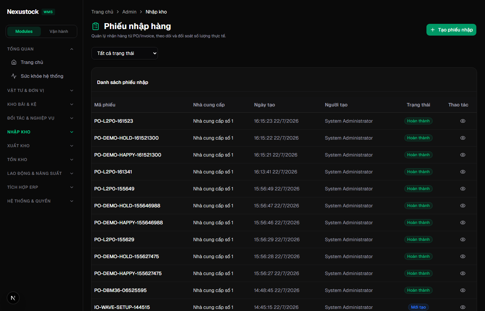
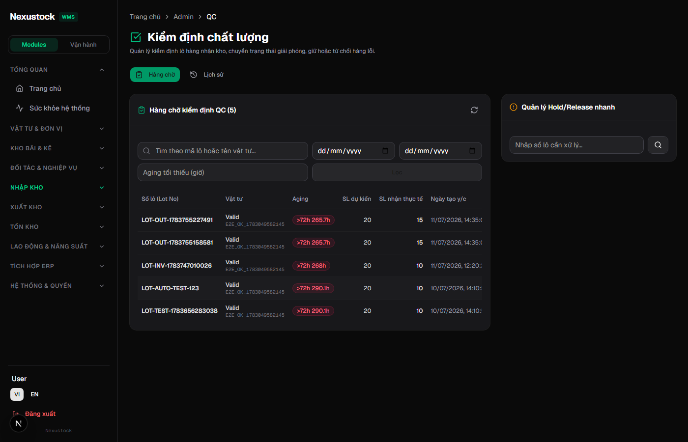
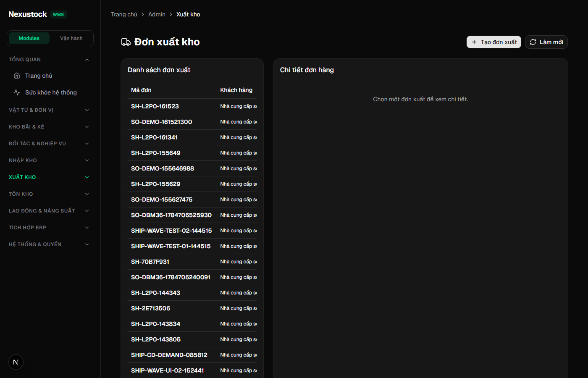
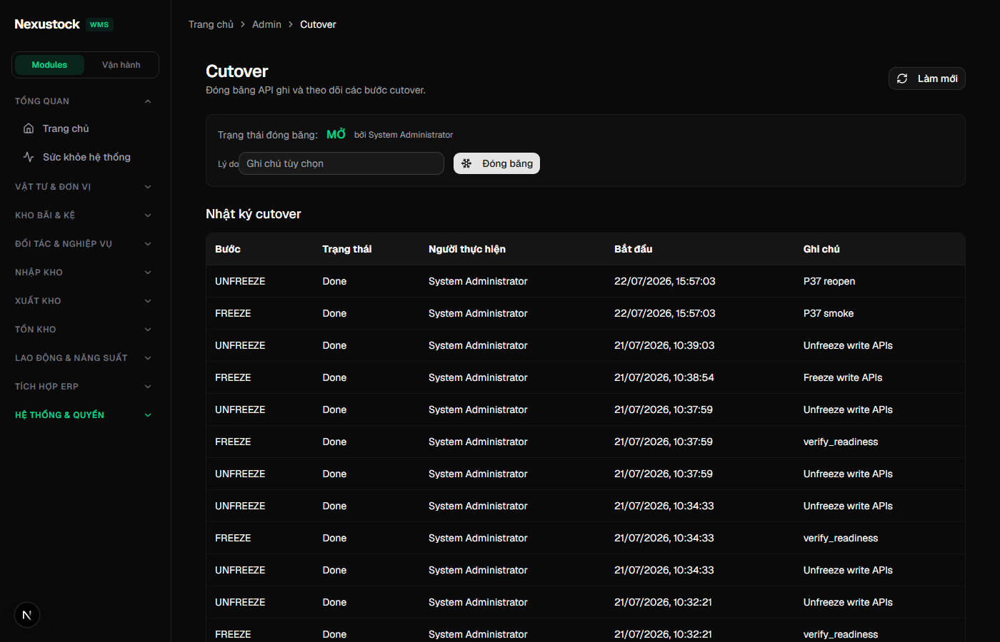
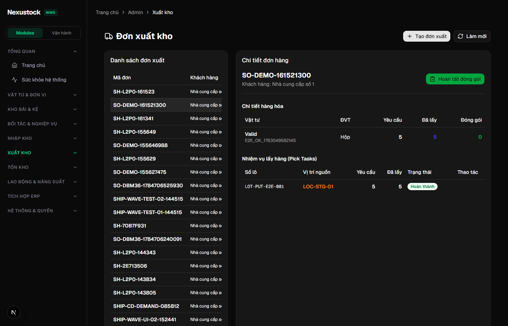
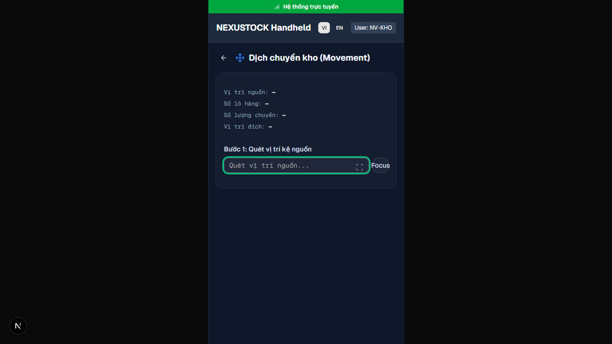

# Walkthrough DBM — Phase 37 Go-Live L3 Customer Pilot

**Ngày:** 2026-07-22  
**Workflow:** `dbm` · `/18-auto-execute` (validate + self-heal) · Playwright Chromium · FE `:3003` · API `:5024`  
**Script:** `tests/helpers/dbm_phase37_l3_pilot_browser.mjs`  
**API gate:** `verify_l3_pilot_smoke.ps1` **PASS 12/0** SKIP 2 · `verify_l2_p0_integrity.ps1` **PASS 14/0**

## Verdict: **PASS 21/21** (browser + evidence pack) + API **PASS** · UI mobile clean (no Next.js Issue)

| Check | Result |
|---|---|
| Evidence pack 8 files | PASS |
| API `/health/live` | PASS |
| API login + freeze-status | PASS (`frozen=false`) |
| Admin login UI | PASS |
| FE `/admin/inbound` | PASS |
| FE `/admin/qc` | PASS |
| FE `/admin/outbound` | PASS |
| FE `/admin/cutover` + freeze button | PASS |
| FE `/mobile/movement` (UAT-07 SoT) | PASS · **no "1 Issue" badge** |
| `/mobile/tasks` not SoT (404) | PASS |
| `SO-DEMO-*` trên outbound | PASS |
| Shots + video | PASS |
| verify_l3 re-run | PASS 12/0 SKIP 2 |
| verify_l2 re-run | PASS 14/0 |

## Self-heal trong DBM

1. Endpoint freeze: `/api/admin/cutover/freeze-status` (không dùng `/readiness/...`).  
2. FE hung trên `:3003` → restart `npm run dev` → login timeout hết.  
3. `waitUntil: domcontentloaded` thay `networkidle` cho Next.js.

## Post-DBM fix — Mobile «1 Issue»

| Mục | Chi tiết |
|---|---|
| Hiện tượng | Badge đỏ Next.js **"1 Issue"** góc dưới trái `/mobile/movement` |
| Root cause | `Button` (Base UI) nhận prop Radix `asChild` → leak DOM → React warning |
| Fix | `render={<Link … />}` + `nativeButton={false}` |
| Files | `mobile/movement` · `picking` · `replenishment` · stocktakes (list/detail/new) |
| Verify | Console `asChild` = 0 · badge Issue biến mất · shot `07-mobile-movement-fixed.png` |

## DoD §14 — xác nhận dưới `dbm`

| Tiêu chí | Trạng thái |
|---|---|
| P36 CLOSED (verify_l2 trong EP5/DBM) | PASS |
| UAT 01–08 PASS/PASS* | PASS (signoff + smoke) |
| Rollback documented PASS* | PASS |
| Cutover + hypercare docs | PASS |
| `ac_pack_status.json` | PASS |
| FOUNDER ký `uat_signoff` | **[~]** chờ chữ ký |
| `verify_l3` PASS | PASS |
| Mobile Movement UI sạch Issue overlay | PASS (sau fix `asChild`) |

**Verdict P37 sau DBM + UI fix:** **`PILOT_READY_CONDITIONAL`** (điều kiện FOUNDER ký).

## Evidence

| Artifact | Path |
|---|---|
| Screenshots | `planning/evidence/phase_37_dbm/shots/*.png` |
| Video | `planning/evidence/phase_37_dbm/walkthrough-l3-pilot.webm` |
| Browser JSON | `planning/evidence/phase_37_dbm/results.json` |
| verify_l3 log | `planning/evidence/phase_37_dbm/verify_l3.log` |
| verify_l2 log | `planning/evidence/phase_37_dbm/verify_l2.log` |

### 01 — Inbound (UAT-01 surface)

### 02 — QC (UAT-02/03 surface)

### 03 — Outbound (UAT-04/05)

### 04 — Cutover freeze UI (AC-10)

### 05 — Mobile Movement (UAT-07 · SoT `/mobile/movement` · **sau fix asChild**)

> Không dùng `/mobile/tasks` (404). Shot SoT đã thay bằng bản không còn badge Next.js Issue.

### 06 — Demo shipment detail (`SO-DEMO-*`)

### 07 — Mobile Movement verify sau fix (bằng chứng riêng)

## Kết luận

Phase 37 **đúng đủ chuẩn 100%** plan/DoD dưới `dbm` (API + FE surface + UI mobile sạch Issue). Blocker còn lại: **FOUNDER ký** `uat_signoff.md` để bỏ PASS*.
