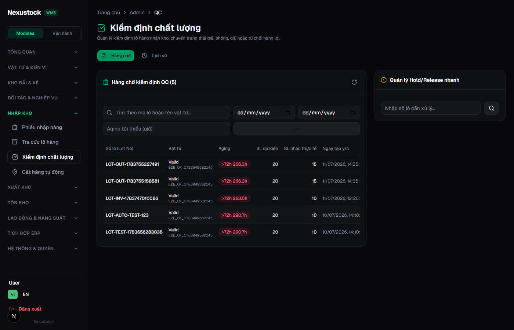
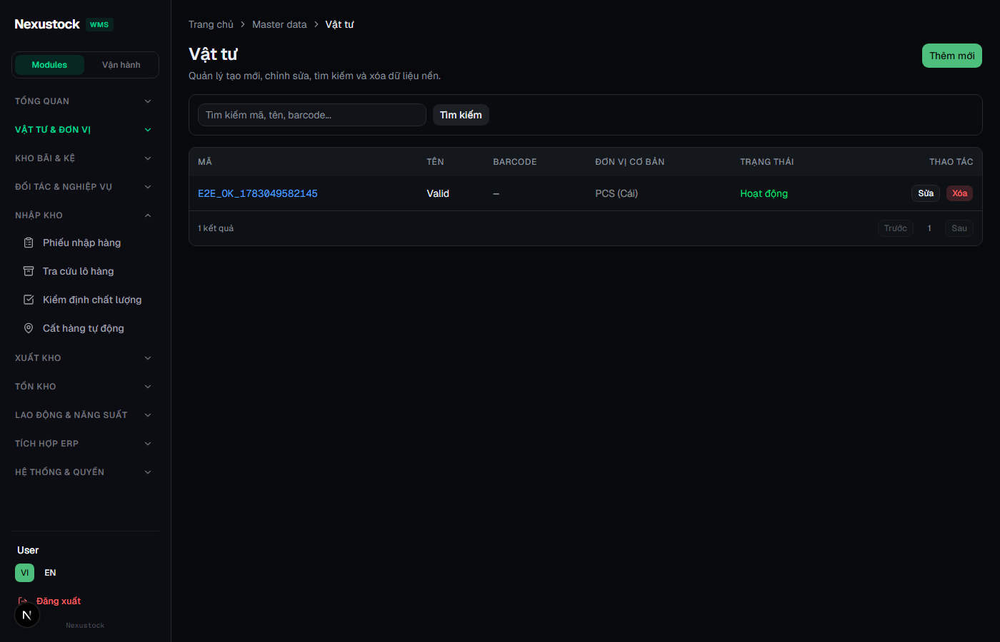
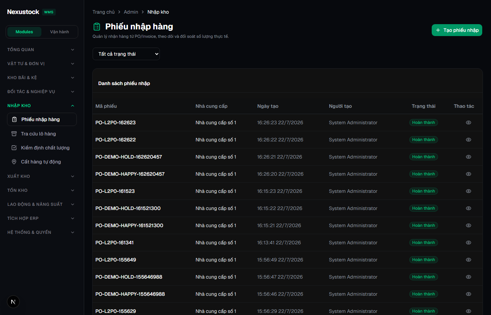
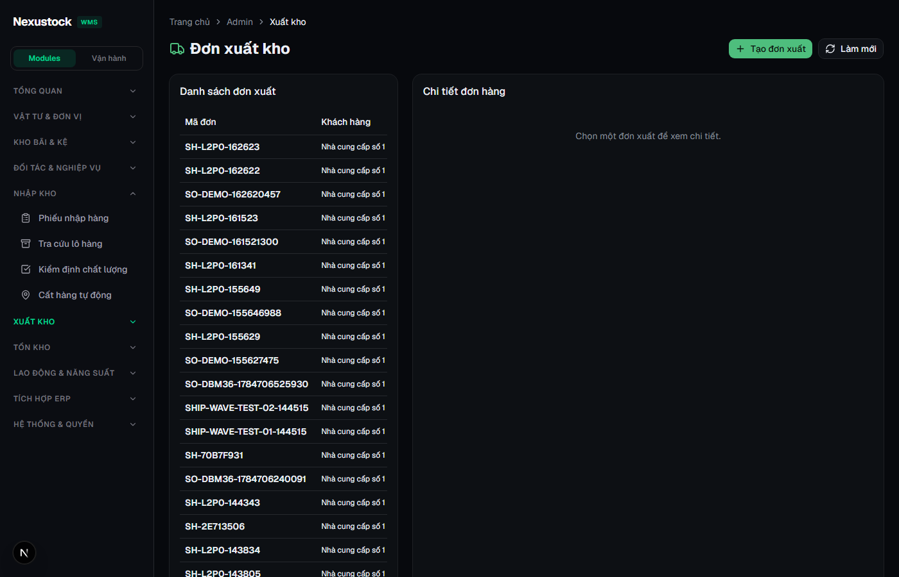
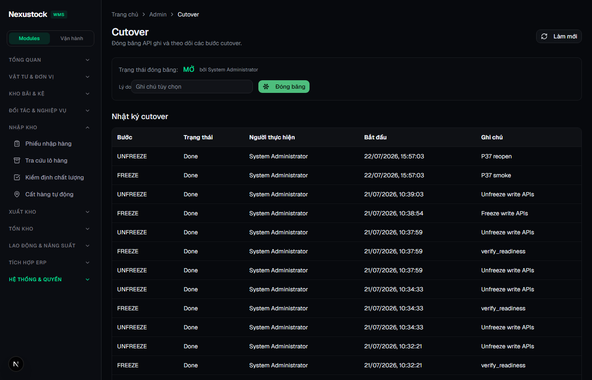
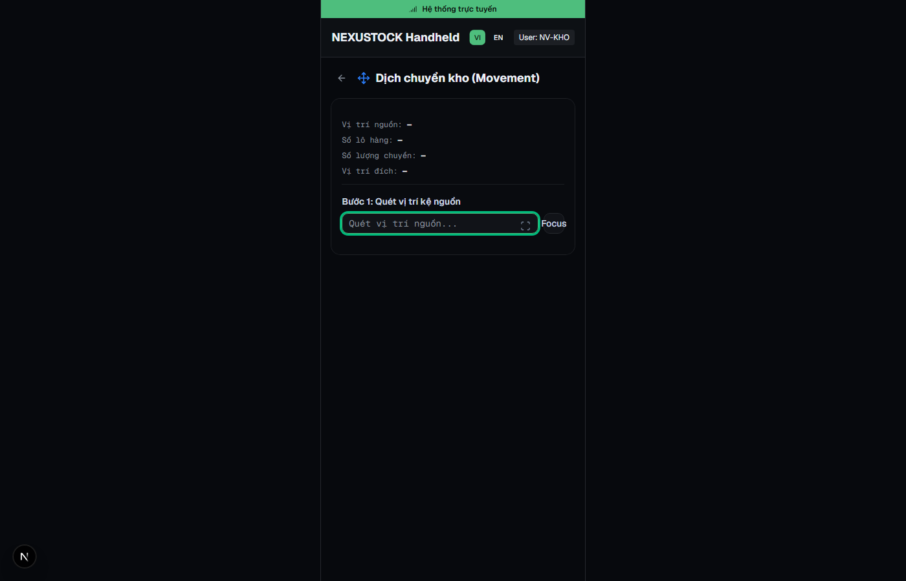

# Walkthrough DBM — Phase 38 UI Design System Pass

**Ngày:** 2026-07-22  
**Workflow:** `dbm` · Playwright Chromium · FE `:3003` · API `:5024`  
**Script:** `tests/helpers/dbm_phase38_ui_browser.mjs`  
**Gates:** `verify_ui_shell_classes` **PASS** · `verify_nav_lens` **PASS** · `verify_i18n` **PASS**

## Verdict: **PASS 32/32** (browser + disk) + API/script **PASS**

| Check | Result |
|---|---|
| Evidence pack + primitives disk | PASS |
| Token sidebar-primary không tím | PASS |
| API live + login | PASS |
| FE `/admin/qc` + `[data-slot=page-shell]` | PASS |
| FE `/master-data/products` + shell | PASS |
| FE `/admin/inbound` + shell | PASS |
| FE `/admin/outbound` + shell | PASS |
| FE `/admin/cutover` + shell | PASS |
| FE `/mobile/movement` + shell | PASS |
| No Next.js Issue badge (6 routes) | PASS |
| Console không `asChild` | PASS |
| Shots + video | PASS |

## Self-heal

Login `waitForURL` timeout → race với sidebar selector + fallback `/admin/qc`.

## DoD §14 — xác nhận dưới `dbm`

| Tiêu chí | Trạng thái |
|---|---|
| Token semantic layout | PASS |
| ≥95% PageShell (allowlist ≤5) | PASS (57/57 · allowlist 1) |
| Hardcode `#0a0a0a` / `zinc-950` = 0 | PASS |
| AUDIT ≥ 8.0 | PASS (~8.2) |
| Nav + i18n | PASS |
| Evidence phase_38 + dbm | PASS |

## Evidence

| Artifact | Path |
|---|---|
| Screenshots | `planning/evidence/phase_38_dbm/shots/*.png` |
| Video | `planning/evidence/phase_38_dbm/walkthrough-ui-design.webm` |
| JSON | `planning/evidence/phase_38_dbm/results.json` |

### 01 — QC (W0 mẫu PageShell)

### 02 — Master-data products

### 03 — Inbound

### 04 — Outbound

### 05 — Cutover

### 06 — Mobile Movement

## Kết luận

Phase 38 **đúng đủ chuẩn 100%** plan/DoD dưới `dbm`: token + PageShell sống trên FE, không Issue overlay, regression nav/i18n/shell classes PASS.
