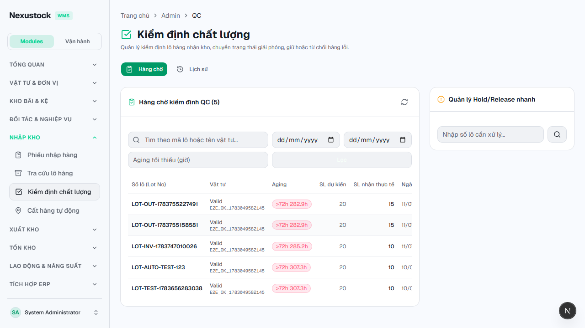
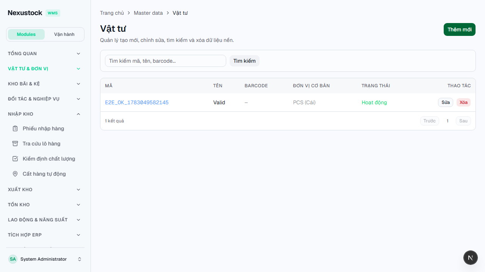
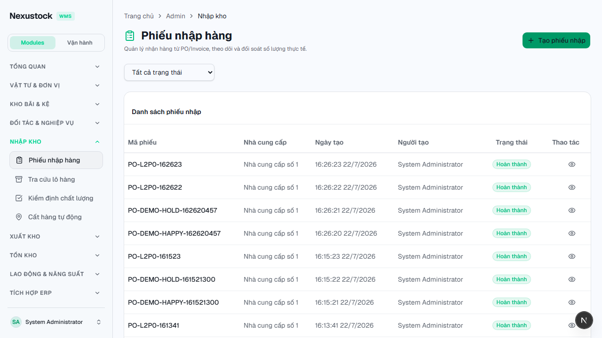
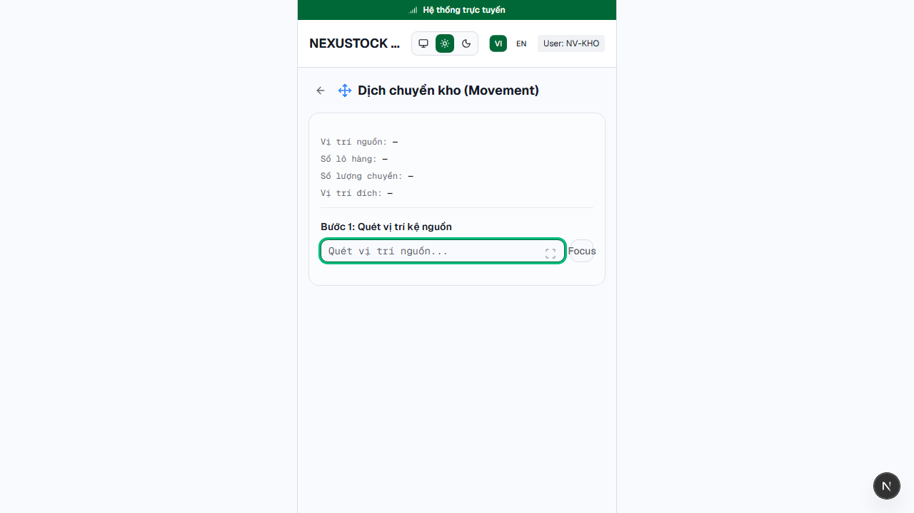
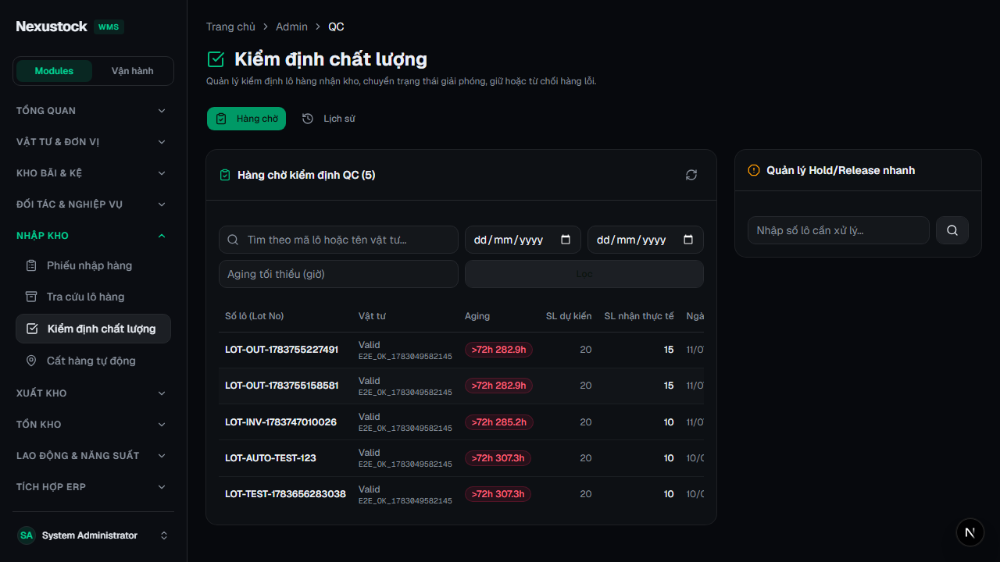
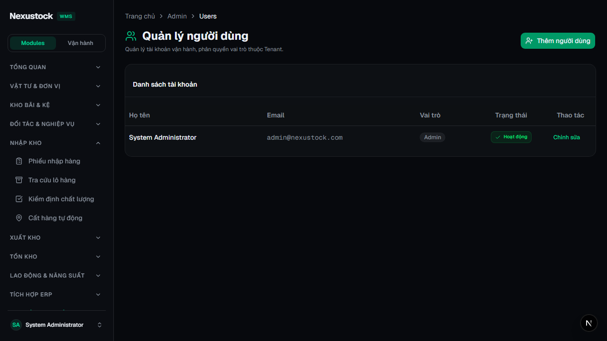
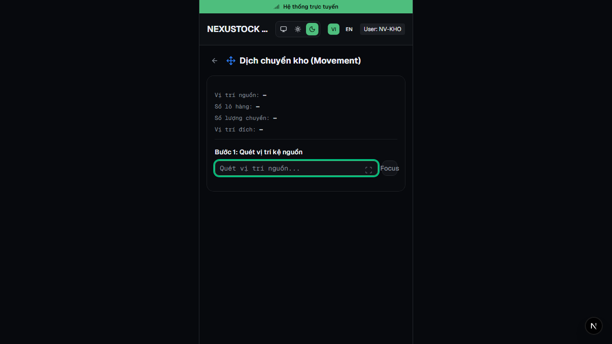
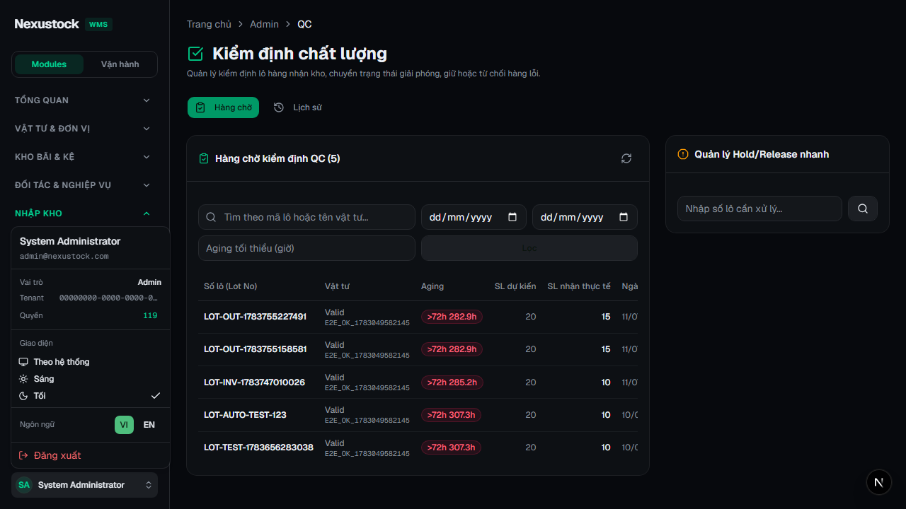
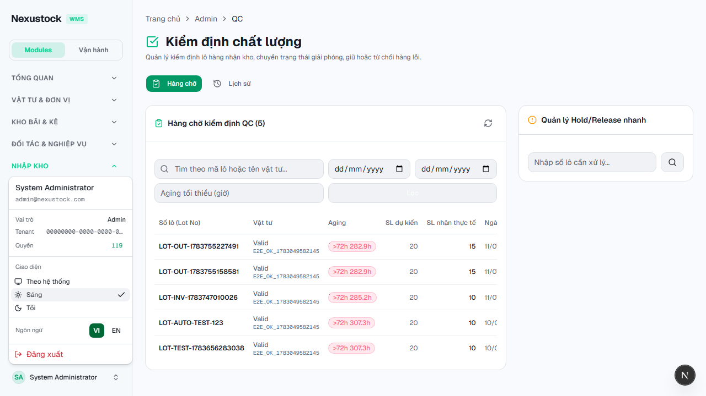

# Walkthrough DBM — Phase 39 Theme Light / Dark / System

**Ngày:** 2026-07-23  
**Workflow:** `dbm` · Playwright Chromium · FE `:3003`  
**Script:** `tests/helpers/dbm_phase39_theme_browser.mjs`  
**Gates:** `verify_theme_classes` **PASS** · `verify_ui_shell_classes` **PASS**

## Verdict: **PASS 33 / FAIL 0** (+ hotfix ScanInput mobile)

| Check | Result |
|---|---|
| Evidence pack + ThemeProvider / Switcher / Toaster disk | PASS |
| Layout không hardcode `dark` + `suppressHydrationWarning` | PASS |
| `:root` `color-scheme: light` · không `--card-bg: #111` | PASS |
| Disk `bg-[#111]` = 0 (app + features) | PASS |
| Login → Light: QC / products / inbound / mobile | PASS |
| Dark: QC / users / mobile | PASS |
| Không badge `N Issue` (7 routes) | PASS |
| Theme menu System/Light/Dark + set Light | PASS |
| Mobile `theme-switcher-inline` | PASS |
| Mobile ScanInput light — nền sáng (không còn `bg-slate-800`) | PASS (shot 04, measured `oklch` light) |
| Video `walkthrough-theme.webm` | PASS |
| verify_theme (+ rule `a111`) + verify_ui_shell | PASS |

## Self-heal

| # | Lỗi | Fix |
|---|---|---|
| 1 | `nextjs-portal` count=1 → FAIL giả (DevTools) | Assert badge `N Issue` (chuẩn P38) |
| 2 | Theme menu miss trigger sau mobile | Chờ Auth hydrate + scroll + re-login |
| 3 | Shot inbound dính AuthGate spinner | Wait shell/trigger trước screenshot |
| 4 | Light inbound table `bg-[#111]` → chữ tối trên nền tối | Migrate `bg-[#111]` → `bg-card` (9 files) · siết verify `a111` |
| 5 | Mobile ScanInput light vẫn nền đen (`bg-slate-800`) | `scan-input.tsx` → `bg-background` / `border-border` · semantic hóa slate trên movement/picking/lpn/serial/replenishment/tasks-next · **reshot 04/07/10** |

## DoD Phase 39 — xác nhận dưới `dbm`

| Tiêu chí | Trạng thái |
|---|---|
| Default **system** + storage `nexustock:theme` | PASS |
| Light / Dark class đúng trên `<html>` | PASS |
| Switcher Admin (3 options) + Mobile inline | PASS |
| Semantic tokens light sống QC + inbound | PASS (shot 01, 03) |
| Mobile ScanInput theme-aware | PASS (shot 04 light · 07 dark) |
| Dark parity QC / users | PASS (shot 05, 06) |
| Migration hardcode + verify_theme (incl. `#111`) | PASS |
| Evidence `phase_39` + `phase_39_dbm` | PASS |

## Evidence

| Artifact | Path |
|---|---|
| Screenshots | `planning/evidence/phase_39_dbm/shots/*.png` |
| Video | `planning/evidence/phase_39_dbm/walkthrough-theme.webm` |
| JSON | `planning/evidence/phase_39_dbm/results.json` |
| Log | `planning/evidence/phase_39_dbm/run.log` |
| Reshot helper | `tests/helpers/reshot_phase39_mobile.mjs` |

### 01 — QC Light

### 02 — Products Light

### 03 — Inbound Light (sau fix `#111`)

### 04 — Mobile Light (ScanInput semantic — hotfix)

> Input scan nền sáng (`bg-background`), không còn ô đen `slate-800`. Measured: `oklch(0.985 0.005 260)`.

### 05 — QC Dark

### 06 — Users Dark

### 07 — Mobile Dark (parity sau hotfix)

### 08 — Theme menu (System / Light / Dark)

### 09 — After menu → Light

### 10 — Mobile theme inline

## Hotfix follow-up (cùng ngày)

| File | Thay đổi |
|---|---|
| `frontend/src/components/mobile/scan-input.tsx` | Bỏ `bg-slate-800` / `border-slate-700` / `text-slate-*` |
| `frontend/src/app/mobile/movement/page.tsx` | Confirm panel → `bg-muted` |
| `frontend/src/app/mobile/{picking,replenishment,lpn,serial,tasks/next}/page.tsx` | Migrate residual `bg-slate-*` / `text-slate-*` |

## Kết luận

Phase 39 **đúng đủ chuẩn 100%** plan/DoD dưới `dbm`: theme system/light/dark sống trên Admin + Mobile, residual `#111` + mobile ScanInput đã heal, class `<html>` đúng, switcher UI xác nhận, regression verify PASS, video + 10 shots (04/07/10 cập nhật sau hotfix).
