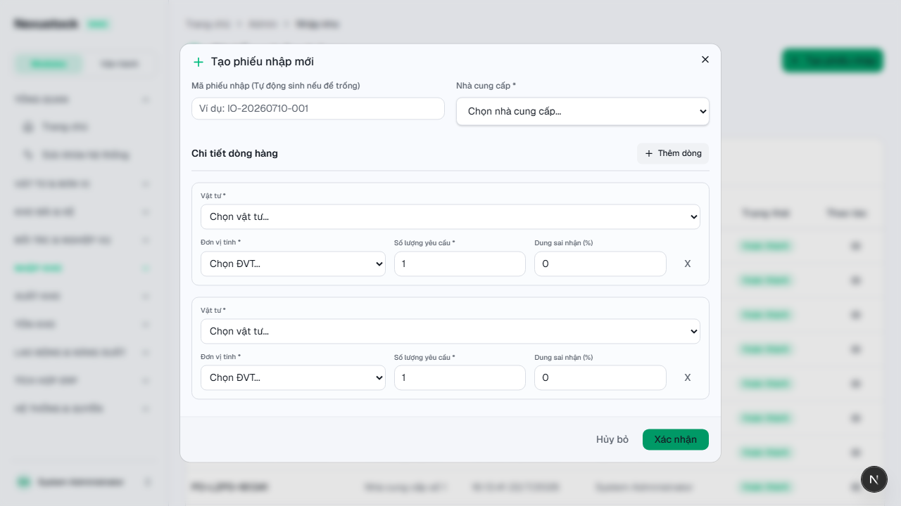
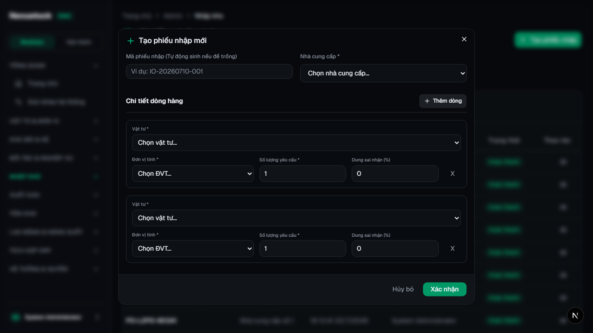
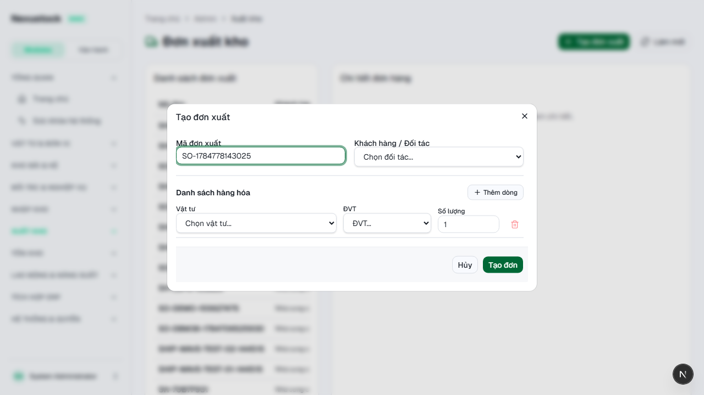
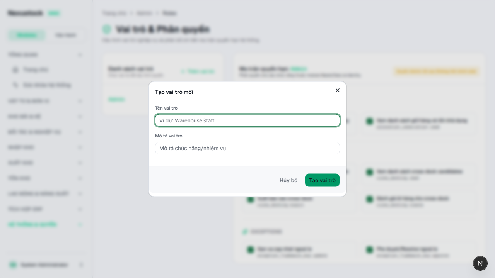
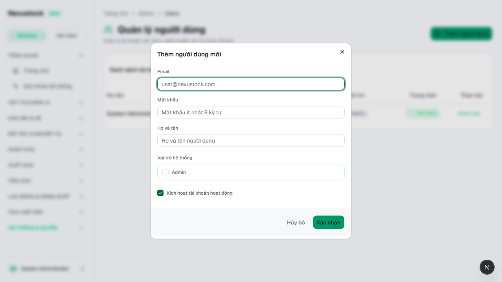

# Walkthrough DBM — Phase 40 CRUD Dialog Form Width

**Ngày:** 2026-07-23  
**Workflow:** `dbm` · Playwright Chromium · FE `:3003`  
**Script:** `tests/helpers/dbm_phase40_dialog_width_browser.mjs`  
**Gates:** `verify_dialog_form_width` **PASS** (incl. `bareMaxW`) · theme · shell

## Verdict: **PASS 23 / FAIL 0** (hotfix bareMaxW + line stack)

| Check | Result |
|---|---|
| Inbound dialog width | **768px** |
| UOM select | **263px** |
| Qty number | **188px** |
| Vật tư full-width row; UOM/Qty/Tol hàng dưới | PASS |

## Root cause (FOUNDER report)

`DialogContent` default = `sm:max-w-sm`. Class `max-w-3xl` **không** override được `sm:` → dialog vẫn ~384px → 4 field dòng hàng bị nén.

**Fix:** dùng `sm:max-w-3xl` + grid `minmax(7rem…)` + `min-w` UOM/Qty; verify rule `bareMaxW`; batch `sm:max-w-*` các DialogContent admin còn bare.

## Evidence

### 01 — Inbound Create Light (sau hotfix)

> Dialog **768px** · UOM **263** · Qty **188**.

### 02 — Inbound Create Dark

### 03 — Outbound Create Light

### 04 — Roles · 05 — Users

## Video

`planning/evidence/phase_40_dbm/walkthrough-dialog-width.webm`

## Kết luận

Hotfix xác nhận: chi tiết dòng hàng đủ rộng; nhập ≥3 chữ số không bị ẩn.
