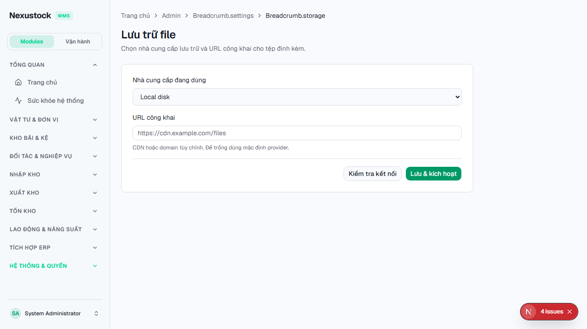
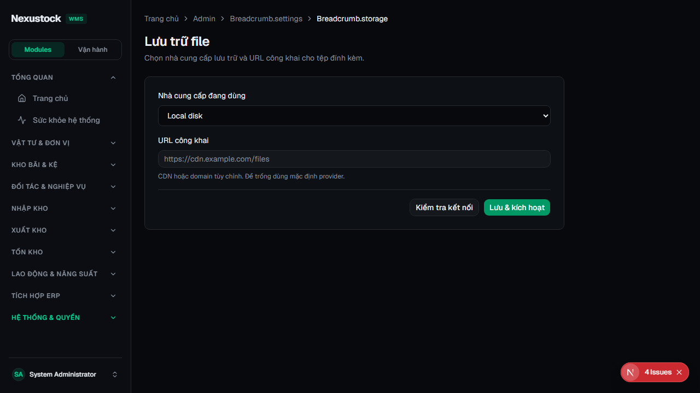
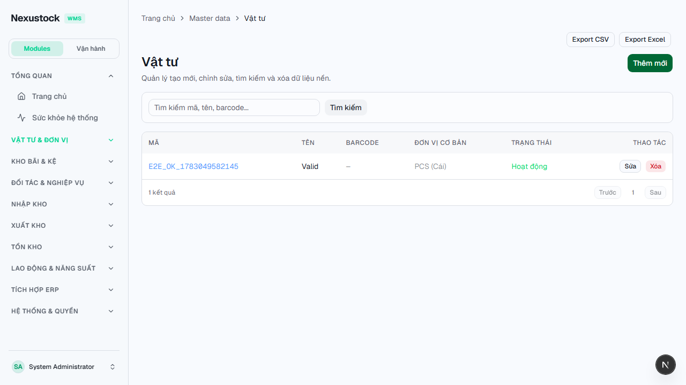
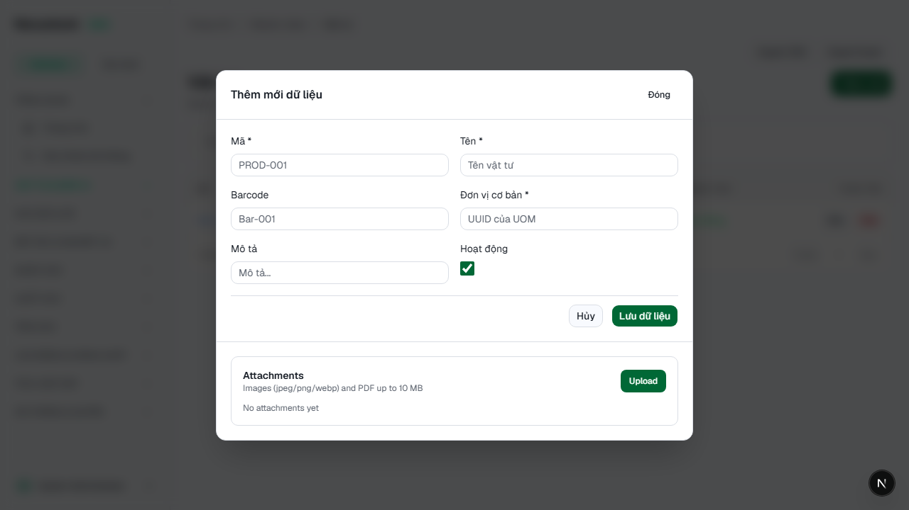
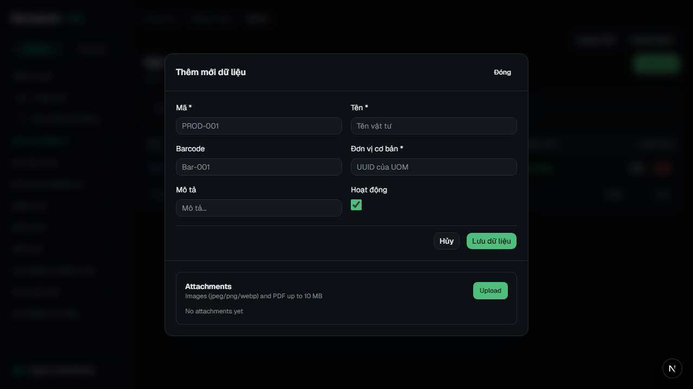
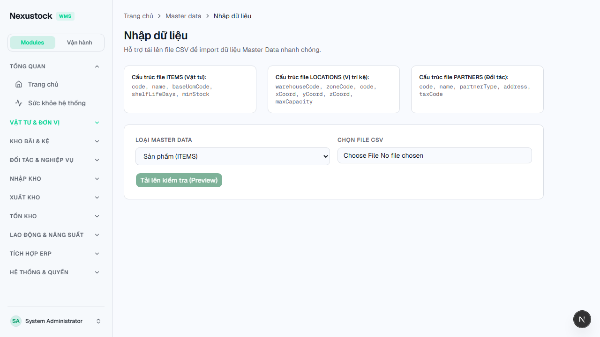
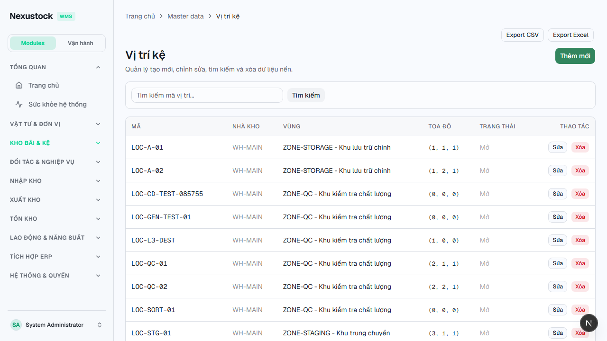

# Walkthrough DBM — Phase 41 Attachments + Spreadsheet + Storage Hub

**Ngày:** 2026-07-23  
**Workflow:** `dbm` · Playwright Chromium · FE `:3003`  
**Script:** `tests/helpers/dbm_phase41_files_browser.mjs`  
**Gates:** `verify_files_spreadsheet` **PASS** · `verify_nav_lens` 45 PASS

## Verdict: **PASS 19 / FAIL 0**

| Check | Result |
|---|---|
| Disk Files module / Storage page / Panel / Exports | PASS |
| verify_files_spreadsheet | PASS |
| Login + FE reachable | PASS |
| Admin Storage light/dark · provider LOCAL · Test/Save | PASS |
| Product Export CSV/Excel | PASS |
| Product Attachments panel + Upload (light/dark) | PASS |
| Import `accept=.csv,.xlsx` | PASS |
| Locations Export | PASS |
| Video webm | PASS |

## Hotfix trong phiên `dbm`

| Issue | Fix |
|---|---|
| `GET /api/files/storage-settings` → 500 `relation files.file_storage_settings does not exist` | Chạy `dotnet ef database update --context FilesDbContext` — bảng schema `files` có đủ; API GET **200** · `activeProvider=LOCAL` |
| Breadcrumb raw keys `Breadcrumb.settings` / `storage` | Thêm keys EN/VI `settings` · `storage` |

## Evidence

### 01 — Admin Storage Light

> Provider **Local disk** · Test connection · Save & activate.

### 02 — Admin Storage Dark

### 03 — Products Export

### 04 — Product Attachments (Create dialog)

> Section **Attachments** · Upload · empty state.

### 05 — Product Attachments Dark

### 06 — Import xlsx accept

### 07 — Locations Export

## Video

`planning/evidence/phase_41_dbm/walkthrough-files-spreadsheet.webm`

## Raw

- `dbm_results.json` · `dbm_log.txt`

## Kết luận

UI Storage Hub + Product attachments + Import/Export spreadsheet **khớp SoT §13 FE dbm**. API storage settings đã xanh sau migrate schema `files`. Sẵn sàng `rp4`/`rp5`.
