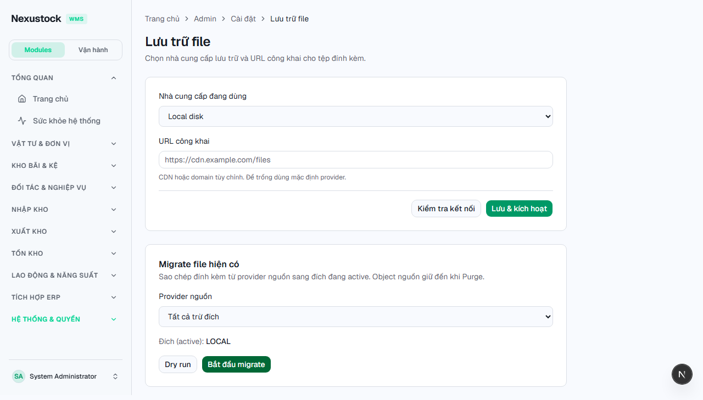
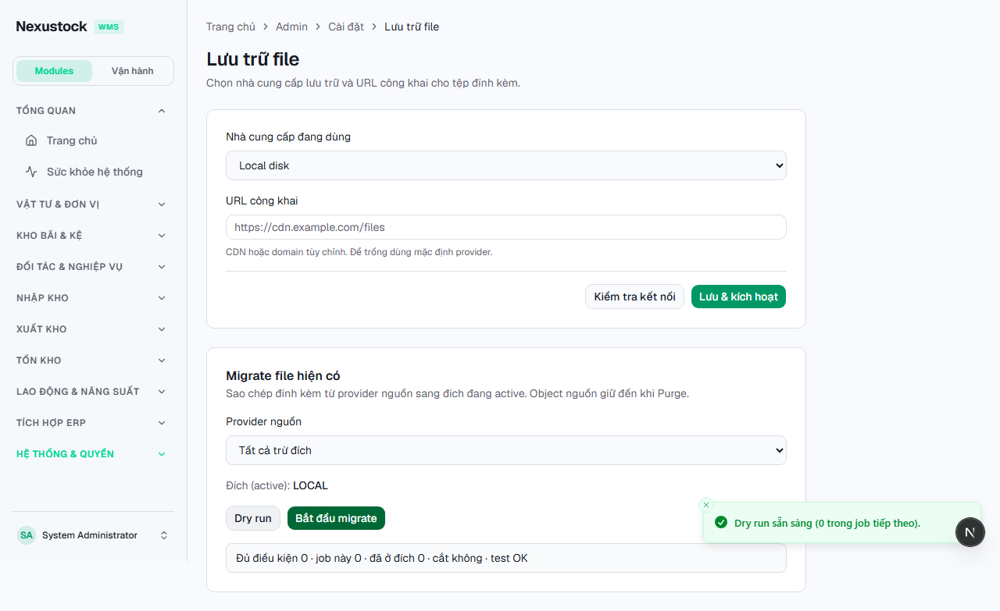
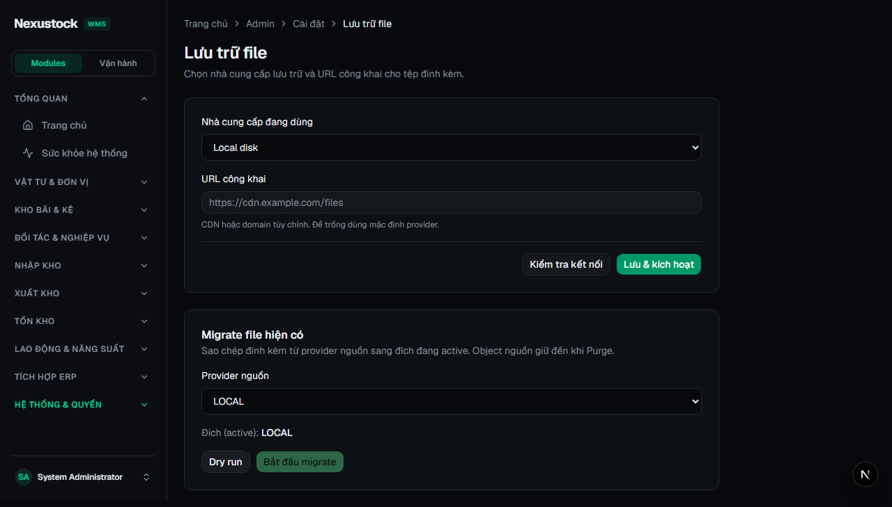

# Walkthrough DBM — Phase 42 Storage Provider Bulk Migrate

**Ngày:** 2026-07-23  
**Workflow:** `dbm` · Playwright Chromium · FE `:3003` · API `:5024`  
**Script:** `tests/helpers/dbm_phase42_storage_migrate_browser.mjs`  
**Gates:** `verify_storage_migrate` **PASS**

## Verdict: **PASS 18 / FAIL 0**

| Check | Result |
|---|---|
| Disk job entity / worker / panel | PASS |
| verify_storage_migrate (+ files regression) | PASS |
| API + FE reachable | PASS |
| Login Admin | PASS |
| Storage page + Migrate panel light/dark | PASS |
| Source select · target active · Dry run / Start | PASS |
| Dry-run result banner (source ALL ≠ LOCAL) | PASS |
| P41 Test/Save regression | PASS |
| Video webm | PASS |

## Hotfix trong phiên `dbm`

| Issue | Fix |
|---|---|
| API down (file lock sau `/18`) | Restart `dotnet run` → listening `:5024` |
| Dry-run LOCAL→LOCAL → toast `MIGRATE_SOURCE_EQUALS_TARGET` | Script chọn source **ALL**; FE disable Start khi `source === activeProvider` |

## Evidence

### 01 — Storage + Migrate panel (light)

> Provider Local disk · section **Migrate existing files** · source · Dry run · Start migrate.

### 02 — Dry run result (light)

> Source **ALL except target** · dry-run banner (eligible / job total).

### 03 — Migrate panel (dark)

## Video

`planning/evidence/phase_42_dbm/walkthrough-storage-migrate.webm`

## Raw

- `dbm_results.json` · `dbm_log.txt`

## Kết luận

Admin Migrate panel khớp SoT §8 · dry-run gate source≠target hoạt động · sẵn sàng `rp4`/`rp5`.
