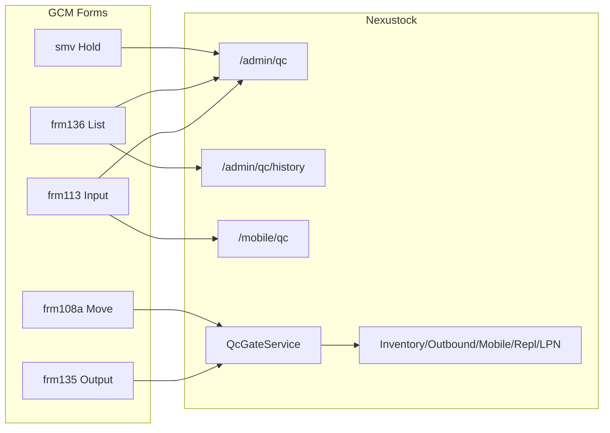

# Function Index — Phase 34 IQC UX Map (GCM Part → Nexustock)

**Ngày:** 2026-07-22  
**Cập nhật:** `` `rp2 `` / `/17-auto-plan` 2026-07-22 (reindex function disk)  
**Mục đích:** AS-IS/TO-BE runtime — đủ để execute EP0–EP6 không điểm mù.

---

## 1. AS-IS — GCM Part (IQC cluster)

| Form | File | Actor | Output |
|---|---|---|---|
| IQC Input | `frm113_Iqc_Input.vb` | IQC inspector | Ghi kết quả kiểm |
| QC Input variants | `frm114_Qc_Input.vb`, `frm114b_Qc_Input.vb` | QC | Biến thể nhập QC |
| IQC List | `frm136_IqcList.vb` | Supervisor / IQC | Tra cứu / quản lý |
| IQC Output | `frm135_IqcOutput.vb` | Warehouse | Xuất sau IQC |
| IQC Input Result | `frm137_IqcInputResult.vb` | IQC | Xem kết quả |
| Part Hold | `smv_frm6_PartHold.vb` | Authorized op | Hold/Unhold |
| Move (hold gate) | `frm108a_Part_Move_FC.vb` | Operator | Chặn move khi hold |

**Đặc điểm:** thick-client, SQL Server trực tiếp, handy BT, form-centric.

---

## 2. AS-IS — Nexustock QC runtime (disk reindex `` `rp2 ``)

### 2.1 Module & surfaces

| Thành phần | Path | Trạng thái |
|---|---|---|
| Module | `backend/modules/Nexustock.Modules.Qc` | ✅ |
| DI | `DependencyInjection.cs` — chỉ `ITenantProvider` (chưa Gate) | ⚠ |
| API | `GET /api/qc/queue`, `POST /api/qc/{lotId}/result\|hold\|release\|reject` | ✅ |
| Upload | `POST /api/storage/upload` (`StorageController`) | ✅ |
| DTO | `QcQueueResponseDto`, `RecordQcResultDto`, `HoldLotDto`, `ReleaseLotDto`, `RejectLotDto` | ✅ |
| Entities | `QcRequest`, `QcResult`, `MaterialHold` | ✅ |
| UI Admin | `frontend/src/app/admin/qc/page.tsx` | ✅ |
| Dialogs | `features/qc/components/qc-result-dialog.tsx`, `hold-release-dialog.tsx` | ✅ |
| Permissions | `Qc.Queue.View`, `Qc.Results.Create`, `Qc.Lots.Hold/Release/Reject` | ✅ seed |
| History API/UI | — | ❌ |
| Queue filter/aging | — | ❌ (chỉ client search) |
| Mobile IQC | — | ❌ |
| `IQcGateService` | — | ❌ |

### 2.2 Lot mapping — cùng bảng `Lots` (`` `rp3 ``)

| EF entity | Module | Kiểu QcStatus | Bảng |
|---|---|---|---|
| `Inbound.Entities.Lot` | Inbound | `LotQcStatus` enum + conversion string | **`Lots`** |
| `Inventory.Entities.Lot` | Inventory | `string` | **`Lots`** (cùng) |
| `Replenishment.Lot` | Replenishment | `string` | **`Lots`** (cùng) |

**Hệ quả `rp3`:** QC ghi qua Inbound = cập nhật cùng row. **Không** dual-write mirror; **không** Qc→Inventory ref.  
Gate **luôn** đọc qua `InboundDbContext.Lots` (enum). Verify script assert Inventory mapping cùng Id sau Pass.

**Residual:** Genealogy có thể ghi `"HOLD"` uppercase — OOS P34; Gate dùng enum / ignore-case.

### 2.3 Call-site Qc check (freeze)


| Call site | File | Check hôm nay | SoT đang dùng | EP1 |
|---|---|---|---|---|
| Inventory move | `InventoryController.MoveInventory` | `QcStatus != "Release"` → `LOT_ON_HOLD` | Inventory.Lot string | → `IQcGateService` + error `QC_LOT_*` |
| Outbound allocate/pick | `OutboundController` | filter / check `"Release"` | Inventory.Lot | Unify Gate |
| Putaway | `PutawayController` | `!= "Release"` | (local lot) | Unify Gate |
| Allocation | `AllocationService` | `LotQcStatus.Release` | **Inbound** ✅ | Verify + optional Gate |
| Cross-dock | `CrossDockingService` | `LotQcStatus.Release` | **Inbound** ✅ | Keep / optional Gate |
| Mobile offline MOVE | `MobileController.SyncOffline` | **không** | — | **Must Gate** |
| Replenishment | `ReplenishmentService` | filter Release trên Lot local | Replenishment/Inventory string | Gate by lotNo/item |
| LPN attach/move | `LpnService` | **không** QcStatus | — | Gate lots trên LPN trước move/attach |
| Inbound receive | `InboundController` | set `Unspec` | Inbound | **Allowlist** |
| QC self | `QcController` | ghi status | Inbound | **Allowlist** |

### 2.4 Project reference graph (DI Gate)

```
Qc → Inbound, MasterData, Identity
Inventory → MasterData, Identity, Exceptions   (CHƯA → Qc / Inbound)
Lpn → Inventory, MasterData
Replenishment → Inbound
Allocation → Inbound
```

**TO-BE EP1:**  
- `Inventory`, `Putaway` (nếu tách), module chứa Mobile, `Lpn`, `Replenishment`, `Outbound` (nếu tách) **thêm** `ProjectReference` → `Nexustock.Modules.Qc` **hoặc** (nếu vòng phụ thuộc) extract `IQcGateService` vào package mỏng — **default an toàn:** consumers ref **Qc**; Qc **không** ref Inventory.  
- Mirror Inventory.Lot: Qc thêm ref Inventory **chỉ nếu** cần update mirror; nếu vòng tròn → mirror qua raw SQL/`DbContext` shared connection trong controller TX hiện có, hoặc event nội bộ. **Default:** QcController sau khi Save Inbound → update `InventoryDbContext.Lots` cùng connection pattern đã dùng QC↔Inbound.

### 2.5 Feature flags pattern

| Flag | Seed | Consume |
|---|---|---|
| `FF_*` (CrossDock, Labor, TI, Readiness, Cutover) | `DatabaseSeeder.DefaultFeatureFlags` | `IFeatureFlagService.IsEnabledAsync` |
| `FF_MOBILE_QC` | **chưa** | EP4 |
| `FF_QC_GATE_ENFORCE` | optional EP1 (default on) | Gate soft→hard |

---

## 3. TO-BE — Phase 34



### Runtime TO-BE

```text
Inbound receive → Lot.QcStatus=Unspec (+ mirror Inventory.Lot)
  → GET /qc/queue sync QcRequest Pending
  → Inspector: result|hold|release|reject (Inbound SoT + mirror)
  → EnsureLotUsableAsync(tenant, lotId|lotNo+itemId)
       → only Release passes
  → move / offline MOVE / pick / replenish / LPN move
```

### Target surfaces

| Surface | Mục tiêu |
|---|---|
| Admin QC queue | Filter/aging/search parity `IqcList` |
| Admin QC result | Field parity metrics/sample/attachments (đã có cơ bản) |
| Admin QC history | Timeline kết quả + hold events |
| Hold/Release dialog | Reason + quyền (giữ) |
| **QcGateService** | Central gate SoT Inbound |
| Mobile `/mobile/qc` | Optional P2 — `FF_MOBILE_QC` |
| Artifacts | UX map 8 forms + UAT + training |

---

## 4. Out of scope (khóa)

- VMI, invoice divide, CAP, Ford code, wafer  
- Clone BT-1500 desktop COM  
- Tách product Part/Shipping  
- ja/zh locale packs (trừ key i18n EN/VI cho màn mới)  
- Rewrite Inbound module / ETL GCM

---

## 5. Dependency graph

```
P05 Qc ✅ → P06 Inventory ✅ → P07 Outbound ✅ → P09 Mobile ✅
                                    ↓
                              Phase 34 IQC UX Map
                    (rp1 locks §18 + rp2 function index)
```

---

## 6. API / UI map chi tiết (execute)

| Actor | Action | API / UI |
|---|---|---|
| QC | Xem queue | `GET /api/qc/queue` → `/admin/qc` |
| QC | Ghi Pass/Fail | `POST /api/qc/{lotId}/result` + dialog |
| QC | Hold | `POST .../hold` |
| QC | Release | `POST .../release` |
| QC | Reject | `POST .../reject` |
| QC | History | `GET /api/qc/history`, `.../timeline` → `/admin/qc/history` |
| WH | Move | `POST /api/inventory/move` → Gate |
| Mobile | Offline MOVE | `POST .../offline-sync` → Gate |
| Mobile | QC (opt) | `/mobile/qc` + same result/hold APIs |

---
