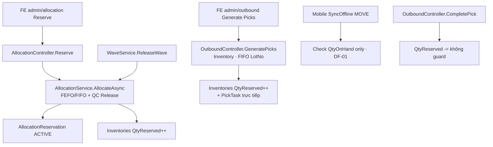
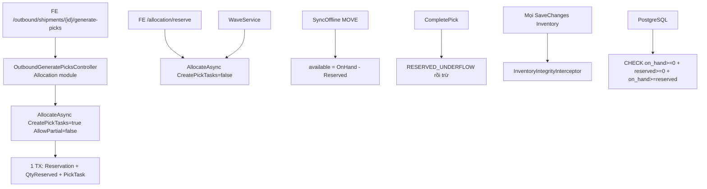

# Function Index — Phase 36 Inventory Integrity (L2-P0)

> **Status:** ✅ **CLOSED** — `/18-auto-execute` + `dbm` + **`rp4`+`rp5` Module DoD 100%** (2026-07-22)  
> SoT: `planning/phases/phase_36_inventory_integrity_l2_p0.md`  
> Evidence: `planning/evidence/phase_36/` · `planning/evidence/phase_36_dbm/` · `planning/evidence/phase_36_rp45/`  
> Brain: `C:\Users\mes\.gemini\antigravity\brain\17cf2960-4583-44a5-918a-5eb1c709dc96\`

---

## A. Call graph hiện tại (AS-IS)



**Vấn đề:** 2 engine cấp phát; offline bỏ reserved; CompletePick có thể âm reserved.

---

## B. Call graph mục tiêu (TO-BE)



---

## C. Symbols / methods (disk)

| ID | Symbol | Path | Vai trò P36 |
|---|---|---|---|
| F01 | `OutboundController.GeneratePicks` | `...Inventory/Controllers/OutboundController.cs` ~L257 | **DELETE** toàn method |
| F02 | `OutboundController.CompletePick` | cùng file ~L363 | **PATCH** RESERVED_UNDERFLOW |
| F03 | `MobileController.SyncOffline` MOVE | `...Inventory/Controllers/MobileController.cs` ~L151/L209 | **PATCH** DF-01 |
| F04 | `IAllocationService.AllocateAsync` | `...Allocation/Services/AllocationService.cs` ~L39 | **EXTEND** CreatePickTasks |
| F05 | `ReserveRequestDto` | `...Allocation/Dtos/AllocationDtos.cs` | **EXTEND** property |
| F06 | `AllocationController.Reserve` | `...Allocation/Controllers/AllocationController.cs` ~L42 | Không đổi (default false) |
| F07 | `ReallocateAsync` | AllocationService ~L344 | Gọi Allocate — giữ CreatePickTasks false |
| F08 | `WaveService` Allocate + **own** PickTask materialize ~L279 | `...Wave/Services/WaveService.cs` | MUST NOT CreatePickTasks; giữ materialize Wave |
| F09 | `InventoryController.MoveInventory` | ~L111 | MUST NOT regress available check |
| F10 | `AddInventoryModule` | `...Inventory/DependencyInjection.cs` | **WIRE** interceptor |
| F11 | `InventoryDbContext` Fluent checks | `...Contexts/InventoryDbContext.cs` ~L71 | **ADD** on_hand≥0 |
| F12 | `ModuleServiceRegistration` | `...Api/Infrastructure/ModuleServiceRegistration.cs` | MUST NOT reorder break |
| F13 | FE `generate-picks` | `frontend/src/app/admin/outbound/page.tsx` ~L125 | MUST NOT đổi URL |
| F14 | NEW `OutboundGeneratePicksController` | `...Allocation/Controllers/` | **NEW** |
| F15 | NEW `InventoryIntegrityInterceptor` | `...Inventory/Interceptors/` | **NEW** |
| F16 | NEW migration on_hand | `...Inventory/Migrations/` | **NEW** |

---

## D. Permissions

| Permission | Dùng bởi |
|---|---|
| `Outbound.Picks.Execute` | GeneratePicks + CompletePick |
| `allocation_reservation.*` / allocation permissions hiện có | Reserve API — không đổi |
| Mobile sync permission Phase 09 | SyncOffline — không đổi |

---

## E. Error codes P36

| errorCode | Nơi phát |
|---|---|
| `INSUFFICIENT_INVENTORY` | GeneratePicks / Allocate AllowPartial=false |
| `PICKS_ALREADY_EXIST` | GeneratePicks |
| `INVALID_SHIPMENT_STATUS` | GeneratePicks Status≠Open |
| `SHIPMENT_NOT_FOUND` | GeneratePicks |
| `RESERVED_UNDERFLOW` | CompletePick **NEW** |
| `INSUFFICIENT_QTY` | CompletePick / MOVE / offline |
| `INVENTORY_INVARIANT_VIOLATION` | Interceptor **NEW** |

---

## F. MUST NOT change

| Item | Lý do |
|---|---|
| `Inventory.csproj` → Allocation | Circular |
| FE URL generate-picks | Breaking UI |
| Wave CreatePickTasks | Wave tự quản pick |
| CHECK names `chk_inventory_balances_qty_reserved/available` | Đã tồn tại — không recreate |
| M1 / P37 / P38 scope | Ngoài phase |

---

## G. EP map (executor)

| EP | Mục tiêu | Symbols chính |
|---|---|---|
| EP0 | DTO + Allocate CreatePickTasks cùng TX | F04 F05 |
| EP1 | Controller mới + xóa F01 | F14 F01 |
| EP2 | Interceptor + DI | F15 F10 |
| EP3 | Migration + Fluent on_hand≥0 | F16 F11 |
| EP4 | CompletePick + DF-01 | F02 F03 |
| EP5 | verify_l2_p0 + regression | tests |
| EP6 | ACCEPTANCE_L2 + evidence | docs |

---

## H. Verify commands (executor)

```powershell
# Port mặc định verify_allocation — xác nhận FOUNDER nếu khác
pwsh -File tests/verify_l2_p0_integrity.ps1
pwsh -File tests/verify_allocation.ps1
pwsh -File tests/verify_wave_picking.ps1
```

Build:

```powershell
dotnet build backend/Nexustock.Api/Nexustock.Api.csproj
```
