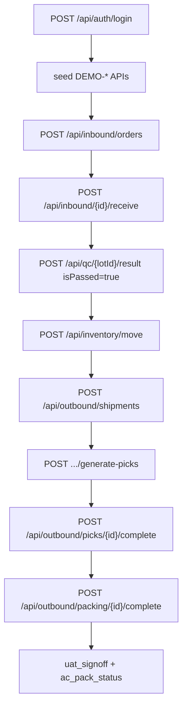
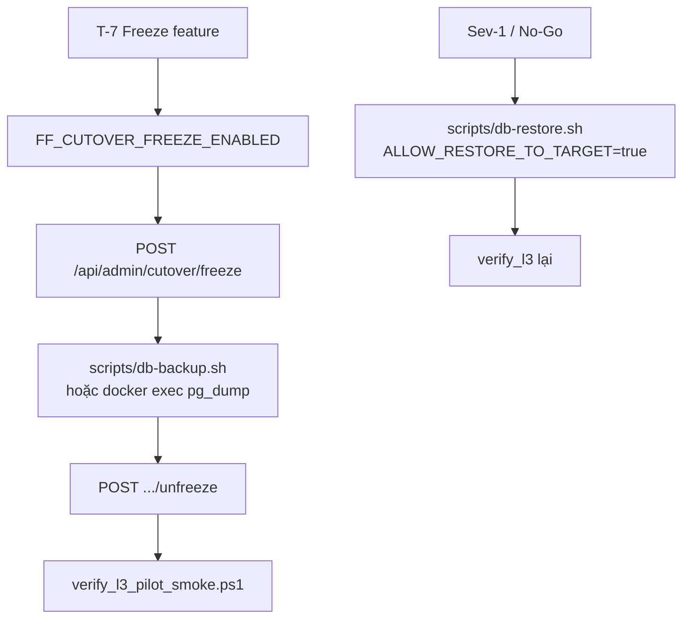

# Function Index — Phase 37 Go-Live L3 Customer Pilot

> **`rp4`+`rp5` 2026-07-22** — Disk FAIL=0 · Module DoD/Pilot 100% kỹ thuật · `PILOT_READY_CONDITIONAL`.  
> SoT: `planning/phases/phase_37_golive_l3_customer_pilot.md` (§20–§26).  
> Brain: `C:\Users\mes\.gemini\antigravity\brain\17cf2960-4583-44a5-918a-5eb1c709dc96\`  
> Status: **ĐÓNG tài liệu** — chờ FOUNDER ký `uat_signoff.md`.

---

## A. Call graph pilot happy path (TO-BE verify/UAT)



---

## B. Call graph cutover / rollback (ops)



---

## C. Symbols / artifacts (disk)

| ID | Symbol / Artifact | Path | Vai trò P37 |
|---|---|---|---|
| F01 | `InboundController` create/receive | `...Inbound/Controllers/InboundController.cs` | UAT-01 · smoke |
| F02 | `QcController.ActiveHold` / `Result` | `...Qc/Controllers/QcController.cs` | UAT-02/03 · `POST {lotId}/hold` · `POST {lotId}/result` |
| F03 | `QcGateService` | `...Qc/Services/QcGateService.cs` | `QC_LOT_ON_HOLD` |
| F04 | `InventoryController.MoveInventory` | `...Inventory/Controllers/InventoryController.cs` | UAT-03/06 · `reasonCode` bắt buộc |
| F05 | `OutboundGeneratePicksController` | `...Allocation/Controllers/` | UAT-04 · P36 SoT |
| F06 | `OutboundController.CompletePick` | `...Inventory/.../OutboundController.cs` | UAT-05 · body `{ pickedQty }` |
| F07 | `OutboundController.CompletePacking` | cùng file | Pack · weight validation |
| F08 | `MobileController.SyncOffline` | MOVE DF-01 | UAT-07 |
| F09 | `AuthController.Register` | `...Identity/.../AuthController.cs` | UAT-08 · TenantId `...0002` |
| F10 | `CutoverController` freeze/unfreeze | `...Readiness/.../CutoverController.cs` | EP2/EP3 |
| F11 | `ReadinessController` uat-runs | `...Readiness/.../ReadinessController.cs` | Optional EP6 |
| F12 | `db-backup.sh` / `db-restore.sh` | `scripts/` | EP3 — Windows: docker exec fallback |
| F13 | FE outbound / qc / inbound / movement | `frontend/src/app/admin|mobile/...` | EP4 shots |
| F14 | NEW `demo_generic_tenant.ps1` | `tests/seed/` | EP1 |
| F15 | NEW `verify_l3_pilot_smoke.ps1` | `tests/` | EP5 |
| F16 | Evidence pack | `planning/evidence/phase_37/` | EP0–EP6 |

**MUST NOT:** Đổi P36 allocation engine · tạo module C# · migration · `/mobile/tasks` · invent create-tenant API.

---

## D. Permissions (Admin cover)

| Permission | Endpoint |
|---|---|
| (Admin all) | Smoke mặc định |
| `Inbound.Orders.Receive` | receive |
| `Qc.Lots.Hold` / result perms | hold + result |
| `Inventory.Movements.Create` | move |
| `Outbound.Picks.Execute` | generate-picks + complete pick |
| `Outbound.Packing.Execute` | packing complete |
| `readiness.cutover.freeze` | freeze/unfreeze |

---

## E. Error codes UAT expect

| Code | Khi |
|---|---|
| `QC_LOT_ON_HOLD` | Move/pick khi lot Hold |
| `INSUFFICIENT_QTY` / `INSUFFICIENT_INVENTORY` | Available không đủ |
| `PICKS_ALREADY_EXIST` | Generate picks lần 2 |
| `RESERVED_UNDERFLOW` | CompletePick reserved thiếu (P36) |
| `CUTOVER_FREEZE_DENIED` | Flag freeze tắt |
| `READINESS_UNAUTHORIZED` | Thiếu permission freeze |

---

## F. File matrix deliverable

| Path | EP | Action |
|---|---|---|
| `planning/evidence/phase_37/uat_signoff.md` | EP0/4/6 | NEW template → fill |
| `planning/evidence/phase_37/cutover_runbook_pilot.md` | EP0/2 | NEW |
| `planning/evidence/phase_37/rollback_rehearsal.md` | EP0/3 | NEW + RTO số |
| `planning/evidence/phase_37/hypercare.md` | EP0 | NEW |
| `planning/evidence/phase_37/ac_pack_status.json` | EP0/6 | NEW → update |
| `planning/evidence/phase_37/verify_l3_results.json` | EP5 | NEW |
| `planning/evidence/phase_37/shots/` | EP4 | NEW dir |
| `tests/seed/demo_generic_tenant.ps1` | EP1 | NEW |
| `tests/verify_l3_pilot_smoke.ps1` | EP5 | NEW |
| `planning/IMPLEMENTATION_PLAN.md` | EP6 | UPDATE row P37 |

---

## G. Trace map L3-UAT → API

| UAT | Primary calls |
|---|---|
| 01 | inbound/orders + receive → GET lots |
| 02 | qc/{lotId}/hold → inventory/move → expect QC_LOT_ON_HOLD |
| 03 | qc result Release → move OK |
| 04 | outbound shipments + generate-picks → pickTaskCount>0 |
| 05 | picks/{id}/complete → reserved giảm |
| 06 | move qty > available → INSUFFICIENT_QTY |
| 07 | mobile/offline-sync MOVE vs reserved |
| 08 | auth/register TenantId=...0002 → GET shipments ≠ data A |

---

## H. Windows / Docker note (EP3)

Local Windows không chạy bash trực tiếp:

```powershell
# Backup ví dụ
docker exec nexustock-postgres pg_dump -U kingsman nexustock_main | Out-File -Encoding utf8 backup_l3.sql
# Restore: dừng API → docker exec psql ... → ALLOW theo runbook; ghi RTO phút
```

Ghi path backup + timestamp vào `rollback_rehearsal.md`.

---

## I. Downstream executor checklist

1. Đọc phase_37 §7 + §20 + §21 + **§22**.  
2. DEMO = logical `...0001`; EP1 **reuse products**.  
3. EP order: 0 → 1 → 5 → 2∥3 → 4 → 6.  
4. EP5: Lot-HOLD riêng · Register→Login · không `$pid`.  
5. Port `5024/api`.  
6. Sau PASS → `PILOT_READY*`.
