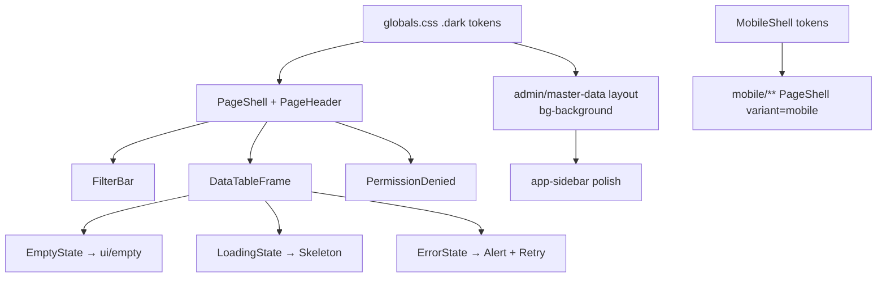
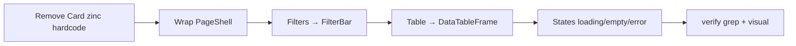

# Function Index — Phase 38 UI Design System Pass (Option B)

> **`rp4`+`rp5` 2026-07-23** — Disk FAIL=0 · Module DoD **100%** · **ĐÓNG tài liệu**.  
> SoT: `planning/phases/phase_38_ui_design_system_pass.md` (§20–§26).  
> AUDIT: `planning/temp/AUDIT_UI_UX_PROD_READINESS.md` (~**8.2**/10).  
> Status: **CLOSED** — EP0–EP6 · dbm 32/0 · allowlist 1.

---

## A. TO-BE component graph

---

## B. Migrate flow (1 page)

---

## C. Symbols / artifacts (disk)

| ID | Symbol / Artifact | Path | Vai trò P38 |
|---|---|---|---|
| F01 | `globals.css` `.dark` tokens | `frontend/src/app/globals.css` | EP1 — đổi primary + **sidebar-primary** (tím → ops) |
| F02 | `AdminLayout` | `frontend/src/app/admin/layout.tsx` | EP2 — `bg-[#0a0a0a]` → `bg-background` |
| F03 | `MasterDataLayout` | `frontend/src/app/master-data/layout.tsx` | EP2 — cùng pattern |
| F04 | `AppSidebar` | `frontend/src/components/app-sidebar.tsx` | EP2 — polish visual only; **giữ** P35 Ops lens |
| F05 | `MobileShell` | `frontend/src/components/mobile/mobile-shell.tsx` | EP5 — `bg-slate-*` → tokens |
| F06 | NEW `PageShell` | `frontend/src/components/layout/page-shell.tsx` | EP1 |
| F07 | NEW `PageHeader` | `frontend/src/components/layout/page-header.tsx` | EP1 |
| F08 | NEW `FilterBar` | `frontend/src/components/layout/filter-bar.tsx` | EP1 |
| F09 | NEW `DataTableFrame` | `frontend/src/components/layout/data-table-frame.tsx` | EP1 |
| F10 | NEW states | `frontend/src/components/states/*` | EP1 — wrap `ui/empty`, `ui/skeleton`, `ui/alert` |
| F11 | `QcPage` mẫu | `frontend/src/app/admin/qc/page.tsx` | EP1 migrate đầu |
| F12 | `ui/empty` / `button` | `frontend/src/components/ui/*` | Reuse · **cấm asChild** |
| F13 | `isUnauthorizedError` | `frontend/src/lib/http-error.ts` | PermissionDenied |
| F14 | `BreadcrumbNav` | `frontend/src/components/breadcrumb-nav.tsx` | Giữ trong layout; PageShell **không** duplicate breadcrumb |
| F15 | NEW verify | `tests/verify_ui_shell_classes.ps1` | EP5 |
| F16 | Evidence | `planning/evidence/phase_38/` | EP0–EP6 |
| F17 | Login | `frontend/src/app/login/**` | EP2 skin tokens |

**MUST NOT:** Đổi API/business · P35 nav logic · i18n keys mất · Option C · thêm chart/motion lib · `asChild` trên Button.

---

## D. Wave page lists (disk exact)

### W2 — Master-data (8)
`import` · `locations` · `partners` · `products` · `reasons` · `uoms` · `warehouses` · `zones`

### W3 — Inbound cluster
`admin/inbound` · `admin/inbound/[id]/receive` · `admin/qc` (đã W0) · `admin/lots` · `admin/putaway`

### W4 — Outbound cluster
`admin/outbound` · `admin/allocation` · `admin/waves` · `admin/waves/[id]` · `admin/waves/[id]/put-wall` · `admin/rma`

### W5 — Ops còn lại (allowlist ≤5 nếu phức tạp)
inventory(+stocktakes×3) · genealogy(+lotNo) · replenishment · serial · lpn · labor(+sessions) · cross-docking(+id) · exceptions · audit · users · roles · rules · integrations×3 · webhooks×2 · observability×3 · readiness · cutover · local-agent · task-interleaving

### W6 — Mobile (8)
`mobile/page` · `movement` · `picking` · `qc` · `replenishment` · `serial` · `lpn` · `tasks/next`  
(**Không** tạo `/mobile/tasks` root — 404 SoT P36/P37)

---

## E. Permissions / a11y

| Concern | Approach |
|---|---|
| 403 | `PermissionDenied` dùng `isUnauthorizedError` |
| Focus | Token `--ring`; Button/Input giữ focus-visible |
| Keyboard | FilterBar + table toolbar tab order trên QC mẫu |
| Motion | CSS `animate-in` / opacity 150–200ms — **không** thêm framer |

---

## F. Verify matrix

| Gate | Command / check |
|---|---|
| Shell classes | `powershell -File tests/verify_ui_shell_classes.ps1` |
| Nav | `verify_nav_lens.ps1` |
| i18n | `verify_i18n.ps1` |
| Visual | shots top 8 · optional `dbm_phase38` |
| DoD | AUDIT ≥8.0 + allowlist ≤5 |

---

## G. Critic residual

0 block. Phase **CLOSED** (`rp4`+`rp5` §25–§26). Residual: Option C / FF_UI_SHELL = OOS; P37 FOUNDER ký = ngoài P38.
