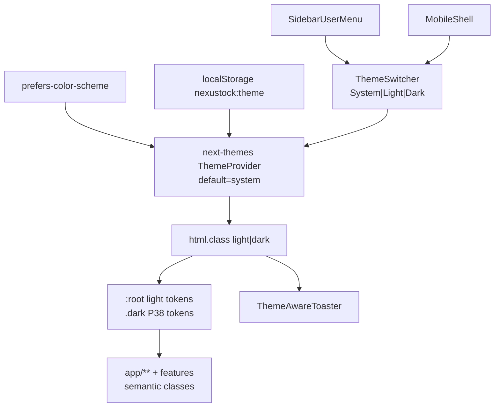
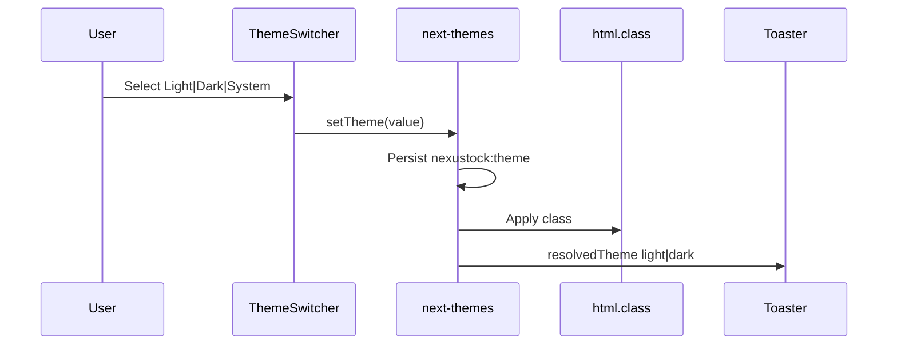

# Function Index — Phase 39 Theme Light / Dark + System (Option B)

> **`/18-auto-execute` 2026-07-23** — Module DoD **100%** · dbm **7/0**.  
> SoT: `planning/phases/phase_39_theme_light_dark_system.md` (§20–§25).  
> Baseline: `planning/evidence/phase_39/baseline_hardcode.json`.  
> Status: **CLOSED** — EP0–EP6.

---

## A. TO-BE theme graph

---

## B. Runtime theme flow

---

## C. Symbols / artifacts (disk)

| ID | Symbol / Artifact | Path | EP | Vai trò |
|---|---|---|---|---|
| F01 | `RootLayout` | `frontend/src/app/layout.tsx` | EP1 | Bỏ hardcode `dark`; `suppressHydrationWarning`; wrap ThemeProvider |
| F02 | NEW `ThemeProvider` | `frontend/src/providers/theme-provider.tsx` | EP1 | `next-themes` wrapper · default **system** · storageKey `nexustock:theme` |
| F03 | NEW `ThemeSwitcher` | `frontend/src/components/theme-switcher.tsx` | EP1 | 3-state · `DropdownMenuRadioGroup` hoặc compact buttons |
| F04 | NEW `ThemeAwareToaster` | `frontend/src/components/theme-aware-toaster.tsx` | EP2 | Sonner `theme={resolved}` |
| F05 | `SidebarUserMenu` | `frontend/src/components/nav/sidebar-user-menu.tsx` | EP1 | Gắn ThemeSwitcher trong dropdown |
| F06 | `MobileShell` | `frontend/src/components/mobile/mobile-shell.tsx` | EP5 | Switcher compact + bỏ `text-white` hard |
| F07 | `AppSidebar` | `frontend/src/components/app-sidebar.tsx` | EP1 | Semantic hover/active (zinc → muted/sidebar) |
| F08 | `globals.css` | `frontend/src/app/globals.css` | EP2 | Polish `:root` §8.2 + scrollbar light |
| F09 | `LoginPage` | `frontend/src/app/login/page.tsx` | EP2 | Light readable |
| F10 | `HomePage` | `frontend/src/app/page.tsx` | EP2 | Semantic |
| F11 | `PageShell` | `frontend/src/components/layout/page-shell.tsx` | — | **Reuse** · không đổi API |
| F12 | `DropdownMenuRadio*` | `frontend/src/components/ui/dropdown-menu.tsx` | EP1 | **Reuse** Base UI |
| F13 | `next-themes` | `package.json` `^0.4.6` | EP1 | **Đã có** — không `npm i` trừ thiếu node_modules |
| F14 | NEW verify | `tests/verify_theme_classes.ps1` | EP6 | Fail dark-only nguy hiểm |
| F15 | Evidence | `planning/evidence/phase_39/` | EP0–EP6 | baseline + shots + dbm |
| F16 | i18n | `messages/{en,vi}/Sidebar.json` | EP1 | `account.theme*` keys |
| F17 | ScanInput | `frontend/src/components/mobile/scan-input.tsx` | EP5 | `text-white` → semantic |
| F18 | features dialogs | `frontend/src/features/**` | EP4 | Dual `dark:` hoặc semantic |

**MUST NOT:** API/business · P35 nav logic · xóa PageShell · force default dark · rewrite hàng loạt `components/ui/*` · Option C brand.

---

## D. Wave / migrate lists (exact)

### W0 — Provider foundation (EP1–EP2)
`layout.tsx` · `theme-provider.tsx` · `theme-switcher.tsx` · `theme-aware-toaster.tsx` · `globals.css` · `login` · `page.tsx` (home) · `health-ui` (optional)

### W1 — Shell (EP1 + EP5 partial)
`app-sidebar.tsx` · `sidebar-user-menu.tsx` · `mobile-shell.tsx` · `language-switcher.tsx` (nếu hardcode)

### W2 — Admin high-traffic `text-white` (EP3)
`qc` · `inbound` · `inbound/[id]/receive` · `allocation` · `users` · `roles` · `outbound` (nếu có) · `waves`(+id/+put-wall) · `lots` · `putaway`

### W3 — Admin remaining (EP3)
`audit` · `exceptions` · `genealogy`(+lotNo) · `replenishment` · `serial` · `lpn` · `rma` · `local-agent` · `integrations/*` · `observability/*` · `cross-docking/[id]` · `inventory/stocktakes/[id]` · `rules` · labor/task-interleaving/readiness/cutover/webhooks (spot)

### W4 — Master-data + features (EP4)
MD: `products` · `partners` · `locations` · `zones` · `warehouses` (+ uoms/reasons/import nếu còn hard)  
Features: `features/qc/*` · `features/outbound/*` · `features/inventory/*` · `features/printing/*`

### W5 — Mobile pages (EP5)
`mobile/page` · `movement` · `picking` · `qc` · `replenishment` · `serial` · `lpn` · `tasks/next` · `scan-input`

### W6 — Verify / evidence (EP6)
`verify_theme_classes.ps1` · regression `verify_ui_shell_classes` · `verify_nav_lens` · `verify_i18n` · dbm light+dark · AUDIT · allowlist ≤5

**Allowlist max 5:** chỉ page quá đặc thù (chart dense / canvas) — ghi `evidence/phase_39/allowlist.md`.

---

## E. Class migrate cheat-sheet

| From (dark-only) | To |
|---|---|
| `text-white` | `text-foreground` (hoặc `text-sidebar-foreground` trong sidebar) |
| `text-zinc-400` | `text-muted-foreground` |
| `bg-zinc-900/50` hover | `hover:bg-muted` / `hover:bg-sidebar-accent` |
| `bg-zinc-950/40` | `bg-muted/40` / `bg-card` |
| `border-zinc-800` | `border-border` |
| Status solid | giữ pattern `bg-*-50 … dark:bg-*-950/30` |

---

## F. Verify matrix

| Gate | Check |
|---|---|
| Theme default | Clear storage → `system`; OS light → no `html.dark` |
| Override | Force dark khi OS light → `html.dark` |
| Persist | Reload giữ lựa chọn |
| Static | `verify_theme_classes.ps1` exit 0 |
| Regression | shell / nav / i18n PASS |
| DBM | 8 routes × light+dark · 0 Issue badge |
| DoD | §14 phase_39 |

---

## G. Critic residual

0 block sau §24. Open chỉ FOUNDER Proceed.  
Residual non-block: volume migrate `text-white` 46 files — wave kỷ luật.
