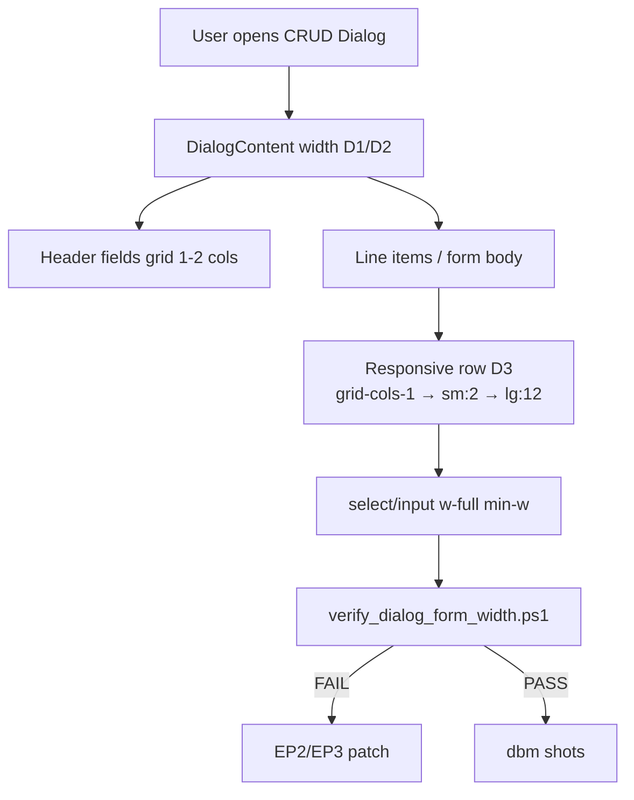
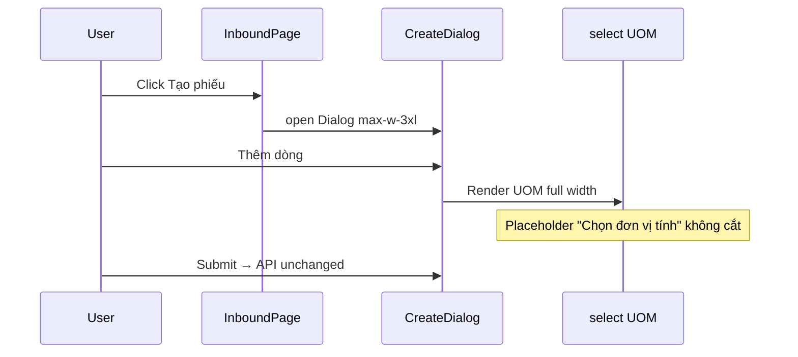

# Function Index — Phase 40 CRUD Dialog Form Width (Option B)

> SoT: `planning/phases/phase_40_crud_dialog_form_width.md` (§8 D1–D6 · §20 EP · §22 rp1).  
> Freeze: `planning/evidence/phase_40/baseline_disk_freeze.json`.  
> Status: **`rp2` 2026-07-23** — EP0–EP5 atomic · maturity **100% Ready**.

---

## A. TO-BE dialog density graph



---

## B. Runtime UX flow (P0 inbound)



---

## C. Symbols / artifacts (disk)

| ID | Symbol / Artifact | Path | EP | Vai trò |
|---|---|---|---|---|
| F01 | `InboundPage` create dialog | `frontend/src/app/admin/inbound/page.tsx` | EP2 | **P0** — thay `grid-cols-12` line ~317 |
| F02 | `CreateShipmentDialog` | `frontend/src/features/outbound/components/create-dialog.tsx` | EP2 | **P0** — bỏ `w-24` ×2 ~194–208 |
| F03 | `ReceivePage` dialog | `frontend/src/app/admin/inbound/[id]/receive/page.tsx` | EP2 | **P0** — `max-w-lg` → ≥`max-w-2xl` · stack fields |
| F04 | LPN modals | `frontend/src/app/admin/lpn/page.tsx` | EP3 | P1 `max-w-sm` |
| F05 | Replenishment modal | `frontend/src/app/admin/replenishment/page.tsx` | EP3 | P1 |
| F06 | Serial modal | `frontend/src/app/admin/serial/page.tsx` | EP3 | P1 |
| F07 | Putaway modal | `frontend/src/app/admin/putaway/page.tsx` | EP3 | P1 |
| F08 | Roles Dialog | `frontend/src/app/admin/roles/page.tsx` | EP3 | P1 `max-w-sm` |
| F09 | Users Dialog | `frontend/src/app/admin/users/page.tsx` | EP3 | P1 `max-w-md` review |
| F10 | `PickDialog` | `frontend/src/features/outbound/components/pick-dialog.tsx` | EP3 | P1 `sm:max-w-[400px]` |
| F11 | `MoveInventoryDialog` | `frontend/src/features/inventory/components/move-dialog.tsx` | EP3 | P1 |
| F12 | `LockInventoryDialog` | `frontend/src/features/inventory/components/lock-dialog.tsx` | EP3 | P1 |
| F13 | `QcResultDialog` | `frontend/src/features/qc/components/qc-result-dialog.tsx` | EP3 | P1 |
| F14 | `HoldReleaseDialog` | `frontend/src/features/qc/components/hold-release-dialog.tsx` | EP3 | P1 |
| F15 | Rules dialogs | `frontend/src/app/admin/rules/page.tsx` | EP3 | P1 |
| F16 | Mappings dialogs | `frontend/src/app/admin/integrations/mappings/page.tsx` | EP3 | P1 |
| F17 | `MasterDataCrudPage` | `frontend/src/features/master-data/master-data-crud.tsx` | EP4 | **Smoke only** — không đổi trừ regress |
| F18 | NEW verify | `tests/verify_dialog_form_width.ps1` | EP1 | Contract §22.5 |
| F19 | NEW dbm helper | `tests/helpers/dbm_phase40_dialog_width_browser.mjs` | EP5 | Shots create inbound/outbound |
| F20 | Evidence | `planning/evidence/phase_40/` | EP0–EP5 | freeze + allowlist + shots |
| F21 | `Dialog` primitive | `frontend/src/components/ui/dialog.tsx` | — | **MUST NOT** đổi default `max-w-sm` |

**MUST NOT:** API/DB · i18n key rename · theme tokens · nav · rewrite `components/ui/dialog.tsx` default · DataTable cột · extract shared LineRow component (optional only nếu lặp ≥3 sau P0).

---

## D. Wave / file lists (exact)

### W0 — Foundation (EP0–EP1)
- `planning/evidence/phase_40/*` (đã có freeze)  
- NEW `tests/verify_dialog_form_width.ps1`  
- (optional) short comment block D1–D6 trong verify header  

### W1 — P0 (EP2) — **bắt buộc DoD**
1. `frontend/src/app/admin/inbound/page.tsx`  
2. `frontend/src/features/outbound/components/create-dialog.tsx`  
3. `frontend/src/app/admin/inbound/[id]/receive/page.tsx`  

### W2 — P1 (EP3) — 13 files F04–F16
Theo `dialog_width_inventory.json` `p1[]`.

### W3 — Smoke + regression (EP4)
- MasterData Products create/edit (smoke)  
- `verify_theme_classes` · `verify_ui_shell_classes` · `verify_nav_lens` · `verify_i18n`  

### W4 — dbm + docs (EP5)
- dbm helper + shots  
- phase § docs · IMPLEMENTATION_PLAN row 40 ✅  

---

## E. EP atomic steps (executor-ready)

### EP0 — Evidence scaffold
- **Goal:** Xác nhận freeze + allowlist; tạo `shots/.gitkeep` nếu thiếu  
- **MUST NOT:** Xóa `baseline_disk_freeze.json`  
- **Validation:** ≥4 files trong `phase_40/`  
- **Continue:** EP1  

### EP1 — Verify script
- **Goal:** `tests/verify_dialog_form_width.ps1` implement §22.5  
- **Logic (pseudo):**
  ```powershell
  # For each *.tsx under frontend/src (exclude ui/dialog.tsx, ui/alert-dialog.tsx):
  # if contains DialogContent:
  #   if grid-cols-12 and not (sm:|md:|lg:) breakpoint → FAIL g12
  #   if match 'className="w-24"' or "w-24 " on div near select/Input
  #      and not TableHead and not min-w-24 → FAIL w24
  # allowlist paths from allowlist.md ≤5
  ```
- **Validation:** Script exits 1 trước fix (expected); document baseline FAIL count  
- **Failure:** Siết regex nếu false-positive TableHead  
- **Continue:** EP2  

### EP2 — Fix P0
- **Inbound line row** — thay:
  ```tsx
  // FROM
  className="grid grid-cols-12 gap-3 items-end ..."
  // TO
  className="grid grid-cols-1 gap-3 sm:grid-cols-2 lg:grid-cols-12 lg:items-end ..."
  // + col-span → sm:col-span-2 lg:col-span-4 (item) / lg:col-span-3 (uom) / ...
  // + min-w-0 trên mỗi cột; select giữ w-full
  ```
- **Outbound** — thay hai `div.w-24` →:
  ```tsx
  className="w-full sm:min-w-[9rem] sm:w-40" // UOM
  className="w-full sm:min-w-[7rem] sm:w-28" // Qty
  // parent: flex-col sm:flex-row
  ```
- **Receive** — `max-w-lg` → `max-w-2xl` (hoặc `sm:max-w-2xl`); `grid-cols-2` fields giữ / stack `grid-cols-1 sm:grid-cols-2`  
- **Validation:** Manual T1–T3 · verify g12/w24 P0 = 0  
- **Continue:** EP3  

### EP3 — Fix P1
- Với mỗi F04–F16: nếu modal có ≥2 input cạnh nhau trong `max-w-sm`/`max-w-[400px]` → nới `sm:max-w-lg` hoặc `sm:max-w-xl` **hoặc** stack `flex-col`  
- Roles/Users: review field count — Users ≥4 field → `max-w-lg` min  
- **Validation:** Checklist P1 trong evidence `p1_pass.md`  
- **Continue:** EP4  

### EP4 — Smoke + regression
- Mở MasterData Products dialog — OK  
- Run 4 verify scripts PASS  
- **Continue:** EP5  

### EP5 — dbm + docs
- Script browser: login → inbound create open → shot line row → outbound create → shot  
- Walkthrough + update phase maturity Module DoD  
- **Validation:** FAIL=0  

---

## F. Trace map (dependency)

```
F18 verify ──► gates EP2/EP3
F01/F02/F03 ──► DoD P0
F04..F16 ──► DoD P1
F17 smoke ──► no regress MD
F19/F20 ──► evidence close
F21 ──► untouched
```

---

## G. Critic pre-score (rp2)

| Trục | Điểm | Ghi chú |
|---|---|---|
| Atomic EP | 9.5 | Pseudo className cụ thể |
| Regression bound | 9.5 | MUST NOT rõ |
| Verify contract | 9.5 | IGNORE false-positive |
| Maintenance | 9.0 | Optional extract component sau |
| **Tổng** | **9.5** | Sẵn sàng `rp3` hoặc Proceed `/18` |

---

## I. `rp3` addendum (2026-07-23)

Blind spots BS-R3-01…16 đóng tại phase §24.

**Khóa execute thêm:**
- Verify rule `maxSmDense` cho custom modal.
- Inbound: `lg:col-span-*` bắt buộc sau responsive grid.
- dbm VI + light/dark P0.
- `p1_pass.md` 13/13.

Verdict: **0 block** → Proceed `/18-auto-execute`.
