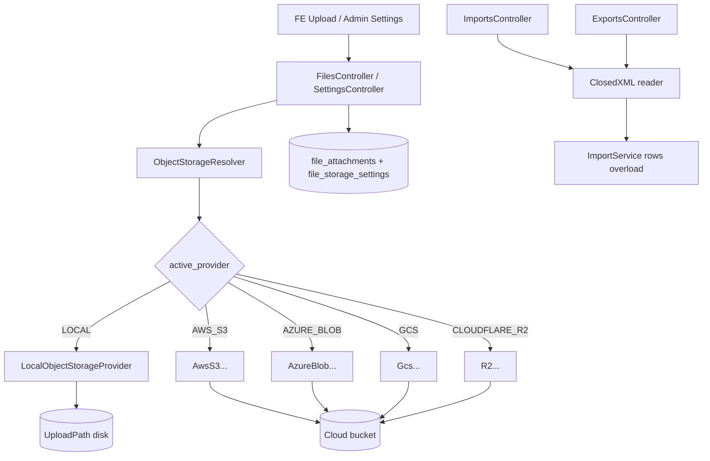
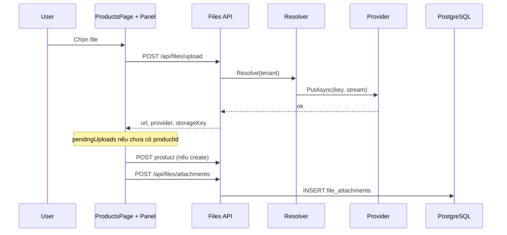
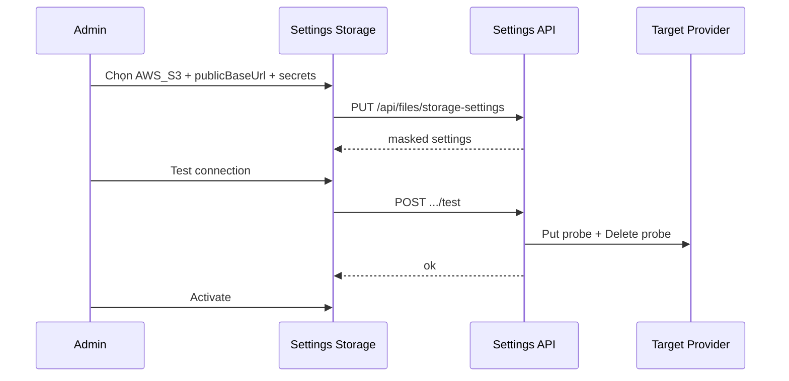
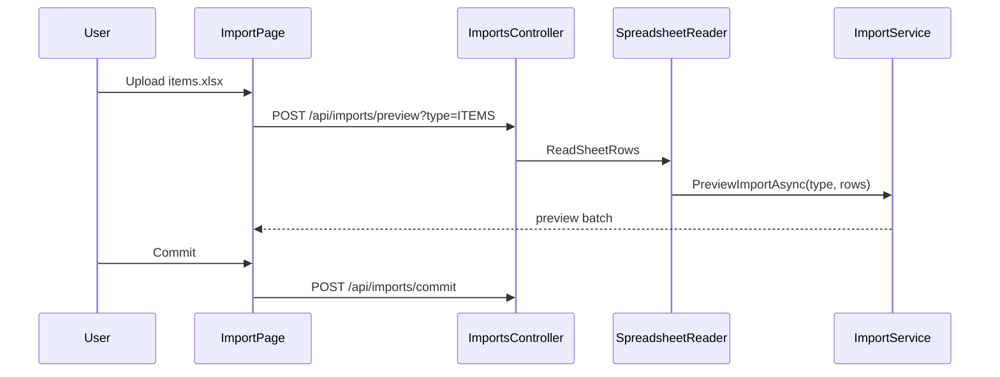

# Function Index — Phase 41 Attachments + Spreadsheet + Storage Hub (Option B)

> SoT: `planning/phases/phase_41_attachments_spreadsheet_gap.md` (§6–§20 · §22 rp1).  
> Freeze: `planning/evidence/phase_41/baseline_disk_freeze.json`.  
> Status: **`rp2`+`rp3` 2026-07-23** — EP0–EP6 atomic · BS-R3 20/20 · maturity **100% Ready**.  
> Downstream: Phase **42** migrate (không nằm index này).

---

## A. TO-BE architecture graph

---

## B. Runtime flows

### B1. Upload + bind Product

### B2. Admin Storage switch + Test

### B3. Import xlsx Master

---

## C. Symbols / artifacts (F-map)

| ID | Symbol / Artifact | Path | EP | Vai trò |
|---|---|---|---|---|
| F01 | `Nexustock.Modules.Files` csproj + DI | `backend/modules/Nexustock.Modules.Files/` **NEW** | EP0 | Module scaffold · register Program.cs |
| F02 | `FileAttachment` entity | `.../Entities/FileAttachment.cs` **NEW** | EP1 | DB row attachment |
| F03 | `FileStorageSettings` entity | `.../Entities/FileStorageSettings.cs` **NEW** | EP1 | 1 row/tenant settings |
| F04 | `FilesDbContext` + migrations | `.../Contexts/` + `Migrations/` **NEW** | EP1 | `file_attachments` · `file_storage_settings` |
| F05 | `IObjectStorageProvider` | `.../Providers/IObjectStorageProvider.cs` **NEW** | EP0–EP1 | Put/Delete/Exists/BuildPublicUrl/**OpenReadAsync** (P42-ready) |
| F06 | `LocalObjectStorageProvider` | `.../Providers/LocalObjectStorageProvider.cs` **NEW** | EP1 | Default LOCAL |
| F07 | `FakeObjectStorageProvider` | `.../Providers/FakeObjectStorageProvider.cs` **NEW** | EP2 | CI only |
| F08 | `AwsS3ObjectStorageProvider` | `.../Providers/AwsS3...cs` **NEW** | EP2 | AWS S3 |
| F09 | `AzureBlobObjectStorageProvider` | `.../Providers/AzureBlob...cs` **NEW** | EP2 | Azure |
| F10 | `GcsObjectStorageProvider` | `.../Providers/Gcs...cs` **NEW** | EP2 | GCS |
| F11 | `CloudflareR2ObjectStorageProvider` | `.../Providers/CloudflareR2...cs` **NEW** | EP2 | R2 S3-compatible |
| F12 | `ObjectStorageResolver` | `.../Services/ObjectStorageResolver.cs` **NEW** | EP1–EP2 | Resolve by settings |
| F13 | `FileStorageService` | `.../Services/FileStorageService.cs` **NEW** | EP1 | Upload whitelist + put |
| F14 | `AttachmentService` | `.../Services/AttachmentService.cs` **NEW** | EP1 | Bind/list/delete |
| F15 | `FilesController` | `.../Controllers/FilesController.cs` **NEW** | EP1 | `/api/files/upload` · attachments |
| F16 | `FileStorageSettingsController` | `.../Controllers/FileStorageSettingsController.cs` **NEW** | EP2 | GET/PUT/test settings |
| F17 | Secret encrypt helper | Data Protection wrapper **NEW** | EP2 | config_json_encrypted |
| F18 | Permission seed | Files DI / Identity seed | EP1 | `files.*` + `master_data.export` |
| F19 | `StorageController` QC | `backend/modules/Nexustock.Modules.Qc/Controllers/StorageController.cs` | EP4 | Delegate → FileStorageService |
| F20 | `Program.cs` static files | `backend/Nexustock.Api/Program.cs` | EP1 | Giữ UseStaticFiles; AddFilesModule |
| F21 | `ImportService` rows overload | `.../MasterData/Services/ImportService.cs` | EP5 | `PreviewImportAsync(type, rows)` |
| F22 | `SpreadsheetReader` / ClosedXML | MasterData or Files helper **NEW** | EP5 | xlsx → string[][] |
| F23 | `ImportsController` | `.../MasterData/Controllers/ImportsController.cs` | EP5 | Accept .xlsx + template format |
| F24 | `ExportsController` | `.../MasterData/Controllers/ExportsController.cs` **NEW** | EP5 | GET export csv\|xlsx |
| F25 | FE `features/files/api.ts` | `frontend/src/features/files/api.ts` **NEW** | EP3–EP4 | Client upload/settings |
| F26 | `EntityAttachmentsPanel` | `frontend/src/features/files/entity-attachments-panel.tsx` **NEW** | EP4 | Upload/list/delete UI |
| F27 | Products page wire | `frontend/src/app/master-data/products/page.tsx` | EP4 | Gắn panel PRODUCT |
| F28 | Admin Storage page | `frontend/src/app/admin/settings/storage/page.tsx` **NEW** | EP3 | Provider · Test · Save |
| F29 | Nav registry Settings | `frontend/src/components/nav/*` + sidebar | EP3 | Link storage + i18n |
| F30 | Import page xlsx | `frontend/src/app/master-data/import/page.tsx` | EP5 | accept `.xlsx` |
| F31 | Export buttons | `products` · `locations` · `partners` pages | EP5 | Dropdown csv\|xlsx |
| F32 | QC result dialog | `frontend/src/features/qc/components/qc-result-dialog.tsx` | EP4 | Upload path compat |
| F33 | i18n keys | `messages/{vi,en}/Admin.json` · `MasterData.json` | EP3–EP5 | storage.* · export.* |
| F34 | `verify_files_spreadsheet.ps1` | `tests/verify_files_spreadsheet.ps1` **NEW** | EP6 | §22.6 rules |
| F35 | dbm helper | `tests/helpers/dbm_phase41_files_browser.mjs` **NEW** | EP6 | Admin + Product shots |
| F36 | Evidence | `planning/evidence/phase_41/` | EP0–EP6 | freeze + shots |
| F37 | shadcn `attachment.tsx` | `frontend/src/components/ui/attachment.tsx` | — | Reuse visual only · **MUST NOT** domain logic |
| F38 | Phase 42 migrate | `phase_42_storage_provider_migrate.md` | — | **MUST NOT** implement trong P41 |

**MUST NOT:** Bulk migrate (P42) · Inbound/Outbound attach (P43) · S3 as default · plaintext secrets trên FE · bytea file trong DB · đổi `products` thêm image_url · phá CSV import regression · đổi default `ui/dialog` · virus scan/OCR/DMS.

---

## D. Wave / file lists (exact EP)

### EP0 — Scaffold
- NEW module Files csproj + sln ref  
- NEW `IObjectStorageProvider` (+ OpenReadAsync stub)  
- Evidence keep + ClosedXML package add (MasterData hoặc Files)  
- **Validation:** solution build / project loads  

### EP1 — Local core
- F02–F06, F12–F15, F18, F20  
- Migration UP  
- Seed settings LOCAL  
- **Validation:** upload LOCAL → list → delete integration smoke  

### EP2 — Cloud + settings API
- F07–F11, F16–F17  
- Fake provider tests  
- **Validation:** PUT settings mask · Test Fake OK · activate  

### EP3 — Admin UI
- F28, F29, F33 (Admin keys)  
- **Validation:** dbm `/admin/settings/storage` light  

### EP4 — Product + QC
- F25–F27, F32, F19  
- pendingUploads create flow  
- **Validation:** dbm Product attach image+pdf  

### EP5 — Spreadsheet
- F21–F24, F30–F31  
- **Validation:** ImportsControllerTests + xlsx preview/commit · export download  

### EP6 — Verify + close
- F34–F36  
- Regression theme/shell/dialog  
- **Validation:** verify PASS · dbm · plan row 41 ✅  

---

## E. Failure recovery (per EP)

| EP | Failure | Recovery |
|---|---|---|
| EP1 | Migration fail | DOWN · fix entity · re-add |
| EP2 | SDK restore proxy | Fake-only CI; document SDK offline pack |
| EP3 | Nav miss permission | Gate `files.storage.manage` · hide link |
| EP4 | Product create no id | Enforce pendingUploads §10 |
| EP5 | xlsx parse empty | `IMPORT_PARSE_FAILED` · keep CSV path |
| EP6 | verify FAIL rule | Fix file in F-map · re-run |

---

## F. Critic checklist map (rp2)

| Risk | Mitigation in index |
|---|---|
| Executor sửa `ui/dialog` | F37 MUST NOT |
| Implement migrate sớm | F38 MUST NOT |
| Bỏ OpenRead → P42 block | F05 bắt buộc OpenReadAsync |
| Secret leak | F17 + GET mask |
| CSV regress | EP5 giữ ImportsControllerTests |
| Default cloud | Seed LOCAL only |

---

## G. Trace map EP ↔ F-ids

| EP | F-ids chính |
|---|---|
| EP0 | F01, F05, F36, ClosedXML |
| EP1 | F02–F06, F12–F15, F18, F20 |
| EP2 | F07–F11, F16–F17 |
| EP3 | F28, F29, F33 |
| EP4 | F19, F25–F27, F32 |
| EP5 | F21–F24, F30–F31 |
| EP6 | F34–F36 |

---

## H. Verdict index

**PASS `rp2`** — atomic EP0–EP6 · F01–F38 · đủ maintenance cho `/18`.
