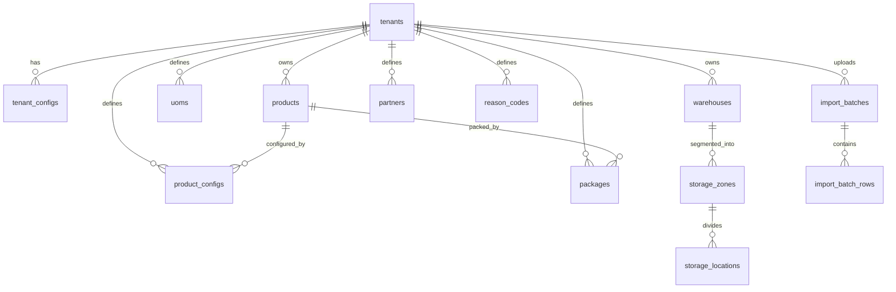

# PHASE 02: Master data foundation

## Execution spec maturity

- **Mức hiện tại:** 96%
- **Đánh giá:** Đủ chi tiết cho thiết kế database vật lý, cấu trúc module thực tế, API contract chuẩn hóa, quy trình import Excel/CSV tin cậy và tích hợp RBAC chuyển tiếp.
- **Khi cần upgrade:** Upgrade nếu phát sinh cấu trúc đa kho đặc thù hoặc thay đổi lớn trong cấu trúc import template.

## 1. Mục tiêu

Chuẩn hóa dữ liệu nền WMS để mọi nghiệp vụ sau dùng chung một catalog nhất quán. Phase này thiết lập các bảng danh mục cốt lõi, tích hợp cơ chế import preview/commit an toàn và chuẩn bị sẵn cấu hình Master Data cho các thuật toán tối ưu (Slotting, Allocation, Serial Tracking) ở các phase sau.

## 2. Phạm vi

### In scope

* Triển khai module `Nexustock.Modules.MasterData` trong dự án Backend Modular Monolith.
* Thiết lập Database Schema vật lý trên PostgreSQL cho nhóm Master Data nền tảng.
* Seed dữ liệu Demo và tham số mặc định (UOM, Warehouse, Zone, Location, Partner, Reason Code).
* Xây dựng API quản lý danh mục (CRUD, Search, Paginate).
* Xây dựng luồng Import Excel/CSV 2 bước (Preview không ghi DB, Commit nguyên khối).
* Xây dựng giao diện Frontend Web SPA quản lý danh mục và Import panel.

### Out of scope

* Quản lý tài khoản, phân quyền (Users, Roles, JWT, Session) -> Triển khai ở Phase 03.
* Logic quản lý Lot, Invoice nhận hàng, số lượng tồn kho khả dụng -> Triển khai ở Phase 04 & Phase 06.
* Thuật toán cất hàng tự động (Slotting Rules) -> Triển khai ở Phase 12.
* Giữ hàng tự động (Allocation Rules) -> Triển khai ở Phase 13.

## 3. Điều kiện đầu vào

* Phase 01 hoàn tất. Monorepo skeleton, Docker PostgreSQL, Redis và Health Check UI hoạt động ổn định.
* Port database `5435` kết nối thành công từ backend qua chuỗi kết nối an toàn.

## 4. Setup

### Cấu trúc thư mục thực tế

* **Backend Module:** [backend/modules/Nexustock.Modules.MasterData/](file:///d:/1_Project/48_Nexustock/backend/modules/Nexustock.Modules.MasterData)
* **Frontend Feature:** [frontend/src/features/master-data/](file:///d:/1_Project/48_Nexustock/frontend/src/features/master-data)
* **Frontend App Route:** [frontend/src/app/master-data/](file:///d:/1_Project/48_Nexustock/frontend/src/app/master-data)

### Quyền hạn (Permission Catalog) đăng ký trước

Hệ thống seed trước các quyền sau vào danh mục để Phase 03 sử dụng. Ở Phase 02, API kiểm tra quyền qua policy stub (giả lập duyệt mọi request):

* `master_data.read` - Quyền xem thông tin danh mục.
* `master_data.write` - Quyền tạo, sửa thông tin danh mục.
* `master_data.import` - Quyền tải file Excel/CSV import dữ liệu nền.
* `master_data.export` - Quyền xuất dữ liệu danh mục ra file Excel/CSV.

## 5. Database Schema (PostgreSQL)

Để đảm bảo tính nhất quán và không phải sửa cấu trúc bảng (ALTER) ở các phase sau, toàn bộ schema vật lý cho Master Data được thiết kế chi tiết như sau:



### A. Bảng `tenants` (Nhà máy / Khách thuê)
Bảng nền tảng để hỗ trợ kiến trúc Multi-Tenant.
```sql
CREATE TABLE tenants (
    id UUID PRIMARY KEY,
    code VARCHAR(50) NOT NULL,
    name VARCHAR(150) NOT NULL,
    is_active BOOLEAN NOT NULL DEFAULT true,
    created_at TIMESTAMP WITH TIME ZONE NOT NULL DEFAULT CURRENT_TIMESTAMP,
    created_by VARCHAR(100) NULL,
    updated_at TIMESTAMP WITH TIME ZONE NULL,
    updated_by VARCHAR(100) NULL,
    row_version INT NOT NULL DEFAULT 1,
    CONSTRAINT uq_tenants_code UNIQUE (code)
);
CREATE INDEX idx_tenants_active ON tenants(is_active);
```

### B. Bảng `tenant_configs` (Tham số vận hành)
```sql
CREATE TABLE tenant_configs (
    tenant_id UUID PRIMARY KEY,
    fifo_policy_level INT NOT NULL DEFAULT 2, -- 0: Tắt, 1: Cảnh báo, 2: Chặn cứng
    lot_no_pattern VARCHAR(100) NOT NULL DEFAULT '{YYYY}{MM}{DD}-{SEQ}',
    allow_negative_stock BOOLEAN NOT NULL DEFAULT false,
    updated_at TIMESTAMP WITH TIME ZONE NULL,
    updated_by VARCHAR(100) NULL,
    CONSTRAINT fk_tenant_configs_tenant FOREIGN KEY (tenant_id) REFERENCES tenants(id) ON DELETE CASCADE
);
```

### C. Bảng `uoms` (Đơn vị tính)
```sql
CREATE TABLE uoms (
    id UUID PRIMARY KEY,
    tenant_id UUID NOT NULL,
    code VARCHAR(20) NOT NULL,
    name VARCHAR(100) NOT NULL,
    is_active BOOLEAN NOT NULL DEFAULT true,
    created_at TIMESTAMP WITH TIME ZONE NOT NULL DEFAULT CURRENT_TIMESTAMP,
    created_by VARCHAR(100) NULL,
    updated_at TIMESTAMP WITH TIME ZONE NULL,
    updated_by VARCHAR(100) NULL,
    row_version INT NOT NULL DEFAULT 1,
    CONSTRAINT uq_uoms_tenant_code UNIQUE (tenant_id, code),
    CONSTRAINT fk_uoms_tenant FOREIGN KEY (tenant_id) REFERENCES tenants(id) ON DELETE CASCADE
);
CREATE INDEX idx_uoms_tenant_code ON uoms(tenant_id, code);
```

### D. Bảng `products` (Danh mục vật tư / Linh kiện)
```sql
CREATE TABLE products (
    id UUID PRIMARY KEY,
    tenant_id UUID NOT NULL,
    code VARCHAR(100) NOT NULL,
    name VARCHAR(255) NOT NULL,
    description TEXT NULL,
    barcode VARCHAR(100) NULL,
    base_uom_id UUID NOT NULL,
    is_active BOOLEAN NOT NULL DEFAULT true,
    created_at TIMESTAMP WITH TIME ZONE NOT NULL DEFAULT CURRENT_TIMESTAMP,
    created_by VARCHAR(100) NULL,
    updated_at TIMESTAMP WITH TIME ZONE NULL,
    updated_by VARCHAR(100) NULL,
    row_version INT NOT NULL DEFAULT 1,
    CONSTRAINT uq_products_tenant_code UNIQUE (tenant_id, code),
    CONSTRAINT uq_products_tenant_barcode UNIQUE (tenant_id, barcode),
    CONSTRAINT fk_products_tenant FOREIGN KEY (tenant_id) REFERENCES tenants(id) ON DELETE CASCADE,
    CONSTRAINT fk_products_uom FOREIGN KEY (base_uom_id) REFERENCES uoms(id)
);
CREATE INDEX idx_products_tenant_code ON products(tenant_id, code);
CREATE INDEX idx_products_tenant_barcode ON products(tenant_id, barcode);
```

### E. Bảng `product_configs` (Cấu hình nghiệp vụ vật tư - chuẩn bị cho các phase sau)
```sql
CREATE TABLE product_configs (
    product_id UUID PRIMARY KEY,
    tenant_id UUID NOT NULL,
    iqc_check_type VARCHAR(20) NOT NULL DEFAULT 'FULL', -- FULL, SAMPLE, NONE
    vendor_inner_lot_ctl BOOLEAN NOT NULL DEFAULT false,
    is_wafer BOOLEAN NOT NULL DEFAULT false,
    lot_validation_regex VARCHAR(255) NULL,
    min_stock NUMERIC(18, 4) NOT NULL DEFAULT 0.0000,
    max_stock NUMERIC(18, 4) NOT NULL DEFAULT 999999.0000,
    weight_class VARCHAR(20) NOT NULL DEFAULT 'MEDIUM', -- LIGHT, MEDIUM, HEAVY (Slotting)
    rotation_speed VARCHAR(20) NOT NULL DEFAULT 'SLOW', -- SLOW, MEDIUM, FAST (Slotting)
    track_serial BOOLEAN NOT NULL DEFAULT false,        -- Bật Serial Tracking
    length NUMERIC(10, 2) NOT NULL DEFAULT 0.00,        -- mm
    width NUMERIC(10, 2) NOT NULL DEFAULT 0.00,         -- mm
    height NUMERIC(10, 2) NOT NULL DEFAULT 0.00,        -- mm
    weight NUMERIC(10, 2) NOT NULL DEFAULT 0.00,        -- g
    CONSTRAINT fk_product_configs_product FOREIGN KEY (product_id) REFERENCES products(id) ON DELETE CASCADE,
    CONSTRAINT fk_product_configs_tenant FOREIGN KEY (tenant_id) REFERENCES tenants(id) ON DELETE CASCADE
);
```

### F. Bảng `packages` (Quy cách đóng gói)
```sql
CREATE TABLE packages (
    id UUID PRIMARY KEY,
    tenant_id UUID NOT NULL,
    product_id UUID NOT NULL,
    package_name VARCHAR(100) NOT NULL, -- Cuộn, Hộp, Pallet, Thùng
    barcode VARCHAR(100) NULL,
    uom_id UUID NOT NULL,
    conversion_factor NUMERIC(18, 4) NOT NULL DEFAULT 1.0000, -- Số lượng quy đổi ra base UOM
    is_active BOOLEAN NOT NULL DEFAULT true,
    created_at TIMESTAMP WITH TIME ZONE NOT NULL DEFAULT CURRENT_TIMESTAMP,
    created_by VARCHAR(100) NULL,
    updated_at TIMESTAMP WITH TIME ZONE NULL,
    updated_by VARCHAR(100) NULL,
    row_version INT NOT NULL DEFAULT 1,
    CONSTRAINT fk_packages_tenant FOREIGN KEY (tenant_id) REFERENCES tenants(id) ON DELETE CASCADE,
    CONSTRAINT fk_packages_product FOREIGN KEY (product_id) REFERENCES products(id) ON DELETE CASCADE,
    CONSTRAINT fk_packages_uom FOREIGN KEY (uom_id) REFERENCES uoms(id),
    CONSTRAINT ck_packages_conversion_factor CHECK (conversion_factor > 0),
    CONSTRAINT uq_packages_product_uom UNIQUE (product_id, uom_id),
    CONSTRAINT uq_packages_tenant_barcode UNIQUE (tenant_id, barcode)
);
CREATE INDEX idx_packages_tenant_barcode ON packages(tenant_id, barcode);
```

### G. Bảng `warehouses` (Nhà kho)
```sql
CREATE TABLE warehouses (
    id UUID PRIMARY KEY,
    tenant_id UUID NOT NULL,
    code VARCHAR(50) NOT NULL,
    name VARCHAR(150) NOT NULL,
    description TEXT NULL,
    is_active BOOLEAN NOT NULL DEFAULT true,
    created_at TIMESTAMP WITH TIME ZONE NOT NULL DEFAULT CURRENT_TIMESTAMP,
    created_by VARCHAR(100) NULL,
    updated_at TIMESTAMP WITH TIME ZONE NULL,
    updated_by VARCHAR(100) NULL,
    row_version INT NOT NULL DEFAULT 1,
    CONSTRAINT uq_warehouses_tenant_code UNIQUE (tenant_id, code),
    CONSTRAINT fk_warehouses_tenant FOREIGN KEY (tenant_id) REFERENCES tenants(id) ON DELETE CASCADE
);
CREATE INDEX idx_warehouses_tenant_code ON warehouses(tenant_id, code);
```

### H. Bảng `storage_zones` (Phân hoạch Vùng kho)
```sql
CREATE TABLE storage_zones (
    id UUID PRIMARY KEY,
    tenant_id UUID NOT NULL,
    warehouse_id UUID NOT NULL,
    code VARCHAR(50) NOT NULL,
    name VARCHAR(150) NOT NULL,
    zone_type VARCHAR(20) NOT NULL DEFAULT 'STORAGE', -- STORAGE, QC, STAGING, SHIPPING, QUARANTINE
    temperature_limit NUMERIC(5, 2) NULL,
    is_locked BOOLEAN NOT NULL DEFAULT false, -- Đóng băng toàn vùng để kiểm kê
    created_at TIMESTAMP WITH TIME ZONE NOT NULL DEFAULT CURRENT_TIMESTAMP,
    created_by VARCHAR(100) NULL,
    updated_at TIMESTAMP WITH TIME ZONE NULL,
    updated_by VARCHAR(100) NULL,
    row_version INT NOT NULL DEFAULT 1,
    CONSTRAINT uq_storage_zones_tenant_warehouse_code UNIQUE (tenant_id, warehouse_id, code),
    CONSTRAINT fk_storage_zones_tenant FOREIGN KEY (tenant_id) REFERENCES tenants(id) ON DELETE CASCADE,
    CONSTRAINT fk_storage_zones_warehouse FOREIGN KEY (warehouse_id) REFERENCES warehouses(id) ON DELETE CASCADE
);
CREATE INDEX idx_storage_zones_warehouse ON storage_zones(warehouse_id);
```

### I. Bảng `storage_locations` (Vị trí kệ hàng)
```sql
CREATE TABLE storage_locations (
    id UUID PRIMARY KEY,
    tenant_id UUID NOT NULL,
    zone_id UUID NOT NULL,
    code VARCHAR(50) NOT NULL,
    max_capacity NUMERIC(18, 4) NOT NULL DEFAULT 999999.0000,
    max_volume NUMERIC(18, 4) NOT NULL DEFAULT 999999.0000, -- Thể tích tối đa
    x_coord INT NOT NULL DEFAULT 0, -- Tọa độ định tuyến cất hàng/lấy hàng
    y_coord INT NOT NULL DEFAULT 0,
    z_coord INT NOT NULL DEFAULT 0, -- Tầng kệ
    length NUMERIC(10, 2) NOT NULL DEFAULT 0.00,
    width NUMERIC(10, 2) NOT NULL DEFAULT 0.00,
    height NUMERIC(10, 2) NOT NULL DEFAULT 0.00,
    is_locked BOOLEAN NOT NULL DEFAULT false, -- Khóa vị trí kệ
    lock_reason_code VARCHAR(50) NULL,
    is_active BOOLEAN NOT NULL DEFAULT true,
    created_at TIMESTAMP WITH TIME ZONE NOT NULL DEFAULT CURRENT_TIMESTAMP,
    created_by VARCHAR(100) NULL,
    updated_at TIMESTAMP WITH TIME ZONE NULL,
    updated_by VARCHAR(100) NULL,
    row_version INT NOT NULL DEFAULT 1,
    CONSTRAINT uq_storage_locations_tenant_code UNIQUE (tenant_id, code),
    CONSTRAINT fk_storage_locations_tenant FOREIGN KEY (tenant_id) REFERENCES tenants(id) ON DELETE CASCADE,
    CONSTRAINT fk_storage_locations_zone FOREIGN KEY (zone_id) REFERENCES storage_zones(id) ON DELETE CASCADE
);
CREATE INDEX idx_storage_locations_zone ON storage_locations(zone_id);
CREATE INDEX idx_storage_locations_code ON storage_locations(tenant_id, code);
```

### J. Bảng `partners` (Đối tác - Vendor & Customer)
```sql
CREATE TABLE partners (
    id UUID PRIMARY KEY,
    tenant_id UUID NOT NULL,
    code VARCHAR(50) NOT NULL,
    name VARCHAR(255) NOT NULL,
    partner_type VARCHAR(20) NOT NULL DEFAULT 'VENDOR', -- VENDOR, CUSTOMER, CARRIER
    address TEXT NULL,
    tax_code VARCHAR(50) NULL,
    is_active BOOLEAN NOT NULL DEFAULT true,
    created_at TIMESTAMP WITH TIME ZONE NOT NULL DEFAULT CURRENT_TIMESTAMP,
    created_by VARCHAR(100) NULL,
    updated_at TIMESTAMP WITH TIME ZONE NULL,
    updated_by VARCHAR(100) NULL,
    row_version INT NOT NULL DEFAULT 1,
    CONSTRAINT uq_partners_tenant_code UNIQUE (tenant_id, code),
    CONSTRAINT fk_partners_tenant FOREIGN KEY (tenant_id) REFERENCES tenants(id) ON DELETE CASCADE
);
CREATE INDEX idx_partners_tenant_code ON partners(tenant_id, code);
```

### K. Bảng `reason_codes` (Lý do chuẩn hóa)
```sql
CREATE TABLE reason_codes (
    id UUID PRIMARY KEY,
    tenant_id UUID NOT NULL,
    code VARCHAR(50) NOT NULL,
    reason_type VARCHAR(30) NOT NULL, -- SYSTEM_OVERRIDE, INVENTORY_ADJUSTMENT, HOLD, SCRAP
    description VARCHAR(255) NOT NULL,
    is_active BOOLEAN NOT NULL DEFAULT true,
    created_at TIMESTAMP WITH TIME ZONE NOT NULL DEFAULT CURRENT_TIMESTAMP,
    created_by VARCHAR(100) NULL,
    updated_at TIMESTAMP WITH TIME ZONE NULL,
    updated_by VARCHAR(100) NULL,
    row_version INT NOT NULL DEFAULT 1,
    CONSTRAINT uq_reason_codes_tenant_type_code UNIQUE (tenant_id, reason_type, code),
    CONSTRAINT fk_reason_codes_tenant FOREIGN KEY (tenant_id) REFERENCES tenants(id) ON DELETE CASCADE
);
```

### L. Bảng `import_batches` & `import_batch_rows` (Quản lý Import 2 bước)
```sql
CREATE TABLE import_batches (
    id UUID PRIMARY KEY,
    tenant_id UUID NOT NULL,
    import_type VARCHAR(50) NOT NULL, -- ITEMS, LOCATIONS, PARTNERS
    status VARCHAR(20) NOT NULL DEFAULT 'PENDING', -- PENDING, VALIDATED, COMMITTED, FAILED
    total_rows INT NOT NULL DEFAULT 0,
    success_rows INT NOT NULL DEFAULT 0,
    error_rows INT NOT NULL DEFAULT 0,
    created_at TIMESTAMP WITH TIME ZONE NOT NULL DEFAULT CURRENT_TIMESTAMP,
    created_by VARCHAR(100) NULL,
    CONSTRAINT fk_import_batches_tenant FOREIGN KEY (tenant_id) REFERENCES tenants(id) ON DELETE CASCADE
);

CREATE TABLE import_batch_rows (
    id UUID PRIMARY KEY,
    batch_id UUID NOT NULL,
    row_index INT NOT NULL,
    raw_data JSONB NOT NULL,
    is_valid BOOLEAN NOT NULL DEFAULT true,
    error_message TEXT NULL,
    CONSTRAINT fk_import_batch_rows_batch FOREIGN KEY (batch_id) REFERENCES import_batches(id) ON DELETE CASCADE
);
```

## 6. Backend/API Contract

Dữ liệu trả về hoặc nhận vào bắt buộc sử dụng định dạng **camelCase**.

### A. Danh mục API

| Phương thức | Đường dẫn API | Chức năng | Tham số truy vấn (Query Params) |
|---|---|---|---|
| `GET` | `/api/master/items` | Danh sách vật tư | `page`, `pageSize`, `search`, `isActive` |
| `POST` | `/api/master/items` | Tạo mới vật tư | Request Body: ItemDTO |
| `PUT` | `/api/master/items/{id}` | Cập nhật vật tư | Request Body: ItemDTO |
| `GET` | `/api/master/uoms` | Danh sách đơn vị tính | `page`, `pageSize`, `isActive` |
| `POST` | `/api/master/uoms` | Tạo mới đơn vị tính | Request Body: UomDTO |
| `GET` | `/api/master/warehouses` | Danh sách nhà kho | `page`, `pageSize`, `isActive` |
| `POST` | `/api/master/warehouses`| Tạo mới nhà kho | Request Body: WarehouseDTO |
| `GET` | `/api/master/zones` | Danh sách vùng kho | `page`, `pageSize`, `warehouseId` |
| `POST` | `/api/master/zones` | Tạo mới vùng kho | Request Body: StorageZoneDTO |
| `GET` | `/api/master/locations` | Danh sách vị trí kệ | `page`, `pageSize`, `zoneId`, `isLocked` |
| `POST` | `/api/master/locations`| Tạo mới vị trí kệ | Request Body: LocationDTO |
| `GET` | `/api/master/partners` | Danh sách đối tác | `page`, `pageSize`, `partnerType` |
| `POST` | `/api/master/partners` | Tạo mới đối tác | Request Body: PartnerDTO |
| `GET` | `/api/master/reasons` | Danh sách lý do | `page`, `pageSize`, `reasonType` |
| `POST` | `/api/master/reasons` | Tạo lý do mới | Request Body: ReasonCodeDTO |

### B. API Import 2 bước

#### 1. Preview file import: `POST /api/master/import/preview`
* **Content-Type:** `multipart/form-data`
* **Payload:** `file` (Excel/CSV), `importType` (enum: `ITEMS`, `LOCATIONS`, `PARTNERS`)
* **Hành vi:**
  1. Đọc và parse dữ liệu file.
  2. Tạo bản ghi `import_batches` trạng thái `PENDING`.
  3. Validate logic nghiệp vụ từng dòng (kiểm tra rỗng, kiểm tra trùng mã, kiểm tra khóa ngoại như `baseUomCode` có tồn tại không).
  4. Lưu tất cả các dòng (raw JSONB) và kết quả validate vào `import_batch_rows`.
  5. Trả về thống kê và chi tiết các dòng lỗi. Không thay đổi bảng dữ liệu thật.

* **Response (Ví dụ lỗi validation):**
```json
{
  "batchId": "472e391b-871f-4422-959c-70e06001a1e8",
  "importType": "ITEMS",
  "status": "VALIDATED",
  "totalRows": 3,
  "successRows": 2,
  "errorRows": 1,
  "errors": [
    {
      "rowIndex": 2,
      "raw": {
        "code": "ITEM-002",
        "name": "Chip xử lý IC",
        "baseUomCode": "BOX_ERROR"
      },
      "errorMessage": "Đơn vị tính 'BOX_ERROR' không tồn tại trên hệ thống."
    }
  ]
}
```

#### 2. Commit ghi dữ liệu: `POST /api/master/import/commit`
* **Request Body:**
```json
{
  "batchId": "472e391b-871f-4422-959c-70e06001a1e8"
}
```
* **Hành vi:**
  1. Kiểm tra trạng thái của `batchId`. Nếu đã commit hoặc có `errorRows > 0`, chặn lại và báo lỗi.
  2. Khởi chạy DB Transaction.
  3. Ghi toàn bộ dữ liệu hợp lệ từ `import_batch_rows` vào các bảng master data thực tế (`products`, `storage_locations`...).
  4. Cập nhật trạng thái batch thành `COMMITTED`.
  5. Commit Transaction. Nếu có bất kỳ lỗi Runtime nào, Rollback toàn bộ.

## 7. Quy tắc import và cấu trúc tệp mẫu (Import Templates)

### A. File Import Vật tư (`items.csv`)
Các cột bắt buộc:
* `code`: Chuỗi ký tự (2-50 ký tự), không dấu, không khoảng trắng, duy nhất.
* `name`: Tên vật tư (tối đa 255 ký tự).
* `baseUomCode`: Mã đơn vị tính cơ bản (phải tồn tại trong bảng `uoms`).
* `trackingPolicy`: Quy tắc theo dõi (enum: `FIFO`, `FEFO`, `NONE`).
* `shelfLifeDays`: Số ngày hạn dùng (số nguyên >= 0).
* `minStock`: Tồn kho tối thiểu (số >= 0).

### B. File Import Vị trí kệ (`locations.csv`)
Các cột bắt buộc:
* `warehouseCode`: Mã kho (phải tồn tại).
* `zoneCode`: Mã vùng kho (phải tồn tại thuộc kho trên).
* `code`: Mã vị trí kệ (tối đa 50 ký tự, duy nhất trong tenant).
* `xCoord`, `yCoord`, `zCoord`: Tọa độ kệ (số nguyên >= 0).
* `maxCapacity`: Khả năng chứa (số >= 0).

## 8. Frontend / UI UX Design Rule

Theo quy tắc UI của FOUNDER:
* **Quy tắc viết hoa UI Text:** Bắt buộc dùng **Sentence case** (Chữ cái đầu tiên viết hoa, ví dụ: "Trang chủ", "Danh mục vật tư", "Xem chi tiết"). Không viết hoa chữ cái đầu của từng từ (Title Case).
* **Tuyệt đối không sử dụng inline style:** Toàn bộ component định nghĩa style thông qua các class Tailwind CSS và cấu trúc UI của Shadcn.
* **Sử dụng thẻ `<template>` cho HTML động:** Đối với các dòng dữ liệu trong bảng import preview được hiển thị động, hoặc các template tooltip, bắt buộc dùng thẻ `<template>` hoặc cấu trúc Component chuẩn của React/Next.js, không cộng chuỗi HTML thủ công.

### Các trạng thái màn hình bắt buộc:
* **Loading State:** Skeleton loader hiển thị khi đang fetch danh mục hoặc đang phân tích file Excel/CSV.
* **Empty State:** Hiển thị hình minh họa (tạo bằng image generator nếu cần) và nút "Thêm mới" hoặc "Tải template" khi danh mục trống.
* **Confirm Dialog:** Hộp thoại xác nhận Sentence case hiển thị khi người dùng thực hiện khóa (lock) vị trí kho hoặc inactive một mã vật tư.

## 9. Quy trình thực hiện (Execution Flow)

1. **Database Migration:**
   * Tạo migration tạo 12 bảng dữ liệu và thiết lập các khóa ngoại, khóa duy nhất.
   * Tạo script seed dữ liệu nền: 1 Tenant mặc định, các đơn vị tính cơ bản (`PCS`, `BOX`, `PALLET`), 1 kho demo (`WH-MAIN`), 3 vùng kho (`ZONE-STORAGE`, `ZONE-QC`, `ZONE-STAGING`) và một số lý do chuẩn hóa (`HOLD-QC`, `ADJ-COUNT`).
2. **Backend API:**
   * Viết Application Services và Controller.
   * Cấu hình Route chuẩn `/api/master/...`.
   * Viết logic parse file Excel/CSV (sử dụng thư viện phổ biến ExcelDataReader hoặc CsvHelper, không tự viết parser).
3. **Frontend SPA:**
   * Tạo cấu trúc thư mục feature.
   * Thiết kế giao diện bảng danh mục hỗ trợ lọc và phân trang.
   * Xây dựng Panel Import trực quan, hiển thị bảng Preview lỗi trực tiếp trước khi nhấn "Xác nhận nhập dữ liệu".

## 10. Kịch bản kiểm thử (Test Plan)

### A. Kiểm thử tự động (Unit / Integration Tests)
* **UnitTest_ItemValidation:** Đảm bảo khi tạo vật tư với mã đơn vị tính không tồn tại, API trả về lỗi 400 Bad Request kèm mã lỗi chuẩn.
* **IntegrationTest_ImportPreviewNoDatabaseWrite:** Gọi API `/api/master/import/preview` với file có 1 dòng lỗi, xác nhận bảng `products` không bị chèn thêm dữ liệu, nhưng bảng `import_batches` ghi nhận đúng 1 lỗi.
* **IntegrationTest_ImportCommitAtomic:** Gọi API `/api/master/import/commit` với batch hợp lệ, xác nhận tất cả bản ghi được chèn vào DB. Giả lập lỗi ở bản ghi cuối cùng để xác nhận toàn bộ lô được rollback hoàn toàn.

### B. Kiểm thử thủ công (Manual Verification)
* **Kiểm tra UI/UX:** Mở màn hình Import, kéo thả tệp CSV bị lỗi định dạng. Xác nhận giao diện hiển thị danh sách lỗi chi tiết theo Sentence case và tô đỏ dòng bị lỗi.
* **Kiểm tra Concurrency:** 2 Admin cùng nhấn commit một `batchId` cùng lúc. Xác nhận hệ thống chặn Admin thứ hai bằng lỗi tranh chấp (Optimistic Concurrency hoặc Lock Batch).

## 11. Acceptance Criteria (DoD)

Hệ thống chỉ được duyệt hoàn thành Phase 02 khi đáp ứng đủ:
1. Database migration chạy thành công trên PostgreSQL sạch mà không có lỗi.
2. API Swagger hiển thị đầy đủ danh mục CRUD Master Data và API Import 2 bước.
3. Front-end SPA load mượt mà, hiển thị đúng các danh mục, không có lỗi console và giao diện tuân thủ 100% Sentence case + không dùng inline style.
4. Test suite tự động (Integration Test) của module MasterData pass 100%.
5. Có đầy đủ bằng chứng kiểm thử (ảnh chụp UI lỗi preview, ảnh chụp DB sau khi commit thành công) gửi PO duyệt.
