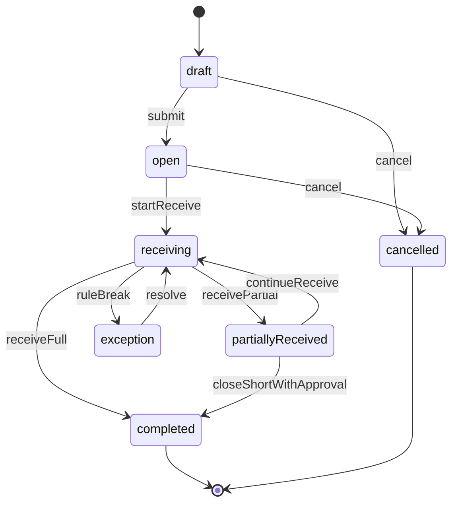

# PHASE 04: Inbound receiving

## 1. Mục tiêu

Nhận hàng từ PO/Invoice/ASN, tạo Lot hợp lệ và ghi `RECEIVE` inventory transaction bất biến.

Phase này là nguồn phát sinh tồn kho đầu tiên. Mọi receive phải đi qua validation, tenant/warehouse scope, permission, audit và transaction boundary rõ.

## 2. Phạm vi

### In scope

* Tạo module Inbound Receiving.
* Tạo inbound order, inbound order item, receiving session và receive command.
* Tạo hoặc liên kết Lot theo item + lot policy.
* Ghi `InventoryTransactions` type `RECEIVE` append-only.
* Cập nhật `InventoryBalances` theo receiving location.
* Seed permission và reason code liên quan.
* Tạo receiving screen tối ưu scan.
* Chuẩn hóa DTO camelCase.

### Out of scope

* QC workflow nâng cao.
* Putaway slotting.
* Cross-dock.
* ERP import đầy đủ.
* Label printing.
* Scale integration.

## 3. Dependency

| Loại | Chi tiết |
|---|---|
| Upstream | Phase 01, 02, 03 |
| Downstream trực tiếp | Phase 05, 06, 17, 19, 23, 27 |
| Contract tạo ra | Inbound order lifecycle, lot creation, RECEIVE ledger transaction, receiving audit timeline |
| Enterprise reference | [Domain state machines](../enterprise/domain_state_machines.md), [Core ERD/schema](../enterprise/core_erd_schema.md), [API contracts core](../enterprise/api_contracts_core.md) |

## 4. State machine



## 5. Database

| Table | Required fields | Main constraints | Indexes |
|---|---|---|---|
| `InboundOrders` | id, tenantId, warehouseId, orderNo, partnerId, sourceType, sourceRef, status, expectedDate | unique tenantId+orderNo | tenantId+warehouseId+status |
| `InboundOrderItems` | id, tenantId, inboundOrderId, lineNo, itemId, expectedQty, receivedQty, uomId, tolerancePct, status | expectedQty > 0 | inboundOrderId+itemId |
| `ReceivingSessions` | id, tenantId, warehouseId, inboundOrderId, stationId, operatorId, status, startedAt, closedAt | one active session per operator/order optional | tenantId+warehouseId+status |
| `Lots` | id, tenantId, itemId, lotNo, manufactureDate, expiryDate, qcStatus, status | unique tenantId+itemId+lotNo | tenantId+itemId+qcStatus |
| `InventoryBalances` | id, tenantId, warehouseId, locationId, itemId, lotId, lpnId, inventoryStatus, qty | unique balance key | tenantId+itemId+inventoryStatus |
| `InventoryTransactions` | id, tenantId, warehouseId, transactionType, itemId, locationId, lotId, qty, uomId, sourceType, sourceId, traceId | append-only, qty > 0 for RECEIVE | tenantId+sourceType+sourceId, tenantId+traceId |

### Transaction boundary

Một receive command phải commit atomically:

1. Validate inbound order status.
2. Validate item, UOM, location, tolerance.
3. Create/reuse lot theo policy.
4. Insert `InventoryTransactions(RECEIVE)`.
5. Upsert `InventoryBalances`.
6. Update receivedQty/status.
7. Write audit/activity timeline.

Không gọi hệ thống ngoài trong DB transaction.

## 6. Backend/API

| API | Mục đích | Permission | Ghi chú |
|---|---|---|---|
| `GET /api/inbound/orders` | Danh sách phiếu nhập | `inboundReceiving.read` | Filter status/warehouse/partner |
| `POST /api/inbound/orders` | Tạo phiếu nhập | `inboundReceiving.create` | Manual order hoặc chuẩn bị import |
| `POST /api/inbound/orders/{id}/submit` | Mở phiếu nhập | `inboundReceiving.update` | draft -> open |
| `POST /api/inbound/orders/{id}/receive` | Nhận hàng | `inboundReceiving.receive` | Idempotency key required |
| `POST /api/inbound/orders/{id}/close-short` | Đóng thiếu | `inboundReceiving.approveShortClose` | Requires reason |
| `GET /api/lots/{lotNo}` | Tra cứu Lot | `lot.read` | Tenant scoped |

### Receive request mẫu

```json
{
  "warehouseId": "wh_001",
  "lineId": "iol_001",
  "itemId": "item_001",
  "lotNo": "LOT-20260701-001",
  "qty": 12.5,
  "uomCode": "PCS",
  "locationId": "loc_receiving_01",
  "expiryDate": "2027-07-01",
  "reasonCode": null
}
```

### Receive response mẫu

```json
{
  "inboundOrderId": "inb_001",
  "status": "receiving",
  "lotId": "lot_001",
  "transactionId": "txn_001",
  "receivedQty": 12.5,
  "traceId": "trc_01hxyz"
}
```

## 7. Frontend/RF/mobile

| Màn hình/Control | Mục đích | Yêu cầu UX |
|---|---|---|
| Inbound order list | Phiếu chờ nhận | Filter status/warehouse/partner, pagination |
| Receiving screen | Scan item/lot/location và nhập qty | Auto-focus scan, font lớn, ít nút |
| Lot detail | Timeline Lot | Hiển thị receiving source và inventory status |
| Close short dialog | Đóng thiếu | Requires reason và permission |

### UI rules

* UI text dùng Sentence case.
* Không dùng inline style.
* Scan input phải gắn context `receiving`.
* Wrong scan không mutate dữ liệu.
* Receiving screen hiển thị expected, received, remaining, tolerance.

## 8. Execution flow

1. User chọn inbound order `open`.
2. System mở receiving session.
3. User scan item.
4. User scan/nhập lot.
5. User scan receiving location.
6. User nhập qty hoặc xác nhận qty.
7. System validate master data, status, tolerance, permission.
8. System tạo lot nếu cần.
9. System ghi `RECEIVE` transaction và cập nhật balance.
10. System cập nhật receivedQty/status và activity timeline.

## 9. Validation & business rules

* Không nhận item ngoài inbound order.
* Không nhận vào inactive/locked location.
* Không nhận inactive item/UOM/partner.
* Lot unique theo `tenantId + itemId + lotNo`.
* Lot expiry required nếu item tracking policy yêu cầu shelf life.
* Không nhận vượt tolerance nếu thiếu quyền.
* Close short phải có permission và reason.
* Completed/cancelled inbound order không được receive thêm.
* Receive command bắt buộc idempotency key.
* Transaction immutable; sai receive dùng corrective transaction ở phase inventory adjustment.

## 10. Exception handling

| Lỗi | Hành vi hệ thống |
|---|---|
| Sai item | Block, không ghi transaction |
| Lot trùng khác metadata | Trả conflict |
| Vượt số lượng/tolerance | Block hoặc yêu cầu override permission |
| PO đóng | Trả conflict |
| Concurrent receive | Trả 409 và yêu cầu reload |
| Location locked | Block, hiển thị reason |
| Missing idempotency key | Trả validation error |

## 11. Observability

* Audit receive, close short, cancel.
* Lot timeline có source inbound order và transaction ID.
* KPI receiving throughput theo ngày/ca/user.
* Log có traceId nhưng không chứa secret.
* Activity timeline ghi actor, qty, item, lot, location.

## 12. Test plan

| Nhóm test | Nội dung |
|---|---|
| Unit | Status transition, tolerance, lot policy |
| Integration | Receive creates lot + transaction + balance atomically |
| Negative | Wrong item, duplicate lot, locked location, permission override |
| Concurrency | Two receive commands same line return deterministic result |
| E2E | User receive đủ/thiếu/vượt tolerance từ UI |
| Regression | Phase 01-03 health/master data/RBAC still pass |

## 13. Measurable acceptance criteria

* Receive creates Lot and `RECEIVE` ledger row in one transaction.
* `InventoryBalances` increases exactly by received quantity.
* Duplicate receive with same idempotency key returns original result.
* Duplicate lot with conflicting metadata returns conflict.
* Over-tolerance receive requires permission and reason.
* Completed/cancelled inbound order cannot receive more.
* Receiving UI shows expected, received, remaining and traceId on success/error.
* Audit timeline answers who received what, where, when and from which order.

## 14. Definition of done

* Database migration chạy sạch trên database trống.
* Receive API có integration test pass.
* UI/RF receiving flow thao tác được end-to-end.
* Audit/trace hoạt động cho receive command.
* Exception path chính được test.
* Phase note đủ để phase 05-06 dùng lot/ledger contract.
* Không còn placeholder generic trong phần triển khai phase.

## 15. Maintenance notes

* Không bỏ qua audit và permission khi thêm receive action mới.
* Giữ transaction boundary rõ.
* Nếu đổi inbound status lifecycle, cập nhật state machine và phase phụ thuộc.
* Nếu đổi inventory transaction schema, cập nhật core ERD/schema.

## 16. Rollback notes

* Revert migration nếu chưa có dữ liệu thật.
* Nếu đã có transaction, dùng corrective transaction thay vì sửa tay.
* Tắt permission/menu để rollback chức năng UI.
* Không xóa `InventoryTransactions` production.
