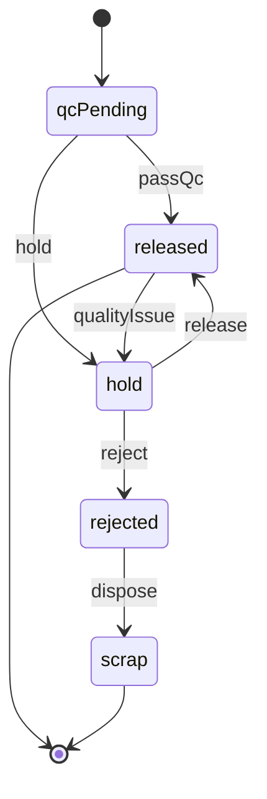

# PHASE 05: QC hold/release

## 1. Mục tiêu

Kiểm soát chất lượng Lot sau receiving: hold, release, reject và quarantine trước khi tồn kho được phép move, allocate hoặc pick.

Phase này bảo vệ inventory khỏi việc dùng nhầm hàng chưa đạt QC hoặc đang bị khóa chất lượng.

## 2. Phạm vi

### In scope

* Tạo module QC hold/release.
* Tạo QC request, QC result và material hold.
* Cập nhật `Lots.qcStatus` theo state machine.
* Chặn move/pick/allocate đối với lot hoặc balance đang hold/rejected.
* Seed permission và reason code liên quan.
* Tạo QC queue, result form, hold/release panel.
* Ghi audit và timeline cho mọi quyết định QC.

### Out of scope

* RMA QC.
* Genealogy branch hold.
* Lab integration.
* Sampling engine nâng cao.
* Destructive test costing.

## 3. Dependency

| Loại | Chi tiết |
|---|---|
| Upstream | Phase 01-04 |
| Downstream trực tiếp | Phase 06, 07, 12, 13, 17, 19 |
| Contract tạo ra | Lot QC lifecycle, material hold contract, QC audit timeline |
| Enterprise reference | [Domain state machines](../enterprise/domain_state_machines.md), [Core ERD/schema](../enterprise/core_erd_schema.md), [Measurable acceptance criteria](../enterprise/measurable_acceptance_criteria.md) |

## 4. State machine



## 5. Database

| Table/Field | Required fields | Main constraints | Indexes |
|---|---|---|---|
| `QcRequests` | id, tenantId, warehouseId, lotId, samplePlan, status, requestedBy, requestedAt | one open request per lot by type | tenantId+warehouseId+status |
| `QcResults` | id, tenantId, qcRequestId, result, metricsJson, attachmentRefs, approvedBy, approvedAt | approved result immutable | qcRequestId+result |
| `MaterialHolds` | id, tenantId, warehouseId, lotId, locationId, inventoryBalanceId, holdType, reasonCode, status, releasedBy, releasedAt | active hold blocks usable inventory | tenantId+warehouseId+status |
| `Lots.qcStatus` | qcPending, released, hold, rejected, scrap | enum only | tenantId+itemId+qcStatus |
| `InventoryTransactions` | transactionType HOLD, RELEASE, SCRAP optional | append-only if quantity status changes | tenantId+sourceType+sourceId |

### Transaction boundary

QC command must commit atomically:

1. Validate lot, warehouse and tenant scope.
2. Validate current QC state.
3. Write QC result or material hold.
4. Update `Lots.qcStatus`.
5. If inventory status changes, write immutable transaction.
6. Write audit/activity timeline.

## 6. Backend/API

| API | Mục đích | Permission | Ghi chú |
|---|---|---|---|
| `GET /api/qc/queue` | Lot chờ QC | `qc.read` | Filter warehouse/status/age |
| `POST /api/qc/lots/{lotId}/result` | Ghi kết quả QC | `qc.result.create` | Requires result payload |
| `POST /api/qc/lots/{lotId}/hold` | Hold Lot | `qc.hold` | Requires reason |
| `POST /api/qc/lots/{lotId}/release` | Release Lot | `qc.release` | Requires permission |
| `POST /api/qc/lots/{lotId}/reject` | Reject Lot | `qc.reject` | Requires reason + approval when configured |
| `GET /api/qc/lots/{lotId}/timeline` | Timeline QC | `qc.read` | Includes audit references |

### Hold request mẫu

```json
{
  "warehouseId": "wh_001",
  "reasonCode": "QC_DAMAGE",
  "description": "Outer carton damaged during receiving.",
  "holdScope": "lot"
}
```

### Result request mẫu

```json
{
  "warehouseId": "wh_001",
  "result": "passed",
  "metrics": {
    "sampleQty": 5,
    "failedQty": 0
  },
  "attachmentRefs": []
}
```

## 7. Frontend/RF/mobile

| Màn hình/Control | Mục đích | Yêu cầu UX |
|---|---|---|
| QC queue | Danh sách lot chờ | Filter warehouse, item, age, status |
| QC result form | Nhập kết quả | Validate required metrics, attachment refs |
| Hold/release panel | Lý do và quyền duyệt | Reason required, confirm dangerous action |
| Lot QC timeline | Truy vết QC | Actor, state, reason, traceId |

### UI rules

* UI text dùng Sentence case.
* Không dùng inline style.
* Hold/reject phải có confirm.
* Release hiển thị rõ current hold reason và actor.
* Unauthorized action không hiển thị hoặc disabled nhưng backend vẫn enforce.

## 8. Execution flow

1. Lot được tạo từ receiving với `qcPending` nếu item cần QC.
2. System hoặc inspector tạo QC request.
3. Inspector kiểm hàng và nhập result.
4. Nếu pass, lot chuyển `released`.
5. Nếu issue, lot chuyển `hold` hoặc `rejected` với reason.
6. Release/reject ghi audit và timeline.
7. Downstream inventory/allocation chỉ dùng lot `released`.

## 9. Validation & business rules

* Lot `hold` không được move/pick/allocate trừ permission override có reason.
* Lot `rejected` không được usable; chỉ được scrap/return theo phase sau.
* Reject bắt buộc reason code.
* Release cần permission.
* Không sửa QC result sau approve; correction phải tạo result mới hoặc reversal có audit.
* Không release lot đã shipped.
* Hold scope phải rõ: lot, location hoặc inventory balance.
* QC state transition sai trả 409.

## 10. Exception handling

| Lỗi | Hành vi hệ thống |
|---|---|
| Thiếu reason | Trả validation error |
| Lot không tồn tại | Trả 404/403 theo tenant policy |
| Lot đã shipped | Block action |
| Thiếu quyền release | Trả 403 |
| Dữ liệu stale | Trả 409, yêu cầu reload |
| Result đã approve | Block update, yêu cầu correction path |

## 11. Observability

* Timeline QC cho mỗi lot.
* Audit hold/release/reject/result.
* KPI pending QC aging.
* KPI hold aging theo reason.
* Trace ID liên kết receiving transaction và QC decision.

## 12. Test plan

| Nhóm test | Nội dung |
|---|---|
| Unit | QC state transition, hold/release rules |
| Integration | Hold blocks allocation/move/pick contract |
| Negative | Missing reason, no permission, stale state, shipped lot |
| E2E | Inspector pass/hold/release/reject từ UI |
| Regression | Phase 04 receiving still creates lot correctly |

## 13. Measurable acceptance criteria

* Lot mới cần QC xuất hiện trong QC queue.
* QC hold blocks allocation, move and pick for affected stock.
* QC release makes lot usable for downstream inventory flows.
* QC reject requires reason and audit.
* Approved QC result cannot be edited silently.
* Lot timeline shows receiving source, QC decision, actor, reason and traceId.
* Unauthorized release returns 403 even if UI action is manually called.
* Pending QC aging KPI can be calculated from stored timestamps.

## 14. Definition of done

* Database migration chạy sạch trên database trống.
* QC API có integration test pass.
* UI QC queue/result/hold/release flow thao tác được end-to-end.
* Audit/trace hoạt động cho QC command.
* Exception path chính được test.
* Phase note đủ để phase 06-07 dùng QC contract.
* Không còn placeholder generic trong phần triển khai phase.

## 15. Maintenance notes

* Khi thêm QC status mới, cập nhật validation, UI badge, downstream allocation/move checks.
* Không bỏ qua audit và permission khi thêm action mới.
* Giữ transaction boundary rõ nếu QC thay đổi inventory status.
* Nếu thay đổi hold semantics, cập nhật phase 06, 07, 13.

## 16. Rollback notes

* Revert migration nếu chưa có dữ liệu thật.
* Nếu đã có QC decision, không xóa; tạo correction/release/reject mới có audit.
* Có thể tạm ẩn menu/permission QC nếu UI lỗi.
* Không xóa transaction hoặc audit production.
