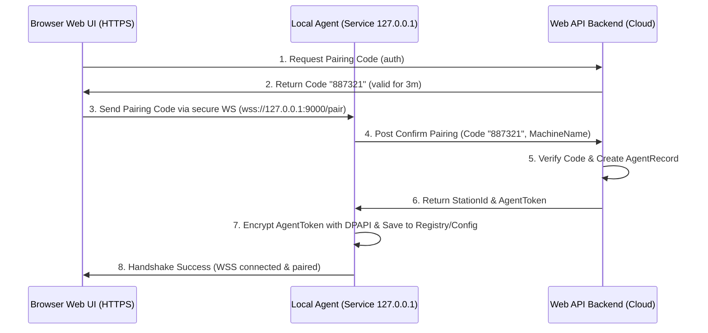

# PHASE 20: Local Agent foundation

## Execution spec maturity

- **Mức hiện tại:** 90%
- **Đánh giá:** Đủ roadmap cho Local Agent, WSS, pairing, code signing và thiết bị cục bộ.
- **Khi cần upgrade:** Bắt buộc viết Local Agent threat model để nâng lên 95% trước khi code Phase 20.

## 1. Mục tiêu

Thiết lập Windows Local Agent chạy dưới dạng Windows Service, đóng vai trò làm cầu nối WebSocket cục bộ (`127.0.0.1:9000`) để kết nối Web UI (trình duyệt HTTPS) với các thiết bị ngoại vi vật lý (cân, máy in). Phase này phải tạo ra được nền tảng bảo mật gồm: cơ chế ghép cặp (Pairing Token), xác thực Origin, lưu trữ Token an toàn bằng DPAPI và quản lý phiên kết nối của trạm.

## 2. Phạm vi

### In scope

- Xây dựng phần mềm Windows Service Local Agent bằng .NET 8 Worker Service.
- Triển khai WebSocket Server cục bộ trong Agent chỉ lắng nghe địa chỉ loopback `127.0.0.1:9000`.
- Thiết lập cơ chế cấu hình Origin Allowlist bảo vệ kết nối từ trình duyệt.
- Thiết lập quy trình ghép cặp (Pairing Flow) giữa Web UI và Local Agent thông qua mã OTP ghép cặp (One-Time Pairing Code).
- Mã hóa và lưu trữ Token xác nhận ghép cặp cục bộ bằng Windows Data Protection API (DPAPI).
- Tạo module trạm làm việc (Station) trên Web Admin để quản lý danh sách trạm và cho phép thu hồi quyền (Revoke Station) từ xa.

### Non-negotiable output

- Windows Service cài đặt và chạy thành công trên máy trạm Windows local.
- WebSocket Server chặn toàn bộ kết nối không có Origin khớp allowlist hoặc không có Pairing Token hợp lệ.
- Database lưu trữ thông tin trạm làm việc, mã token băm của trạm, và lịch sử kết nối.
- API endpoint trên Backend để sinh Pairing Code, xác thực ghép cặp, và cập nhật Heartbeat trạm.

## 3. Điều kiện đầu vào

### Readiness checklist

- Khung bảo mật Identity và RBAC (Phase 03) đã sẵn sàng.
- Web UI App Shell (Phase 01) hoạt động tốt.
- Quyền `local_agent.manage` được gán cho vai trò Admin hệ thống.

## 4. Setup

### Cấu trúc module đề xuất

- Backend module: `backend/modules/local_agent_foundation/`
- Local Agent source: `local-agent/Nexustock.LocalAgent/` (chứa Windows Service, WebSocket Server, DPAPI wrapper)
- Frontend module: `frontend/features/local_agent_foundation/`

### Permission seed đề xuất

- `local_agent.view`: Xem trạng thái các trạm làm việc và thiết bị.
- `local_agent.pair`: Thực hiện ghép cặp trạm mới.
- `local_agent.revoke`: Thu hồi quyền truy cập của một trạm làm việc.

## 5. Database

### 5.1 Bảng dữ liệu trạm làm việc (`AgentStations`)

| Tên cột | Kiểu dữ liệu | Nullable | Ràng buộc chính | Ý nghĩa |
|---|---|---|---|---|
| `id` | uuid | No | Primary Key | ID trạm |
| `tenantId` | varchar(50) | No | FK | Định danh tenant |
| `stationCode` | varchar(50) | No | Unique per tenant | Mã trạm (ví dụ: `STATION-PACK-01`) |
| `name` | varchar(100) | No | | Tên trạm làm việc |
| `tokenHash` | varchar(256) | No | | Chuỗi băm SHA-256 của AgentToken dùng để auth |
| `status` | varchar(30) | No | | Trạng thái trạm: `active`, `revoked` |
| `machineName` | varchar(100) | Yes | | Tên máy tính Windows cài đặt agent |
| `createdAt` | timestamp | No | | Thời gian tạo |
| `updatedAt` | timestamp | Yes | | Thời gian cập nhật gần nhất |

### 5.2 Bảng trạng thái thiết bị ngoại vi (`DeviceStatuses`)

| Tên cột | Kiểu dữ liệu | Nullable | Ràng buộc chính | Ý nghĩa |
|---|---|---|---|---|
| `id` | uuid | No | Primary Key | ID dòng |
| `tenantId` | varchar(50) | No | FK | Định danh tenant |
| `stationId` | uuid | No | FK | Liên kết trạm |
| `deviceId` | varchar(50) | No | Unique per station | Định danh thiết bị (ví dụ: `scale_01`) |
| `deviceType` | varchar(30) | No | | Loại thiết bị: `scaleCom`, `zebraZpl`, `tscTspl` |
| `connectionState`| varchar(20) | No | | Trạng thái kết nối: `connected`, `disconnected`, `error` |
| `lastHeartbeatAt`| timestamp | No | | Heartbeat gần nhất từ Agent gửi lên |
| `lastErrorMessage`| text | Yes | | Lỗi gần nhất nếu có |

### 5.3 Kịch bản SQL Migration (PostgreSQL)

```sql
-- +migrate Up
CREATE TABLE "AgentStations" (
    "Id" UUID PRIMARY KEY,
    "TenantId" VARCHAR(50) NOT NULL,
    "StationCode" VARCHAR(50) NOT NULL,
    "Name" VARCHAR(100) NOT NULL,
    "TokenHash" VARCHAR(256) NOT NULL,
    "Status" VARCHAR(30) NOT NULL DEFAULT 'active',
    "MachineName" VARCHAR(100),
    "CreatedAt" TIMESTAMP NOT NULL DEFAULT CURRENT_TIMESTAMP,
    "UpdatedAt" TIMESTAMP,
    CONSTRAINT "UQ_AgentStations_Tenant_Code" UNIQUE ("TenantId", "StationCode")
);

CREATE TABLE "DeviceStatuses" (
    "Id" UUID PRIMARY KEY,
    "TenantId" VARCHAR(50) NOT NULL,
    "StationId" UUID NOT NULL,
    "DeviceId" VARCHAR(50) NOT NULL,
    "DeviceType" VARCHAR(30) NOT NULL,
    "ConnectionState" VARCHAR(20) NOT NULL DEFAULT 'disconnected',
    "LastHeartbeatAt" TIMESTAMP NOT NULL DEFAULT CURRENT_TIMESTAMP,
    "LastErrorMessage" TEXT,
    CONSTRAINT "FK_DeviceStatuses_AgentStations" FOREIGN KEY ("StationId") REFERENCES "AgentStations"("Id") ON DELETE CASCADE,
    CONSTRAINT "UQ_DeviceStatuses_Station_Device" UNIQUE ("StationId", "DeviceId")
);

CREATE INDEX "IX_AgentStations_TenantId" ON "AgentStations" ("TenantId");
CREATE INDEX "IX_DeviceStatuses_StationId" ON "DeviceStatuses" ("StationId");

-- +migrate Down
DROP TABLE IF EXISTS "DeviceStatuses";
DROP TABLE IF EXISTS "AgentStations";
```

## 6. Backend/API

### 6.1 API sinh mã ghép cặp (Pairing Code generation)
- **Method & Path:** `POST /api/agent/stations/pairing-code`
- **Permission:** `local_agent.pair`
- **Request:** `{ "stationCode": "STATION-PACK-01", "name": "Bàn đóng gói số 1" }`
- **Response (Success):** `{ "pairingCode": "887321", "expiresAt": "2026-07-01T09:12:15Z" }`
- *Ghi chú:* Mã ghép cặp gồm 6 chữ số ngẫu nhiên, lưu vào Redis cache hoặc DB với TTL = 3 phút.

### 6.2 API xác thực ghép cặp từ Local Agent (Pairing confirmation)
- **Method & Path:** `POST /api/agent/stations/confirm-pair`
- **Auth:** Public API (xác thực qua Pairing Code).
- **Request:** `{ "stationCode": "STATION-PACK-01", "pairingCode": "887321", "machineName": "DESKTOP-PACK-01" }`
- **Response (Success):** `{ "stationId": "uuid-1234", "agentToken": "tok_sec_abc123xyz" }`
- *Ghi chú:* Tạo AgentToken ngẫu nhiên có độ dài entropy lớn. Lưu băm SHA-256 của AgentToken vào `tokenHash` trong bảng `AgentStations`.

### 6.3 API Heartbeat trạm làm việc
- **Method & Path:** `POST /api/agent/stations/{stationId}/heartbeat`
- **Auth:** Header `X-Agent-Token` chứa AgentToken bản rõ.
- **Request:** `{ "devices": [ { "deviceId": "scale_01", "deviceType": "scaleCom", "connectionState": "connected" } ] }`
- **Response (Success):** `{ "status": "active" }` (Nếu trạm bị đánh dấu `revoked`, API trả lỗi 403 buộc Agent tự reset cấu hình).

## 7. Frontend/RF/mobile

### Màn hình thiết lập kết nối Trạm (Station Setup)
- Web UI hiển thị widget kiểm tra trạng thái Local Agent. Nếu chưa có kết nối WebSocket cục bộ, Web UI hiển thị hướng dẫn tải phần mềm và nút "Tạo mã ghép cặp".
- Trình duyệt chạy JS kết nối WebSocket cục bộ: `wss://127.0.0.1:9000/ws` (hoặc `ws://` chỉ trong môi trường dev). 
- Nếu WebSocket cục bộ báo trạng thái `unpaired`, giao diện Web UI hiển thị hộp thoại điền OTP ghép cặp và gửi xuống Agent.

## 8. Execution flow

### Quy trình ghép cặp trạm lần đầu (First-time Pairing Flow)



## 9. Validation & business rules

### 9.1 Threat Model & Attack Vector Matrix

| ID | Attack Vector (Véc tơ tấn công) | Threat Impact (Tác động) | Mitigation Strategy (Chiến lược phòng chống) |
|---|---|---|---|
| **AV-01** | **Origin Spoofing** (Trang web lạ cố kết nối WebSocket của Agent) | Kẻ xấu mở tab ẩn danh chạy mã độc gán lệnh in/cân đè dữ liệu cục bộ | WebSocket Server của Agent lọc Header `Origin`. Chỉ chấp nhận các tên miền trong allowlist được cấu hình cứng (ví dụ: `https://*.nexustock.vn`). Từ chối bắt tay (handshake) ngay nếu sai. |
| **AV-02** | **Token Theft** (Kẻ xấu đọc trộm file cấu hình Agent để lấy Pairing Token) | Giả mạo máy trạm gửi heartbeat giả, đánh cắp quyền in ấn/cân | Token lưu cục bộ trên Windows Registry hoặc JSON config bắt buộc mã hóa qua Windows Data Protection API (DPAPI) ở mức Machine/User scope. Key giải mã chỉ nằm trên kernel của máy trạm đó. |
| **AV-03** | **Replay Attack** (Chặn tin nhắn WebSocket cũ và gửi lại) | Lặp lại lệnh cân/lệnh in cũ gây sai lệch số lượng | Mỗi request gửi xuống Agent phải có `Timestamp` (ISO 8601) và `HMAC-SHA256` ký số bằng `AgentToken`. Agent từ chối nếu thời gian lệch quá 30 giây (`Time Skew`). |
| **AV-04** | **Port Hijack** (Phần mềm khác chiếm cổng 9000 của Agent) | Làm tê liệt kết nối Web UI đến thiết bị ngoại vi | Cơ chế quét dải cổng (Port scanning) dự phòng tự động từ `9000` đến `9005`. Web UI ping tuần tự để kết nối cổng khả dụng. |
| **AV-05** | **MITM (Man-In-The-Middle)** (Chặn bắt gói tin trên loopback) | Rò rỉ dữ liệu hoặc chèn lệnh trái phép | Bắt buộc chạy kết nối WebSocket bảo mật `wss://127.0.0.1:9000` sử dụng chứng chỉ SSL tự ký đã được tin cậy tại máy local của trạm. |

### 9.2 Luật an toàn Local Agent

- **Mặc định HTTPS/WSS:** WebSocket Server của Local Agent bắt buộc sử dụng giao thức bảo mật `wss://127.0.0.1:9000` cho môi trường production để tránh bị các trình duyệt HTTPS chặn (Mixed Content). Cung cấp fallback `ws://127.0.0.1:9000` chỉ dành cho môi trường phát triển (development) cục bộ.
- **Cấp và tin cậy chứng chỉ (Certificate Trust Flow):** 
  - Trình cài đặt Local Agent (MSIX) sẽ tự động tạo một Self-signed SSL Certificate cho tên miền `localhost` và thêm nó vào thư mục `Trusted Root Certification Authorities` trên máy tính trạm Windows của thủ kho.
  - Quá trình này được ký số (Code Signing) bằng chứng chỉ doanh nghiệp để vượt qua Windows SmartScreen cảnh báo.
- **Cơ chế dò cổng dự phòng (Port Discovery & Fallback):**
  - Nếu cổng mặc định `9000` bị chiếm, Local Agent sẽ tự động thử bind cổng trong dải `9001-9005`.
  - Web UI trên trình duyệt khi tải trang sẽ thực hiện quét cổng nhanh (Port scanning) từ `9000` đến `9005` bằng cách gửi request WSS ping để nhận diện cổng đang mở của Agent.
- **Chống tấn công phát lại (Replay & Time Skew Protection):**
  - Mỗi tin nhắn giao tiếp WebSocket gửi xuống Agent phải chứa `timestamp` dạng ISO 8601 và mã chữ ký HMAC SHA-256 được tính dựa trên `AgentToken`.
  - Local Agent sẽ reject tin nhắn nếu độ lệch thời gian (Time Skew) giữa Client và Server cục bộ vượt quá 30 giây để chống lại cuộc tấn công phát lại (Replay attack).
- **Chỉ bind Loopback:** WebSocket Server của Local Agent bắt buộc chỉ bind địa chỉ loopback `127.0.0.1`. Tuyệt đối cấm sử dụng `0.0.0.0` hoặc IP mạng LAN để ngăn chặn truy cập chéo thiết bị ngoại vi trong mạng nội bộ.
- **Kiểm tra Origin Allowlist:** Bất kỳ kết nối WebSocket nào đến Agent phải được xác thực Header `Origin`. Nếu Origin không khớp cấu hình cho phép của WMS, kết nối bị đóng ngay lập tức với lỗi `403 Forbidden`.
- **Lưu trữ DPAPI:** AgentToken lưu cục bộ tại máy Windows phải được mã hóa qua Windows Data Protection API (DPAPI) ở mức User scope hoặc Machine scope để chống đọc trộm file cấu hình phẳng.

### 9.3 Windows DPAPI Cryptography Wrapper (Pseudo-code C#)

Để lưu trữ `AgentToken` an toàn trên máy trạm Windows, Agent sử dụng lớp thư viện mã hóa sau:

```csharp
using System.Security.Cryptography;
using System.Text;

public class DpapiSecretStorage : ISecretStorage
{
    // Entropy bổ sung để tăng cường bảo mật (tương đương muối bảo mật)
    private static readonly byte[] OptionalEntropy = Encoding.UTF8.GetBytes("NexustockAgentEntropy2026");

    public string EncryptSecret(string plainText)
    {
        if (string.IsNullOrEmpty(plainText)) return string.Empty;
        
        byte[] plainBytes = Encoding.UTF8.GetBytes(plainText);
        // Mã hóa sử dụng Machine scope hoặc User scope
        byte[] encryptedBytes = ProtectedData.Protect(
            plainBytes, 
            OptionalEntropy, 
            DataProtectionScope.CurrentUser
        );
        
        return Convert.ToBase64String(encryptedBytes);
    }

    public string DecryptSecret(string encryptedBase64)
    {
        if (string.IsNullOrEmpty(encryptedBase64)) return string.Empty;
        
        try
        {
            byte[] encryptedBytes = Convert.FromBase64String(encryptedBase64);
            byte[] plainBytes = ProtectedData.Unprotect(
                encryptedBytes, 
                OptionalEntropy, 
                DataProtectionScope.CurrentUser
            );
            
            return Encoding.UTF8.GetString(plainBytes);
        }
        catch (CryptographicException)
        {
            // Trả về rỗng nếu token bị corrupt hoặc bị đổi user giải mã
            return string.Empty;
        }
    }
}
```

## 10. Exception handling

| Nhóm lỗi | Nguyên nhân | Xử lý |
|---|---|---|
| Cổng WebSocket bị chiếm | Cổng 9000-9005 đều bị chiếm dụng | Agent ghi log Event Viewer, dừng khởi chạy dịch vụ, báo động đỏ. |
| Token bị thu hồi | Admin bấm Revoke trạm trên Web Admin | Heartbeat API trả về 403. Agent lập tức tự xóa Token đã lưu cục bộ bằng DPAPI, ngắt mọi kết nối WebSocket hiện có và chuyển trạng thái về `unpaired`. |
| Sai Origin | Trang web lạ kết nối đến localhost | WebSocket Server từ chối kết nối trước khi thực hiện handshake. |
| Mất đồng bộ thời gian | Đồng hồ máy trạm bị sai lệch quá 30 giây | Trả lỗi `auth.time_skew` và yêu cầu đồng bộ lại đồng hồ hệ thống (NTP). |

## 11. Observability

- **Event Viewer logs:** Ghi nhận lỗi khởi chạy dịch vụ, lỗi bind cổng, lỗi DPAPI giải mã thất bại.
- **Heartbeat monitoring:** Định kỳ 30 giây, Web Backend kiểm tra các trạm làm việc. Nếu `lastHeartbeatAt` của thiết bị ngoại vi quá 2 phút, đổi trạng thái sang `offline` trên UI giám sát.

## 12. Test plan

- **Unit Test:**
  - Logic xác thực Origin khớp wildcard allowlist.
  - Logic mã hóa/giải mã DPAPI wrapper.
- **Integration Test:**
  - Gọi API sinh mã ghép cặp, mô phỏng gửi mã đến Agent và xác thực trả về Token.
  - Gọi API Heartbeat với Token hợp lệ và Token đã bị thu hồi (Verify 403).
- **Negative Test:**
  - Kết nối WebSocket từ một Origin lạ (ví dụ: `https://evil.com`) và xác minh kết nối bị từ chối ngay.

## 13. Acceptance criteria

Để đạt mức sẵn sàng 95% (Execution-Ready), Local Agent phải thỏa mãn các tiêu chí nghiệm thu sau:

* **AC-01 (Cài đặt & Tự khởi động):** Local Agent đóng gói dạng MSIX cài đặt thành công trên máy trạm Windows 10/11, tự động đăng ký Windows Service và khởi động cùng hệ điều hành (`StartType = Automatic`).
* **AC-02 (Xác thực Origin & Cấm WAN):** WebSocket Server của Agent chỉ lắng nghe ở `127.0.0.1`. Khi thực hiện quét cổng hoặc kết nối từ một client nằm ngoài máy (mạng LAN/WAN), kết nối phải bị chặn hoàn toàn. Khi kết nối từ trình duyệt với Header `Origin` lạ (ví dụ: `https://evil.com`), kết nối phải bị reject ngay từ khâu handshake (HTTP 403).
* **AC-03 (Bảo mật lưu trữ Token):** Sau khi hoàn tất ghép cặp (Pairing), file cấu hình JSON cục bộ hoặc Registry của Agent chỉ chứa chuỗi token đã mã hóa dạng Base64 (DPAPI encrypted). Nếu mở file cấu hình bằng Notepad, tuyệt đối không nhìn thấy Token bản rõ. Thử copy file cấu hình sang một máy tính khác, Agent tại máy mới phải báo lỗi giải mã DPAPI thất bại và tự chuyển về trạng thái `unpaired`.
* **AC-04 (Chống Replay & Lệch giờ):** Khi gửi lệnh in thử qua WebSocket với timestamp bị sửa lùi quá 30 giây so với giờ hệ thống của Agent, Agent phải từ chối xử lý và trả về lỗi `auth.time_skew`.
* **AC-05 (Heartbeat & Thu hồi từ xa):** Khi Admin thực hiện "Revoke Station" trên Web Admin Cloud:
  1. API Heartbeat trả về 403.
  2. Agent nhận 403 lập tức kích hoạt hàm xóa token cục bộ, đóng mọi socket và chuyển trạng thái trên Web UI thành `unpaired` trong vòng 10 giây.

