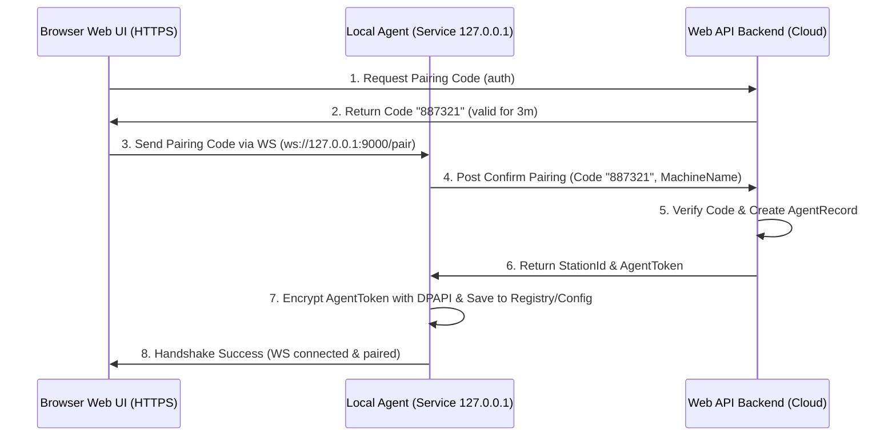

# PHASE 20: Local Agent foundation

## 1. Mục tiêu

Thiết lập Windows Local Agent chạy dưới dạng Windows Service, đóng vai trò làm cầu nối WebSocket cục bộ (`127.0.0.1:9000`) để kết nối Web UI (trình duyệt HTTPS) với các thiết bị ngoại vi vật lý (cân, máy in). Phase này phải tạo ra được nền tảng bảo mật gồm: cơ chế ghép cặp (Pairing Token), xác thực Origin, lưu trữ Token an toàn bằng DPAPI và quản lý phiên kết nối của trạm.

## 2. Phạm vi

### In scope

- Xây dựng phần mềm Windows Service Local Agent bằng .NET 8 Worker Service.
- Triển khai WebSocket Server cục bộ trong Agent chỉ lắng nghe địa chỉ loopback `127.0.0.1:9000`.
- Thiết lập cơ chế cấu hình Origin Allowlist bảo vệ kết nối từ trình duyệt.
- Thiết lập quy trình ghép cặp (Pairing Flow) giữa Web UI và Local Agent thông qua mã OTP ghép cặp (One-Time Pairing Code).
- Mã hóa và lưu trữ Token xác nhận ghép cặp cục bộ bằng Windows Data Protection API (DPAPI).
- Tạo module trạm làm việc (Station) trên Web Admin để quản lý danh sách trạm và cho phép thu hồi quyền (Revoke Station) từ xa.

### Non-negotiable output

- Windows Service cài đặt và chạy thành công trên máy trạm Windows local.
- WebSocket Server chặn toàn bộ kết nối không có Origin khớp allowlist hoặc không có Pairing Token hợp lệ.
- Database lưu trữ thông tin trạm làm việc, mã token băm của trạm, và lịch sử kết nối.
- API endpoint trên Backend để sinh Pairing Code, xác thực ghép cặp, và cập nhật Heartbeat trạm.

## 3. Điều kiện đầu vào

### Readiness checklist

- Khung bảo mật Identity và RBAC (Phase 03) đã sẵn sàng.
- Web UI App Shell (Phase 01) hoạt động tốt.
- Quyền `local_agent.manage` được gán cho vai trò Admin hệ thống.

## 4. Setup

### Cấu trúc module đề xuất

- Backend module: `backend/modules/local_agent_foundation/`
- Local Agent source: `local-agent/Nexustock.LocalAgent/` (chứa Windows Service, WebSocket Server, DPAPI wrapper)
- Frontend module: `frontend/features/local_agent_foundation/`

### Permission seed đề xuất

- `local_agent.view`: Xem trạng thái các trạm làm việc và thiết bị.
- `local_agent.pair`: Thực hiện ghép cặp trạm mới.
- `local_agent.revoke`: Thu hồi quyền truy cập của một trạm làm việc.

## 5. Database

### Bảng dữ liệu trạm làm việc (`AgentStations`)

| Tên cột | Kiểu dữ liệu | Nullable | Ràng buộc chính | Ý nghĩa |
|---|---|---|---|---|
| `id` | uuid | No | Primary Key | ID trạm |
| `tenantId` | varchar(50) | No | FK | Định danh tenant |
| `stationCode` | varchar(50) | No | Unique per tenant | Mã trạm (ví dụ: `STATION-PACK-01`) |
| `name` | varchar(100) | No | | Tên trạm làm việc |
| `tokenHash` | varchar(256) | No | | Chuỗi băm SHA-256 của AgentToken dùng để auth |
| `status` | varchar(30) | No | | Trạng thái trạm: `active`, `revoked` |
| `machineName` | varchar(100) | Yes | | Tên máy tính Windows cài đặt agent |
| `createdAt` | timestamp | No | | Thời gian tạo |
| `updatedAt` | timestamp | Yes | | Thời gian cập nhật gần nhất |

### Bảng trạng thái thiết bị ngoại vi (`DeviceStatuses`)

| Tên cột | Kiểu dữ liệu | Nullable | Ràng buộc chính | Ý nghĩa |
|---|---|---|---|---|
| `id` | uuid | No | Primary Key | ID dòng |
| `tenantId` | varchar(50) | No | FK | Định danh tenant |
| `stationId` | uuid | No | FK | Liên kết trạm |
| `deviceId` | varchar(50) | No | Unique per station | Định danh thiết bị (ví dụ: `scale_01`) |
| `deviceType` | varchar(30) | No | | Loại thiết bị: `scaleCom`, `zebraZpl`, `tscTspl` |
| `connectionState`| varchar(20) | No | | Trạng thái kết nối: `connected`, `disconnected`, `error` |
| `lastHeartbeatAt`| timestamp | No | | Heartbeat gần nhất từ Agent gửi lên |
| `lastErrorMessage`| text | Yes | | Lỗi gần nhất nếu có |

## 6. Backend/API

### 6.1 API sinh mã ghép cặp (Pairing Code generation)
- **Method & Path:** `POST /api/agent/stations/pairing-code`
- **Permission:** `local_agent.pair`
- **Request:** `{ "stationCode": "STATION-PACK-01", "name": "Bàn đóng gói số 1" }`
- **Response (Success):** `{ "pairingCode": "887321", "expiresAt": "2026-07-01T09:12:15Z" }`
- *Ghi chú:* Mã ghép cặp gồm 6 chữ số ngẫu nhiên, lưu vào Redis cache hoặc DB với TTL = 3 phút.

### 6.2 API xác thực ghép cặp từ Local Agent (Pairing confirmation)
- **Method & Path:** `POST /api/agent/stations/confirm-pair`
- **Auth:** Public API (xác thực qua Pairing Code).
- **Request:** `{ "stationCode": "STATION-PACK-01", "pairingCode": "887321", "machineName": "DESKTOP-PACK-01" }`
- **Response (Success):** `{ "stationId": "uuid-1234", "agentToken": "tok_sec_abc123xyz" }`
- *Ghi chú:* Tạo AgentToken ngẫu nhiên có độ dài entropy lớn. Lưu băm SHA-256 của AgentToken vào `tokenHash` trong bảng `AgentStations`.

### 6.3 API Heartbeat trạm làm việc
- **Method & Path:** `POST /api/agent/stations/{stationId}/heartbeat`
- **Auth:** Header `X-Agent-Token` chứa AgentToken bản rõ.
- **Request:** `{ "devices": [ { "deviceId": "scale_01", "deviceType": "scaleCom", "connectionState": "connected" } ] }`
- **Response (Success):** `{ "status": "active" }` (Nếu trạm bị đánh dấu `revoked`, API trả lỗi 403 buộc Agent tự reset cấu hình).

## 7. Frontend/RF/mobile

### Màn hình thiết lập kết nối Trạm (Station Setup)
- Web UI hiển thị widget kiểm tra trạng thái Local Agent. Nếu chưa có kết nối WebSocket cục bộ, Web UI hiển thị hướng dẫn tải phần mềm và nút "Tạo mã ghép cặp".
- Trình duyệt chạy JS kết nối WebSocket cục bộ: `ws://127.0.0.1:9000/ws`. 
- Nếu WebSocket cục bộ báo trạng thái `unpaired`, giao diện Web UI hiển thị hộp thoại điền OTP ghép cặp và gửi xuống Agent.

## 8. Execution flow

### Quy trình ghép cặp trạm lần đầu (First-time Pairing Flow)

## 9. Validation & business rules

### Luật an toàn Local Agent
- **Chỉ bind Loopback:** WebSocket Server của Local Agent bắt buộc chỉ bind địa chỉ loopback `127.0.0.1`. Tuyệt đối cấm sử dụng `0.0.0.0` hoặc IP mạng LAN để ngăn chặn truy cập chéo thiết bị ngoại vi trong mạng nội bộ.
- **Kiểm tra Origin Allowlist:** Bất kỳ kết nối WebSocket nào đến Agent phải được xác thực Header `Origin`. Nếu Origin không khớp cấu hình cho phép của WMS, kết nối bị đóng ngay lập tức với lỗi `403 Forbidden`.
- **Lưu trữ DPAPI:** AgentToken lưu cục bộ tại máy Windows phải được mã hóa qua Windows Data Protection API (DPAPI) ở mức User scope hoặc Machine scope để chống đọc trộm file cấu hình phẳng.

## 10. Exception handling

| Nhóm lỗi | Nguyên nhân | Xử lý |
|---|---|---|
| Cổng WebSocket bị chiếm | Cổng 9000 bị phần mềm khác chiếm dụng | Agent ghi log Event Viewer, thử bind cổng dự phòng (9001-9005) và báo cho Web UI qua URL parameters. |
| Token bị thu hồi | Admin bấm Revoke trạm trên Web Admin | Heartbeat API trả về 403. Agent lập tức tự xóa Token đã lưu cục bộ bằng DPAPI, ngắt mọi kết nối WebSocket hiện có và chuyển trạng thái về `unpaired`. |
| Sai Origin | Trang web lạ kết nối đến localhost:9000 | WebSocket Server từ chối kết nối trước khi thực hiện handshake. |

## 11. Observability

- **Event Viewer logs:** Ghi nhận lỗi khởi chạy dịch vụ, lỗi bind cổng, lỗi DPAPI giải mã thất bại.
- **Heartbeat monitoring:** Định kỳ 30 giây, Web Backend kiểm tra các trạm làm việc. Nếu `lastHeartbeatAt` của thiết bị ngoại vi quá 2 phút, đổi trạng thái sang `offline` trên UI giám sát.

## 12. Test plan

- **Unit Test:**
  - Logic xác thực Origin khớp wildcard allowlist.
  - Logic mã hóa/giải mã DPAPI wrapper.
- **Integration Test:**
  - Gọi API sinh mã ghép cặp, mô phỏng gửi mã đến Agent và xác thực trả về Token.
  - Gọi API Heartbeat với Token hợp lệ và Token đã bị thu hồi (Verify 403).
- **Negative Test:**
  - Kết nối WebSocket từ một Origin lạ (ví dụ: `https://evil.com`) và xác minh kết nối bị từ chối ngay.

## 13. Acceptance criteria

- Local Agent cài đặt thành công dưới dạng Windows Service và tự động khởi động cùng hệ điều hành.
- Trình duyệt kết nối được WebSocket `ws://127.0.0.1:9000` và hoàn tất ghép cặp bằng mã 6 số.
- Khi admin bấm "Revoke" trên Web UI, trạm làm việc bị đẩy ra ngay lập tức và Local Agent chuyển về trạng thái `unpaired`.
- Không có bất kỳ file plain-text nào chứa AgentToken được lưu trên ổ đĩa máy trạm.
