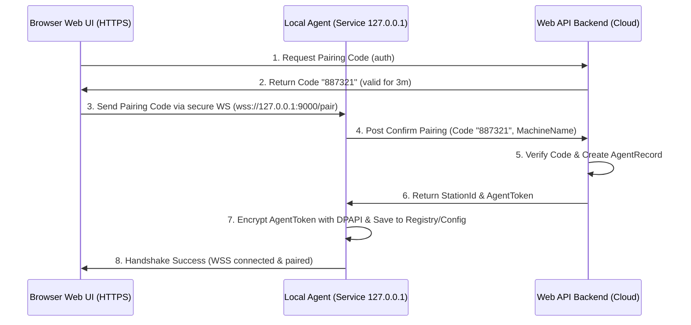

# PHASE 20: Local Agent foundation

## Execution status

- **Trạng thái triển khai:** ✅ Hoàn thành
- **Ngày hoàn thành:** 2026-07-16
- **Bằng chứng nghiệm thu:** Backend Local Agent module, Windows Local Agent, WebSocket loopback, DPAPI token storage, HMAC command guard, admin UI, sidebar entry, changelog/readme update và 2 kịch bản kiểm thử tự động đã hoàn tất.
- **Kiểm thử đã chạy:** `tests/verify_local_agent.ps1` và `tests/verify_agent_websocket.ps1` pass 100%.

## Execution spec maturity

- **Mức hiện tại:** 100%
- **Đánh giá:** Đã triển khai hoàn chỉnh Local Agent, WSS/dev WS fallback, pairing, quản lý trạm, thu hồi token, threat model thiết bị cục bộ và WebSocket protocol contract.
- **Điều kiện duy trì:** Không đổi envelope WebSocket, dải port `9000-9005`, loopback-only `127.0.0.1`, DPAPI token storage hoặc mô hình Browser không giữ `AgentToken` nếu chưa có compatibility/versioning plan cho Phase 21/22.

## 1. Mục tiêu

Thiết lập Windows Local Agent chạy dưới dạng Windows Service, đóng vai trò làm cầu nối WebSocket cục bộ (`127.0.0.1:9000`) để kết nối Web UI (trình duyệt HTTPS) với các thiết bị ngoại vi vật lý (cân, máy in). Phase này phải tạo ra được nền tảng bảo mật gồm: cơ chế ghép cặp (Pairing Token), xác thực Origin, lưu trữ Token an toàn bằng DPAPI và quản lý phiên kết nối của trạm.

## 2. Phạm vi

### In scope

- Xây dựng phần mềm Windows Service Local Agent bằng .NET 8 Worker Service.
- Triển khai WebSocket Server cục bộ trong Agent chỉ lắng nghe địa chỉ loopback `127.0.0.1:9000`.
- Thiết lập cơ chế cấu hình Origin Allowlist bảo vệ kết nối từ trình duyệt.
- Thiết lập quy trình ghép cặp (Pairing Flow) giữa Web UI và Local Agent thông qua mã OTP ghép cặp (One-Time Pairing Code).
- Mã hóa và lưu trữ Token xác nhận ghép cặp cục bộ bằng Windows Data Protection API (DPAPI).
- Tạo module trạm làm việc (Station) trên Web Admin để quản lý danh sách trạm và cho phép thu hồi quyền (Revoke Station) từ xa.

### Non-negotiable output

- Windows Service cài đặt và chạy thành công trên máy trạm Windows local.
- WebSocket Server chặn toàn bộ kết nối không có Origin khớp allowlist hoặc không có Pairing Token hợp lệ.
- Database lưu trữ thông tin trạm làm việc, mã token băm của trạm, và lịch sử kết nối.
- API endpoint trên Backend để sinh Pairing Code, xác thực ghép cặp, và cập nhật Heartbeat trạm.

## 3. Điều kiện đầu vào

### Readiness checklist

- Khung bảo mật Identity và RBAC (Phase 03) đã sẵn sàng.
- Web UI App Shell (Phase 01) hoạt động tốt.
- Quyền `local_agent.view`, `local_agent.pair` và `local_agent.revoke` được seed và gán cho vai trò Admin hệ thống.
- Máy dev Windows 10/11 có quyền cài đặt Windows Service và trust local certificate để kiểm thử WSS.
- Backend đang chạy HTTPS hoặc môi trường dev có cấu hình rõ fallback `ws://127.0.0.1` để tránh Mixed Content.

## 4. Setup

### Cấu trúc module đề xuất

- Backend module: `backend/modules/Nexustock.Modules.LocalAgent/`
- Local Agent source: `local-agent/Nexustock.LocalAgent/` (Windows Worker Service, WebSocket Server, DPAPI wrapper, certificate bootstrap)
- Frontend pages: `frontend/src/app/admin/local-agent/`
- Shared frontend helper: `frontend/src/lib/local-agent-client.ts` để dò cổng, kết nối WSS và chuẩn hóa trạng thái `unpaired/paired/offline/error`.

### Permission seed đề xuất

- `local_agent.view`: Xem trạng thái các trạm làm việc và thiết bị.
- `local_agent.pair`: Thực hiện ghép cặp trạm mới.
- `local_agent.revoke`: Thu hồi quyền truy cập của một trạm làm việc.

### Contract triển khai bắt buộc

- Tên bảng backend dùng PascalCase theo convention EF Core hiện tại: `AgentStations`, `DeviceStatuses`, `AgentPairingCodes`, `AgentConnectionEvents`.
- DTO JSON trả về frontend bắt buộc camelCase: `stationId`, `stationCode`, `connectionState`, `lastHeartbeatAt`.
- Local Agent chỉ expose API/WebSocket trên loopback, không mở HTTP endpoint ra LAN.
- Mọi token bản rõ chỉ xuất hiện một lần ở response `confirm-pair`; backend chỉ lưu hash SHA-256, Local Agent chỉ lưu DPAPI encrypted value.

### 4.4 Decision lock

| Chủ đề | Quyết định Phase 20 | Lý do |
|---|---|---|
| Origin Allowlist | Dev: `http://localhost:3000`, `http://localhost:3003`; Prod/Staging lấy từ cấu hình backend `LocalAgent:AllowedOrigins` | Không hardcode domain production khi chưa chốt DNS, vẫn tránh wildcard rộng |
| Port range | `9000-9005` | Đủ fallback khi port mặc định bị chiếm, không mở quét rộng gây chậm UI |
| DPAPI scope | `LocalMachine` khi chạy Windows Service; `CurrentUser` chỉ dùng dev console | Windows Service thường chạy bằng service account, Machine scope ổn định hơn sau reboot |
| Pairing Code TTL | 3 phút, single-use, lưu hash SHA-256 | Giảm rủi ro OTP bị reuse hoặc lộ trong DB |
| Certificate trust | Dev cho phép `ws://`; staging/prod bắt buộc `wss://` với certificate do installer trust theo thumbprint | Tránh Mixed Content trên HTTPS và có đường rollback certificate rõ ràng |
| Token transport | `X-Agent-Token` chỉ dùng Agent gọi Backend; WebSocket browser dùng HMAC message sau khi paired | Không để browser giữ AgentToken bản rõ |

## 5. Database

### 5.1 Bảng dữ liệu trạm làm việc (`AgentStations`)

| Tên cột | Kiểu dữ liệu | Nullable | Ràng buộc chính | Ý nghĩa |
|---|---|---|---|---|
| `id` | uuid | No | Primary Key | ID trạm |
| `tenantId` | varchar(50) | No | FK | Định danh tenant |
| `stationCode` | varchar(50) | No | Unique per tenant | Mã trạm (ví dụ: `STATION-PACK-01`) |
| `name` | varchar(100) | No | | Tên trạm làm việc |
| `tokenHash` | varchar(256) | No | | Chuỗi băm SHA-256 của AgentToken dùng để auth |
| `status` | varchar(30) | No | | Trạng thái trạm: `active`, `revoked` |
| `machineName` | varchar(100) | Yes | | Tên máy tính Windows cài đặt agent |
| `createdAt` | timestamp | No | | Thời gian tạo |
| `updatedAt` | timestamp | Yes | | Thời gian cập nhật gần nhất |

### 5.2 Bảng trạng thái thiết bị ngoại vi (`DeviceStatuses`)

| Tên cột | Kiểu dữ liệu | Nullable | Ràng buộc chính | Ý nghĩa |
|---|---|---|---|---|
| `id` | uuid | No | Primary Key | ID dòng |
| `tenantId` | varchar(50) | No | FK | Định danh tenant |
| `stationId` | uuid | No | FK | Liên kết trạm |
| `deviceId` | varchar(50) | No | Unique per station | Định danh thiết bị (ví dụ: `scale_01`) |
| `deviceType` | varchar(30) | No | | Loại thiết bị: `scaleCom`, `zebraZpl`, `tscTspl` |
| `connectionState`| varchar(20) | No | | Trạng thái kết nối: `connected`, `disconnected`, `error` |
| `lastHeartbeatAt`| timestamp | No | | Heartbeat gần nhất từ Agent gửi lên |
| `lastErrorMessage`| text | Yes | | Lỗi gần nhất nếu có |

### 5.3 Bảng mã ghép cặp (`AgentPairingCodes`)

| Tên cột | Kiểu dữ liệu | Nullable | Ràng buộc chính | Ý nghĩa |
|---|---|---|---|---|
| `id` | uuid | No | Primary Key | ID mã ghép cặp |
| `tenantId` | uuid | No | Index | Tenant tạo mã |
| `stationCode` | varchar(50) | No | Index | Mã trạm cần ghép cặp |
| `codeHash` | varchar(256) | No | | Hash của OTP 6 số, không lưu OTP bản rõ |
| `expiresAt` | timestamp | No | Index | Thời điểm hết hạn, mặc định 3 phút |
| `consumedAt` | timestamp | Yes | | Thời điểm đã dùng |
| `createdBy` | varchar(100) | No | | Người tạo mã |
| `createdAt` | timestamp | No | | Thời điểm tạo |

### 5.4 Bảng lịch sử kết nối (`AgentConnectionEvents`)

| Tên cột | Kiểu dữ liệu | Nullable | Ràng buộc chính | Ý nghĩa |
|---|---|---|---|---|
| `id` | uuid | No | Primary Key | ID event |
| `tenantId` | uuid | No | Index | Tenant |
| `stationId` | uuid | Yes | FK | Trạm liên quan nếu đã định danh |
| `eventType` | varchar(50) | No | | `paired`, `heartbeat`, `revoked`, `tokenRejected`, `originRejected`, `dpapiFailed` |
| `origin` | varchar(300) | Yes | | Origin trình duyệt gửi đến Agent |
| `machineName` | varchar(100) | Yes | | Tên máy Windows |
| `message` | text | Yes | | Mô tả ngắn gọn đã mask dữ liệu nhạy cảm |
| `createdAt` | timestamp | No | Index | Thời điểm phát sinh |

### 5.5 Kịch bản SQL Migration (PostgreSQL)

```sql
-- +migrate Up
CREATE TABLE "AgentStations" (
    "Id" UUID PRIMARY KEY,
    "TenantId" VARCHAR(50) NOT NULL,
    "StationCode" VARCHAR(50) NOT NULL,
    "Name" VARCHAR(100) NOT NULL,
    "TokenHash" VARCHAR(256) NOT NULL,
    "Status" VARCHAR(30) NOT NULL DEFAULT 'active',
    "MachineName" VARCHAR(100),
    "CreatedAt" TIMESTAMP NOT NULL DEFAULT CURRENT_TIMESTAMP,
    "UpdatedAt" TIMESTAMP,
    CONSTRAINT "UQ_AgentStations_Tenant_Code" UNIQUE ("TenantId", "StationCode")
);

CREATE TABLE "DeviceStatuses" (
    "Id" UUID PRIMARY KEY,
    "TenantId" VARCHAR(50) NOT NULL,
    "StationId" UUID NOT NULL,
    "DeviceId" VARCHAR(50) NOT NULL,
    "DeviceType" VARCHAR(30) NOT NULL,
    "ConnectionState" VARCHAR(20) NOT NULL DEFAULT 'disconnected',
    "LastHeartbeatAt" TIMESTAMP NOT NULL DEFAULT CURRENT_TIMESTAMP,
    "LastErrorMessage" TEXT,
    CONSTRAINT "FK_DeviceStatuses_AgentStations" FOREIGN KEY ("StationId") REFERENCES "AgentStations"("Id") ON DELETE CASCADE,
    CONSTRAINT "UQ_DeviceStatuses_Station_Device" UNIQUE ("StationId", "DeviceId")
);

CREATE INDEX "IX_AgentStations_TenantId" ON "AgentStations" ("TenantId");
CREATE TABLE "AgentPairingCodes" (
    "Id" UUID PRIMARY KEY,
    "TenantId" UUID NOT NULL,
    "StationCode" VARCHAR(50) NOT NULL,
    "CodeHash" VARCHAR(256) NOT NULL,
    "ExpiresAt" TIMESTAMP NOT NULL,
    "ConsumedAt" TIMESTAMP,
    "CreatedBy" VARCHAR(100) NOT NULL,
    "CreatedAt" TIMESTAMP NOT NULL DEFAULT CURRENT_TIMESTAMP
);

CREATE TABLE "AgentConnectionEvents" (
    "Id" UUID PRIMARY KEY,
    "TenantId" UUID NOT NULL,
    "StationId" UUID,
    "EventType" VARCHAR(50) NOT NULL,
    "Origin" VARCHAR(300),
    "MachineName" VARCHAR(100),
    "Message" TEXT,
    "CreatedAt" TIMESTAMP NOT NULL DEFAULT CURRENT_TIMESTAMP,
    CONSTRAINT "FK_AgentConnectionEvents_AgentStations" FOREIGN KEY ("StationId") REFERENCES "AgentStations"("Id") ON DELETE SET NULL
);

CREATE INDEX "IX_DeviceStatuses_StationId" ON "DeviceStatuses" ("StationId");
CREATE INDEX "IX_AgentPairingCodes_Tenant_Station" ON "AgentPairingCodes" ("TenantId", "StationCode");
CREATE INDEX "IX_AgentPairingCodes_ExpiresAt" ON "AgentPairingCodes" ("ExpiresAt");
CREATE INDEX "IX_AgentConnectionEvents_Tenant_CreatedAt" ON "AgentConnectionEvents" ("TenantId", "CreatedAt");

-- +migrate Down
DROP TABLE IF EXISTS "AgentConnectionEvents";
DROP TABLE IF EXISTS "AgentPairingCodes";
DROP TABLE IF EXISTS "DeviceStatuses";
DROP TABLE IF EXISTS "AgentStations";
```

## 6. Backend/API

### 6.1 API sinh mã ghép cặp (Pairing Code generation)
- **Method & Path:** `POST /api/agent/stations/pairing-code`
- **Permission:** `local_agent.pair`
- **Request:** `{ "stationCode": "STATION-PACK-01", "name": "Bàn đóng gói số 1" }`
- **Response (Success):** `{ "pairingCode": "887321", "expiresAt": "2026-07-01T09:12:15Z" }`
- *Ghi chú:* Mã ghép cặp gồm 6 chữ số ngẫu nhiên, lưu vào Redis cache hoặc DB với TTL = 3 phút.

### 6.2 API xác thực ghép cặp từ Local Agent (Pairing confirmation)
- **Method & Path:** `POST /api/agent/stations/confirm-pair`
- **Auth:** Public API (xác thực qua Pairing Code).
- **Request:** `{ "stationCode": "STATION-PACK-01", "pairingCode": "887321", "machineName": "DESKTOP-PACK-01" }`
- **Response (Success):** `{ "stationId": "uuid-1234", "agentToken": "tok_sec_abc123xyz" }`
- *Ghi chú:* Tạo AgentToken ngẫu nhiên có độ dài entropy lớn. Lưu băm SHA-256 của AgentToken vào `tokenHash` trong bảng `AgentStations`.

### 6.3 API Heartbeat trạm làm việc
- **Method & Path:** `POST /api/agent/stations/{stationId}/heartbeat`
- **Auth:** Header `X-Agent-Token` chứa AgentToken bản rõ.
- **Request:** `{ "devices": [ { "deviceId": "scale_01", "deviceType": "scaleCom", "connectionState": "connected", "lastErrorMessage": null } ] }`
- **Response (Success):** `{ "status": "active" }` (Nếu trạm bị đánh dấu `revoked`, API trả lỗi 403 buộc Agent tự reset cấu hình).

### 6.4 API danh sách trạm cho Web Admin
- **Method & Path:** `GET /api/agent/stations`
- **Permission:** `local_agent.view`
- **Response:** `{ "items": [ { "stationId": "uuid", "stationCode": "STATION-PACK-01", "name": "Bàn đóng gói số 1", "status": "active", "machineName": "DESKTOP-PACK-01", "lastHeartbeatAt": "2026-07-16T01:00:00Z", "devices": [] } ] }`

### 6.5 API thu hồi trạm
- **Method & Path:** `POST /api/agent/stations/{stationId}/revoke`
- **Permission:** `local_agent.revoke`
- **Request:** `{ "reasonCode": "SECURITY_ROTATION", "description": "Thu hồi token trạm đóng gói cũ" }`
- **Response:** `{ "status": "revoked" }`
- **Ghi chú:** API đổi `AgentStations.status` sang `revoked`, ghi `AgentConnectionEvents.eventType = revoked`. Token cũ không được khôi phục; muốn dùng lại phải pairing mới.

## 7. Frontend/RF/mobile

### Màn hình thiết lập kết nối Trạm (Station Setup)
- Web UI hiển thị widget kiểm tra trạng thái Local Agent. Nếu chưa có kết nối WebSocket cục bộ, Web UI hiển thị hướng dẫn tải phần mềm và nút "Tạo mã ghép cặp".
- Trình duyệt chạy JS kết nối WebSocket cục bộ: `wss://127.0.0.1:9000/ws` (hoặc `ws://` chỉ trong môi trường dev).
- Nếu WebSocket cục bộ báo trạng thái `unpaired`, giao diện Web UI hiển thị hộp thoại điền OTP ghép cặp và gửi xuống Agent.
- Admin page `frontend/src/app/admin/local-agent/page.tsx` hiển thị danh sách trạm, trạng thái heartbeat, thiết bị đang kết nối và action thu hồi trạm.
- Sidebar thêm menu `Local Agent` trong nhóm `Hệ thống & Quyền` hoặc `Tồn kho`, chỉ hiện khi user có `local_agent.view`.

## 8. Execution flow

### Quy trình ghép cặp trạm lần đầu (First-time Pairing Flow)



### 8.2 WebSocket protocol contract

Local Agent WebSocket chỉ nhận JSON message envelope theo format thống nhất để Phase 21/22 tái sử dụng mà không đổi transport.

```json
{
  "messageId": "uuid",
  "type": "agent.status.request",
  "timestamp": "2026-07-16T01:30:00Z",
  "payload": {},
  "signature": "base64-hmac-sha256"
}
```

| Message type | Direction | Auth | Payload chính | Response |
|---|---|---|---|---|
| `agent.status.request` | Web UI -> Agent | Origin allowlist | `{}` | `agent.status.response` |
| `agent.pair.request` | Web UI -> Agent | Origin allowlist + Pairing Code | `{ "stationCode": "STATION-PACK-01", "pairingCode": "887321" }` | `agent.pair.response` |
| `agent.heartbeat.push` | Agent -> Backend | `X-Agent-Token` | device state list | `{ "status": "active", "traceId": "..." }` |
| `agent.command.ping` | Web UI -> Agent | HMAC sau paired | `{}` | `agent.command.pong` |
| `agent.reset.request` | Web UI/Admin -> Agent | HMAC sau paired | `{ "reasonCode": "REPAIR" }` | `agent.reset.response` |

### 8.3 Agent local config contract

File cấu hình cục bộ không được chứa secret bản rõ. Format dự kiến:

```json
{
  "stationId": "uuid",
  "stationCode": "STATION-PACK-01",
  "backendBaseUrl": "https://api.nexustock.vn",
  "webSocketPort": 9000,
  "dpapiScope": "LocalMachine",
  "encryptedAgentToken": "base64-dpapi-value",
  "certificateThumbprint": "SHA1-THUMBPRINT",
  "allowedOrigins": ["http://localhost:3000", "http://localhost:3003"]
}
```

### 8.4 Local Agent startup lifecycle

1. Đọc config cục bộ.
2. Kiểm tra `encryptedAgentToken`; nếu decrypt fail thì chuyển trạng thái `unpaired`.
3. Load certificate theo `certificateThumbprint`; nếu thiếu certificate trong prod thì dừng service và ghi Event Viewer.
4. Bind `127.0.0.1` trong dải `9000-9005`, ưu tiên port cấu hình trước.
5. Start WebSocket server và reject mọi request sai Origin.
6. Nếu đã paired, gửi heartbeat đầu tiên lên backend.
7. Nếu heartbeat trả 403, xóa token DPAPI local và chuyển trạng thái `unpaired`.

## 9. Validation & business rules

### 9.1 Threat Model & Attack Vector Matrix

| ID | Attack Vector (Véc tơ tấn công) | Threat Impact (Tác động) | Mitigation Strategy (Chiến lược phòng chống) |
|---|---|---|---|
| **AV-01** | **Origin Spoofing** (Trang web lạ cố kết nối WebSocket của Agent) | Kẻ xấu mở tab ẩn danh chạy mã độc gán lệnh in/cân đè dữ liệu cục bộ | WebSocket Server của Agent lọc Header `Origin`. Chỉ chấp nhận các tên miền trong allowlist được cấu hình cứng (ví dụ: `https://*.nexustock.vn`). Từ chối bắt tay (handshake) ngay nếu sai. |
| **AV-02** | **Token Theft** (Kẻ xấu đọc trộm file cấu hình Agent để lấy Pairing Token) | Giả mạo máy trạm gửi heartbeat giả, đánh cắp quyền in ấn/cân | Token lưu cục bộ trên Windows Registry hoặc JSON config bắt buộc mã hóa qua Windows Data Protection API (DPAPI) ở mức Machine/User scope. Key giải mã chỉ nằm trên kernel của máy trạm đó. |
| **AV-03** | **Replay Attack** (Chặn tin nhắn WebSocket cũ và gửi lại) | Lặp lại lệnh cân/lệnh in cũ gây sai lệch số lượng | Mỗi request gửi xuống Agent phải có `Timestamp` (ISO 8601) và `HMAC-SHA256` ký số bằng `AgentToken`. Agent từ chối nếu thời gian lệch quá 30 giây (`Time Skew`). |
| **AV-04** | **Port Hijack** (Phần mềm khác chiếm cổng 9000 của Agent) | Làm tê liệt kết nối Web UI đến thiết bị ngoại vi | Cơ chế quét dải cổng (Port scanning) dự phòng tự động từ `9000` đến `9005`. Web UI ping tuần tự để kết nối cổng khả dụng. |
| **AV-05** | **MITM (Man-In-The-Middle)** (Chặn bắt gói tin trên loopback) | Rò rỉ dữ liệu hoặc chèn lệnh trái phép | Bắt buộc chạy kết nối WebSocket bảo mật `wss://127.0.0.1:9000` sử dụng chứng chỉ SSL tự ký đã được tin cậy tại máy local của trạm. |

### 9.2 Luật an toàn Local Agent

- **Mặc định HTTPS/WSS:** WebSocket Server của Local Agent bắt buộc sử dụng giao thức bảo mật `wss://127.0.0.1:9000` cho môi trường production để tránh bị các trình duyệt HTTPS chặn (Mixed Content). Cung cấp fallback `ws://127.0.0.1:9000` chỉ dành cho môi trường phát triển (development) cục bộ.
- **Cấp và tin cậy chứng chỉ (Certificate Trust Flow):** 
  - Trình cài đặt Local Agent (MSIX) sẽ tự động tạo một Self-signed SSL Certificate cho tên miền `localhost` và thêm nó vào thư mục `Trusted Root Certification Authorities` trên máy tính trạm Windows của thủ kho.
  - Quá trình này được ký số (Code Signing) bằng chứng chỉ doanh nghiệp để vượt qua Windows SmartScreen cảnh báo.
- **Cơ chế dò cổng dự phòng (Port Discovery & Fallback):**
  - Nếu cổng mặc định `9000` bị chiếm, Local Agent sẽ tự động thử bind cổng trong dải `9001-9005`.
  - Web UI trên trình duyệt khi tải trang sẽ thực hiện quét cổng nhanh (Port scanning) từ `9000` đến `9005` bằng cách gửi request WSS ping để nhận diện cổng đang mở của Agent.
- **Chống tấn công phát lại (Replay & Time Skew Protection):**
  - Mỗi tin nhắn giao tiếp WebSocket gửi xuống Agent phải chứa `timestamp` dạng ISO 8601 và mã chữ ký HMAC SHA-256 được tính dựa trên `AgentToken`.
  - Local Agent sẽ reject tin nhắn nếu độ lệch thời gian (Time Skew) giữa Client và Server cục bộ vượt quá 30 giây để chống lại cuộc tấn công phát lại (Replay attack).
- **Chỉ bind Loopback:** WebSocket Server của Local Agent bắt buộc chỉ bind địa chỉ loopback `127.0.0.1`. Tuyệt đối cấm sử dụng `0.0.0.0` hoặc IP mạng LAN để ngăn chặn truy cập chéo thiết bị ngoại vi trong mạng nội bộ.
- **Kiểm tra Origin Allowlist:** Bất kỳ kết nối WebSocket nào đến Agent phải được xác thực Header `Origin`. Nếu Origin không khớp cấu hình cho phép của WMS, kết nối bị đóng ngay lập tức với lỗi `403 Forbidden`.
- **Lưu trữ DPAPI:** AgentToken lưu cục bộ tại máy Windows phải được mã hóa qua Windows Data Protection API (DPAPI) ở mức User scope hoặc Machine scope để chống đọc trộm file cấu hình phẳng.

### 9.3 Windows DPAPI Cryptography Wrapper (Pseudo-code C#)

Để lưu trữ `AgentToken` an toàn trên máy trạm Windows, Agent sử dụng lớp thư viện mã hóa sau:

```csharp
using System.Security.Cryptography;
using System.Text;

public class DpapiSecretStorage : ISecretStorage
{
    // Entropy bổ sung để tăng cường bảo mật (tương đương muối bảo mật)
    private static readonly byte[] OptionalEntropy = Encoding.UTF8.GetBytes("NexustockAgentEntropy2026");

    public string EncryptSecret(string plainText)
    {
        if (string.IsNullOrEmpty(plainText)) return string.Empty;
        
        byte[] plainBytes = Encoding.UTF8.GetBytes(plainText);
        // Mã hóa sử dụng Machine scope hoặc User scope
        byte[] encryptedBytes = ProtectedData.Protect(
            plainBytes, 
            OptionalEntropy, 
            DataProtectionScope.CurrentUser
        );
        
        return Convert.ToBase64String(encryptedBytes);
    }

    public string DecryptSecret(string encryptedBase64)
    {
        if (string.IsNullOrEmpty(encryptedBase64)) return string.Empty;
        
        try
        {
            byte[] encryptedBytes = Convert.FromBase64String(encryptedBase64);
            byte[] plainBytes = ProtectedData.Unprotect(
                encryptedBytes, 
                OptionalEntropy, 
                DataProtectionScope.CurrentUser
            );
            
            return Encoding.UTF8.GetString(plainBytes);
        }
        catch (CryptographicException)
        {
            // Trả về rỗng nếu token bị corrupt hoặc bị đổi user giải mã
            return string.Empty;
        }
    }
}
```

## 10. Exception handling

| Nhóm lỗi | Nguyên nhân | Xử lý |
|---|---|---|
| Cổng WebSocket bị chiếm | Cổng 9000-9005 đều bị chiếm dụng | Agent ghi log Event Viewer, dừng khởi chạy dịch vụ, báo động đỏ. |
| Token bị thu hồi | Admin bấm Revoke trạm trên Web Admin | Heartbeat API trả về 403. Agent lập tức tự xóa Token đã lưu cục bộ bằng DPAPI, ngắt mọi kết nối WebSocket hiện có và chuyển trạng thái về `unpaired`. |
| Sai Origin | Trang web lạ kết nối đến localhost | WebSocket Server từ chối kết nối trước khi thực hiện handshake. |
| Mất đồng bộ thời gian | Đồng hồ máy trạm bị sai lệch quá 30 giây | Trả lỗi `auth.time_skew` và yêu cầu đồng bộ lại đồng hồ hệ thống (NTP). |
| Certificate thiếu hoặc sai thumbprint | Installer chưa trust certificate hoặc certificate bị xóa | Production dừng service, ghi Event Viewer và báo trạng thái `certificate_error`; dev được fallback `ws://` nếu bật cấu hình dev. |
| DPAPI decrypt fail | Config bị copy sang máy/user khác hoặc scope bị đổi | Xóa token local, chuyển `unpaired`, ghi event `dpapiFailed`, không retry vô hạn. |
| Backend không erreichbar | Mất mạng hoặc backend down | Agent giữ WebSocket local, trả trạng thái `backend_offline`, retry heartbeat theo backoff tối đa 60 giây. |
| Pairing Code hết hạn/đã dùng | OTP quá 3 phút hoặc đã consumed | Backend trả 400, Agent không lưu token, Web UI yêu cầu tạo mã mới. |

### 10.1 Error code contract

| Code | Layer | Ý nghĩa | UI action |
|---|---|---|---|
| `agent.unpaired` | Agent | Chưa ghép cặp hoặc token đã bị xóa | Hiển thị nút tạo Pairing Code |
| `agent.origin_denied` | Agent | Origin không nằm trong allowlist | Hiển thị lỗi bảo mật, không retry |
| `agent.port_unavailable` | Agent | Không bind được port 9000-9005 | Hướng dẫn restart service hoặc đổi port |
| `agent.certificate_error` | Agent | Certificate thiếu/sai | Hướng dẫn cài lại Agent hoặc trust certificate |
| `agent.dpapi_failed` | Agent | Không giải mã được token | Yêu cầu pairing lại |
| `auth.time_skew` | Agent | Timestamp lệch quá 30 giây | Hướng dẫn đồng bộ giờ Windows |
| `backend.revoked` | Backend | Station đã bị thu hồi | Agent xóa token và UI về `unpaired` |
| `backend.offline` | Agent | Backend tạm không kết nối được | UI báo degraded, cho phép retry |

## 11. Observability

- **Event Viewer logs:** Ghi nhận lỗi khởi chạy dịch vụ, lỗi bind cổng, lỗi DPAPI giải mã thất bại.
- **Heartbeat monitoring:** Định kỳ 30 giây, Web Backend kiểm tra các trạm làm việc. Nếu `lastHeartbeatAt` của thiết bị ngoại vi quá 2 phút, đổi trạng thái sang `offline` trên UI giám sát.
- **Connection event audit:** Mỗi lần pairing, revoke, token reject, origin reject, DPAPI decrypt fail phải ghi `AgentConnectionEvents`; message không chứa token, OTP hoặc secret.
- **Trace correlation:** Heartbeat và revoke response trả `traceId` để đối chiếu log backend với Event Viewer trên máy trạm.
- **Event naming:** Event Viewer source dùng `Nexustock.LocalAgent`; event level gồm `Information`, `Warning`, `Error`, không ghi secret.
- **Health snapshot:** Web Admin hiển thị `paired/unpaired/backend_offline/certificate_error/port_unavailable` theo status mới nhất từ Agent.
- **Retention:** `AgentConnectionEvents` giữ tối thiểu 90 ngày hoặc theo policy audit chung; cleanup không xóa event đang liên quan incident mở.

## 12. Test plan

- **Unit Test:**
  - Logic xác thực Origin khớp wildcard allowlist.
  - Logic mã hóa/giải mã DPAPI wrapper.
  - Logic verify HMAC envelope và reject timestamp lệch quá 30 giây.
  - Logic chọn port fallback `9000-9005`.
  - Logic sanitize log không chứa OTP, AgentToken hoặc private key.
- **Integration Test:**
  - Gọi API sinh mã ghép cặp, mô phỏng gửi mã đến Agent và xác thực trả về Token.
  - Gọi API Heartbeat với Token hợp lệ và Token đã bị thu hồi (Verify 403).
- **Negative Test:**
  - Kết nối WebSocket từ một Origin lạ (ví dụ: `https://evil.com`) và xác minh kết nối bị từ chối ngay.
  - Gửi Heartbeat với token sai, token rỗng, token của trạm đã revoke và xác minh backend trả 401/403 đúng.
  - Dùng Pairing Code hết hạn hoặc đã consumed và xác minh API không cấp AgentToken.
- **Manual Windows Test:**
  - Cài service local, reboot máy, kiểm tra service tự chạy lại.
  - Mở file/registry config và xác minh không có token bản rõ.
  - Copy config sang user/máy khác và xác minh DPAPI decrypt fail rồi Agent về `unpaired`.
  - Xóa certificate theo thumbprint, restart service và xác minh prod trả `agent.certificate_error`.
  - Chiếm port `9000-9005`, restart service và xác minh lỗi `agent.port_unavailable` được log rõ.

## 13. Acceptance criteria

Để đạt mức sẵn sàng 96% (Execution-Ready), Local Agent phải thỏa mãn các tiêu chí nghiệm thu sau:

* **AC-01 (Cài đặt & Tự khởi động):** Local Agent đóng gói dạng MSIX cài đặt thành công trên máy trạm Windows 10/11, tự động đăng ký Windows Service và khởi động cùng hệ điều hành (`StartType = Automatic`).
* **AC-02 (Xác thực Origin & Cấm WAN):** WebSocket Server của Agent chỉ lắng nghe ở `127.0.0.1`. Khi thực hiện quét cổng hoặc kết nối từ một client nằm ngoài máy (mạng LAN/WAN), kết nối phải bị chặn hoàn toàn. Khi kết nối từ trình duyệt với Header `Origin` lạ (ví dụ: `https://evil.com`), kết nối phải bị reject ngay từ khâu handshake (HTTP 403).
* **AC-03 (Bảo mật lưu trữ Token):** Sau khi hoàn tất ghép cặp (Pairing), file cấu hình JSON cục bộ hoặc Registry của Agent chỉ chứa chuỗi token đã mã hóa dạng Base64 (DPAPI encrypted). Nếu mở file cấu hình bằng Notepad, tuyệt đối không nhìn thấy Token bản rõ. Thử copy file cấu hình sang một máy tính khác, Agent tại máy mới phải báo lỗi giải mã DPAPI thất bại và tự chuyển về trạng thái `unpaired`.
* **AC-04 (Chống Replay & Lệch giờ):** Khi gửi lệnh in thử qua WebSocket với timestamp bị sửa lùi quá 30 giây so với giờ hệ thống của Agent, Agent phải từ chối xử lý và trả về lỗi `auth.time_skew`.
* **AC-05 (Heartbeat & Thu hồi từ xa):** Khi Admin thực hiện "Revoke Station" trên Web Admin Cloud:
  1. API Heartbeat trả về 403.
  2. Agent nhận 403 lập tức kích hoạt hàm xóa token cục bộ, đóng mọi socket và chuyển trạng thái trên Web UI thành `unpaired` trong vòng 10 giây.
* **AC-06 (Protocol & Config Contract):** WebSocket message phải tuân thủ envelope `messageId/type/timestamp/payload/signature`; config local không chứa secret bản rõ và có `certificateThumbprint` để rollback chính xác.
* **AC-07 (Port/Certificate Failure Mode):** Khi thiếu certificate prod hoặc tất cả port `9000-9005` bị chiếm, Agent phải fail-safe, ghi Event Viewer, không fallback sang insecure mode ngoài dev.

### Definition of done

* Database migration chạy sạch trên database trống.
* API pairing, heartbeat, list và revoke có integration test pass.
* WebSocket protocol contract có unit test verify envelope, HMAC và time skew.
* Local Agent cài được trên Windows 10/11, chạy như Windows Service và tự khởi động lại sau reboot.
* Web UI kết nối được Local Agent qua `wss://127.0.0.1:9000-9005` hoặc fallback dev `ws://` có kiểm soát.
* Origin Allowlist, token hash, DPAPI storage, replay guard và revoke flow được test đủ positive/negative path.
* Event Viewer log và `AgentConnectionEvents` ghi được lỗi bind port, origin reject, token reject, DPAPI fail và revoke.
* README hoặc phase note đủ để executor tiếp theo hiểu cách cài service, trust certificate, pairing và rollback.
* Không còn placeholder generic trong phần triển khai phase.

## 14. Out of scope

* Tích hợp cân thật qua COM port, driver vendor hoặc giao thức cân chi tiết; phần này thuộc Phase 21.
* Tạo template tem, render ZPL/TSPL hoặc quản lý print job thật; phần này thuộc Phase 22.
* Đồng bộ ERP/WMS legacy, webhook hoặc external integration; phần này thuộc Phase 23-24.
* Cloud device gateway, remote hardware control qua mạng LAN/WAN hoặc mở Agent ra IP ngoài loopback.
* Auto-update Local Agent, telemetry nâng cao và fleet management lớn hơn nhu cầu MVP.

Không đưa scope ngoài vào Phase 20 nếu chưa có dependency rõ. Nếu bắt buộc phát sinh scope mới, cập nhật roadmap tổng trước khi triển khai.

## 15. Dependencies

* Phase 01 Web UI App Shell đã sẵn sàng để gắn station setup page và sidebar.
* Phase 03 Identity/RBAC/Audit đã sẵn sàng để seed permission `local_agent.view`, `local_agent.pair`, `local_agent.revoke`.
* Phase 07 Outbound picking & packing là dependency vận hành vì Local Agent phục vụ packing station, cân và in tem downstream.
* Windows 10/11 workstation có quyền cài service, mở loopback port và trust local certificate.
* Backend dev/prod phải xác định rõ HTTPS endpoint, Origin Allowlist và chính sách certificate trust trước khi code.

### Downstream impact

* Phase 21 Scale integration dùng Local Agent WebSocket, station identity, heartbeat, device status contract và `agent.command.*` envelope của Phase 20.
* Phase 22 Label printing dùng cùng AgentToken, WSS channel, replay guard, station revoke flow và certificate trust contract.
* Phase 23-24 integration/observability được phép đọc `AgentConnectionEvents` để phân tích lỗi thiết bị tại trạm.
* Nếu đổi bảng `AgentStations`, `DeviceStatuses`, `AgentPairingCodes` hoặc API `/api/agent/stations/*`, phải cập nhật Phase 21-22 trước khi triển khai.
* Không đổi dải port, auth header, token hash format hoặc event type sau khi phase sau đã phụ thuộc nếu không có migration/compatibility plan.

## 16. Maintenance notes

* Không mở Agent ra LAN để “tiện test”; mọi kết nối production bắt buộc loopback.
* Không lưu OTP, AgentToken hoặc certificate private key dạng plain text trong DB, file config, log hoặc Event Viewer.
* Token bị revoke không được khôi phục; pairing lại bằng token mới.
* Pairing Code hết hạn nhanh, dùng một lần, lưu hash thay vì bản rõ.
* Feature advanced như auto-update, remote diagnostics, multi-port device routing phải có permission hoặc feature flag riêng.
* Cấu hình Origin Allowlist phải rõ theo môi trường dev/staging/prod, không dùng wildcard rộng nếu không cần.

### Maintenance contract

* Giữ tài liệu này đồng bộ với migration, API contract, Local Agent config schema và frontend station UI.
* Khi thêm device type mới, cập nhật `DeviceStatuses.deviceType`, UI badge, heartbeat DTO và negative test.
* Khi thêm permission mới, cập nhật seed, sidebar visibility, API policy và regression test.
* Khi đổi certificate hoặc DPAPI scope, cập nhật installer, README, rollback note và manual Windows test.
* Khi đổi timeout heartbeat, cập nhật backend monitoring, UI offline rule và downstream Phase 21-22.

## 17. Extension points

* Tích hợp cân điện tử thật qua COM/USB HID ở Phase 21.
* Tích hợp in tem ZPL/TSPL, print queue và reprint audit ở Phase 22.
* Thêm auto-discovery thiết bị cục bộ nhưng vẫn giữ boundary loopback.
* Thêm auto-update Local Agent có ký số và rollback installer.
* Thêm dashboard sức khỏe trạm theo ca/kho/khu vực khi Phase 25 Observability bắt đầu.
* Thêm policy rotation token định kỳ theo tenant hoặc station group.

### Nguyên tắc mở rộng

* Mở rộng bằng module hoặc service rõ ràng, không nhét logic thiết bị vào controller.
* Ưu tiên API/contract ổn định trước khi thêm driver cụ thể.
* Không thêm dependency ngoài nếu .NET standard library hoặc dependency hiện có xử lý đủ.
* Feature nâng cao phải có permission hoặc feature flag riêng.
* Mọi driver thiết bị mới phải có mock adapter để test không cần phần cứng thật.

## 18. Rollback notes

* Tắt menu `Local Agent` hoặc thu quyền `local_agent.view/pair/revoke` nếu UI/API lỗi.
* Revoke station token bị lỗi bảo mật, buộc pairing lại sau khi fix.
* Stop/disable Windows Service trên máy trạm nếu Agent bind port sai hoặc certificate lỗi.
* Rollback migration chỉ khi chưa có station production; nếu đã có station production, giữ bảng và đánh dấu `revoked` thay vì xóa dữ liệu.
* Không xóa `AgentConnectionEvents` trong production vì đây là audit trail điều tra lỗi thiết bị.

### Rollback safety

* Nếu UI lỗi, ẩn menu/permission tạm thời; backend và Agent có thể giữ nguyên.
* Nếu API lỗi, rollback deployment image trước, xử lý token/station theo trace ID sau.
* Nếu Agent lỗi cục bộ, stop service và xóa token DPAPI local sau khi đã revoke trên Web Admin.
* Nếu certificate trust lỗi, gỡ certificate đã tạo bởi installer theo thumbprint đã log, không xóa certificate khác của hệ thống.
* Nếu token nghi bị lộ, revoke toàn bộ station liên quan, không reuse Pairing Code hoặc AgentToken cũ.
* Nếu protocol WebSocket cần đổi sau Phase 21/22, thêm message type/version mới thay vì sửa envelope hiện hữu.

