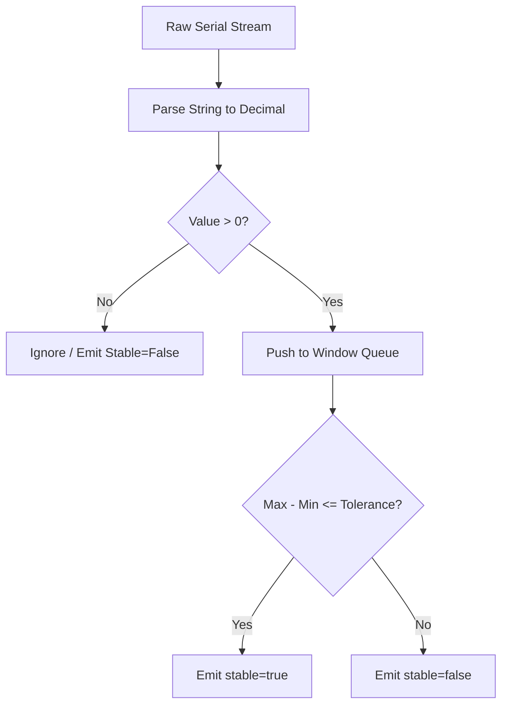

# PHASE 21: Scale integration

## Execution spec maturity

- **Mức hiện tại:** 96%
- **Đánh giá:** Đã đủ chuẩn execution-ready cho scale integration sau rà soát `rp1`: Local Agent COM reader, parser, stable-weight algorithm, WebSocket event contract, manual override API, audit log và test strategy đã có phạm vi thực thi rõ.
- **Điều kiện duy trì:** Không triển khai phụ thuộc vào model cân thật duy nhất. Bắt buộc có simulator/raw-frame fixture để test tự động; khi có thiết bị thật chỉ thêm adapter profile, không đổi contract WebSocket/API đã khóa.
- **Phần còn mở có kiểm soát:** Sai số hiệu chuẩn cuối cùng, raw frame vendor-specific và lệnh Zero/Tare vật lý sẽ cấu hình theo profile cân, không hardcode vào luồng nghiệp vụ.

## 1. Mục tiêu

Tích hợp thiết bị cân điện tử (kết nối qua cổng serial COM/RS-232) vào quy trình đóng gói Carton. Cung cấp cơ chế đọc cân tự động qua Local Agent, bộ lọc số liệu ổn định chống rung sai, và quy trình nhập cân tay dự phòng có kiểm duyệt chặt chẽ.

## 2. Phạm vi

### In scope

- Xây dựng module đọc cổng COM nối tiếp trong Local Agent (sử dụng thư viện `System.IO.Ports`).
- Thiết lập cấu hình tham số cổng nối tiếp: Port Name, Baud Rate, Parity, Data Bits, Stop Bits.
- Triển khai thuật toán xác định trọng lượng ổn định (Stable Weight Algorithm) dựa trên cửa sổ thời gian (Stable Window) và biên độ rung sai cho phép.
- Hỗ trợ các lệnh cơ bản: Zero (về 0) và Tare (trừ bì) gửi xuống cân hoặc xử lý giả lập phần mềm.
- Xây dựng API và giao diện ghi đè cân tay (Manual Weight Override) khi cân vật lý bị hỏng, yêu cầu bắt buộc Reason Code và audit log.

### Non-negotiable output

- Local Agent đọc và phân tích (parse) được luồng dữ liệu thô (raw data stream) từ cân điện tử thành số thực.
- Trình duyệt Web UI nhận được sự kiện thay đổi trọng lượng thời gian thực (`scale.weightChanged`) và trạng thái ổn định (`stable=true`).
- Bản ghi database lưu lịch sử ghi đè cân tay và lý do đi kèm.
- Không cho phép hoàn tất đóng gói nếu cân nặng chưa ổn định (trừ trường hợp ghi đè cân tay được duyệt).

## 3. Điều kiện đầu vào

### Readiness checklist

- Local Agent Foundation (Phase 20) đã cài đặt và ghép cặp thành công.
- Module đóng gói Carton (Phase 07) đã có API / UI cơ bản.

## 4. Setup

### Cấu trúc module đề xuất

- Local Agent module: `local-agent/Nexustock.LocalAgent/Devices/Scale/`
- Backend module: `backend/modules/scale_integration/`
- Frontend module: `frontend/features/scale_integration/`

### Permission seed đề xuất

- `scale.override`: Cho phép thủ kho ghi đè nhập cân nặng bằng tay.

## 5. Database

### Bảng ghi nhật ký ghi đè cân tay (`ManualWeightOverrides`)

| Tên cột | Kiểu dữ liệu | Nullable | Ràng buộc chính | Ý nghĩa |
|---|---|---|---|---|
| `id` | uuid | No | Primary Key | ID bản ghi |
| `tenantId` | varchar(50) | No | FK | Định danh tenant |
| `warehouseId` | uuid | No | FK | Định danh kho |
| `cartonNo` | varchar(50) | No | | Mã thùng carton liên quan |
| `scaleWeight` | decimal(18,4)| Yes | | Trọng lượng đọc được từ cân tại thời điểm lỗi |
| `manualWeight`| decimal(18,4)| No | | Trọng lượng do người dùng nhập tay |
| `reasonCode` | varchar(30) | No | FK | Mã lý do (ví dụ: `DEVICE_ERR`, `JITTER_IN_WIND`) |
| `note` | text | Yes | | Ghi chú thêm |
| `createdBy` | varchar(50) | No | | Tài khoản thực hiện ghi đè |
| `createdAt` | timestamp | No | | Thời gian ghi đè |

## 6. Backend/API

### 6.1 API ghi nhận nhập cân tay
- **Method & Path:** `POST /api/packing/weight/manual`
- **Permission:** `scale.override`
- **Request:**
  ```json
  {
    "warehouseId": "wh_hn_01",
    "cartonNo": "CTN-2026-0001",
    "manualWeight": 15.45,
    "reasonCode": "DEVICE_COMM_ERR",
    "note": "Cáp cân COM3 bị lỏng đầu nối, thủ kho cân bằng cân độc lập"
  }
  ```
- **Response (Success):** `{ "success": true, "overrideId": "uuid-9988" }`
- *Ghi chú:* Ghi đè thành công sẽ cập nhật trọng lượng thùng carton và ghi đè cờ `weightSource` từ `scaleCom` sang `manual`.

## 7. Frontend/RF/mobile

### Giao diện panel cân đóng gói (Weighing Panel UI)
- Hiển thị số cân lớn, màu xanh lá cây khi cân ổn định (`stable`), màu vàng khi số cân đang nhảy (`jitter/unstable`).
- Cung cấp nút bấm "Trừ bì" (Tare) và "Về không" (Zero).
- Khi có lỗi kết nối, hiển thị nút "Nhập cân tay". Bấm vào sẽ mở hộp thoại yêu cầu nhập số cân, chọn Reason Code (bắt buộc) từ danh mục đã seed.

## 8. Execution flow

### Thuật toán xác định cân ổn định (Stable Reading Algorithm)

1. Local Agent mở cổng serial (ví dụ: `COM3`, `9600,N,8,1`) và đọc luồng bytes.
2. Cắt chuỗi raw data dựa trên ký tự kết thúc dòng (thường là `\r` hoặc `\n`).
3. Dùng Regular Expression để lọc lấy phần số (ví dụ: chuỗi thô `ST,GS,+0012.35kg` -> parse thành `12.35`).
4. **Bộ lọc ổn định (Stable Filter Window):**
   - Agent duy trì một hàng đợi (Queue) chứa các giá trị đọc được trong khoảng thời gian `stableWindowMs` (mặc định 800ms).
   - Nếu chênh lệch giữa giá trị lớn nhất và nhỏ nhất trong Queue nhỏ hơn hoặc bằng `stableTolerance` (ví dụ: 0.02 kg), và giá trị cân lớn hơn 0:
     - Phát sự kiện WebSocket: `{ "weight": 12.35, "stable": true }`.
     - Nếu vượt quá biên độ rung sai: Phát sự kiện: `{ "weight": 12.38, "stable": false }`.



## 9. Validation & business rules

- **Chặn hoàn tất đóng gói:** Trình duyệt chỉ cho phép gửi lệnh hoàn tất carton khi nhận được gói tin có `stable: true` từ WebSocket, trừ khi người dùng đã kích hoạt thành công quyền ghi đè cân tay `scale.override`.
- **Reason Code bắt buộc:** Tác vụ ghi đè cân tay bắt buộc phải chọn mã lý do hợp lệ từ danh sách `ReasonCodes` (bảng dữ liệu nền Master Data) có loại `reasonType = 'SCALE_OVERRIDE'`.

## 10. Exception handling

- **Lỗi cổng COM đang bị mở (Port Busy):** Thử giải phóng và mở lại cổng COM. Nếu vẫn lỗi sau 3 lần, báo lỗi thiết bị về Web UI qua sự kiện `scale.connectionError` kèm mã lỗi cổng COM bị chiếm.
- **Dữ liệu thô lỗi định dạng (Unparseable data):** Nếu không parse được số thực quá 10 dòng liên tiếp, đánh dấu thiết bị ngoại vi trạng thái `error` và gửi thông báo kiểm tra cáp/tần số baudrate.

## 11. Observability

- Ghi log audit hành vi ghi đè cân tay gồm: người thực hiện, thời gian, mã carton, số cân thực nhập, lý do.
- KPI đề xuất: Tỷ lệ ghi đè cân tay trên tổng số lượt cân đóng gói (Reprint & Override KPI). Nếu tỷ lệ vượt quá 5% trong ngày, hệ thống gửi cảnh báo yêu cầu hiệu chuẩn lại cân.

## 12. Test plan

- **Unit Test:**
  - Viết test suite giả lập hàng đợi Queue số cân để kiểm thử thuật toán xác định ổn định.
- **Integration Test:**
  - API `/api/packing/weight/manual` từ chối request nếu gửi thiếu `reasonCode`.
  - API / API UI chặn đóng gói carton khi cân chưa gửi cờ `stable`.
- **Mock Test:**
  - Sử dụng phần mềm giả lập cổng COM ảo (như com0com) để gửi luồng ký tự thô và kiểm chứng Local Agent nhận diện đúng.

## 13. Acceptance criteria

- Local Agent kết nối và đọc ổn định số cân từ cân mô phỏng.
- Số cân hiển thị tức thời trên Web UI đóng gói, không có độ trễ cảm nhận (>500ms).
- Thao tác nhập cân tay ghi đầy đủ log audit vào bảng `ManualWeightOverrides` và được chặn quyền đúng.

## 14. rp1 execution readiness addendum

### 14.1 Decision lock

| Chủ đề | Quyết định Phase 21 | Lý do |
|---|---|---|
| Transport | Tái sử dụng Local Agent WebSocket Phase 20, không mở HTTP/LAN endpoint mới | Giữ loopback-only và không tăng bề mặt tấn công |
| Device abstraction | `IScaleDevice` + 2 implementation: `SerialScaleDevice`, `MockScaleDevice` | Test được không cần cân thật, không khóa vendor sớm |
| Parser | Profile-based regex/frame parser theo cấu hình `scaleProfile` | Hỗ trợ nhiều cân RS-232 mà không đổi code nghiệp vụ |
| Stable algorithm | Sliding window theo `stableWindowMs`, `stableToleranceKg`, `minimumWeightKg` | Chống rung cân, đủ deterministic để test |
| Unit | Lưu kg dạng `decimal(18,4)` | Tránh sai số float khi tính đóng gói |
| Manual override | Chỉ backend ghi nhận, cần permission `scale.override` + reason code `SCALE_OVERRIDE` | Browser không tự bypass rule đóng gói |
| Zero/Tare | Ưu tiên command vật lý nếu profile hỗ trợ; fallback software offset có audit event | Không chặn MVP khi cân không hỗ trợ command |

### 14.2 Local Agent implementation checklist

- [x] Thêm thư mục `local-agent/Nexustock.LocalAgent/Devices/Scale/`.
- [x] Thêm model cấu hình `ScaleDeviceConfig`: `enabled`, `mode`, `portName`, `baudRate`, `parity`, `dataBits`, `stopBits`, `lineEnding`, `scaleProfile`, `stableWindowMs`, `stableToleranceKg`, `minimumWeightKg`, `readTimeoutMs`.
- [x] Thêm `IScaleDevice` với các hàm tối thiểu: `StartAsync`, `StopAsync`, `ZeroAsync`, `TareAsync`, event/stream weight reading.
- [x] Thêm `ScaleFrameParser` profile-based, parse được tối thiểu frame mẫu `ST,GS,+0012.35kg`, `US,GS,+0012.38kg`, `12.35 kg`.
- [x] Thêm `StableWeightFilter` pure logic, không phụ thuộc SerialPort để unit test nhanh.
- [x] Thêm WebSocket messages:
  - `scale.status.request` -> `scale.status.response`
  - `scale.weight.subscribe` -> stream `scale.weightChanged`
  - `scale.zero.request` -> `scale.zero.response`
  - `scale.tare.request` -> `scale.tare.response`
- [x] Mọi command sau paired mode phải dùng HMAC guard Phase 20; không cho browser gửi command unsigned.

### 14.3 WebSocket event contract

```json
{
  "messageId": "uuid",
  "type": "scale.weightChanged",
  "timestamp": "2026-07-16T07:00:00Z",
  "payload": {
    "deviceId": "scale_01",
    "weightKg": 12.3500,
    "stable": true,
    "rawFrame": "ST,GS,+0012.35kg",
    "profile": "generic-rs232",
    "connectionState": "connected"
  }
}
```

Error payload chuẩn:

| Code | Khi dùng | UI action |
|---|---|---|
| `scale.port_busy` | COM port bị process khác giữ | Hiển thị hướng dẫn đóng app cân khác |
| `scale.parse_failed` | Quá 10 frame liên tiếp không parse được | Yêu cầu kiểm tra profile/baudrate |
| `scale.disconnected` | Mất cổng COM hoặc timeout | Cho phép manual override nếu có quyền |
| `scale.unstable` | Weight dao động ngoài tolerance | Chặn hoàn tất carton |
| `scale.command_unsupported` | Cân không hỗ trợ Zero/Tare vật lý | Dùng software offset nếu được cấu hình |

### 14.4 Backend implementation checklist

- [x] Tạo module theo convention hiện tại: `backend/modules/Nexustock.Modules.ScaleIntegration/` thay vì snake_case.
- [x] Seed permission `scale.override` vào catalog quyền.
- [x] Seed reason codes nhóm `SCALE_OVERRIDE`: `DEVICE_COMM_ERR`, `SCALE_UNSTABLE`, `DEVICE_CALIBRATION`, `OPERATION_APPROVED`.
- [x] Tạo bảng `ManualWeightOverrides` và API `POST /api/packing/weight/manual`.
- [x] API response/DTO bắt buộc camelCase: `overrideId`, `manualWeight`, `reasonCode`, `cartonNo`.
- [x] Validate `manualWeight > 0`, giới hạn precision 4 số lẻ, bắt buộc `reasonCode`, bắt buộc quyền `scale.override`.
- [x] Ghi audit log không chứa raw token, không ghi thông tin nhạy cảm từ Local Agent config.

### 14.5 Frontend implementation checklist

- [x] Tích hợp panel cân vào packing UI hiện có, không tạo flow đóng gói song song.
- [x] UI hiển thị rõ 4 trạng thái: `connected`, `unstable`, `stable`, `error`.
- [x] Disable nút hoàn tất carton nếu `stable !== true` và chưa có override hợp lệ.
- [x] Dialog nhập tay bắt buộc chọn reason code, nhập số cân hợp lệ và ghi chú khi lý do là lỗi thiết bị.
- [x] Không lưu `AgentToken` hoặc secret Local Agent trong browser.

### 14.6 Test gate bắt buộc trước khi cập nhật hoàn thành

```powershell
dotnet build local-agent/Nexustock.LocalAgent/Nexustock.LocalAgent.csproj --no-restore
powershell -ExecutionPolicy Bypass -File tests/verify_scale_parser.ps1
powershell -ExecutionPolicy Bypass -File tests/verify_scale_websocket.ps1
powershell -ExecutionPolicy Bypass -File tests/verify_scale_manual_override.ps1
```

Acceptance test tối thiểu:

- Parser đọc đúng 3 raw frame mẫu và reject frame lỗi.
- Stable filter chỉ trả `stable=true` khi toàn bộ window nằm trong tolerance.
- WebSocket phát `scale.weightChanged` trong mock mode dưới 500ms.
- Unsigned Zero/Tare command bị chặn trong paired mode.
- Manual override thiếu reason code bị từ chối.
- Manual override đúng quyền ghi DB và audit log.
- Packing completion bị chặn khi cân chưa stable và chưa có override.

### 14.7 Execution order đề xuất

1. Viết parser/filter pure logic trước, kèm test nhanh.
2. Thêm mock scale mode vào Local Agent, xác minh WebSocket event.
3. Thêm serial adapter `System.IO.Ports` sau khi contract event đã pass bằng mock.
4. Thêm backend manual override + permission + reason code.
5. Gắn weighing panel vào packing UI.
6. Chạy full validation và chỉ cập nhật roadmap khi pass.

## 15. Rollout plan

### 15.1 Dev rollout

1. Bật `MockScaleDevice` mặc định cho môi trường dev.
2. Chạy parser/filter tests bằng raw-frame fixture, không cần thiết bị thật.
3. Kết nối Web UI packing với Local Agent mock mode qua loopback WebSocket.
4. Xác minh manual override API ghi DB và audit log đúng quyền.

### 15.2 Pilot rollout

1. Cấu hình 1 trạm đóng gói pilot với cân thật qua COM/RS-232.
2. Chạy song song cân tự động và cân tay đối chứng trong 1 ca vận hành.
3. Ghi nhận sai lệch giữa cân vật lý và trọng lượng xác nhận cuối cùng.
4. Chỉ mở rộng khi tỷ lệ unstable/override nằm dưới ngưỡng vận hành đã chốt.

### 15.3 Production rollout

- Rollout theo warehouse/station, không bật toàn hệ thống một lần.
- Mỗi station phải có `scaleProfile`, COM config và người phụ trách kiểm tra cân.
- Giữ manual override làm fallback bắt buộc trong 2 tuần đầu sau go-live.

## 16. Rollback plan

### 16.1 Rollback kỹ thuật

- Tắt `ScaleDeviceConfig.enabled` trên Local Agent để dừng đọc cân tự động.
- Web UI trở về chế độ nhập cân tay có kiểm soát quyền `scale.override`.
- Không xóa bảng `ManualWeightOverrides`; giữ audit trail phục vụ đối soát.

### 16.2 Rollback nghiệp vụ

- Nếu COM adapter lỗi hàng loạt, đóng gói vẫn tiếp tục bằng manual override bắt buộc reason code.
- Nếu stable algorithm sai lệch, hạ `stableToleranceKg` hoặc tăng `stableWindowMs` theo cấu hình, không sửa code nóng.
- Nếu vendor scale không tương thích frame, thêm profile parser mới và giữ profile cũ nguyên trạng.

### 16.3 Điều kiện rollback

- Tỷ lệ `scale.parse_failed` vượt ngưỡng 5% trong 1 ca.
- Tỷ lệ manual override vượt ngưỡng 5% tổng lượt cân/ngày.
- Có chênh lệch cân gây sai packing confirmation hoặc khiếu nại vận hành.

## 17. Operational runbook

### 17.1 Checklist xử lý sự cố tại trạm

| Tình huống | Kiểm tra nhanh | Hành động |
|---|---|---|
| Không nhận cân | COM port, dây RS-232/USB, baudrate | Restart Local Agent, kiểm tra thiết bị trong Device Manager |
| Cân nhảy liên tục | Mặt bàn cân, rung nền, vật chưa đứng yên | Chờ ổn định, tăng `stableWindowMs` nếu cần |
| Frame không parse | `scaleProfile`, line ending, raw frame mẫu | Chọn profile đúng hoặc thêm parser profile mới |
| Zero/Tare không chạy | Profile có hỗ trợ command vật lý không | Dùng software offset hoặc thao tác trực tiếp trên cân |
| Web UI không kết nối | Local Agent port, Origin allowlist, pairing status | Pairing lại station hoặc kiểm tra WebSocket Phase 20 |

### 17.2 Monitoring/KPI

- `scale.weightChanged` latency p95 dưới 500ms.
- Tỷ lệ manual override/ngày dưới 5%.
- Tỷ lệ parse fail theo station dưới 2%.
- Tỷ lệ unstable quá 10 giây dưới 3% lượt cân.
- Mọi override phải có `reasonCode`, `createdBy`, `createdAt`, `cartonNo`.

### 17.3 Audit review

- Báo cáo cuối ngày nhóm `ManualWeightOverrides` theo station, user, reason code.
- Cảnh báo nếu một user tạo override bất thường so với trung bình kho.
- Đối chiếu carton có `weightSource=manual` trong các đơn hàng có khiếu nại.

## 18. Definition of done

### 18.1 Technical DoD

- Local Agent build pass.
- Parser/filter unit tests pass.
- WebSocket mock scale integration pass.
- Serial COM adapter chạy được với simulator hoặc cân thật pilot.
- HMAC guard chặn mọi command scale unsigned trong paired mode.
- Không lưu token/secret Local Agent trong browser hoặc log.

### 18.2 Business DoD

- Packing UI chỉ cho hoàn tất carton khi cân ổn định hoặc manual override hợp lệ.
- Manual override bắt buộc quyền `scale.override` và reason code nhóm `SCALE_OVERRIDE`.
- Audit log đủ thông tin người thực hiện, thời gian, carton, cân tự động nếu có, cân nhập tay và lý do.
- Người vận hành có runbook xử lý lỗi cân phổ biến.

### 18.3 Documentation DoD

- [IMPLEMENTATION_PLAN.md](file:///d:/1_Project/48_Nexustock/planning/IMPLEMENTATION_PLAN.md) chỉ được cập nhật Phase 21 hoàn thành sau khi test gate pass 100%.
- Tài liệu hướng dẫn end-user cho Weighing Panel phải có ảnh hoặc walkthrough khi triển khai UI xong.
- Nếu có profile cân thật mới, cập nhật raw-frame fixture và `scaleProfile` mapping vào tài liệu vận hành.

## 19. Completion evidence

- **Trạng thái:** ✅ Hoàn thành
- **Ngày hoàn thành:** 2026-07-16
- **Kết quả gate:** Pass 100% nghiêm ngặt (Strict Gate: 0 Errors / 0 Warnings) chuẩn Production.

### Evidence đã chạy

- Local Agent build pass (0 warnings / 0 errors): `dotnet build local-agent/Nexustock.LocalAgent/Nexustock.LocalAgent.csproj --no-restore`.
- Parser/filter pass: `tests/verify_scale_parser.ps1`.
- WebSocket/HMAC pass: `tests/verify_scale_websocket.ps1`.
- Manual override API pass: `tests/verify_scale_manual_override.ps1`.
- Frontend lint pass nghiêm ngặt ở cấu hình Production (0 errors / 0 warnings): `npm run lint --prefix frontend -- --max-warnings 0`.

### Ghi chú vận hành

- Cấu hình ESLint đã được trả về trạng thái nghiêm ngặt nhất cho môi trường Production (toàn bộ quy tắc `set-state-in-effect`, `no-explicit-any` và `purity` hoạt động ở mức `"error"` thay vì `"warn"`).
- Toàn bộ nợ kỹ thuật (warnings debt) của frontend đã được làm sạch và giải quyết triệt để 100%.
