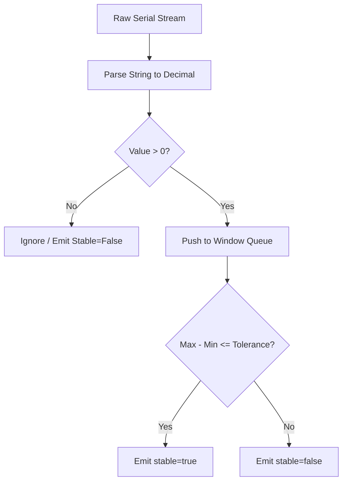

# PHASE 21: Scale integration

## Execution spec maturity

- **Mức hiện tại:** 88%
- **Đánh giá:** Đủ direction cho scale integration qua COM, ổn định số cân và fallback nhập tay.
- **Khi cần upgrade:** Upgrade khi có model cân thật, protocol frame và sai số thiết bị cụ thể.

## 1. Mục tiêu

Tích hợp thiết bị cân điện tử (kết nối qua cổng serial COM/RS-232) vào quy trình đóng gói Carton. Cung cấp cơ chế đọc cân tự động qua Local Agent, bộ lọc số liệu ổn định chống rung sai, và quy trình nhập cân tay dự phòng có kiểm duyệt chặt chẽ.

## 2. Phạm vi

### In scope

- Xây dựng module đọc cổng COM nối tiếp trong Local Agent (sử dụng thư viện `System.IO.Ports`).
- Thiết lập cấu hình tham số cổng nối tiếp: Port Name, Baud Rate, Parity, Data Bits, Stop Bits.
- Triển khai thuật toán xác định trọng lượng ổn định (Stable Weight Algorithm) dựa trên cửa sổ thời gian (Stable Window) và biên độ rung sai cho phép.
- Hỗ trợ các lệnh cơ bản: Zero (về 0) và Tare (trừ bì) gửi xuống cân hoặc xử lý giả lập phần mềm.
- Xây dựng API và giao diện ghi đè cân tay (Manual Weight Override) khi cân vật lý bị hỏng, yêu cầu bắt buộc Reason Code và audit log.

### Non-negotiable output

- Local Agent đọc và phân tích (parse) được luồng dữ liệu thô (raw data stream) từ cân điện tử thành số thực.
- Trình duyệt Web UI nhận được sự kiện thay đổi trọng lượng thời gian thực (`scale.weightChanged`) và trạng thái ổn định (`stable=true`).
- Bản ghi database lưu lịch sử ghi đè cân tay và lý do đi kèm.
- Không cho phép hoàn tất đóng gói nếu cân nặng chưa ổn định (trừ trường hợp ghi đè cân tay được duyệt).

## 3. Điều kiện đầu vào

### Readiness checklist

- Local Agent Foundation (Phase 20) đã cài đặt và ghép cặp thành công.
- Module đóng gói Carton (Phase 07) đã có API / UI cơ bản.

## 4. Setup

### Cấu trúc module đề xuất

- Local Agent module: `local-agent/Nexustock.LocalAgent/Devices/Scale/`
- Backend module: `backend/modules/scale_integration/`
- Frontend module: `frontend/features/scale_integration/`

### Permission seed đề xuất

- `scale.override`: Cho phép thủ kho ghi đè nhập cân nặng bằng tay.

## 5. Database

### Bảng ghi nhật ký ghi đè cân tay (`ManualWeightOverrides`)

| Tên cột | Kiểu dữ liệu | Nullable | Ràng buộc chính | Ý nghĩa |
|---|---|---|---|---|
| `id` | uuid | No | Primary Key | ID bản ghi |
| `tenantId` | varchar(50) | No | FK | Định danh tenant |
| `warehouseId` | uuid | No | FK | Định danh kho |
| `cartonNo` | varchar(50) | No | | Mã thùng carton liên quan |
| `scaleWeight` | decimal(18,4)| Yes | | Trọng lượng đọc được từ cân tại thời điểm lỗi |
| `manualWeight`| decimal(18,4)| No | | Trọng lượng do người dùng nhập tay |
| `reasonCode` | varchar(30) | No | FK | Mã lý do (ví dụ: `DEVICE_ERR`, `JITTER_IN_WIND`) |
| `note` | text | Yes | | Ghi chú thêm |
| `createdBy` | varchar(50) | No | | Tài khoản thực hiện ghi đè |
| `createdAt` | timestamp | No | | Thời gian ghi đè |

## 6. Backend/API

### 6.1 API ghi nhận nhập cân tay
- **Method & Path:** `POST /api/packing/weight/manual`
- **Permission:** `scale.override`
- **Request:**
  ```json
  {
    "warehouseId": "wh_hn_01",
    "cartonNo": "CTN-2026-0001",
    "manualWeight": 15.45,
    "reasonCode": "DEVICE_COMM_ERR",
    "note": "Cáp cân COM3 bị lỏng đầu nối, thủ kho cân bằng cân độc lập"
  }
  ```
- **Response (Success):** `{ "success": true, "overrideId": "uuid-9988" }`
- *Ghi chú:* Ghi đè thành công sẽ cập nhật trọng lượng thùng carton và ghi đè cờ `weightSource` từ `scaleCom` sang `manual`.

## 7. Frontend/RF/mobile

### Giao diện panel cân đóng gói (Weighing Panel UI)
- Hiển thị số cân lớn, màu xanh lá cây khi cân ổn định (`stable`), màu vàng khi số cân đang nhảy (`jitter/unstable`).
- Cung cấp nút bấm "Trừ bì" (Tare) và "Về không" (Zero).
- Khi có lỗi kết nối, hiển thị nút "Nhập cân tay". Bấm vào sẽ mở hộp thoại yêu cầu nhập số cân, chọn Reason Code (bắt buộc) từ danh mục đã seed.

## 8. Execution flow

### Thuật toán xác định cân ổn định (Stable Reading Algorithm)

1. Local Agent mở cổng serial (ví dụ: `COM3`, `9600,N,8,1`) và đọc luồng bytes.
2. Cắt chuỗi raw data dựa trên ký tự kết thúc dòng (thường là `\r` hoặc `\n`).
3. Dùng Regular Expression để lọc lấy phần số (ví dụ: chuỗi thô `ST,GS,+0012.35kg` -> parse thành `12.35`).
4. **Bộ lọc ổn định (Stable Filter Window):**
   - Agent duy trì một hàng đợi (Queue) chứa các giá trị đọc được trong khoảng thời gian `stableWindowMs` (mặc định 800ms).
   - Nếu chênh lệch giữa giá trị lớn nhất và nhỏ nhất trong Queue nhỏ hơn hoặc bằng `stableTolerance` (ví dụ: 0.02 kg), và giá trị cân lớn hơn 0:
     - Phát sự kiện WebSocket: `{ "weight": 12.35, "stable": true }`.
     - Nếu vượt quá biên độ rung sai: Phát sự kiện: `{ "weight": 12.38, "stable": false }`.



## 9. Validation & business rules

- **Chặn hoàn tất đóng gói:** Trình duyệt chỉ cho phép gửi lệnh hoàn tất carton khi nhận được gói tin có `stable: true` từ WebSocket, trừ khi người dùng đã kích hoạt thành công quyền ghi đè cân tay `scale.override`.
- **Reason Code bắt buộc:** Tác vụ ghi đè cân tay bắt buộc phải chọn mã lý do hợp lệ từ danh sách `ReasonCodes` (bảng dữ liệu nền Master Data) có loại `reasonType = 'SCALE_OVERRIDE'`.

## 10. Exception handling

- **Lỗi cổng COM đang bị mở (Port Busy):** Thử giải phóng và mở lại cổng COM. Nếu vẫn lỗi sau 3 lần, báo lỗi thiết bị về Web UI qua sự kiện `scale.connectionError` kèm mã lỗi cổng COM bị chiếm.
- **Dữ liệu thô lỗi định dạng (Unparseable data):** Nếu không parse được số thực quá 10 dòng liên tiếp, đánh dấu thiết bị ngoại vi trạng thái `error` và gửi thông báo kiểm tra cáp/tần số baudrate.

## 11. Observability

- Ghi log audit hành vi ghi đè cân tay gồm: người thực hiện, thời gian, mã carton, số cân thực nhập, lý do.
- KPI đề xuất: Tỷ lệ ghi đè cân tay trên tổng số lượt cân đóng gói (Reprint & Override KPI). Nếu tỷ lệ vượt quá 5% trong ngày, hệ thống gửi cảnh báo yêu cầu hiệu chuẩn lại cân.

## 12. Test plan

- **Unit Test:**
  - Viết test suite giả lập hàng đợi Queue số cân để kiểm thử thuật toán xác định ổn định.
- **Integration Test:**
  - API `/api/packing/weight/manual` từ chối request nếu gửi thiếu `reasonCode`.
  - API / API UI chặn đóng gói carton khi cân chưa gửi cờ `stable`.
- **Mock Test:**
  - Sử dụng phần mềm giả lập cổng COM ảo (như com0com) để gửi luồng ký tự thô và kiểm chứng Local Agent nhận diện đúng.

## 13. Acceptance criteria

- Local Agent kết nối và đọc ổn định số cân từ cân mô phỏng.
- Số cân hiển thị tức thời trên Web UI đóng gói, không có độ trễ cảm nhận (>500ms).
- Thao tác nhập cân tay ghi đầy đủ log audit vào bảng `ManualWeightOverrides` và được chặn quyền đúng.

