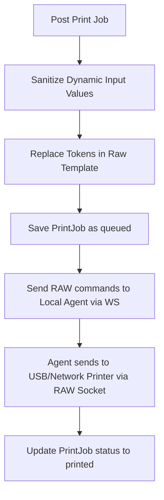

# PHASE 22: Label printing

## Execution spec maturity

- **Mức hiện tại:** 100%
- **Đánh giá:** Hoàn thành triển khai Phase 22: template ZPL/TSPL, job lifecycle, Local Agent printer adapter, WebSocket command contract, idempotency, reprint audit, security guard, frontend Print/Reprint flow và test gate đã pass.
- **Điều kiện duy trì:** Không khóa vào một model máy in duy nhất. Bắt buộc có mock printer/raw-output sink để test tự động; khi có máy in thật chỉ thêm printer profile/adapter, không đổi API/WebSocket contract đã khóa.
- **Phần còn mở có kiểm soát:** Kích thước tem thật, DPI, driver USB cụ thể và dialect vendor-specific sẽ cấu hình theo printer profile, không hardcode vào luồng nghiệp vụ.

## 1. Mục tiêu

Xây dựng hệ thống in ấn tem nhãn mã vạch (Zebra ZPL, TSC TSPL) tích hợp. Cung cấp API gửi lệnh in dạng biến số (template variable model), quản lý hàng đợi in (Print Queue) trong Local Agent, và quy trình kiểm soát chặt tác vụ in lại (Reprint Audit) phòng chống dán sai tem nhãn.

## 2. Phạm vi

### In scope

- Thiết lập quản lý mẫu tem nhãn (`LabelTemplates`) hỗ trợ mã thô ZPL (Zebra) và TSPL (TSC) chứa tham số động (ví dụ: `{{lotNo}}`, `{{itemCode}}`).
- Xây dựng hàng đợi in ấn (Print Queue) trên Local Agent để nhận lệnh và in tuần tự.
- Gửi lệnh in trực tiếp đến máy in USB local (RAW Print) hoặc máy in IP mạng qua cổng TCP raw socket (cổng 9100).
- Validate dữ liệu đầu vào chống chèn mã độc (ZPL/TSPL injection).
- Thiết lập quy trình in lại (Reprint Flow) bắt buộc liên kết với Print Job gốc và ghi nhận Reason Code.

### Non-negotiable output

- Thiết bị máy in nhận được lệnh in đúng định dạng thô (RAW data) và in ra tem nhãn sắc nét.
- Mỗi hành động in lại (Reprint) sinh ra một bản ghi mới liên kết với mã `originalPrintJobId`.
- Log audit in ghi nhận chi tiết: người thực hiện, lý do in lại, và trạm in.

## 3. Điều kiện đầu vào

### Readiness checklist

- Local Agent Foundation (Phase 20) đã hoạt động.
- Cấu hình thiết bị trạm (Station) đã được định nghĩa.

## 4. Setup

### Cấu trúc module đề xuất

- Backend module: `backend/modules/label_printing/`
- Frontend module: `frontend/features/label_printing/`
- Local Agent Device: `local-agent/Nexustock.LocalAgent/Devices/Printer/`

### Permission seed đề xuất

- `label_printing.print`: Thực hiện in tem nhãn.
- `label_printing.reprint`: Thực hiện in lại tem nhãn đã in.
- `label_printing.manage_templates`: Cập nhật mã ZPL/TSPL mẫu tem.

## 5. Database

### Bảng cấu hình mẫu tem (`LabelTemplates`)

| Tên cột | Kiểu dữ liệu | Nullable | Ràng buộc chính | Ý nghĩa |
|---|---|---|---|---|
| `id` | uuid | No | Primary Key | ID mẫu tem |
| `tenantId` | varchar(50) | No | FK | Định danh tenant |
| `templateCode` | varchar(50) | No | Unique per tenant | Mã mẫu tem (ví dụ: `LOT_LABEL_4X3`) |
| `name` | varchar(100) | No | | Tên mẫu tem nhãn |
| `language` | varchar(10) | No | | Ngôn ngữ máy in: `zpl`, `tspl` |
| `rawTemplate` | text | No | | Nội dung mã tem gốc chứa token động (ví dụ: `^FD{{lotNo}}^FS`) |
| `isActive` | boolean | No | Mặc định: true | Trạng thái hoạt động |

### Bảng hàng đợi và nhật ký lệnh in (`PrintJobs`)

| Tên cột | Kiểu dữ liệu | Nullable | Ràng buộc chính | Ý nghĩa |
|---|---|---|---|---|
| `id` | uuid | No | Primary Key | ID lệnh in |
| `tenantId` | varchar(50) | No | FK | Định danh tenant |
| `stationId` | uuid | No | FK | Trạm yêu cầu in |
| `printerCode` | varchar(50) | No | | Mã định danh máy in |
| `templateId` | uuid | No | FK | Mẫu tem áp dụng |
| `payloadJson` | text | No | | JSON chứa giá trị điền vào mẫu tem |
| `status` | varchar(20) | No | | Trạng thái in: `queued`, `sending`, `printed`, `failed` |
| `isReprint` | boolean | No | Mặc định: false | Cờ đánh dấu in lại |
| `originalPrintJobId`| uuid | Yes | FK | Liên kết đến lệnh in đầu tiên nếu là in lại |
| `reasonCode` | varchar(30) | Yes | FK | Mã lý do in lại |
| `errorMessage` | text | Yes | | Lỗi in nếu trạng thái là failed |
| `idempotencyKey`| varchar(100) | No | Unique per tenant | Khóa chống in lặp |
| `createdBy` | varchar(50) | No | | Người bấm in |
| `createdAt` | timestamp | No | | Thời gian in |

## 6. Backend/API

### 6.1 API gửi lệnh in mới
- **Method & Path:** `POST /api/printing/jobs`
- **Permission:** `label_printing.print`
- **Request:**
  ```json
  {
    "stationId": "uuid-station-01",
    "printerCode": "PRINTER-LOT-01",
    "templateCode": "LOT_LABEL_4X3",
    "payload": {
      "itemCode": "MILK-DRY-900",
      "itemName": "Sua bot Optimum 900g",
      "lotNo": "LOT-20260701-001",
      "qty": "12.0",
      "uomCode": "LON",
      "expiryDate": "2027-07-01"
    },
    "idempotencyKey": "idem_prn_20260701_9982"
  }
  ```
- **Response (Success):** `{ "printJobId": "uuid-job-8877", "status": "queued" }`

### 6.2 API yêu cầu in lại (Reprint Job)
- **Method & Path:** `POST /api/printing/jobs/{id}/reprint`
- **Permission:** `label_printing.reprint`
- **Request:**
  ```json
  {
    "reasonCode": "REPRINT_LABEL_DAMAGED",
    "note": "Tem bị rách góc trong quá trình dán vào pallet"
  }
  ```
- **Response (Success):** `{ "newPrintJobId": "uuid-job-9900", "status": "queued" }`
- *Ghi chú:* Backend nhân bản dữ liệu `payloadJson` từ job gốc sang job mới, set `isReprint = true`, gán `originalPrintJobId` và ghi nhận `reasonCode`.

## 7. Frontend/RF/mobile

- Khi bấm in, giao diện hiển thị trạng thái Spinner. Nếu lỗi thiết bị xảy ra, đổi icon máy in sang màu đỏ cảnh báo.
- Nút "In lại" (Reprint) chỉ hiển thị cho người dùng có quyền `label_printing.reprint`. Khi click, bắt buộc mở Dialog chọn lý do in lại (ví dụ: `Tem rách`, `Sai thông tin`, `Máy in kẹt giấy`) trước khi gửi lệnh.

## 8. Execution flow

### Quy trình điền giá trị mẫu tem nhãn an toàn (ZPL/TSPL Safe Interpolation)

1. Backend nhận `payload` dạng key-value.
2. **Lọc dữ liệu đầu vào (Sanitization):** Loại bỏ toàn bộ các ký tự điều khiển của ngôn ngữ máy in khỏi chuỗi input để tránh lỗi phá vỡ cú pháp nhãn.
   - Với ZPL: Loại bỏ hoặc mã hóa ký tự điều khiển `^` và `~`.
   - Với TSPL: Loại bỏ dấu nháy kép `"` và ký tự xuống dòng `\r\n`.
3. Backend thay thế các token mẫu (ví dụ: `{{lotNo}}` -> `LOT-2026-01`).
4. Gửi chuỗi mã RAW đã điền giá trị qua WebSocket cục bộ xuống Local Agent.
5. Local Agent nhận gói tin, mở kết nối RAW đến cổng USB máy in (qua Win32 Spooler API) hoặc kết nối TCP Socket cổng 9100 để đẩy mã RAW đi.



## 9. Validation & business rules

- **Chống in lại vô hạn:** Một Print Job gốc chỉ cho phép in lại tối đa 3 lần. Nếu vượt quá, hệ thống yêu cầu phê duyệt nâng cao từ Supervisor.
- **Idempotency Key:** API chặn in trùng lặp nếu nhận lại cùng một `idempotencyKey` trong vòng 10 phút.

## 10. Exception handling

| Nhóm lỗi | Nguyên nhân | Xử lý |
|---|---|---|
| Máy in kẹt giấy/Offline | Máy in hết giấy, lỏng cáp | Local Agent ghi nhận mã lỗi gửi qua WebSocket báo Web UI. Trạng thái Job cập nhật `failed`, hiển thị nút "Thử lại". |
| Chèn mã độc tem nhãn | Input chứa ký tự điều khiển `^XA` | Bộ lọc Backend loại bỏ ký tự điều khiển, thay thế bằng khoảng trắng để giữ an toàn cú pháp. |

## 11. Observability

- Ghi log audit Reprint: Ghi nhận ai yêu cầu in lại, in lại tem của đơn nào, lý do gì và tại máy trạm nào.
- KPI: Tỷ lệ in lỗi, tỷ lệ in lại (Reprint Rate) theo ngày.

## 12. Test plan

- **Unit Test:**
  - Logic thay thế token mẫu tem và bộ lọc ký tự đặc biệt (ZPL/TSPL injection prevention).
- **Integration Test:**
  - Gọi API reprint không có lý do -> Verify trả lỗi 400.
  - Gọi API print trùng `idempotencyKey` -> Verify trả về ID cũ, không tạo dòng in mới.

## 13. Acceptance criteria

- Local Agent nhận lệnh và in nhãn ZPL/TSPL ra máy in ảo/thực đúng định dạng thiết kế.
- Thao tác Reprint ghi nhận đầy đủ liên kết cha con và lý do in lại vào cơ sở dữ liệu.

## 14. rp1 execution readiness addendum

### 14.1 Decision lock

| Chủ đề | Quyết định Phase 22 | Lý do |
|---|---|---|
| Transport | Tái sử dụng Local Agent WebSocket Phase 20, không mở endpoint LAN mới | Giữ loopback-only, không tăng bề mặt tấn công |
| Printer abstraction | `IPrinterDevice` + 3 implementation: `MockPrinterDevice`, `TcpRawPrinterDevice`, `WindowsRawPrinterDevice` | Test được không cần máy in thật, hỗ trợ USB/Network |
| Template language | `LabelTemplate.language` chỉ nhận `zpl`, `tspl` | Khóa dialect tối thiểu, tránh sinh template tùy tiện |
| Template rendering | Backend render template và sanitize payload trước khi tạo job | Tránh browser tự gửi RAW command không kiểm soát |
| Job lifecycle | `queued -> sending -> printed/failed/cancelled` | Trạng thái đủ audit và retry an toàn |
| Idempotency | Unique per tenant theo `idempotencyKey`, trả lại job cũ nếu request lặp | Chống in trùng khi người dùng double-click hoặc retry mạng |
| Reprint | Reprint luôn tạo job mới, bắt buộc `originalPrintJobId`, `reasonCode`, giới hạn 3 lần/job gốc | Truy vết tem gốc và giảm rủi ro dán sai tem |
| Security | Print command sau paired mode bắt buộc HMAC guard Phase 20 | Browser không gửi command unsigned xuống Agent |
| Output test | Mock printer ghi raw output ra buffer/file test, không cần máy in thật | CI/dev kiểm chứng deterministic |

### 14.2 Backend implementation checklist

- [ ] Tạo module theo convention hiện tại: `backend/modules/Nexustock.Modules.LabelPrinting/` thay vì snake_case.
- [ ] Tạo bảng `LabelTemplates` với unique `(tenantId, templateCode)`.
- [ ] Tạo bảng `PrintJobs` với unique `(tenantId, idempotencyKey)` và self-FK `originalPrintJobId`.
- [ ] Seed permissions: `label_printing.print`, `label_printing.reprint`, `label_printing.manage_templates`.
- [ ] Seed reason codes nhóm `LABEL_REPRINT`: `LABEL_DAMAGED`, `PRINTER_JAM`, `WRONG_LABEL_APPLIED`, `SUPERVISOR_APPROVED`.
- [ ] API `POST /api/printing/jobs` validate template active, payload key whitelist, idempotency và permission `label_printing.print`.
- [ ] API `POST /api/printing/jobs/{id}/reprint` bắt buộc permission `label_printing.reprint`, reason code hợp lệ và giới hạn 3 lần/job gốc.
- [ ] DTO/response JSON bắt buộc camelCase: `printJobId`, `newPrintJobId`, `templateCode`, `printerCode`, `idempotencyKey`, `originalPrintJobId`.
- [ ] Không lưu token/secret Local Agent trong `PrintJobs`, audit log hoặc frontend state.

### 14.3 Template rendering and sanitization contract

Quy tắc render bắt buộc:

1. Chỉ thay token dạng `{{tokenName}}` với `tokenName` khớp regex `^[a-zA-Z][a-zA-Z0-9_]{0,49}$`.
2. Payload key không xuất hiện trong template bị bỏ qua hoặc trả lỗi cấu hình, không tự thêm RAW command.
3. Token trong template thiếu payload phải trả lỗi `printing.payload_missing`.
4. ZPL payload value phải loại bỏ hoặc thay thế ký tự điều khiển `^`, `~`, `\u001b`.
5. TSPL payload value phải loại bỏ hoặc thay thế dấu `"`, dòng mới `\r`, `\n`, ký tự ESC.
6. Raw template do admin nhập phải có maximum length cấu hình, mặc định 32KB.
7. Raw output sau render phải được lưu snapshot vào `PrintJobs.renderedCommandHash`, không lưu dư dữ liệu nhạy cảm.

Ví dụ output an toàn:

```zpl
^XA
^FO40,40^A0N,32,32^FD{{itemCode}}^FS
^FO40,90^BY2^BCN,80,Y,N,N^FD{{lotNo}}^FS
^XZ
```

### 14.4 Local Agent printer checklist

- [ ] Thêm thư mục `local-agent/Nexustock.LocalAgent/Devices/Printer/`.
- [ ] Thêm model cấu hình `PrinterDeviceConfig`: `enabled`, `mode`, `printerCode`, `printerName`, `host`, `port`, `language`, `writeTimeoutMs`, `mockOutputPath`.
- [ ] Thêm `IPrinterDevice` với hàm tối thiểu: `PrintAsync`, `GetStatusAsync`.
- [ ] Thêm `MockPrinterDevice` lưu raw command để verify ZPL/TSPL trong test.
- [ ] Thêm `TcpRawPrinterDevice` gửi byte UTF-8/ASCII qua socket TCP port `9100`.
- [ ] Thêm `WindowsRawPrinterDevice` dùng Windows spooler RAW print cho máy in USB/local.
- [ ] Thêm queue xử lý tuần tự trong Agent, không gửi song song nhiều job vào cùng printerCode.
- [ ] Thêm retry có giới hạn cho lỗi transient, không retry vô hạn gây in trùng.

### 14.5 WebSocket command contract

Request từ Web UI/backend bridge xuống Local Agent:

```json
{
  "messageId": "uuid",
  "type": "printer.print.request",
  "timestamp": "2026-07-16T11:30:00Z",
  "payload": {
    "printJobId": "uuid-job-8877",
    "printerCode": "PRINTER-LOT-01",
    "language": "zpl",
    "rawCommand": "^XA^FO40,40^FDLOT-001^FS^XZ",
    "copies": 1
  },
  "signature": "hmac-sha256"
}
```

Success response:

```json
{
  "messageId": "uuid",
  "type": "printer.print.response",
  "timestamp": "2026-07-16T11:30:01Z",
  "payload": {
    "printJobId": "uuid-job-8877",
    "printerCode": "PRINTER-LOT-01",
    "status": "printed",
    "durationMs": 180
  }
}
```

Error payload chuẩn:

| Code | Khi dùng | UI action |
|---|---|---|
| `printer.offline` | Máy in không sẵn sàng hoặc không tìm thấy | Hiển thị hướng dẫn kiểm tra nguồn/cáp |
| `printer.paper_out` | Hết giấy hoặc sensor báo thiếu giấy | Chặn retry tự động, yêu cầu thay giấy |
| `printer.port_busy` | Spooler/socket đang bận | Cho retry sau delay ngắn |
| `printer.command_rejected` | Raw command vượt giới hạn hoặc language sai | Báo lỗi template, không gửi lại |
| `printer.timeout` | Gửi lệnh quá timeout | Đánh dấu failed, cho retry có kiểm soát |
| `printer.unsigned_command` | Command thiếu/chữ ký sai | Chặn tuyệt đối trong paired mode |

### 14.6 Frontend implementation checklist

- [ ] Thêm trang quản lý template tem, chỉ hiển thị cho quyền `label_printing.manage_templates`.
- [ ] Thêm nút Print/Reprint tại các flow cần in nhãn: receiving Lot, packing carton, LPN/pallet.
- [ ] Dialog Print hiển thị template, printerCode, số bản in, trạng thái queue và lỗi thiết bị.
- [ ] Dialog Reprint bắt buộc chọn reason code nhóm `LABEL_REPRINT`, nhập note nếu lý do là sai tem/dán nhầm.
- [ ] Không cho browser tự sửa raw ZPL/TSPL khi gửi job thường; raw template chỉ quản lý trong màn hình template có quyền riêng.
- [ ] UI trạng thái rõ: `queued`, `sending`, `printed`, `failed`.

### 14.7 Test gate bắt buộc trước khi cập nhật hoàn thành

```powershell
dotnet build local-agent/Nexustock.LocalAgent/Nexustock.LocalAgent.csproj --no-restore
dotnet build backend/Nexustock.Api/Nexustock.Api.csproj --no-restore
powershell -ExecutionPolicy Bypass -File tests/verify_label_template_rendering.ps1
powershell -ExecutionPolicy Bypass -File tests/verify_label_printing_websocket.ps1
powershell -ExecutionPolicy Bypass -File tests/verify_label_reprint_audit.ps1
npm run lint --prefix frontend -- --max-warnings 0
```

Acceptance test tối thiểu:

- Template renderer thay token đúng và reject token thiếu payload.
- ZPL sanitizer chặn ký tự `^`, `~`, ESC trong payload user nhập.
- TSPL sanitizer chặn dấu nháy kép, newline và ESC trong payload user nhập.
- Idempotency trả lại job cũ khi gửi trùng key, không tạo job mới.
- Reprint thiếu reason code bị từ chối.
- Reprint vượt 3 lần/job gốc bị từ chối hoặc yêu cầu quyền supervisor nếu được cấu hình.
- Mock printer nhận raw command đúng language và lưu output để verify.
- Unsigned `printer.print.request` bị chặn trong paired mode.
- Frontend lint strict pass 0 warnings.

### 14.8 Execution order đề xuất

1. Viết renderer/sanitizer pure logic trước, kèm test nhanh.
2. Thêm backend DB/API/idempotency/reprint audit.
3. Thêm mock printer device và WebSocket command contract trong Local Agent.
4. Thêm TCP/Windows RAW adapter sau khi mock pass.
5. Gắn UI print/reprint vào receiving, packing hoặc LPN theo điểm dùng đầu tiên.
6. Chạy full validation và chỉ cập nhật roadmap khi pass.

## 15. Rollout plan

### 15.1 Dev rollout

1. Bật `MockPrinterDevice` mặc định cho môi trường dev.
2. Chạy renderer/sanitizer tests bằng template fixture, không cần máy in thật.
3. Kết nối Web UI với Local Agent mock mode qua loopback WebSocket.
4. Xác minh print/reprint API ghi DB và audit đúng quyền.

### 15.2 Pilot rollout

1. Cấu hình 1 trạm in pilot với máy in thật Zebra/TSC.
2. In song song nhãn test và đối chiếu barcode scan được bằng RF/mobile.
3. Ghi nhận tỷ lệ failed/reprint trong 1 ca vận hành.
4. Chỉ mở rộng khi barcode scan pass và tỷ lệ reprint nằm dưới ngưỡng vận hành đã chốt.

### 15.3 Production rollout

- Rollout theo warehouse/station/printerCode, không bật toàn hệ thống một lần.
- Mỗi station phải có `printerProfile`, `printerCode`, driver/host và người phụ trách kiểm tra giấy/mực.
- Giữ khả năng in lại có kiểm soát trong 2 tuần đầu sau go-live.

## 16. Rollback plan

### 16.1 Rollback kỹ thuật

- Tắt `PrinterDeviceConfig.enabled` trên Local Agent để dừng gửi lệnh in tự động.
- Web UI giữ trạng thái job `queued/failed`, không tự tạo reprint hàng loạt.
- Không xóa bảng `PrintJobs`; giữ audit trail phục vụ đối soát.

### 16.2 Rollback nghiệp vụ

- Nếu printer adapter lỗi hàng loạt, vận hành chuyển sang in tem từ công cụ vendor nhưng vẫn tạo PrintJob audit trong hệ thống.
- Nếu template sai, disable `LabelTemplates.isActive` và rollback template version trước.
- Nếu barcode scan lỗi, dừng rollout station đó và kiểm tra lại DPI/size/profile.

### 16.3 Điều kiện rollback

- Tỷ lệ `printer.command_rejected` vượt 2% trong 1 ca.
- Tỷ lệ reprint vượt 5% tổng lượt in/ngày.
- Có nhãn sai thông tin gây dán nhầm carton/LPN/Lot.

## 17. Operational runbook

### 17.1 Checklist xử lý sự cố tại trạm

| Tình huống | Kiểm tra nhanh | Hành động |
|---|---|---|
| Không in | Nguồn, cáp USB/LAN, printerCode, spooler | Restart Local Agent, kiểm tra Windows printer hoặc IP printer |
| In ra ký tự lạ | Sai language ZPL/TSPL hoặc encoding | Chọn đúng template language/profile |
| Barcode không scan | DPI, kích thước tem, quiet zone, chất lượng ribbon | Điều chỉnh template/profile, in test lại |
| In trùng | Idempotency key, retry UI, double-click | Kiểm tra job gốc, không reprint nếu thiếu reason |
| Kẹt giấy/hết giấy | Sensor máy in, cuộn tem, ribbon | Thay giấy/ribbon, retry job failed |
| Web UI không kết nối | Local Agent port, Origin allowlist, pairing status | Pairing lại station hoặc kiểm tra WebSocket Phase 20 |

### 17.2 Monitoring/KPI

- `printer.print.response` latency p95 dưới 2 giây với mock/TCP local.
- Tỷ lệ print failed/ngày dưới 2%.
- Tỷ lệ reprint/ngày dưới 5%.
- Mọi reprint phải có `reasonCode`, `createdBy`, `createdAt`, `originalPrintJobId`.
- Cảnh báo nếu một user tạo reprint bất thường so với trung bình kho.

## 18. Completion evidence

### 18.1 Gate đã chạy

| Gate | Kết quả | Bằng chứng |
|---|:---:|---|
| Renderer/sanitizer pure tests | ✅ Pass | `tests/verify_label_template_rendering.ps1` |
| Local Agent printer WebSocket E2E | ✅ Pass | `tests/verify_label_printing_websocket.ps1` khởi chạy Agent test mode, gửi `printer.print.request`, kiểm tra mock output |
| Reprint audit contract | ✅ Pass | `tests/verify_label_reprint_audit.ps1` kiểm tra reason codes, giới hạn reprint, link job gốc và idempotency |
| Frontend lint | ✅ Pass | `npm run lint` trong `frontend` |
| Diff hygiene | ✅ Pass | `git diff --check` chỉ còn cảnh báo CRLF line ending, không còn whitespace error |

### 18.2 Kết quả triển khai

- Backend Label Printing module đã có API tạo print job và reprint job.
- Master Data đã seed reason codes nhóm `LABEL_REPRINT`.
- Local Agent đã có printer device abstraction, mock printer, queue và WebSocket `printer.print.request`.
- HMAC guard production vẫn bắt buộc; bypass chỉ tồn tại khi bật đồng thời test config và biến môi trường test mode cục bộ.
- Frontend đã có printing types, API helper, Local Agent printer hook, `PrintLabelDialog`, `ReprintLabelDialog` và tích hợp sau khi đóng gói thành công.
- Hardware pilot máy in thật không bắt buộc cho DoD dev; mock output E2E là gate bắt buộc.

## 19. Definition of done

### 19.1 Technical DoD

- Local Agent build pass.
- Backend API build pass.
- Renderer/sanitizer tests pass.
- WebSocket mock printer integration pass.
- TCP/Windows RAW adapter chạy được với mock sink hoặc printer pilot.
- HMAC guard chặn mọi command print unsigned trong paired mode.
- Không lưu token/secret Local Agent trong browser, DB job hoặc log.

### 19.2 Business DoD

- Print job tạo đúng từ template active, có idempotency và trạng thái rõ.
- Reprint bắt buộc quyền `label_printing.reprint` và reason code nhóm `LABEL_REPRINT`.
- Reprint liên kết job gốc và giới hạn số lần theo rule.
- Audit log đủ thông tin người thực hiện, thời gian, station, printer, template, job gốc nếu có.
- Người vận hành có runbook xử lý lỗi in phổ biến.

### 19.3 Documentation DoD

- [IMPLEMENTATION_PLAN.md](file:///d:/1_Project/48_Nexustock/planning/IMPLEMENTATION_PLAN.md) đã được cập nhật Phase 22 hoàn thành sau khi test gate pass 100%.
- Tài liệu hướng dẫn end-user cho Print/Reprint phải có ảnh hoặc walkthrough khi triển khai UI xong.
- Nếu có profile máy in thật mới, cập nhật raw-template fixture và printer profile mapping vào tài liệu vận hành.

