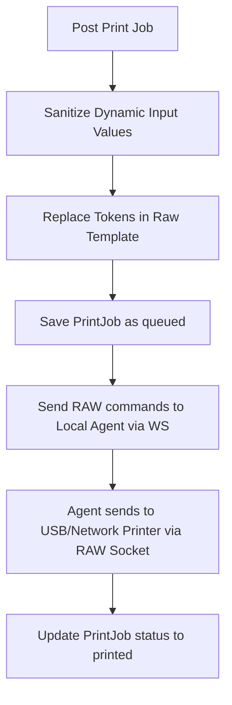

# PHASE 22: Label printing

## Execution spec maturity

- **Mức hiện tại:** 88%
- **Đánh giá:** Đủ direction cho label printing, ZPL/TSPL, print job và reprint audit.
- **Khi cần upgrade:** Upgrade khi chốt model máy in, template tem thật và rule reprint theo vận hành.

## 1. Mục tiêu

Xây dựng hệ thống in ấn tem nhãn mã vạch (Zebra ZPL, TSC TSPL) tích hợp. Cung cấp API gửi lệnh in dạng biến số (template variable model), quản lý hàng đợi in (Print Queue) trong Local Agent, và quy trình kiểm soát chặt tác vụ in lại (Reprint Audit) phòng chống dán sai tem nhãn.

## 2. Phạm vi

### In scope

- Thiết lập quản lý mẫu tem nhãn (`LabelTemplates`) hỗ trợ mã thô ZPL (Zebra) và TSPL (TSC) chứa tham số động (ví dụ: `{{lotNo}}`, `{{itemCode}}`).
- Xây dựng hàng đợi in ấn (Print Queue) trên Local Agent để nhận lệnh và in tuần tự.
- Gửi lệnh in trực tiếp đến máy in USB local (RAW Print) hoặc máy in IP mạng qua cổng TCP raw socket (cổng 9100).
- Validate dữ liệu đầu vào chống chèn mã độc (ZPL/TSPL injection).
- Thiết lập quy trình in lại (Reprint Flow) bắt buộc liên kết với Print Job gốc và ghi nhận Reason Code.

### Non-negotiable output

- Thiết bị máy in nhận được lệnh in đúng định dạng thô (RAW data) và in ra tem nhãn sắc nét.
- Mỗi hành động in lại (Reprint) sinh ra một bản ghi mới liên kết với mã `originalPrintJobId`.
- Log audit in ghi nhận chi tiết: người thực hiện, lý do in lại, và trạm in.

## 3. Điều kiện đầu vào

### Readiness checklist

- Local Agent Foundation (Phase 20) đã hoạt động.
- Cấu hình thiết bị trạm (Station) đã được định nghĩa.

## 4. Setup

### Cấu trúc module đề xuất

- Backend module: `backend/modules/label_printing/`
- Frontend module: `frontend/features/label_printing/`
- Local Agent Device: `local-agent/Nexustock.LocalAgent/Devices/Printer/`

### Permission seed đề xuất

- `label_printing.print`: Thực hiện in tem nhãn.
- `label_printing.reprint`: Thực hiện in lại tem nhãn đã in.
- `label_printing.manage_templates`: Cập nhật mã ZPL/TSPL mẫu tem.

## 5. Database

### Bảng cấu hình mẫu tem (`LabelTemplates`)

| Tên cột | Kiểu dữ liệu | Nullable | Ràng buộc chính | Ý nghĩa |
|---|---|---|---|---|
| `id` | uuid | No | Primary Key | ID mẫu tem |
| `tenantId` | varchar(50) | No | FK | Định danh tenant |
| `templateCode` | varchar(50) | No | Unique per tenant | Mã mẫu tem (ví dụ: `LOT_LABEL_4X3`) |
| `name` | varchar(100) | No | | Tên mẫu tem nhãn |
| `language` | varchar(10) | No | | Ngôn ngữ máy in: `zpl`, `tspl` |
| `rawTemplate` | text | No | | Nội dung mã tem gốc chứa token động (ví dụ: `^FD{{lotNo}}^FS`) |
| `isActive` | boolean | No | Mặc định: true | Trạng thái hoạt động |

### Bảng hàng đợi và nhật ký lệnh in (`PrintJobs`)

| Tên cột | Kiểu dữ liệu | Nullable | Ràng buộc chính | Ý nghĩa |
|---|---|---|---|---|
| `id` | uuid | No | Primary Key | ID lệnh in |
| `tenantId` | varchar(50) | No | FK | Định danh tenant |
| `stationId` | uuid | No | FK | Trạm yêu cầu in |
| `printerCode` | varchar(50) | No | | Mã định danh máy in |
| `templateId` | uuid | No | FK | Mẫu tem áp dụng |
| `payloadJson` | text | No | | JSON chứa giá trị điền vào mẫu tem |
| `status` | varchar(20) | No | | Trạng thái in: `queued`, `sending`, `printed`, `failed` |
| `isReprint` | boolean | No | Mặc định: false | Cờ đánh dấu in lại |
| `originalPrintJobId`| uuid | Yes | FK | Liên kết đến lệnh in đầu tiên nếu là in lại |
| `reasonCode` | varchar(30) | Yes | FK | Mã lý do in lại |
| `errorMessage` | text | Yes | | Lỗi in nếu trạng thái là failed |
| `idempotencyKey`| varchar(100) | No | Unique per tenant | Khóa chống in lặp |
| `createdBy` | varchar(50) | No | | Người bấm in |
| `createdAt` | timestamp | No | | Thời gian in |

## 6. Backend/API

### 6.1 API gửi lệnh in mới
- **Method & Path:** `POST /api/printing/jobs`
- **Permission:** `label_printing.print`
- **Request:**
  ```json
  {
    "stationId": "uuid-station-01",
    "printerCode": "PRINTER-LOT-01",
    "templateCode": "LOT_LABEL_4X3",
    "payload": {
      "itemCode": "MILK-DRY-900",
      "itemName": "Sua bot Optimum 900g",
      "lotNo": "LOT-20260701-001",
      "qty": "12.0",
      "uomCode": "LON",
      "expiryDate": "2027-07-01"
    },
    "idempotencyKey": "idem_prn_20260701_9982"
  }
  ```
- **Response (Success):** `{ "printJobId": "uuid-job-8877", "status": "queued" }`

### 6.2 API yêu cầu in lại (Reprint Job)
- **Method & Path:** `POST /api/printing/jobs/{id}/reprint`
- **Permission:** `label_printing.reprint`
- **Request:**
  ```json
  {
    "reasonCode": "REPRINT_LABEL_DAMAGED",
    "note": "Tem bị rách góc trong quá trình dán vào pallet"
  }
  ```
- **Response (Success):** `{ "newPrintJobId": "uuid-job-9900", "status": "queued" }`
- *Ghi chú:* Backend nhân bản dữ liệu `payloadJson` từ job gốc sang job mới, set `isReprint = true`, gán `originalPrintJobId` và ghi nhận `reasonCode`.

## 7. Frontend/RF/mobile

- Khi bấm in, giao diện hiển thị trạng thái Spinner. Nếu lỗi thiết bị xảy ra, đổi icon máy in sang màu đỏ cảnh báo.
- Nút "In lại" (Reprint) chỉ hiển thị cho người dùng có quyền `label_printing.reprint`. Khi click, bắt buộc mở Dialog chọn lý do in lại (ví dụ: `Tem rách`, `Sai thông tin`, `Máy in kẹt giấy`) trước khi gửi lệnh.

## 8. Execution flow

### Quy trình điền giá trị mẫu tem nhãn an toàn (ZPL/TSPL Safe Interpolation)

1. Backend nhận `payload` dạng key-value.
2. **Lọc dữ liệu đầu vào (Sanitization):** Loại bỏ toàn bộ các ký tự điều khiển của ngôn ngữ máy in khỏi chuỗi input để tránh lỗi phá vỡ cú pháp nhãn.
   - Với ZPL: Loại bỏ hoặc mã hóa ký tự điều khiển `^` và `~`.
   - Với TSPL: Loại bỏ dấu nháy kép `"` và ký tự xuống dòng `\r\n`.
3. Backend thay thế các token mẫu (ví dụ: `{{lotNo}}` -> `LOT-2026-01`).
4. Gửi chuỗi mã RAW đã điền giá trị qua WebSocket cục bộ xuống Local Agent.
5. Local Agent nhận gói tin, mở kết nối RAW đến cổng USB máy in (qua Win32 Spooler API) hoặc kết nối TCP Socket cổng 9100 để đẩy mã RAW đi.



## 9. Validation & business rules

- **Chống in lại vô hạn:** Một Print Job gốc chỉ cho phép in lại tối đa 3 lần. Nếu vượt quá, hệ thống yêu cầu phê duyệt nâng cao từ Supervisor.
- **Idempotency Key:** API chặn in trùng lặp nếu nhận lại cùng một `idempotencyKey` trong vòng 10 phút.

## 10. Exception handling

| Nhóm lỗi | Nguyên nhân | Xử lý |
|---|---|---|
| Máy in kẹt giấy/Offline | Máy in hết giấy, lỏng cáp | Local Agent ghi nhận mã lỗi gửi qua WebSocket báo Web UI. Trạng thái Job cập nhật `failed`, hiển thị nút "Thử lại". |
| Chèn mã độc tem nhãn | Input chứa ký tự điều khiển `^XA` | Bộ lọc Backend loại bỏ ký tự điều khiển, thay thế bằng khoảng trắng để giữ an toàn cú pháp. |

## 11. Observability

- Ghi log audit Reprint: Ghi nhận ai yêu cầu in lại, in lại tem của đơn nào, lý do gì và tại máy trạm nào.
- KPI: Tỷ lệ in lỗi, tỷ lệ in lại (Reprint Rate) theo ngày.

## 12. Test plan

- **Unit Test:**
  - Logic thay thế token mẫu tem và bộ lọc ký tự đặc biệt (ZPL/TSPL injection prevention).
- **Integration Test:**
  - Gọi API reprint không có lý do -> Verify trả lỗi 400.
  - Gọi API print trùng `idempotencyKey` -> Verify trả về ID cũ, không tạo dòng in mới.

## 13. Acceptance criteria

- Local Agent nhận lệnh và in nhãn ZPL/TSPL ra máy in ảo/thực đúng định dạng thiết kế.
- Thao tác Reprint ghi nhận đầy đủ liên kết cha con và lý do in lại vào cơ sở dữ liệu.

