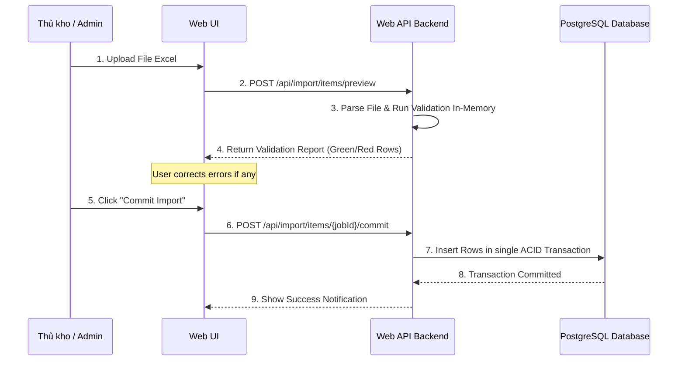

# PHASE 23: ERP/WMS legacy contract

## Execution spec maturity

- **Mức hiện tại:** 95%
- **Đánh giá rp1:** Đủ chuẩn để bắt đầu triển khai Phase 23 theo hướng contract-first. Contract API, idempotency, mapping, import preview/commit, audit/trace, security và verification gates đã rõ.
- **Điểm khóa trước khi code:** Giữ nguyên giả định SAP sandbox/mock theo [erp_mock_payloads.md](file:///d:/1_Project/48_Nexustock/planning/enterprise/erp_mock_payloads.md). Khi có tài liệu SAP thật, chỉ cập nhật bảng mapping alias và sample payload, không đổi invariant idempotency/payload hash.
- **Boundary:** Phase 23 chỉ xử lý inbound import/order contract, mapping và import/export thủ công. Retry, DLQ, replay và webhook worker triển khai sâu ở Phase 24 theo [ADR 0005](file:///d:/1_Project/48_Nexustock/planning/enterprise/adr/0005-integration-reliability-model.md).

## 1. Mục tiêu

Thiết lập các giao thức truyền nhận dữ liệu (API Contract) chuẩn hóa và cơ chế nhập/xuất dữ liệu (Import/Export Wizard) tích hợp để liên kết Nexustock WMS với hệ thống ERP hiện tại (như SAP, Oracle, Odoo) hoặc hệ thống quản lý kho cũ (Legacy WMS).

## 2. Phạm vi

### In scope

- Xây dựng API tích hợp (Integration API) nhận đơn PO/SO từ ERP.
- Triển khai cơ chế kiểm tra tính trùng lặp dữ liệu tích hợp thông qua `Idempotency-Key` và đối chiếu Payload Hash.
- Thiết lập cơ chế import dữ liệu lớn bằng Excel/CSV qua luồng 2 bước: Preview lỗi (không ghi DB) và Commit an toàn (Atomic Batch Commit).
- Viết adapter ánh xạ (mapping) mã vật tư, mã kho, mã đối tác giữa ERP và WMS, đồng thời xuất báo cáo lỗi ánh xạ chi tiết (Mapping Error Report).
- Quản lý phiên bản hợp đồng dữ liệu tích hợp (Contract Versioning: `v1.0`, `v1.1`, vv).

### Non-negotiable output

- API Endpoint nhận đơn từ ERP trả về response đồng bộ ngay lập tức chứa trạng thái tiếp nhận và `traceId`.
- Giao diện Import Wizard cho phép kéo thả file Excel, hiển thị bảng preview phân loại dòng hợp lệ/dòng lỗi rõ ràng trước khi ghi.
- Bản ghi log tích hợp lưu đầy đủ payload gửi/nhận, trạng thái xử lý, trace ID để hỗ trợ L1/L2 support đối soát.

## 3. Điều kiện đầu vào

### Readiness checklist

- Module Inbound receiving (Phase 04) và Outbound picking (Phase 07) đã hoàn tất.
- Danh mục lỗi chuẩn và Exception framework (Phase 10) hoạt động tốt.

## 4. Setup

### Cấu trúc module đề xuất

- Backend module: `backend/modules/Nexustock.Modules.ErpIntegration/` (Controllers, DTOs, mapping services, import/export engine, persistence).
- API host registration: `backend/Nexustock.Api/Program.cs` đăng ký module, DbContext, permission seed và middleware trace.
- Frontend feature: `frontend/src/features/erp-integration/` gồm API client, types, import wizard và integration dashboard.
- Admin routes đề xuất:
  - `/admin/integrations/messages`: theo dõi log tin nhắn tích hợp.
  - `/admin/integrations/import`: import wizard preview/commit.
  - `/admin/integrations/mappings`: cấu hình alias ERP -> WMS.

### Permission seed đề xuất

- `integration.view`: Xem log tích hợp và trạng thái đồng bộ đơn hàng.
- `integration.import`: Thực hiện import dữ liệu thủ công từ file Excel.
- `integration.export`: Xuất dữ liệu tồn kho, danh mục để đồng bộ thủ công.

## 5. Database

### Bảng ghi log tin nhắn tích hợp (`IntegrationMessages`)

| Tên cột | Kiểu dữ liệu | Nullable | Ràng buộc chính | Ý nghĩa |
|---|---|---|---|---|
| `id` | uuid | No | Primary Key | ID log |
| `tenantId` | varchar(50) | No | FK | Định danh tenant |
| `idempotencyKey`| varchar(100) | No | Unique per tenant + message type | Khóa chống trùng |
| `payloadHash` | varchar(64) | No | Index | Hash SHA-256 của payload body canonical JSON |
| `externalSystem`| varchar(50) | No | Index | Tên hệ thống gửi, ví dụ `SAP-ERP` |
| `externalReference` | varchar(100) | No | Index | Mã chứng từ ERP, ví dụ `EBELN` hoặc `VBELN` |
| `contractVersion` | varchar(20) | No | | Phiên bản contract đã dùng |
| `direction` | varchar(10) | No | Check | Chiều tin nhắn: `inbound`, `outbound` |
| `messageType` | varchar(50) | No | Index | Loại tin: `purchaseOrder`, `salesOrder`, `stockUpdate` |
| `payload` | text | No | | JSON payload gốc để audit/đối soát |
| `responsePayload` | text | Yes | | JSON response đã trả cho idempotent replay |
| `status` | varchar(20) | No | Index | Trạng thái: `accepted`, `failed`, `conflict` |
| `errorCode` | varchar(100) | Yes | Index | Mã lỗi chuẩn |
| `errorMessage` | text | Yes | | Chi tiết lỗi hệ thống |
| `traceId` | varchar(50) | No | Index | Trace ID của request |
| `createdAt` | timestamp | No | | Thời gian ghi nhận |
| `updatedAt` | timestamp | No | | Thời gian cập nhật cuối |

### Bảng ánh xạ dữ liệu tích hợp (`IntegrationMappings`)

| Tên cột | Kiểu dữ liệu | Nullable | Ràng buộc chính | Ý nghĩa |
|---|---|---|---|---|
| `id` | uuid | No | Primary Key | ID mapping |
| `tenantId` | varchar(50) | No | FK | Định danh tenant |
| `externalSystem` | varchar(50) | No | Unique group | Hệ thống ngoài |
| `mappingType` | varchar(30) | No | Unique group | `item`, `warehouse`, `partner`, `uom` |
| `externalCode` | varchar(100) | No | Unique group | Mã ERP/SAP |
| `internalCode` | varchar(100) | No | Index | Mã trong WMS |
| `status` | varchar(20) | No | Index | `active`, `inactive` |
| `createdAt` | timestamp | No | | Thời gian tạo |
| `updatedAt` | timestamp | No | | Thời gian cập nhật |

### Bảng phiên import (`IntegrationImportJobs`)

| Tên cột | Kiểu dữ liệu | Nullable | Ràng buộc chính | Ý nghĩa |
|---|---|---|---|---|
| `id` | uuid | No | Primary Key | ID phiên import |
| `tenantId` | varchar(50) | No | FK | Định danh tenant |
| `importType` | varchar(50) | No | Index | `items`, `mappings`, `inboundOrders` |
| `fileName` | varchar(255) | No | | Tên file gốc |
| `status` | varchar(20) | No | Index | `previewed`, `committed`, `failed`, `expired` |
| `totalRows` | integer | No | | Tổng dòng |
| `validRows` | integer | No | | Dòng hợp lệ |
| `errorRows` | integer | No | | Dòng lỗi |
| `previewPayload` | text | No | | JSON preview để commit lại không cần đọc file |
| `traceId` | varchar(50) | No | Index | Trace ID phiên import |
| `createdAt` | timestamp | No | | Thời gian preview |
| `expiresAt` | timestamp | No | | Thời điểm hết hạn preview |

## 6. Backend/API

### 6.1 Giao thức đồng bộ Đơn Nhập kho (`POST /api/integration/inbound-orders`)
- **Yêu cầu:** Header `Idempotency-Key` bắt buộc. Header `X-Contract-Version` (mặc định `v1.1`).
- **Quy tắc xử lý:**
  1. Tính hash SHA-256 của JSON body. Đối chiếu `idempotencyKey` trong bảng `IntegrationMessages`.
  2. Nếu trùng key và trùng hash: Trả về kết quả đã xử lý trước đó (HTTP 200).
  3. Nếu trùng key nhưng khác hash: Trả lỗi `409 Conflict` (idempotency key đã dùng cho dữ liệu khác).
  4. Nếu là key mới: Validate định dạng, ánh xạ mã sản phẩm từ hệ thống cũ sang mã của Nexustock. Nếu hợp lệ, lưu DB và trả về `201 Created`.

### 6.2 API Import Wizard (Preview & Commit)
- **POST `/api/import/{type}/preview`**: Nhận file Excel, chạy qua bộ lọc validation, trả về danh sách dòng lỗi mà không ghi DB.
- **POST `/api/import/{importJobId}/commit`**: Chỉ khi 100% dòng trong Preview hợp lệ, cho phép gửi lệnh Commit để ghi nhận dữ liệu chính thức vào DB dưới một Database Transaction duy nhất.

### 6.3 Mẫu Mock Payload SAP BAPI Inbound Order (Nhận PO từ SAP)

**API Endpoint:** `POST /api/integration/inbound-orders`

```json
{
  "integrationHeader": {
    "externalSystem": "SAP-ERP",
    "externalReference": "PO-2026-99881",
    "contractVersion": "v1.1",
    "idempotencyKey": "idem_po_99881_20260701_001",
    "timestamp": "2026-07-01T09:00:00Z"
  },
  "inboundOrder": {
    "tenantId": "tenant_nexustock_demo",
    "WERKS": "wh_hn_01",
    "EBELN": "PO-2026-99881",
    "LIFNR": "SUPPLIER-MILK-VN",
    "orderDate": "2026-07-01",
    "expectedArrivalDate": "2026-07-03",
    "items": [
      {
        "EBELP": 10,
        "MATNR": "SAP-MILK-DRY-900",
        "expectedQty": 120.000000,
        "MEINS": "LON"
      },
      {
        "EBELP": 20,
        "MATNR": "SAP-MILK-FRSH-180",
        "expectedQty": 480.000000,
        "MEINS": "HOP"
      }
    ]
  }
}
```

### 6.4 Mẫu Mock Payload SAP BAPI Goods Receipt Confirmation (Webhook xuất từ WMS sang SAP)

**Webhook Endpoint đăng ký bởi SAP (WMS gọi đi):** `POST https://sap-gateway.nexustock.vn/sap/bc/srt/rfc/sap/z_wms_goods_receipt`

```json
{
  "webhookHeader": {
    "event": "shipment.confirmed",
    "deliveryId": "dlv_ship_001hxy762",
    "timestamp": "2026-07-01T15:30:22Z"
  },
  "payload": {
    "tenantId": "tenant_nexustock_demo",
    "WERKS": "wh_hn_01",
    "MBLNR": "GR-2026-11223",
    "EBELN": "PO-2026-99881",
    "shippedAt": "2026-07-01T15:29:45Z",
    "details": [
      {
        "EBELP": 10,
        "MATNR": "SAP-MILK-DRY-900",
        "shippedQty": 120.000000,
        "MEINS": "LON",
        "CHARG": "LOT-26A-01"
      },
      {
        "EBELP": 20,
        "MATNR": "SAP-MILK-FRSH-180",
        "shippedQty": 480.000000,
        "MEINS": "HOP",
        "CHARG": "LOT-26F-01"
      }
    ]
  }
}
```

## 7. Frontend/RF/mobile

- **Giao diện Import Wizard:** Gồm 3 bước:
  1. Chọn và tải tệp tin (Excel/CSV).
  2. Xem trước dữ liệu (Preview): Dòng lỗi được tô màu đỏ và hiển thị nguyên nhân lỗi (ví dụ: "Mã Item không tồn tại", "Số lượng không được âm").
  3. Bấm nút "Lưu vào hệ thống" (chỉ kích hoạt khi không còn lỗi).
- **Dashboard giám sát tích hợp:** Hiển thị danh sách các tin nhắn tích hợp gần nhất, hỗ trợ lọc theo trạng thái (Thành công, Thất bại) và tìm kiếm theo `traceId` hoặc mã đơn hàng ERP.

## 8. Execution flow

### Quy trình Nhập dữ liệu 2 bước (Import Preview & Commit Flow)



## 9. Validation & business rules

### 9.1 Chính sách vòng đời phiên bản Hợp đồng (Contract Versioning Lifecycle)

Hệ thống quản lý tích hợp API hỗ trợ 3 trạng thái phiên bản thông qua Header `X-Contract-Version`:
- **`Supported` (Đang hoạt động):** Phiên bản hiện tại (ví dụ: `v1.1` dành cho SAP).
- **`Deprecated` (Khuyến cáo ngưng):** Phiên bản cũ vẫn chạy nhưng ghi log cảnh báo và gửi email nhắc nâng cấp (ví dụ: `v1.0`).
- **`Retired` (Bị loại bỏ):** Phiên bản không còn hỗ trợ, API trả lỗi ngay lập tức: `HTTP 400 - integration.contractVersionRetired`.

### 9.2 Ma trận chống trùng lặp dữ liệu (Idempotency & Payload Hash Matrix)

| Idempotency-Key | Payload Body Hash | Database Match | Hệ quả & Phản hồi từ WMS |
|---|---|---|---|
| Mới hoàn toàn | N/A | Không có | Tiếp nhận đơn, lưu log tích hợp, xử lý nghiệp vụ, trả `201 Created` |
| Đã tồn tại | Khớp 100% | Có khớp | Trả lại HTTP Response cũ đã lưu trong log, không chạy lại nghiệp vụ (HTTP 200) |
| Đã tồn tại | Khác biệt | Có khớp | Phát hiện giả mạo hoặc xung đột. Chặn xử lý, trả lỗi `HTTP 409 Conflict - integration.payloadHashMismatch` |
| Rỗng/Thiếu | N/A | N/A | Từ chối xử lý, trả lỗi `HTTP 400 Bad Request - integration.idempotencyKeyRequired` |

### 9.3 Bảng Ánh xạ Trường dữ liệu (Field Mapping Table SAP -> WMS)

| Chiều tích hợp | Trường SAP (Technical Name) | Ý nghĩa trường SAP | Trường WMS tương ứng | Ghi chú & Quy tắc ánh xạ |
|---|---|---|---|---|
| **Inbound (PO)** | `EBELN` | Purchasing Document Number | `orderNo` | Khóa chính đơn mua hàng trên SAP. |
| **Inbound (PO)** | `LIFNR` | Vendor Account Number | `partnerCode` | Mã nhà cung cấp. Phải ánh xạ qua bảng `PartnerMapping`. |
| **Inbound (PO)** | `WERKS` | Plant / Warehouse Code | `warehouseCode` | Phải tương thích với danh mục kho trong WMS. |
| **Inbound (PO)** | `EBELP` | Item Number of PO | `lineNo` | Dòng mặt hàng trong đơn (thường tăng theo bước 10). |
| **Inbound (PO)** | `MATNR` | Material Number | `itemCode` | Mã vật tư SAP. Trình mapping của WMS sẽ đối chiếu alias. |
| **Inbound (PO)** | `MENGE` | PO Quantity | `expectedQty` | Số lượng yêu cầu nhập. |
| **Inbound (PO)** | `MEINS` | Unit of Measure | `uomCode` | Đơn vị tính (v.d. ST, PC, KG). |
| **Outbound (GR)** | `MBLNR` | Number of Material Document | `deliveryId` | ID chứng từ nhập xuất được tạo ra trong WMS. |
| **Outbound (GR)** | `CHARG` | Batch Number (Lot) | `lotNo` | Số lô hàng thực tế được phân bổ/nhập kho tại WMS. |
| **Outbound (GR)** | `ERFMG` | Quantity in Unit of Entry | `shippedQty` / `receivedQty`| Số lượng thực nhập/thực xuất. |

### 9.4 Quy tắc nhập dữ liệu 2 bước (Import Preview & Commit Invariants)

- **Preview State Storage (Bộ nhớ tạm):**
  - Khi người dùng upload file Excel/CSV, dữ liệu được parse thô, validate và lưu vào `IntegrationImportJobs.previewPayload` với TTL = 30 phút qua `expiresAt`. Không ghi dữ liệu tạm này vào các bảng nghiệp vụ chính để tránh rác DB.
- **Atomic Batch Commit (Ghi nhận đồng loạt):**
  - Khi người dùng xác nhận "Commit", hệ thống đọc lại previewPayload trong DB, mở một Database Transaction duy nhất để insert toàn bộ dữ liệu.
  - Nếu bất kỳ dòng nào lỗi ghi (do database constraint vi phạm ở phút chót), rollback toàn bộ transaction và trả lỗi giao dịch nguyên khối.
- **Mapping Error Taxonomy (Bảng phân loại lỗi ánh xạ):**
  - `mapping.unresolvedItemCode`: Mã vật tư SAP chưa khai báo alias trong WMS.
  - `mapping.unresolvedWarehouse`: Mã kho SAP chưa được ánh xạ.
  - `mapping.unresolvedPartner`: Nhà cung cấp hoặc khách hàng không hợp lệ.

## 10. Exception handling & Error Code Matrix

### 10.1 Ma trận mã lỗi tích hợp (Error Code Matrix)

| Mã lỗi WMS (Error Code) | HTTP Status | Nguyên nhân lỗi | Hành động xử lý đề xuất cho SAP / Client |
|---|---|---|---|
| `integration.idempotencyKeyRequired` | 400 Bad Request | Request thiếu Header `Idempotency-Key`. | Bắt buộc sinh UUIDv4 hoặc chuỗi định danh duy nhất gửi kèm trong Header. |
| `integration.payloadHashMismatch` | 409 Conflict | Gửi trùng `Idempotency-Key` nhưng nội dung JSON body khác nhau. | Kiểm tra lại logic sinh key ở hệ thống SAP; không được tái sử dụng key cũ cho đơn mới. |
| `mapping.unresolvedItemCode` | 422 Unprocessable | Mã vật tư `MATNR` gửi từ SAP chưa được định nghĩa ánh xạ trong WMS. | Cấu hình ánh xạ vật tư trên màn hình Admin WMS hoặc cập nhật lại danh mục vật tư SAP. |
| `mapping.unresolvedWarehouse` | 422 Unprocessable | Mã nhà máy `WERKS` gửi từ SAP chưa khớp với kho nào của WMS. | Khai báo mã kho tương ứng hoặc sửa trường `WERKS` trên SAP PO. |
| `validation.orderAlreadyProcessed` | 422 Unprocessable | Đơn hàng đã tồn tại và đã ở trạng thái hoàn thành / đang xử lý. | SAP ghi nhận đơn đã được xử lý và bỏ qua không gửi lại. |
| `integration.contractVersionRetired` | 400 Bad Request | Header `X-Contract-Version` chứa phiên bản đã bị ngưng hỗ trợ (`Retired`). | Nâng cấp đầu nối tích hợp SAP để khớp phiên bản mới (`v1.1` hoặc `v1.2`). |
| `integration.outboundWebhookNotAvailable` | 501 Not Implemented | Client gọi luồng webhook outbound khi Phase 24 chưa triển khai. | Không gọi outbound webhook trong Phase 23; dùng payload placeholder để chuẩn bị Phase 24. |

### 10.2 Exception Handling Table

| Nhóm lỗi | Nguyên nhân | Xử lý |
|---|---|---|
| Sai định dạng cột | File import thiếu cột bắt buộc hoặc đổi tên cột | Trả lỗi cấu hình file ngay bước preview, dừng parse dòng. |
| Stale data | Trùng mã đơn đã hoàn tất nhập từ lâu | Trả lỗi `validation.orderAlreadyProcessed`. |
| Trùng mã Idempotency | Gọi lại API do timeout mạng | Trả về response cũ để đảm bảo tính an toàn giao dịch. |
| Lỗi hash payload | Gửi trùng key nhưng sửa đổi số lượng đơn | Trả lỗi `409 Conflict` để bảo vệ tính toàn vẹn dữ liệu. |
| Gọi nhầm outbound webhook | Luồng outbound chưa thuộc Phase 23 | Trả lỗi `integration.outboundWebhookNotAvailable` kèm traceId. |

## 11. Observability

- Ghi nhận mọi giao dịch import thủ công vào `AuditLogs` kèm file đính kèm.
- KPI: Tỷ lệ import thành công trong lượt đầu, số tin nhắn lỗi tích hợp tồn đọng.

## 12. Test plan

- **Unit Test:**
  - Logic xác định trùng lặp Idempotency Key (trùng hash/khác hash).
  - Logic parse file Excel lỗi dòng và gom lỗi báo cáo.
  - Logic mapping alias theo `externalSystem + mappingType + externalCode`.
  - Logic contract version: supported/deprecated/retired.
- **Integration Test:**
  - Gửi mock payload đơn PO từ ERP giả lập lên API tích hợp. Kiểm tra việc ánh xạ mã hàng hóa và tạo inbound order.
  - Gửi lại cùng payload + cùng `Idempotency-Key` 10 lần, xác nhận chỉ có 1 business mutation.
  - Gửi lại cùng `Idempotency-Key` nhưng payload khác, xác nhận HTTP 409.
  - Test rollback transaction khi dòng thứ 99 trong file Excel bị lỗi ghi DB.
  - Test RBAC: user thiếu `integration.import` không commit được.
  - Test multi-tenant: tenant A không đọc được integration message/import job của tenant B.

### Verification scripts bắt buộc

- `tests/verify_erp_integration_contract.ps1`: build backend, gọi API mock PO, kiểm tra idempotency matrix và conflict.
- `tests/verify_erp_import_preview_commit.ps1`: chạy preview lỗi/hợp lệ, commit atomic và rollback khi lỗi cuối batch.
- `tests/verify_erp_mapping_contract.ps1`: kiểm tra mapping item/warehouse/partner/uom, unresolved mapping trả đúng error code.
- `npm run lint --prefix frontend -- --max-warnings 0`: đảm bảo UI import/dashboard không có lint warning.

## 13. Acceptance criteria

Để đạt mức sẵn sàng 95% (Execution-Ready), module tích hợp ERP phải thỏa mãn các tiêu chí nghiệm thu sau:

* **AC-01 (Tốc độ & Hiệu năng):** API tích hợp tiếp nhận đơn hàng phải phản hồi dưới 500ms đối với payload đơn dưới 100 dòng.
* **AC-02 (Tính toàn vẹn Idempotency):** Gửi cùng một payload và `Idempotency-Key` 10 lần liên tiếp, hệ thống chỉ tạo duy nhất 1 đơn hàng trong DB, 9 lần sau trả về HTTP 200 kèm cùng một `traceId` và dữ liệu response giống hệt lần đầu.
* **AC-03 (Ánh xạ SAP Master Data):** Khi nhận payload có chứa trường SAP `MATNR = 'SAP-MILK-900'` đã được cấu hình mapping sang WMS Item `MILK-DRY-900`, đơn hàng tạo ra trong WMS phải lưu đúng mã `MILK-DRY-900`. Nếu gửi mã `MATNR` chưa cấu hình, API phải trả về HTTP 422 kèm mã lỗi `mapping.unresolvedItemCode`.
* **AC-04 (Rollback Giao dịch):** Khi import file Excel qua Wizard, nếu có 1 dòng bất kỳ bị lỗi validation ở bước Commit (ví dụ: lỗi khóa ngoại DB), toàn bộ lô dữ liệu phải được rollback hoàn toàn.
* **AC-05 (Boundary Phase 24):** Phase 23 chỉ khóa payload contract cho webhook phản hồi SAP; không triển khai worker gửi webhook, retry, DLQ hoặc replay. Các phần này là acceptance scope của Phase 24.

## 14. Implementation checklist

### 14.1 Backend implementation checklist

- [x] Tạo module `Nexustock.Modules.ErpIntegration` theo pattern module backend hiện có.
- [x] Thêm entities/migrations cho `IntegrationMessages`, `IntegrationMappings`, `IntegrationImportJobs`.
- [x] Seed permissions `integration.view`, `integration.import`, `integration.export`.
- [x] Thêm DTO request/response dùng camelCase khi trả ra API.
- [x] Thêm API `POST /api/integration/inbound-orders` với `Idempotency-Key` bắt buộc.
- [x] Thêm contract version guard cho `X-Contract-Version` gồm supported/deprecated/retired.
- [x] Thêm payload hash SHA-256 theo canonical JSON để chống tái sử dụng key sai dữ liệu.
- [x] Thêm mapping resolver cho item, warehouse, partner, uom theo `externalSystem + mappingType + externalCode`.
- [x] Thêm import preview/commit cho mappings và inbound orders.
- [x] Ghi `IntegrationMessages.responsePayload` để replay idempotent trả cùng kết quả cũ.
- [x] Gắn trace ID vào response lỗi, log nghiệp vụ và import job.
- [x] Bảo đảm multi-tenant isolation ở mọi query/mutation.

### 14.2 Frontend implementation checklist

- [x] Thêm feature folder `frontend/src/features/erp-integration/` gồm `api.ts`, `types.ts`, components và hooks.
- [x] Thêm trang `/admin/integrations/messages` xem log, lọc theo status, messageType, externalSystem, traceId.
- [x] Thêm trang `/admin/integrations/import` cho upload file, preview lỗi/hợp lệ, commit atomic.
- [x] Thêm trang `/admin/integrations/mappings` để cấu hình alias ERP -> WMS.
- [x] Hiển thị lỗi mapping theo error code chuẩn, không dùng message hard-code mơ hồ.
- [x] Chỉ bật nút commit khi preview có `errorRows = 0`.
- [x] Hiển thị idempotency conflict rõ: key đã dùng cho payload khác.
- [x] Tất cả state có loading, empty, error, retry và permission guard.

### 14.3 Security checklist

- [x] Không hard-code endpoint, username, password, token ERP/SAP trong source.
- [x] Header `Idempotency-Key` bắt buộc cho mutation integration.
- [x] Giới hạn kích thước payload JSON và file import.
- [x] Validate extension/MIME của file import trước khi parse.
- [x] Không trả raw stack trace, connection string hoặc credential trong lỗi API.
- [x] Audit mọi commit import và mọi thay đổi mapping.

### 14.4 Test gate bắt buộc trước khi cập nhật hoàn thành

```powershell
dotnet build backend/Nexustock.Api/Nexustock.Api.csproj --no-restore
powershell -ExecutionPolicy Bypass -File tests/verify_erp_integration_contract.ps1
powershell -ExecutionPolicy Bypass -File tests/verify_erp_import_preview_commit.ps1
powershell -ExecutionPolicy Bypass -File tests/verify_erp_mapping_contract.ps1
npm run lint --prefix frontend -- --max-warnings 0
```

Acceptance test tối thiểu:

- Mock PO từ SAP tạo đúng inbound order và `IntegrationMessages`.
- Gửi trùng payload + trùng `Idempotency-Key` trả lại response cũ, không tạo business mutation mới.
- Gửi trùng `Idempotency-Key` nhưng khác payload trả `409 integration.payloadHashMismatch`.
- Mapping thiếu item/warehouse/partner/uom trả đúng mã lỗi `mapping.*`.
- Preview import có lỗi không ghi bảng nghiệp vụ.
- Commit import rollback toàn bộ nếu lỗi cuối batch.
- User thiếu quyền import/export/view bị chặn đúng 401/403.
- Tenant A không đọc được message/import job/mapping của tenant B.
- Frontend lint strict pass 0 warnings.

### 14.5 Execution order đề xuất

1. Tạo module backend, migration và permission seed trước.
2. Viết idempotency + payload hash pure logic kèm test nhanh.
3. Viết mapping resolver và error taxonomy.
4. Viết inbound order contract API bằng mock payload.
5. Viết import preview/commit, ưu tiên CSV trước nếu Excel parser chưa có sẵn.
6. Thêm UI dashboard/messages, import wizard, mapping screen.
7. Chạy full validation, chỉ cập nhật roadmap khi pass.

## 15. Rollout plan

### 15.1 Dev rollout

1. Dùng mock payload tại [erp_mock_payloads.md](file:///d:/1_Project/48_Nexustock/planning/enterprise/erp_mock_payloads.md).
2. Seed mapping mẫu cho item, warehouse, partner, uom trong demo tenant.
3. Chạy API contract bằng PowerShell verify scripts, không cần SAP sandbox thật.
4. Kiểm tra UI import/mapping bằng file CSV nhỏ dưới 100 dòng.

### 15.2 Pilot rollout

1. Khóa contract version pilot ở `v1.1`.
2. Cho SAP/legacy team gửi payload vào staging hoặc mock gateway.
3. Đối chiếu số đơn nhận thành công, số lỗi mapping và trace ID trong 1 ngày vận hành thử.
4. Chỉ mở pilot rộng khi idempotency conflict = 0 và lỗi mapping đã có owner xử lý.

### 15.3 Production rollout

- Bật theo từng `externalSystem` và từng tenant, không mở toàn hệ thống một lần.
- Giữ import thủ công CSV/Excel làm fallback nếu API ERP tạm dừng.
- Theo dõi lỗi `integration.payloadHashMismatch`, `mapping.*`, `validation.orderAlreadyProcessed` hằng ngày trong 2 tuần đầu.
- Không bật worker retry/DLQ ở Phase 23; chuyển sang Phase 24 sau khi contract inbound ổn định.

## 16. Rollback plan

### 16.1 Rollback kỹ thuật

- Tắt endpoint integration bằng cấu hình module hoặc permission, giữ frontend chỉ đọc log.
- Không xóa `IntegrationMessages`; giữ audit để đối soát với ERP/SAP.
- Dừng commit import mới, cho phép export lỗi mapping để sửa offline.
- Rollback migration chỉ khi chưa có dữ liệu thật; nếu đã có dữ liệu thật thì disable feature thay vì drop table.

### 16.2 Rollback nghiệp vụ

- Nếu SAP gửi sai field mapping hàng loạt, chuyển sang import CSV preview/commit đã kiểm soát.
- Nếu idempotency conflict tăng bất thường, khóa externalSystem đó và yêu cầu SAP team reset key generation.
- Nếu import commit gây lỗi dữ liệu, rollback transaction đã chặn ghi một phần; đối soát bằng `traceId` và `IntegrationImportJobs`.

### 16.3 Điều kiện rollback

- Tỷ lệ mapping unresolved vượt 5% tổng dòng trong 1 ngày pilot.
- Có payload dùng lại `Idempotency-Key` nhưng khác hash từ cùng externalSystem.
- Có lỗi multi-tenant isolation hoặc lộ dữ liệu tenant khác.
- Import wizard ghi một phần batch thay vì rollback toàn bộ.

## 17. Operational runbook

### 17.1 Checklist xử lý sự cố tích hợp

| Tình huống | Kiểm tra nhanh | Hành động |
|---|---|---|
| ERP gửi trùng đơn | `idempotencyKey`, `payloadHash`, `externalReference` | Nếu hash khớp, trả response cũ; nếu khác hash, báo SAP sửa key |
| Không tạo được đơn inbound | Mapping item/warehouse/partner/uom | Cập nhật `IntegrationMappings`, gửi lại payload hoặc import lại |
| Import không commit được | `errorRows`, lỗi dòng, permission | Sửa file hoặc mapping, chạy preview lại trước commit |
| Sai contract version | Header `X-Contract-Version` | Dùng version supported, không bypass retired version |
| Không tìm được lỗi | `traceId` trong response và `IntegrationMessages` | Tra log theo trace ID, đối chiếu payload gốc |
| User không thấy menu | Permission `integration.view/import/export` | Kiểm tra role và permission seed |

### 17.2 Monitoring/KPI

- API inbound order p95 dưới 500ms với payload dưới 100 dòng.
- Idempotent replay trả cùng `traceId` và response payload.
- Tỷ lệ `mapping.*` lỗi dưới 5% trong pilot.
- Tỷ lệ `integration.payloadHashMismatch` phải bằng 0 trong production bình thường.
- Import preview phải có tỷ lệ lỗi hiển thị rõ theo dòng/cột.
- Mọi mutation integration có audit log và trace ID.

## 18. Completion evidence

### 18.1 Gate cần chạy khi hoàn thành

| Gate | Kỳ vọng | Bằng chứng |
|---|:---:|---|
| Backend build | ✅ Pass | `dotnet build backend/Nexustock.Api/Nexustock.Api.csproj --no-restore` |
| ERP contract verify | ✅ Pass | `tests/verify_erp_integration_contract.ps1` |
| Import preview/commit verify | ✅ Pass | `tests/verify_erp_import_preview_commit.ps1` |
| Mapping contract verify | ✅ Pass | `tests/verify_erp_mapping_contract.ps1` |
| Frontend lint | ✅ Pass | `npm run lint` trong thư mục `frontend` |
| Diff hygiene | ✅ Pass | `git diff --check` |

### 18.1.1 RP4 validation evidence - 2026-07-18 09:31

- `dotnet build backend/Nexustock.Api/Nexustock.Api.csproj --no-restore`: ✅ Pass, 0 warning, 0 error.
- `tests/verify_erp_integration_contract.ps1`: ✅ Pass, kiểm tra đủ create/replay/conflict/missing-key.
- `tests/verify_erp_mapping_contract.ps1`: ✅ Pass, kiểm tra lỗi mapping item/partner đúng mã.
- `tests/verify_erp_import_preview_commit.ps1`: ✅ Pass, kiểm tra preview lỗi, chặn commit lỗi, commit hợp lệ.
- `npm run lint`: ✅ Pass, frontend 0 error.
- `git diff --check`: ✅ Pass, chỉ còn cảnh báo line ending LF/CRLF từ Git trên Windows, không có whitespace error.

### 18.2 Kết quả cần ghi nhận sau triển khai

- Backend ErpIntegration module đã có migration, API contract, mapping resolver và import service.
- Inbound ERP payload mock tạo được đơn nghiệp vụ đúng module hiện có.
- Idempotency matrix đã test đủ: key mới, key cũ/hash khớp, key cũ/hash khác, key thiếu.
- Import wizard preview/commit pass rollback atomic.
- UI dashboard/messages/import/mapping dùng được end-to-end.
- Phase 24 nhận lại đúng boundary để phát triển retry/DLQ/replay/webhook worker.

## 19. Definition of done

### 19.1 Technical DoD

* Database migration chạy sạch trên database trống.
* API chính có test integration pass.
* Payload hash và idempotency replay hoạt động đúng matrix.
* Mapping resolver trả đúng mã lỗi cho item/warehouse/partner/uom chưa cấu hình.
* Import commit atomic, lỗi bất kỳ dòng nào rollback toàn bộ batch.
* JSON response từ Controller dùng camelCase để frontend JavaScript tiêu thụ trực tiếp.
* Phase 24 không bị triển khai lẫn: retry/DLQ/replay chỉ tạo contract placeholder nếu cần, không làm worker thật ở Phase 23.

### 19.2 Business DoD

* UI Import Wizard và Integration Dashboard thao tác được end-to-end.
* Audit/trace hoạt động cho mọi request ERP/import commit.
* Exception path chính được test.
* Không hard-code credential ERP/SAP trong source hoặc tài liệu public.
* Không còn placeholder generic trong phần triển khai phase.

### 19.3 Documentation DoD

* README hoặc phase note đủ để executor tiếp theo hiểu dependency.
* [IMPLEMENTATION_PLAN.md](file:///d:/1_Project/48_Nexustock/planning/IMPLEMENTATION_PLAN.md) chỉ cập nhật Phase 23 hoàn thành sau khi test gate pass 100%.
* Nếu nhận tài liệu SAP thật, cập nhật bảng mapping và mock payload, không thay invariant idempotency/payload hash.

