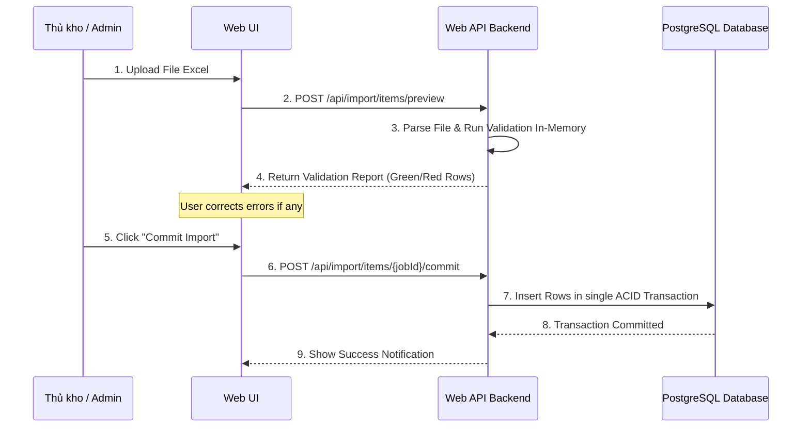

# PHASE 23: ERP/WMS legacy contract

## 1. Mục tiêu

Thiết lập các giao thức truyền nhận dữ liệu (API Contract) chuẩn hóa và cơ chế nhập/xuất dữ liệu (Import/Export Wizard) tích hợp để liên kết Nexustock WMS với hệ thống ERP hiện tại (như SAP, Oracle, Odoo) hoặc hệ thống quản lý kho cũ (Legacy WMS).

## 2. Phạm vi

### In scope

- Xây dựng API tích hợp (Integration API) nhận đơn PO/SO từ ERP.
- Triển khai cơ chế kiểm tra tính trùng lặp dữ liệu tích hợp thông qua `Idempotency-Key` và đối chiếu Payload Hash.
- Thiết lập cơ chế import dữ liệu lớn bằng Excel/CSV qua luồng 2 bước: Preview lỗi (không ghi DB) và Commit an toàn (Atomic Batch Commit).
- Viết adapter ánh xạ (mapping) mã vật tư, mã kho, mã đối tác giữa ERP và WMS, đồng thời xuất báo cáo lỗi ánh xạ chi tiết (Mapping Error Report).
- Quản lý phiên bản hợp đồng dữ liệu tích hợp (Contract Versioning: `v1.0`, `v1.1`, vv).

### Non-negotiable output

- API Endpoint nhận đơn từ ERP trả về response đồng bộ ngay lập tức chứa trạng thái tiếp nhận và `traceId`.
- Giao diện Import Wizard cho phép kéo thả file Excel, hiển thị bảng preview phân loại dòng hợp lệ/dòng lỗi rõ ràng trước khi ghi.
- Bản ghi log tích hợp lưu đầy đủ payload gửi/nhận, trạng thái xử lý, trace ID để hỗ trợ L1/L2 support đối soát.

## 3. Điều kiện đầu vào

### Readiness checklist

- Module Inbound receiving (Phase 04) và Outbound picking (Phase 07) đã hoàn tất.
- Danh mục lỗi chuẩn và Exception framework (Phase 10) hoạt động tốt.

## 4. Setup

### Cấu trúc module đề xuất

- Backend module: `backend/modules/erp_integration/` (chứa Controllers, Mapping Services, Import/Export Engine)
- Frontend feature: `frontend/features/erp_integration/`

### Permission seed đề xuất

- `integration.view`: Xem log tích hợp và trạng thái đồng bộ đơn hàng.
- `integration.import`: Thực hiện import dữ liệu thủ công từ file Excel.
- `integration.export`: Xuất dữ liệu tồn kho, danh mục để đồng bộ thủ công.

## 5. Database

### Bảng ghi log tin nhắn tích hợp (`IntegrationMessages`)

| Tên cột | Kiểu dữ liệu | Nullable | Ràng buộc chính | Ý nghĩa |
|---|---|---|---|---|
| `id` | uuid | No | Primary Key | ID log |
| `tenantId` | varchar(50) | No | FK | Định danh tenant |
| `idempotencyKey`| varchar(100) | No | Unique per tenant | Khóa chống trùng |
| `payloadHash` | varchar(64) | No | | Hash SHA-256 của payload body |
| `externalSystem`| varchar(50) | No | | Tên hệ thống gửi (ví dụ: `SAP`) |
| `direction` | varchar(10) | No | | Chiều tin nhắn: `inbound`, `outbound` |
| `messageType` | varchar(50) | No | | Loại tin: `purchaseOrder`, `salesOrder`, `stockUpdate` |
| `payload` | text | No | | JSON payload chi tiết |
| `status` | varchar(20) | No | | Trạng thái: `success`, `failed`, `pending_retry` |
| `errorMessage` | text | Yes | | Chi tiết lỗi hệ thống |
| `traceId` | varchar(50) | No | Index | Trace ID của request |
| `createdAt` | timestamp | No | | Thời gian ghi nhận |

## 6. Backend/API

### 6.1 Giao thức đồng bộ Đơn Nhập kho (`POST /api/integration/inbound-orders`)
- **Yêu cầu:** Header `Idempotency-Key` bắt buộc.
- **Request payload:** Xem mẫu chi tiết tại [erp_mock_payloads.md](file:///d:/1_Project/48_Nexustock/planning/enterprise/erp_mock_payloads.md#L23-L45).
- **Quy tắc xử lý:**
  1. Tính hash SHA-256 của JSON body. Đối chiếu `idempotencyKey` trong bảng `IntegrationMessages`.
  2. Nếu trùng key và trùng hash: Trả về kết quả đã xử lý trước đó (HTTP 200).
  3. Nếu trùng key nhưng khác hash: Trả lỗi `409 Conflict` (idempotency key đã dùng cho dữ liệu khác).
  4. Nếu là key mới: Validate định dạng, ánh xạ mã sản phẩm từ hệ thống cũ sang mã của Nexustock. Nếu hợp lệ, lưu DB và trả về `201 Created`.

### 6.2 API Import Wizard (Preview & Commit)
- **POST `/api/import/{type}/preview`**: Nhận file Excel, chạy qua bộ lọc validation, trả về danh sách dòng lỗi mà không ghi DB.
- **POST `/api/import/{importJobId}/commit`**: Chỉ khi 100% dòng trong Preview hợp lệ, cho phép gửi lệnh Commit để ghi nhận dữ liệu chính thức vào DB dưới một Database Transaction duy nhất.

## 7. Frontend/RF/mobile

- **Giao diện Import Wizard:** Gồm 3 bước:
  1. Chọn và tải tệp tin (Excel/CSV).
  2. Xem trước dữ liệu (Preview): Dòng lỗi được tô màu đỏ và hiển thị nguyên nhân lỗi (ví dụ: "Mã Item không tồn tại", "Số lượng không được âm").
  3. Bấm nút "Lưu vào hệ thống" (chỉ kích hoạt khi không còn lỗi).
- **Dashboard giám sát tích hợp:** Hiển thị danh sách các tin nhắn tích hợp gần nhất, hỗ trợ lọc theo trạng thái (Thành công, Thất bại) và tìm kiếm theo `traceId` hoặc mã đơn hàng ERP.

## 8. Execution flow

### Quy trình Nhập dữ liệu 2 bước (Import Preview & Commit Flow)

## 9. Validation & business rules

### 9.1 Chính sách vòng đời phiên bản Hợp đồng (Contract Versioning Lifecycle)

Hệ thống quản lý tích hợp API hỗ trợ 3 trạng thái phiên bản thông qua Header `X-Contract-Version`:
- **`Supported` (Đang hoạt động):** Phiên bản hiện tại (ví dụ: `v1.1` dành cho SAP).
- **`Deprecated` (Khuyến cáo ngưng):** Phiên bản cũ vẫn chạy nhưng ghi log cảnh báo và gửi email nhắc nâng cấp (ví dụ: `v1.0`).
- **`Retired` (Bị loại bỏ):** Phiên bản không còn hỗ trợ, API trả lỗi ngay lập tức: `HTTP 400 - integration.contractVersionRetired`.

### 9.2 Ma trận chống trùng lặp dữ liệu (Idempotency & Payload Hash Matrix)

| Idempotency-Key | Payload Body Hash | Database Match | Hệ quả & Phản hồi từ WMS |
|---|---|---|---|
| Mới hoàn toàn | N/A | Không có | Tiếp nhận đơn, lưu log tích hợp, xử lý nghiệp vụ, trả `201 Created` |
| Đã tồn tại | Khớp 100% | Có khớp | Trả lại HTTP Response cũ đã lưu trong log, không chạy lại nghiệp vụ (HTTP 200) |
| Đã tồn tại | Khác biệt | Có khớp | Phát hiện giả mạo hoặc xung đột. Chặn xử lý, trả lỗi `HTTP 409 Conflict - integration.payloadHashMismatch` |
| Rỗng/Thiếu | N/A | N/A | Từ chối xử lý, trả lỗi `HTTP 400 Bad Request - integration.idempotencyKeyRequired` |

### 9.3 Quy tắc nhập dữ liệu 2 bước (Import Preview & Commit Invariants)

- **Preview State Storage (Bộ nhớ tạm):**
  - Khi người dùng upload file Excel, dữ liệu được parse thô, validate và lưu tạm vào Redis cache với TTL = 30 phút dưới dạng `import_job:{jobId}`. Không ghi dữ liệu tạm này vào các bảng nghiệp vụ chính để tránh rác DB.
- **Atomic Batch Commit (Ghi nhận đồng loạt):**
  - Khi người dùng xác nhận "Commit", hệ thống đọc lại Redis cache, mở một Database Transaction duy nhất để insert toàn bộ dữ liệu.
  - Nếu bất kỳ dòng nào lỗi ghi (do database constraint vi phạm ở phút chót), rollback toàn bộ transaction và trả lỗi giao dịch nguyên khối.
- **Mapping Error Taxonomy (Bảng phân loại lỗi ánh xạ):**
  - `mapping.unresolvedItemCode`: Mã vật tư SAP chưa khai báo alias trong WMS.
  - `mapping.unresolvedWarehouse`: Mã kho SAP chưa được ánh xạ.
  - `mapping.unresolvedPartner`: Nhà cung cấp hoặc khách hàng không hợp lệ.

## 10. Exception handling

| Nhóm lỗi | Nguyên nhân | Xử lý |
|---|---|---|
| Sai định dạng cột | File import thiếu cột bắt buộc hoặc đổi tên cột | Trả lỗi cấu hình file ngay bước preview, dừng parse dòng. |
| Stale data | Trùng mã đơn đã hoàn tất nhập từ lâu | Trả lỗi `validation.orderAlreadyProcessed`. |
| Trùng mã Idempotency | Gọi lại API do timeout mạng | Trả về response cũ để đảm bảo tính an toàn giao dịch. |
| Lỗi hash payload | Gửi trùng key nhưng sửa đổi số lượng đơn | Trả lỗi `409 Conflict` để bảo vệ tính toàn vẹn dữ liệu. |
| ERP Sandbox Down | Môi trường test của SAP bị lỗi | Trả lỗi `integration.externalGatewayTimeout` kèm traceId. |

## 11. Observability

- Ghi nhận mọi giao dịch import thủ công vào `AuditLogs` kèm file đính kèm.
- KPI: Tỷ lệ import thành công trong lượt đầu, số tin nhắn lỗi tích hợp tồn đọng.

## 12. Test plan

- **Unit Test:**
  - Logic xác định trùng lặp Idempotency Key (trùng hash/khác hash).
  - Logic parse file Excel lỗi dòng và gom lỗi báo cáo.
- **Integration Test:**
  - Gửi mock payload đơn PO từ ERP giả lập lên API tích hợp. Kiểm tra việc ánh xạ mã hàng hóa và ghi nhận tồn kho.
  - Test rollback transaction khi dòng thứ 99 trong file Excel bị lỗi ghi DB.

## 13. Acceptance criteria

- API tích hợp tiếp nhận đơn SO/PO từ ERP phản hồi thành công hoặc báo lỗi rõ ràng dưới 500ms.
- Nhập tệp Excel lỗi không gây ghi đè rác vào database nhờ cơ chế Atomic Commit.
