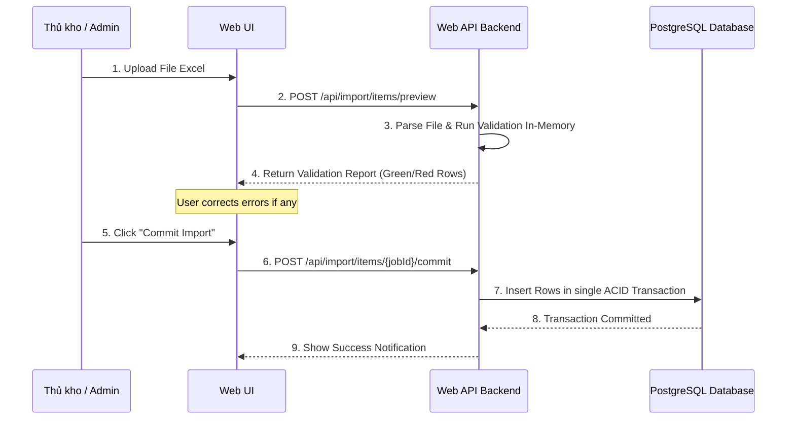

# PHASE 23: ERP/WMS legacy contract

## Execution spec maturity

- **Mức hiện tại:** 90%
- **Đánh giá:** Đủ roadmap cho ERP/WMS legacy contract, idempotency và SAP integration direction.
- **Khi cần upgrade:** Bắt buộc viết SAP contract confirmation để nâng lên 95% trước khi code Phase 23.

## 1. Mục tiêu

Thiết lập các giao thức truyền nhận dữ liệu (API Contract) chuẩn hóa và cơ chế nhập/xuất dữ liệu (Import/Export Wizard) tích hợp để liên kết Nexustock WMS với hệ thống ERP hiện tại (như SAP, Oracle, Odoo) hoặc hệ thống quản lý kho cũ (Legacy WMS).

## 2. Phạm vi

### In scope

- Xây dựng API tích hợp (Integration API) nhận đơn PO/SO từ ERP.
- Triển khai cơ chế kiểm tra tính trùng lặp dữ liệu tích hợp thông qua `Idempotency-Key` và đối chiếu Payload Hash.
- Thiết lập cơ chế import dữ liệu lớn bằng Excel/CSV qua luồng 2 bước: Preview lỗi (không ghi DB) và Commit an toàn (Atomic Batch Commit).
- Viết adapter ánh xạ (mapping) mã vật tư, mã kho, mã đối tác giữa ERP và WMS, đồng thời xuất báo cáo lỗi ánh xạ chi tiết (Mapping Error Report).
- Quản lý phiên bản hợp đồng dữ liệu tích hợp (Contract Versioning: `v1.0`, `v1.1`, vv).

### Non-negotiable output

- API Endpoint nhận đơn từ ERP trả về response đồng bộ ngay lập tức chứa trạng thái tiếp nhận và `traceId`.
- Giao diện Import Wizard cho phép kéo thả file Excel, hiển thị bảng preview phân loại dòng hợp lệ/dòng lỗi rõ ràng trước khi ghi.
- Bản ghi log tích hợp lưu đầy đủ payload gửi/nhận, trạng thái xử lý, trace ID để hỗ trợ L1/L2 support đối soát.

## 3. Điều kiện đầu vào

### Readiness checklist

- Module Inbound receiving (Phase 04) và Outbound picking (Phase 07) đã hoàn tất.
- Danh mục lỗi chuẩn và Exception framework (Phase 10) hoạt động tốt.

## 4. Setup

### Cấu trúc module đề xuất

- Backend module: `backend/modules/erp_integration/` (chứa Controllers, Mapping Services, Import/Export Engine)
- Frontend feature: `frontend/features/erp_integration/`

### Permission seed đề xuất

- `integration.view`: Xem log tích hợp và trạng thái đồng bộ đơn hàng.
- `integration.import`: Thực hiện import dữ liệu thủ công từ file Excel.
- `integration.export`: Xuất dữ liệu tồn kho, danh mục để đồng bộ thủ công.

## 5. Database

### Bảng ghi log tin nhắn tích hợp (`IntegrationMessages`)

| Tên cột | Kiểu dữ liệu | Nullable | Ràng buộc chính | Ý nghĩa |
|---|---|---|---|---|
| `id` | uuid | No | Primary Key | ID log |
| `tenantId` | varchar(50) | No | FK | Định danh tenant |
| `idempotencyKey`| varchar(100) | No | Unique per tenant | Khóa chống trùng |
| `payloadHash` | varchar(64) | No | | Hash SHA-256 của payload body |
| `externalSystem`| varchar(50) | No | | Tên hệ thống gửi (ví dụ: `SAP`) |
| `direction` | varchar(10) | No | | Chiều tin nhắn: `inbound`, `outbound` |
| `messageType` | varchar(50) | No | | Loại tin: `purchaseOrder`, `salesOrder`, `stockUpdate` |
| `payload` | text | No | | JSON payload chi tiết |
| `status` | varchar(20) | No | | Trạng thái: `success`, `failed`, `pending_retry` |
| `errorMessage` | text | Yes | | Chi tiết lỗi hệ thống |
| `traceId` | varchar(50) | No | Index | Trace ID của request |
| `createdAt` | timestamp | No | | Thời gian ghi nhận |

## 6. Backend/API

### 6.1 Giao thức đồng bộ Đơn Nhập kho (`POST /api/integration/inbound-orders`)
- **Yêu cầu:** Header `Idempotency-Key` bắt buộc. Header `X-Contract-Version` (mặc định `v1.1`).
- **Quy tắc xử lý:**
  1. Tính hash SHA-256 của JSON body. Đối chiếu `idempotencyKey` trong bảng `IntegrationMessages`.
  2. Nếu trùng key và trùng hash: Trả về kết quả đã xử lý trước đó (HTTP 200).
  3. Nếu trùng key nhưng khác hash: Trả lỗi `409 Conflict` (idempotency key đã dùng cho dữ liệu khác).
  4. Nếu là key mới: Validate định dạng, ánh xạ mã sản phẩm từ hệ thống cũ sang mã của Nexustock. Nếu hợp lệ, lưu DB và trả về `201 Created`.

### 6.2 API Import Wizard (Preview & Commit)
- **POST `/api/import/{type}/preview`**: Nhận file Excel, chạy qua bộ lọc validation, trả về danh sách dòng lỗi mà không ghi DB.
- **POST `/api/import/{importJobId}/commit`**: Chỉ khi 100% dòng trong Preview hợp lệ, cho phép gửi lệnh Commit để ghi nhận dữ liệu chính thức vào DB dưới một Database Transaction duy nhất.

### 6.3 Mẫu Mock Payload SAP BAPI Inbound Order (Nhận PO từ SAP)

**API Endpoint:** `POST /api/integration/inbound-orders`

```json
{
  "integrationHeader": {
    "externalSystem": "SAP-ERP",
    "externalReference": "PO-2026-99881",
    "contractVersion": "v1.1",
    "idempotencyKey": "idem_po_99881_20260701_001",
    "timestamp": "2026-07-01T09:00:00Z"
  },
  "inboundOrder": {
    "tenantId": "tenant_nexustock_demo",
    "WERKS": "wh_hn_01",
    "EBELN": "PO-2026-99881",
    "LIFNR": "SUPPLIER-MILK-VN",
    "orderDate": "2026-07-01",
    "expectedArrivalDate": "2026-07-03",
    "items": [
      {
        "EBELP": 10,
        "MATNR": "SAP-MILK-DRY-900",
        "expectedQty": 120.000000,
        "MEINS": "LON"
      },
      {
        "EBELP": 20,
        "MATNR": "SAP-MILK-FRSH-180",
        "expectedQty": 480.000000,
        "MEINS": "HOP"
      }
    ]
  }
}
```

### 6.4 Mẫu Mock Payload SAP BAPI Goods Receipt Confirmation (Webhook xuất từ WMS sang SAP)

**Webhook Endpoint đăng ký bởi SAP (WMS gọi đi):** `POST https://sap-gateway.nexustock.vn/sap/bc/srt/rfc/sap/z_wms_goods_receipt`

```json
{
  "webhookHeader": {
    "event": "shipment.confirmed",
    "deliveryId": "dlv_ship_001hxy762",
    "timestamp": "2026-07-01T15:30:22Z"
  },
  "payload": {
    "tenantId": "tenant_nexustock_demo",
    "WERKS": "wh_hn_01",
    "MBLNR": "GR-2026-11223",
    "EBELN": "PO-2026-99881",
    "shippedAt": "2026-07-01T15:29:45Z",
    "details": [
      {
        "EBELP": 10,
        "MATNR": "SAP-MILK-DRY-900",
        "shippedQty": 120.000000,
        "MEINS": "LON",
        "CHARG": "LOT-26A-01"
      },
      {
        "EBELP": 20,
        "MATNR": "SAP-MILK-FRSH-180",
        "shippedQty": 480.000000,
        "MEINS": "HOP",
        "CHARG": "LOT-26F-01"
      }
    ]
  }
}
```

## 7. Frontend/RF/mobile

- **Giao diện Import Wizard:** Gồm 3 bước:
  1. Chọn và tải tệp tin (Excel/CSV).
  2. Xem trước dữ liệu (Preview): Dòng lỗi được tô màu đỏ và hiển thị nguyên nhân lỗi (ví dụ: "Mã Item không tồn tại", "Số lượng không được âm").
  3. Bấm nút "Lưu vào hệ thống" (chỉ kích hoạt khi không còn lỗi).
- **Dashboard giám sát tích hợp:** Hiển thị danh sách các tin nhắn tích hợp gần nhất, hỗ trợ lọc theo trạng thái (Thành công, Thất bại) và tìm kiếm theo `traceId` hoặc mã đơn hàng ERP.

## 8. Execution flow

### Quy trình Nhập dữ liệu 2 bước (Import Preview & Commit Flow)



## 9. Validation & business rules

### 9.1 Chính sách vòng đời phiên bản Hợp đồng (Contract Versioning Lifecycle)

Hệ thống quản lý tích hợp API hỗ trợ 3 trạng thái phiên bản thông qua Header `X-Contract-Version`:
- **`Supported` (Đang hoạt động):** Phiên bản hiện tại (ví dụ: `v1.1` dành cho SAP).
- **`Deprecated` (Khuyến cáo ngưng):** Phiên bản cũ vẫn chạy nhưng ghi log cảnh báo và gửi email nhắc nâng cấp (ví dụ: `v1.0`).
- **`Retired` (Bị loại bỏ):** Phiên bản không còn hỗ trợ, API trả lỗi ngay lập tức: `HTTP 400 - integration.contractVersionRetired`.

### 9.2 Ma trận chống trùng lặp dữ liệu (Idempotency & Payload Hash Matrix)

| Idempotency-Key | Payload Body Hash | Database Match | Hệ quả & Phản hồi từ WMS |
|---|---|---|---|
| Mới hoàn toàn | N/A | Không có | Tiếp nhận đơn, lưu log tích hợp, xử lý nghiệp vụ, trả `201 Created` |
| Đã tồn tại | Khớp 100% | Có khớp | Trả lại HTTP Response cũ đã lưu trong log, không chạy lại nghiệp vụ (HTTP 200) |
| Đã tồn tại | Khác biệt | Có khớp | Phát hiện giả mạo hoặc xung đột. Chặn xử lý, trả lỗi `HTTP 409 Conflict - integration.payloadHashMismatch` |
| Rỗng/Thiếu | N/A | N/A | Từ chối xử lý, trả lỗi `HTTP 400 Bad Request - integration.idempotencyKeyRequired` |

### 9.3 Bảng Ánh xạ Trường dữ liệu (Field Mapping Table SAP -> WMS)

| Chiều tích hợp | Trường SAP (Technical Name) | Ý nghĩa trường SAP | Trường WMS tương ứng | Ghi chú & Quy tắc ánh xạ |
|---|---|---|---|---|
| **Inbound (PO)** | `EBELN` | Purchasing Document Number | `orderNo` | Khóa chính đơn mua hàng trên SAP. |
| **Inbound (PO)** | `LIFNR` | Vendor Account Number | `partnerCode` | Mã nhà cung cấp. Phải ánh xạ qua bảng `PartnerMapping`. |
| **Inbound (PO)** | `WERKS` | Plant / Warehouse Code | `warehouseCode` | Phải tương thích với danh mục kho trong WMS. |
| **Inbound (PO)** | `EBELP` | Item Number of PO | `lineNo` | Dòng mặt hàng trong đơn (thường tăng theo bước 10). |
| **Inbound (PO)** | `MATNR` | Material Number | `itemCode` | Mã vật tư SAP. Trình mapping của WMS sẽ đối chiếu alias. |
| **Inbound (PO)** | `MENGE` | PO Quantity | `expectedQty` | Số lượng yêu cầu nhập. |
| **Inbound (PO)** | `MEINS` | Unit of Measure | `uomCode` | Đơn vị tính (v.d. ST, PC, KG). |
| **Outbound (GR)** | `MBLNR` | Number of Material Document | `deliveryId` | ID chứng từ nhập xuất được tạo ra trong WMS. |
| **Outbound (GR)** | `CHARG` | Batch Number (Lot) | `lotNo` | Số lô hàng thực tế được phân bổ/nhập kho tại WMS. |
| **Outbound (GR)** | `ERFMG` | Quantity in Unit of Entry | `shippedQty` / `receivedQty`| Số lượng thực nhập/thực xuất. |

### 9.4 Quy tắc nhập dữ liệu 2 bước (Import Preview & Commit Invariants)

- **Preview State Storage (Bộ nhớ tạm):**
  - Khi người dùng upload file Excel, dữ liệu được parse thô, validate và lưu tạm vào Redis cache với TTL = 30 phút dưới dạng `import_job:{jobId}`. Không ghi dữ liệu tạm này vào các bảng nghiệp vụ chính để tránh rác DB.
- **Atomic Batch Commit (Ghi nhận đồng loạt):**
  - Khi người dùng xác nhận "Commit", hệ thống đọc lại Redis cache, mở một Database Transaction duy nhất để insert toàn bộ dữ liệu.
  - Nếu bất kỳ dòng nào lỗi ghi (do database constraint vi phạm ở phút chót), rollback toàn bộ transaction và trả lỗi giao dịch nguyên khối.
- **Mapping Error Taxonomy (Bảng phân loại lỗi ánh xạ):**
  - `mapping.unresolvedItemCode`: Mã vật tư SAP chưa khai báo alias trong WMS.
  - `mapping.unresolvedWarehouse`: Mã kho SAP chưa được ánh xạ.
  - `mapping.unresolvedPartner`: Nhà cung cấp hoặc khách hàng không hợp lệ.

## 10. Exception handling & Error Code Matrix

### 10.1 Ma trận mã lỗi tích hợp (Error Code Matrix)

| Mã lỗi WMS (Error Code) | HTTP Status | Nguyên nhân lỗi | Hành động xử lý đề xuất cho SAP / Client |
|---|---|---|---|
| `integration.idempotencyKeyRequired` | 400 Bad Request | Request thiếu Header `Idempotency-Key`. | Bắt buộc sinh UUIDv4 hoặc chuỗi định danh duy nhất gửi kèm trong Header. |
| `integration.payloadHashMismatch` | 409 Conflict | Gửi trùng `Idempotency-Key` nhưng nội dung JSON body khác nhau. | Kiểm tra lại logic sinh key ở hệ thống SAP; không được tái sử dụng key cũ cho đơn mới. |
| `mapping.unresolvedItemCode` | 422 Unprocessable | Mã vật tư `MATNR` gửi từ SAP chưa được định nghĩa ánh xạ trong WMS. | Cấu hình ánh xạ vật tư trên màn hình Admin WMS hoặc cập nhật lại danh mục vật tư SAP. |
| `mapping.unresolvedWarehouse` | 422 Unprocessable | Mã nhà máy `WERKS` gửi từ SAP chưa khớp với kho nào của WMS. | Khai báo mã kho tương ứng hoặc sửa trường `WERKS` trên SAP PO. |
| `validation.orderAlreadyProcessed` | 422 Unprocessable | Đơn hàng đã tồn tại và đã ở trạng thái hoàn thành / đang xử lý. | SAP ghi nhận đơn đã được xử lý và bỏ qua không gửi lại. |
| `integration.contractVersionRetired` | 400 Bad Request | Header `X-Contract-Version` chứa phiên bản đã bị ngưng hỗ trợ (`Retired`). | Nâng cấp đầu nối tích hợp SAP để khớp phiên bản mới (`v1.1` hoặc `v1.2`). |
| `integration.externalGatewayTimeout` | 504 Gateway Timeout | WMS không thể kết nối hoặc timeout khi gọi Webhook phản hồi sang SAP. | WMS lưu đơn vào Outbox queue và tự động thực hiện gửi lại (retry background). |

### 10.2 Exception Handling Table

| Nhóm lỗi | Nguyên nhân | Xử lý |
|---|---|---|
| Sai định dạng cột | File import thiếu cột bắt buộc hoặc đổi tên cột | Trả lỗi cấu hình file ngay bước preview, dừng parse dòng. |
| Stale data | Trùng mã đơn đã hoàn tất nhập từ lâu | Trả lỗi `validation.orderAlreadyProcessed`. |
| Trùng mã Idempotency | Gọi lại API do timeout mạng | Trả về response cũ để đảm bảo tính an toàn giao dịch. |
| Lỗi hash payload | Gửi trùng key nhưng sửa đổi số lượng đơn | Trả lỗi `409 Conflict` để bảo vệ tính toàn vẹn dữ liệu. |
| ERP Sandbox Down | Môi trường test của SAP bị lỗi | Trả lỗi `integration.externalGatewayTimeout` kèm traceId. |

## 11. Observability

- Ghi nhận mọi giao dịch import thủ công vào `AuditLogs` kèm file đính kèm.
- KPI: Tỷ lệ import thành công trong lượt đầu, số tin nhắn lỗi tích hợp tồn đọng.

## 12. Test plan

- **Unit Test:**
  - Logic xác định trùng lặp Idempotency Key (trùng hash/khác hash).
  - Logic parse file Excel lỗi dòng và gom lỗi báo cáo.
- **Integration Test:**
  - Gửi mock payload đơn PO từ ERP giả lập lên API tích hợp. Kiểm tra việc ánh xạ mã hàng hóa và ghi nhận tồn kho.
  - Test rollback transaction khi dòng thứ 99 trong file Excel bị lỗi ghi DB.

## 13. Acceptance criteria

Để đạt mức sẵn sàng 95% (Execution-Ready), module tích hợp ERP phải thỏa mãn các tiêu chí nghiệm thu sau:

* **AC-01 (Tốc độ & Hiệu năng):** API tích hợp tiếp nhận đơn hàng phải phản hồi dưới 500ms đối với payload đơn dưới 100 dòng.
* **AC-02 (Tính toàn vẹn Idempotency):** Gửi cùng một payload và `Idempotency-Key` 10 lần liên tiếp, hệ thống chỉ tạo duy nhất 1 đơn hàng trong DB, 9 lần sau trả về HTTP 200 kèm cùng một `traceId` và dữ liệu response giống hệt lần đầu.
* **AC-03 (Ánh xạ SAP Master Data):** Khi nhận payload có chứa trường SAP `MATNR = 'SAP-MILK-900'` đã được cấu hình mapping sang WMS Item `MILK-DRY-900`, đơn hàng tạo ra trong WMS phải lưu đúng mã `MILK-DRY-900`. Nếu gửi mã `MATNR` chưa cấu hình, API phải trả về HTTP 422 kèm mã lỗi `mapping.unresolvedItemCode`.
* **AC-04 (Rollback Giao dịch):** Khi import file Excel qua Wizard, nếu có 1 dòng bất kỳ bị lỗi validation ở bước Commit (ví dụ: lỗi khóa ngoại DB), toàn bộ lô dữ liệu phải được rollback hoàn toàn.
* **AC-05 (Webhook phản hồi SAP):** Khi xác nhận xuất kho hoặc nhận hàng hoàn tất, WMS phải bắn Webhook thành công sang SAP URL đích với cơ chế retry tối đa 5 lần (exponential backoff) nếu SAP trả về lỗi HTTP 5xx.

### Definition of done

* Database migration chạy sạch trên database trống.
* API chính có test integration pass.
* UI/RF/mobile flow chính thao tác được end-to-end.
* Audit/trace hoạt động cho command quan trọng.
* Exception path chính được test.
* README hoặc phase note đủ để executor tiếp theo hiểu dependency.
* Không còn placeholder generic trong phần triển khai phase.

