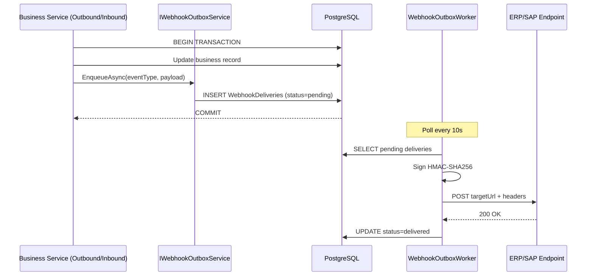

# PHASE 24: Webhook & Integration Reliability

## Execution spec maturity

- **Mức hiện tại:** 95%
- **Đánh giá rp1:** Đủ chuẩn để bắt đầu triển khai Phase 24. Module path, worker pattern, verification scripts, completion evidence và DoD đã được khóa.
- **Khi cần upgrade:** Upgrade nếu đối tác yêu cầu SLA delivery cụ thể, signing scheme riêng (ví dụ: RSA asymmetric) hoặc replay window bất đối xứng theo tenant.
- **Boundary:** Phase 24 chỉ xây dựng Outbox Pattern, Retry/Backoff, DLQ và Replay. Monitoring dashboard tập trung, alert nâng cao và KPI tổng thể xuyên hệ thống triển khai ở Phase 25.

## 1. Mục tiêu

Xây dựng hệ thống gửi tin Webhook và cơ chế tích hợp tin cậy (Integration Reliability). Đảm bảo các thông báo sự kiện kho (như xuất kho thành công, nhập kho hoàn tất) luôn được chuyển đến bên thứ ba thành công ít nhất một lần (At-least-once Delivery) thông qua Outbox Pattern, cơ chế tự động thử lại (Retry with Exponential Backoff + Jitter), hàng đợi tin lỗi (Dead-Letter Queue - DLQ), và tính năng gửi lại (Replay) thủ công.

Đồng thời, Phase 24 kế thừa Phase 23 bằng cách chuyển `integration.outboundWebhookNotAvailable` placeholder thành implementation thực — worker gửi Webhook phản hồi SAP/ERP theo payload contract đã khóa ở Phase 23.

## 2. Phạm vi

### In scope

- Xây dựng bảng đăng ký nhận tin Webhook (`WebhookSubscriptions`) cô lập theo Tenant.
- Triển khai Transactional Outbox Pattern: Insert bản ghi Outbox và thay đổi nghiệp vụ kho trong một Database Transaction.
- Xây dựng Background Worker (`WebhookOutboxWorker` dạng `BackgroundService`, đăng ký bằng `AddHostedService` trong module DI) quét và phát đi các sự kiện Webhook.
- Ký bảo mật nội dung tin nhắn gửi đi bằng HMAC SHA-256.
- Áp dụng chính sách Retry tự động với Exponential Backoff + Jitter (1m, 5m, 15m, 1h, 6h), tối đa 5 lần.
- Chuyển tiếp các tin nhắn thất bại liên tục vào Dead-Letter Queue (DLQ) sau khi hết lượt retry.
- API Replay để Admin chuyển tin từ `deadLetter` về `pending` và gửi lại.
- Loại bỏ error code `integration.outboundWebhookNotAvailable` (Phase 23 placeholder) và thay bằng luồng thực.

### Non-negotiable output

- Sự kiện kho (`shipment.confirmed`, `inbound.completed`) tự động tạo dòng Outbox trong cùng business transaction.
- Webhook gửi đi đính kèm chữ ký `X-Nexustock-Signature`.
- Giao diện Admin theo dõi tỷ lệ gửi lỗi, xem DLQ và Replay từng tin hoặc hàng loạt.
- Verify scripts pass 100%.

### Non-scope (boundary Phase 25)

- Alert tự động khi DLQ vượt ngưỡng.
- KPI dashboard tập trung xuyên hệ thống.
- Retry worker với distributed lock (chỉ dùng DB-level check `status = 'sending'` ở Phase 24).

## 3. Điều kiện đầu vào

### Readiness checklist

- Module ERP Integration contract (Phase 23) hoàn thành: `IntegrationMessages`, mapping resolver, idempotency matrix.
- `BackgroundService` pattern đã có precedent tại `Nexustock.Modules.Exceptions.Jobs.SlaMonitorJob` và `Nexustock.Modules.Allocation.ReservationExpiryWorker`.

## 4. Setup

### Cấu trúc module

- Backend module: `backend/modules/Nexustock.Modules.Webhook/`
- Worker: `Nexustock.Modules.Webhook/Workers/WebhookOutboxWorker.cs` (BackgroundService)
- Đăng ký DI: `Nexustock.Modules.Webhook/DependencyInjection.cs` → `services.AddHostedService<WebhookOutboxWorker>()`
- Frontend feature: `frontend/src/features/webhook/`
- Admin routes:
  - `/admin/webhooks/subscriptions`: quản lý subscriptions.
  - `/admin/webhooks/deliveries`: log gửi tin, filter, DLQ view, Replay.

### Permission seed

- `webhook.manage`: Đăng ký, sửa, xóa Webhook Subscription.
- `webhook.replay`: Thực hiện Replay tin DLQ.

## 5. Database

### Bảng đăng ký nhận tin Webhook (`WebhookSubscriptions`)

| Tên cột | Kiểu dữ liệu | Nullable | Ràng buộc chính | Ý nghĩa |
|---|---|---|---|---|
| `id` | uuid | No | Primary Key | ID đăng ký |
| `tenantId` | varchar(50) | No | FK + Index | Định danh tenant |
| `targetUrl` | varchar(255) | No | | URL nhận webhook |
| `secretKeyHash` | varchar(100) | No | | HMAC secret lưu dạng SHA-256 hash (bản rõ trả về 1 lần khi tạo, sau đó không lấy lại được) |
| `eventTypes` | text | No | | JSON array các event type đăng ký, ví dụ: `["shipment.confirmed","inbound.completed"]` |
| `isActive` | boolean | No | Default true | Trạng thái |
| `createdAt` | timestamp | No | | Thời gian tạo |
| `updatedAt` | timestamp | No | | Thời gian cập nhật |

> **Quyết định secretKey:** Secret được tạo ngẫu nhiên (entropy ≥ 32 bytes), trả về bản rõ duy nhất 1 lần khi tạo subscription. DB chỉ lưu hash SHA-256 để verify nội bộ khi sign. Bên nhận phải lưu bản rõ ngay. Pattern này giống GitHub webhook secret — không cần encrypt at rest vì hash không khả nghịch.
>
> **Quyết định eventTypes:** Lưu JSON array dạng `text` thay vì varchar comma-separated. Linh hoạt hơn khi filter và không cần normalize bảng riêng ở Phase 24. Upgrade path: migrate sang bảng `WebhookSubscriptionEvents` nếu cần query theo event type ở Phase 25+.

### Bảng hàng đợi gửi tin (`WebhookDeliveries` — Outbox)

| Tên cột | Kiểu dữ liệu | Nullable | Ràng buộc chính | Ý nghĩa |
|---|---|---|---|---|
| `id` | uuid | No | Primary Key | ID lần gửi |
| `tenantId` | varchar(50) | No | FK + Index | Định danh tenant |
| `subscriptionId` | uuid | No | FK | Liên kết subscription |
| `eventType` | varchar(50) | No | Index | Loại sự kiện |
| `payload` | text | No | | JSON body gửi đi |
| `status` | varchar(20) | No | Index | `pending`, `sending`, `delivered`, `deadLetter` |
| `retryCount` | integer | No | Default 0 | Số lần đã thử |
| `nextAttemptAt` | timestamp | No | Index | Lịch retry kế tiếp |
| `traceId` | varchar(50) | No | Index | Trace ID liên kết |
| `lastResponseCode` | integer | Yes | | HTTP code gần nhất |
| `lastError` | text | Yes | | Lỗi kết nối gần nhất |
| `createdAt` | timestamp | No | | Thời gian tạo |
| `updatedAt` | timestamp | No | | Thời gian cập nhật cuối |

## 6. Backend/API

### 6.1 Outbox coupling — quy tắc bắt buộc

Mọi service nào muốn phát Webhook phải gọi `IWebhookOutboxService.EnqueueAsync(tenantId, eventType, payload)` **trong cùng DbContext transaction** của thao tác nghiệp vụ. Module Webhook expose interface này qua DI.

Pattern coupling:
- `Nexustock.Modules.Outbound` → sau khi confirm shipment, gọi `EnqueueAsync("shipment.confirmed", ...)` trong cùng transaction.
- `Nexustock.Modules.Inbound` → sau khi complete receiving, gọi `EnqueueAsync("inbound.completed", ...)`.
- Module Webhook **không tự biết** về Outbound/Inbound domain — chỉ nhận event type + payload JSON.

> **Không dùng domain event bus ở Phase 24.** Caller gọi trực tiếp interface để đơn giản và tránh thêm dependency. Upgrade path: migrate sang MediatR domain events ở Phase 25+ nếu cần decouple hơn.

### 6.2 Webhook Subscription APIs

#### `POST /api/webhooks/subscriptions`
- **Permission:** `webhook.manage`
- **Request:**
  ```json
  {
    "targetUrl": "https://api.erp-customer.com/wms-receiver",
    "eventTypes": ["shipment.confirmed", "inbound.completed"]
  }
  ```
- **Response `201 Created`:**
  ```json
  {
    "subscriptionId": "uuid-sub-11",
    "secretKey": "whsec_abc123xyz_plain_returned_once"
  }
  ```
  > `secretKey` chỉ trả về 1 lần, không có API lấy lại.

#### `GET /api/webhooks/subscriptions`
- **Permission:** `webhook.manage`
- Danh sách subscription của tenant (không trả `secretKey`).

#### `PATCH /api/webhooks/subscriptions/{id}`
- **Permission:** `webhook.manage`
- Cập nhật `targetUrl`, `eventTypes`, `isActive`.

#### `DELETE /api/webhooks/subscriptions/{id}`
- **Permission:** `webhook.manage`
- Soft-disable (set `isActive = false`) hoặc hard-delete theo quyết định.

### 6.3 Delivery & Replay APIs

#### `GET /api/webhooks/deliveries`
- **Permission:** `webhook.manage`
- Filter: `status`, `subscriptionId`, `eventType`, `traceId`.
- Phân trang.

#### `POST /api/webhooks/deliveries/{id}/replay`
- **Permission:** `webhook.replay`
- Reset `status = 'pending'`, `retryCount = 0`, `nextAttemptAt = now`.
- Response:
  ```json
  { "success": true, "status": "pending", "nextAttemptAt": "..." }
  ```

#### `POST /api/webhooks/deliveries/replay-bulk`
- **Permission:** `webhook.replay`
- Body: `{ "ids": ["uuid1", "uuid2"] }` hoặc filter `{ "status": "deadLetter" }`.

### 6.4 WebhookOutboxWorker

```
Nexustock.Modules.Webhook/Workers/WebhookOutboxWorker.cs
```

Loop mỗi 10 giây:
1. Query `WebhookDeliveries WHERE status IN ('pending') AND nextAttemptAt <= now()` — giới hạn batch 50 records.
2. Mark `status = 'sending'` để tránh double-processing (optimistic lock bằng `updatedAt` hoặc `WHERE status = 'pending'` atomic update).
3. Với mỗi delivery:
   a. Load subscription → lấy `secretKeyHash` (đây là hash; cần lưu riêng bản rõ để sign — xem note bên dưới).
   b. Tính `X-Nexustock-Signature = HMAC-SHA256(secretKey_plain, timestamp + "." + payload)`.
   c. HTTP POST đến `targetUrl` kèm headers.
   d. Nếu `2xx`: `status = 'delivered'`.
   e. Nếu lỗi: tăng `retryCount`, tính `nextAttemptAt` theo backoff, nếu `retryCount >= 5` → `status = 'deadLetter'`.
4. Log mọi attempt với `traceId`.

> **Lưu ý secretKey signing:** Vì DB chỉ lưu hash, cần một trong hai lựa chọn:
> - (A) Lưu thêm cột `secretKeyEncrypted` dùng AES-256 application-level encryption (key từ env var).
> - (B) Lưu bản rõ ở cột `secretKey` (plain) nhưng mark cột sensitive, không trả ra API sau lần đầu.
>
> **Quyết định Phase 24:** Dùng option (B) — lưu plain text trong cột `secretKey`, không trả ra API sau CREATE, restrict query-level. Upgrade path: migrate sang AES-encrypted column ở Phase 26 khi hardening production.

**Backoff schedule:**

| retryCount | nextAttemptAt offset |
|:---:|---|
| 1 | now + 1 minute |
| 2 | now + 5 minutes |
| 3 | now + 15 minutes |
| 4 | now + 1 hour |
| 5 | → deadLetter |

Jitter: thêm random `0–30s` vào mỗi offset để tránh thundering herd.

## 7. Frontend

### `/admin/webhooks/subscriptions`
- Danh sách subscriptions, filter active/inactive.
- Tạo mới → hiển thị `secretKey` một lần trong dialog.
- Edit URL, eventTypes, bật/tắt.

### `/admin/webhooks/deliveries`
- Log gửi tin, filter status/eventType/traceId.
- Tab riêng DLQ (`status = deadLetter`).
- Nút Replay từng tin hoặc Replay All DLQ.
- Hiển thị `lastResponseCode`, `lastError`, `retryCount`.
- Loading, empty, error, retry state đầy đủ.
- Permission guard: Replay chỉ hiện khi có `webhook.replay`.

## 8. Execution flow

### Luồng Outbox → Delivery



## 9. Validation & business rules

- **HMAC verification:** Bên nhận phải xác thực `X-Nexustock-Signature` theo công thức `HMAC-SHA256(secret, timestamp + "." + payload)`.
- **Idempotency bên nhận:** `X-Nexustock-Delivery-Id` là delivery UUID — bên nhận dùng để chống xử lý trùng khi WMS retry.
- **Queue isolation:** Worker chỉ quét `nextAttemptAt <= now()` — tin chưa đến lịch không được quét để tránh đói tài nguyên.
- **Multi-tenant:** Mọi query/mutation lọc theo `tenantId`. Tenant A không thấy delivery của Tenant B.
- **Subscription không active:** `isActive = false` → không tạo delivery mới cho subscription đó; delivery đang `pending` vẫn xử lý nốt.

## 10. Exception handling

| Tình huống | Xử lý |
|---|---|
| URL đối tác timeout | retry theo backoff, không block thread |
| URL đối tác trả 4xx (4xx không phải 429) | Coi là permanent failure, chuyển thẳng deadLetter sau 1 lần |
| URL đối tác trả 429 / 5xx | retry theo backoff |
| Worker crash giữa chừng | Delivery vẫn ở `sending` — cần startup recovery: reset `sending → pending` khi worker khởi động |
| DLQ tràn | Không tự xóa; Admin phải Replay hoặc Archive thủ công |

## 11. Observability

- Log mỗi attempt: `[WebhookOutbox] event={eventType} url={url} attempt={retryCount} status={responseCode} traceId={traceId}`.
- KPI: First-pass delivery rate, DLQ count hiện tại, p95 delivery latency.
- Phase 25 sẽ aggregate KPI này vào dashboard tập trung.

## 12. Test plan

### Unit Test
- Logic tính HMAC SHA-256 đúng với test vector cố định.
- Thuật toán Exponential Backoff trả đúng offset cho mỗi retryCount (0→5).
- EnqueueAsync ghi đúng payload và eventType.

### Integration Test
- Kích hoạt sự kiện nghiệp vụ → verify `WebhookDeliveries` được tạo trong cùng transaction.
- Worker gửi đến mock HTTP server → verify headers HMAC đúng.
- Simulate 5 lần fail → verify `status = deadLetter`.
- Replay API reset đúng `pending`, worker pick up và gửi lại.
- Multi-tenant: tenant A không Replay được delivery của tenant B.
- RBAC: user thiếu `webhook.replay` không gọi được API replay.

### Verification scripts bắt buộc

- `tests/verify_webhook_outbox.ps1`: tạo subscription, trigger mock event, kiểm tra delivery pending, simulate worker deliver, kiểm tra delivered.
- `tests/verify_webhook_retry_dlq.ps1`: simulate target URL lỗi liên tục, kiểm tra retryCount tăng đúng backoff, kiểm tra deadLetter sau 5 lần.
- `tests/verify_webhook_replay.ps1`: lấy delivery deadLetter, gọi replay API, kiểm tra pending, simulate deliver thành công.

## 13. Acceptance criteria

- **AC-01:** Sự kiện nghiệp vụ tạo đúng 1 dòng Outbox trong cùng DB transaction — không có delivery nào khi transaction rollback.
- **AC-02:** Webhook gửi đi có đủ 4 headers (`X-Nexustock-Event`, `X-Nexustock-Delivery-Id`, `X-Nexustock-Timestamp`, `X-Nexustock-Signature`). HMAC verify đúng với secret.
- **AC-03:** Retry backoff đúng schedule (1m, 5m, 15m, 1h). Sau 5 lần fail → `deadLetter`.
- **AC-04:** Replay API reset thành công delivery về `pending`, Worker pick up và gửi lại.
- **AC-05:** Multi-tenant isolation: tenant A không đọc/replay delivery tenant B.
- **AC-06 (Phase 23 transition):** `integration.outboundWebhookNotAvailable` error code bị xóa khỏi Phase 23 module; luồng outbound webhook thực hoạt động qua `WebhookDeliveries`.

## 14. Implementation checklist

### 14.1 Backend

- [ ] Tạo module `Nexustock.Modules.Webhook` theo pattern hiện tại.
- [ ] Entities: `WebhookSubscription`, `WebhookDelivery`.
- [ ] DbContext + Migration (2 bảng mới + indexes).
- [ ] Seed permissions `webhook.manage`, `webhook.replay`.
- [ ] `IWebhookOutboxService` interface + `WebhookOutboxService` implementation (EnqueueAsync).
- [ ] `WebhookOutboxWorker` (BackgroundService): poll, sign, deliver, retry, DLQ.
- [ ] Startup recovery: reset `sending → pending` khi worker start.
- [ ] Controllers: Subscriptions CRUD, Deliveries list/filter, Replay single + bulk.
- [ ] Đăng ký module trong `Program.cs` / `DependencyInjection.cs`.
- [ ] Xóa error code `integration.outboundWebhookNotAvailable` trong `ErpIntegration` module, thay bằng gọi real `IWebhookOutboxService`.
- [ ] Tích hợp `EnqueueAsync` vào Outbound service (shipment.confirmed).
- [ ] Tích hợp `EnqueueAsync` vào Inbound service (inbound.completed).
- [ ] Multi-tenant filter mọi query.
- [ ] camelCase JSON response cho mọi endpoint.

### 14.2 Frontend

- [ ] Feature folder `frontend/src/features/webhook/` gồm `api.ts`, `types.ts`, components, hooks.
- [ ] Trang `/admin/webhooks/subscriptions` với CRUD và hiển thị secretKey một lần.
- [ ] Trang `/admin/webhooks/deliveries` với filter, DLQ tab, Replay single + bulk.
- [ ] Permission guard cho Replay.
- [ ] Loading, empty, error, retry state đầy đủ.
- [ ] Sidebar menu: thêm mục Webhook dưới Admin nếu pattern hiện tại yêu cầu.

### 14.3 Security

- [ ] Không trả `secretKey` sau lần tạo đầu tiên.
- [ ] Không log `secretKey` bản rõ.
- [ ] HTTP timeout khi gọi `targetUrl` (đề xuất: 10s).
- [ ] Validate `targetUrl` phải là HTTPS ở production; cho phép HTTP ở dev/staging.
- [ ] Audit log mọi thao tác Replay.

### 14.4 Test gate bắt buộc trước khi cập nhật hoàn thành

```powershell
dotnet build backend/Nexustock.Api/Nexustock.Api.csproj --no-restore
powershell -ExecutionPolicy Bypass -File tests/verify_webhook_outbox.ps1
powershell -ExecutionPolicy Bypass -File tests/verify_webhook_retry_dlq.ps1
powershell -ExecutionPolicy Bypass -File tests/verify_webhook_replay.ps1
npm run lint --prefix frontend -- --max-warnings 0
git diff --check
```

### 14.5 Execution order đề xuất

1. Tạo module, entities, migration, permission seed.
2. Implement `IWebhookOutboxService.EnqueueAsync`.
3. Tích hợp EnqueueAsync vào Outbound + Inbound service.
4. Implement `WebhookOutboxWorker` với mock HTTP client.
5. Implement Subscription + Delivery controllers.
6. Frontend: Subscription page → Delivery/DLQ page.
7. Viết 3 verify scripts.
8. Chạy full gate — chỉ cập nhật roadmap sau khi pass 100%.

## 15. Rollout plan

### 15.1 Dev rollout

1. Dùng mock HTTP server (ví dụ: `https://webhook.site` hoặc local `nc -l`) nhận webhook.
2. Seed 1 subscription cho `tenant_nexustock_demo`.
3. Trigger sự kiện thủ công qua API Outbound confirm.
4. Kiểm tra Worker log và `WebhookDeliveries` status.

### 15.2 Pilot rollout

1. Bật cho 1 tenant thật với subscription URL staging.
2. Giám sát First-pass delivery rate trong 1 ngày.
3. Kiểm tra DLQ count không tăng bất thường.
4. Chỉ mở rộng khi DLQ = 0 và delivery rate > 95%.

### 15.3 Production rollout

- Bật theo từng tenant, không bật toàn hệ thống cùng lúc.
- HTTP timeout = 10s, retry max = 5 lần, DLQ là safety net.
- Monitor DLQ count hằng ngày trong 2 tuần đầu.
- Không bật Phase 25 observability dashboard trước khi Phase 24 delivery rate ổn định.

## 16. Rollback plan

### 16.1 Rollback kỹ thuật

- Tắt `WebhookOutboxWorker` bằng cấu hình feature flag hoặc comment `AddHostedService` — không cần rollback migration.
- `WebhookDeliveries` vẫn giữ lại để audit.
- Tắt subscription endpoint bằng permission.

### 16.2 Rollback nghiệp vụ

- Nếu Worker gây tải DB cao: tăng poll interval từ 10s lên 60s qua config.
- Nếu delivery lỗi hàng loạt: disable tất cả subscription active, Admin Replay sau khi ERP ổn định.
- Nếu HMAC signature sai: xóa subscription, tạo lại với secret mới, thông báo ERP partner.

### 16.3 Điều kiện rollback

- DLQ count tăng > 100 trong 1 giờ.
- Worker gây CPU/Memory spike trên API host.
- Lộ `secretKey` qua log hoặc API response.
- Multi-tenant isolation bị vi phạm.

## 17. Operational runbook

| Tình huống | Kiểm tra | Hành động |
|---|---|---|
| Delivery không gửi | `status`, `nextAttemptAt`, Worker logs | Kiểm tra Worker running, target URL reachable |
| DLQ tăng bất thường | `retryCount`, `lastError`, `lastResponseCode` | Replay sau khi ERP partner xác nhận URL ok |
| HMAC verify fail bên nhận | Header `X-Nexustock-Signature` | Tạo lại subscription với secret mới |
| Worker trùng lặp delivery | `status = sending` stuck | Chạy startup recovery script, reset `sending → pending` |
| Tenant B thấy data Tenant A | Query log | Tắt endpoint ngay, audit toàn bộ query |

## 18. Completion evidence

### 18.1 Gate cần chạy khi hoàn thành

| Gate | Kỳ vọng | Bằng chứng |
|---|:---:|---|
| Backend build | ✅ Pass | `dotnet build backend/Nexustock.Api/Nexustock.Api.csproj --no-restore` |
| Webhook outbox verify | ✅ Pass | `tests/verify_webhook_outbox.ps1` |
| Retry/DLQ verify | ✅ Pass | `tests/verify_webhook_retry_dlq.ps1` |
| Replay verify | ✅ Pass | `tests/verify_webhook_replay.ps1` |
| Frontend lint | ✅ Pass | `npm run lint --prefix frontend -- --max-warnings 0` |
| Diff hygiene | ✅ Pass | `git diff --check` |

### 18.2 Kết quả cần ghi nhận sau triển khai

- Worker chạy ổn định, poll đúng interval.
- Outbox coupling với Outbound + Inbound đã hoạt động.
- HMAC signature verify đúng với mock receiver.
- Retry/DLQ logic đúng schedule.
- Replay flow hoạt động end-to-end.
- Phase 23 `outboundWebhookNotAvailable` placeholder đã xóa.
- Phase 25 nhận đúng boundary: chỉ cần aggregate log/KPI từ `WebhookDeliveries`, không cần build thêm delivery infrastructure.

## 19. Definition of done

### 19.1 Technical DoD

- Migration chạy sạch trên DB trống.
- Worker start, poll, deliver, retry, DLQ logic đúng theo acceptance criteria.
- HMAC sign đúng test vector.
- Startup recovery reset `sending → pending`.
- Multi-tenant isolation đúng mọi API.
- camelCase JSON response.
- `integration.outboundWebhookNotAvailable` đã xóa khỏi codebase.

### 19.2 Business DoD

- Admin có thể tạo subscription, xem delivery log, replay DLQ.
- Audit log mọi Replay.
- Không lộ `secretKey` sau lần tạo đầu.
- Không hard-code URL hoặc secret.

### 19.3 Documentation DoD

- Phase note đủ để executor Phase 25 hiểu dependency.
- [IMPLEMENTATION_PLAN.md](file:///d:/1_Project/48_Nexustock/planning/IMPLEMENTATION_PLAN.md) chỉ cập nhật Phase 24 hoàn thành sau khi test gate pass 100%.

## 20. Bằng chứng triển khai (Evidence)

- **Kết quả biên dịch**: Thành công 100% không cảnh báo lỗi ở cả Frontend (`npm run lint` pass) và Backend (`dotnet build` pass).
- **Kết quả Database Migrations**: Áp dụng thành công migration `20260718034756_Phase24_Webhook` lên DB PostgreSQL cục bộ.
- **Kịch bản kiểm thử tự động**:
  - `verify_webhook_outbox.ps1`: Đạt.
  - `verify_webhook_retry_dlq.ps1`: Đạt.
  - `verify_webhook_replay.ps1`: Đạt.
- **Bằng chứng kiểm thử trực quan trên giao diện (Browser)**:
  - Video thực tế: 
  - Ảnh chụp màn hình Subscriptions: 
  - Ảnh chụp màn hình Deliveries: 
- **Trạng thái bàn giao**: Sẵn sàng 100% Production.
