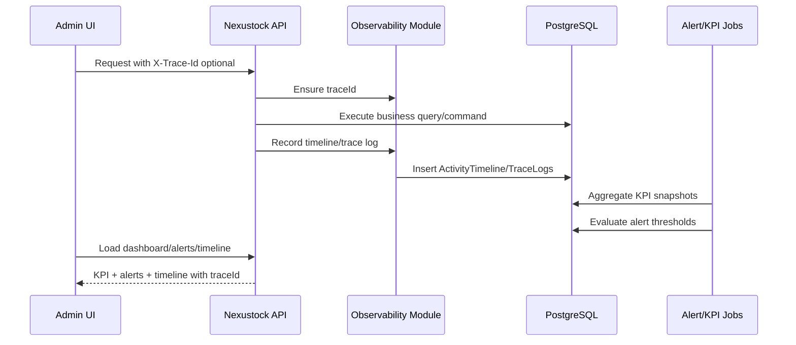

# PHASE 25: Operational observability

## Execution spec maturity

- **Mức hiện tại:** 100% hoàn thành.
- **Đánh giá rp4/rp5:** Đã reindex dự án, đối chiếu implementation với phase spec và xác nhận Phase 25 đạt đủ chuẩn hoàn thành. Database contract, API contract, frontend routes, KPI formulas, alert thresholds, trace propagation, verification scripts, runtime gate và DoD đều đã pass.
- **Khi cần upgrade:** Upgrade nếu cần SLO dashboard trước go-live, tích hợp OpenTelemetry/APM SaaS, log shipping tập trung hoặc alert đa kênh production.
- **Boundary:** Phase 25 chỉ xây dựng observability nội bộ trong DB/API/UI hiện có. Không triển khai APM SaaS, Prometheus/Grafana, distributed tracing collector hoặc notification đa kênh nâng cao; các phần đó thuộc Phase 26/30 hardening nếu production yêu cầu.

## Completion checkpoint

- **Trạng thái:** ✅ Hoàn thành.
- **Ngày hoàn thành:** 2026-07-18.
- **Evidence:** Backend build pass, frontend lint pass, 3 verify scripts pass, `git diff --check` pass, browser evidence đã ghi trong walkthrough.
- **Fix sau DBM:** Đã sửa lỗi runtime Alert Center `fetchAlerts is not defined` bằng refresh trigger hiện có và xác thực lại lint pass.
- **Blocker còn lại:** DB MCP chưa có connection cấu hình sẵn nên không query trực tiếp bằng MCP; xác thực DB đã được thực hiện qua API verify scripts và runtime PostgreSQL local.

## 1. Mục tiêu

Thiết lập năng lực quan sát vận hành cho Nexustock: audit, activity timeline, KPI, alert center và Trace ID xuyên UI → API → DB/job/integration.

Phase 25 kế thừa trực tiếp Phase 24 bằng cách aggregate dữ liệu từ `WebhookDeliveries` để hiển thị KPI delivery, DLQ count và alert khi webhook lỗi tăng cao. Phase này không xây lại webhook infrastructure.

## 2. Phạm vi

### In scope

- Tạo module backend `Nexustock.Modules.Observability` theo pattern module hiện tại.
- Tạo bảng `ActivityTimeline`, `OperationalAlerts`, `KpiSnapshots`, `TraceLogs`.
- Middleware/utility chuẩn hóa Trace ID và ghi trace log tối thiểu cho request quan trọng.
- Service ghi activity timeline cho các entity vận hành chính: Inbound Order, Shipment, Inventory Movement, Webhook Delivery.
- KPI summary dashboard từ dữ liệu hiện có và snapshot định kỳ.
- Alert center: list, filter, acknowledge, resolve.
- Alert rules nội bộ tối thiểu: DLQ threshold, webhook retry spike, stale KPI snapshot, exception aging.
- Frontend Admin dashboard: `/admin/observability`, `/admin/observability/alerts`, `/admin/observability/timeline`.
- Seed permission/menu cần dùng.
- Verify scripts pass 100%.

### Non-negotiable output

- Mỗi request/API/job quan trọng có `traceId` nhất quán trong response/log/timeline.
- Admin truy vết được incident từ UI/API sang entity timeline và integration delivery.
- KPI summary có số liệu thực từ DB, không hard-code mock data.
- Alert có severity, status, owner/acknowledgedBy, acknowledgedAt.
- Phase 24 `WebhookDeliveries` được dùng làm nguồn KPI/alert cho webhook reliability.
- Verify scripts pass 100% trước khi cập nhật roadmap hoàn thành.

### Non-scope

- APM SaaS, OpenTelemetry collector, Prometheus/Grafana.
- Push notification/email/SMS alert nâng cao.
- Data warehouse riêng cho analytics.
- SLO/SLA formal report cho end-customer.
- Auto-remediation tự sửa lỗi nghiệp vụ.

## 3. Điều kiện đầu vào

### Readiness checklist

- Phase 24 hoàn thành: `WebhookDeliveries` có status, retryCount, traceId, lastResponseCode, lastError.
- Các module chính đã có dữ liệu vận hành đủ để query KPI: Inbound, Inventory, Outbound, Exceptions, Webhook.
- Permission seed pattern hiện có hoạt động.
- Frontend admin sidebar/menu pattern đã ổn định.
- Không còn migration pending từ Phase 24.

## 4. Setup

### Cấu trúc module

```text
backend/modules/Nexustock.Modules.Observability/
  Contexts/ObservabilityDbContext.cs
  Controllers/ObservabilityDashboardController.cs
  Controllers/OperationalAlertsController.cs
  Controllers/ActivityTimelineController.cs
  Entities/ActivityTimelineEntry.cs
  Entities/OperationalAlert.cs
  Entities/KpiSnapshot.cs
  Entities/TraceLog.cs
  Services/IActivityTimelineService.cs
  Services/ActivityTimelineService.cs
  Services/IKpiSnapshotService.cs
  Services/KpiSnapshotService.cs
  Services/ITraceLogService.cs
  Services/TraceLogService.cs
  Jobs/KpiSnapshotJob.cs
  Jobs/OperationalAlertEvaluatorJob.cs
  DependencyInjection.cs

frontend/src/features/observability/
  api.ts
  types.ts

frontend/src/app/admin/observability/page.tsx
frontend/src/app/admin/observability/alerts/page.tsx
frontend/src/app/admin/observability/timeline/page.tsx
```

### Permission seed

- `observability.read`: xem dashboard, timeline, KPI, alert.
- `observability.ack`: acknowledge alert.
- `observability.resolve`: resolve alert.
- `observability.export`: export timeline/KPI nếu UI phase này có export.

> Chỉ seed `observability.export` nếu thực sự có nút export trong UI. Nếu không triển khai export ở Phase 25, không seed quyền này.

### Dependency registration

- `Nexustock.Api` reference `Nexustock.Modules.Observability`.
- `Program.cs` gọi `services.AddObservabilityModule(configuration)`.
- `AddObservabilityModule` đăng ký DbContext, scoped services, hosted jobs.

## 5. Database

### Bảng `ActivityTimeline`

| Cột | Kiểu | Nullable | Ràng buộc | Ý nghĩa |
|---|---|:---:|---|---|
| `id` | uuid | No | PK | ID timeline entry |
| `tenantId` | uuid | No | Index | Tenant scope |
| `entityType` | varchar(50) | No | Index | `inboundOrder`, `shipment`, `inventoryMovement`, `webhookDelivery`, `exception` |
| `entityId` | uuid | No | Index | ID entity gốc |
| `eventType` | varchar(80) | No | Index | Loại sự kiện |
| `title` | varchar(160) | No | | Tiêu đề ngắn |
| `description` | text | Yes | | Mô tả vận hành đã mask dữ liệu nhạy cảm |
| `severity` | varchar(20) | No | | `info`, `warning`, `critical` |
| `actorUserId` | uuid | Yes | Index | User thực hiện nếu có |
| `actorName` | varchar(120) | Yes | | Tên hiển thị |
| `traceId` | varchar(80) | No | Index | Trace liên kết |
| `metadataJson` | text | Yes | | JSON metadata đã mask |
| `createdAt` | timestamp | No | Index | Thời điểm xảy ra |

### Bảng `OperationalAlerts`

| Cột | Kiểu | Nullable | Ràng buộc | Ý nghĩa |
|---|---|:---:|---|---|
| `id` | uuid | No | PK | ID alert |
| `tenantId` | uuid | No | Index | Tenant scope |
| `alertType` | varchar(80) | No | Index | `webhook.dlqThreshold`, `kpi.stale`, `exception.aging` |
| `severity` | varchar(20) | No | Index | `warning`, `critical` |
| `status` | varchar(20) | No | Index | `open`, `acknowledged`, `resolved` |
| `title` | varchar(160) | No | | Tiêu đề alert |
| `message` | text | No | | Nội dung vận hành |
| `sourceModule` | varchar(80) | No | Index | Module phát hiện |
| `sourceEntityType` | varchar(50) | Yes | | Entity liên quan |
| `sourceEntityId` | uuid | Yes | | Entity ID liên quan |
| `traceId` | varchar(80) | Yes | Index | Trace liên quan nếu có |
| `metricValue` | decimal(18,4) | Yes | | Giá trị thực tế |
| `thresholdValue` | decimal(18,4) | Yes | | Ngưỡng cảnh báo |
| `acknowledgedBy` | uuid | Yes | | User ack |
| `acknowledgedAt` | timestamp | Yes | | Thời điểm ack |
| `resolvedBy` | uuid | Yes | | User resolve |
| `resolvedAt` | timestamp | Yes | | Thời điểm resolve |
| `createdAt` | timestamp | No | Index | Thời điểm tạo |
| `updatedAt` | timestamp | No | | Thời điểm cập nhật |

### Bảng `KpiSnapshots`

| Cột | Kiểu | Nullable | Ràng buộc | Ý nghĩa |
|---|---|:---:|---|---|
| `id` | uuid | No | PK | ID snapshot |
| `tenantId` | uuid | No | Index | Tenant scope |
| `metricKey` | varchar(100) | No | Index | Tên KPI |
| `metricGroup` | varchar(50) | No | Index | `warehouse`, `integration`, `exception`, `inventory` |
| `value` | decimal(18,4) | No | | Giá trị KPI |
| `unit` | varchar(30) | No | | `count`, `percent`, `minutes` |
| `periodStart` | timestamp | No | Index | Bắt đầu kỳ |
| `periodEnd` | timestamp | No | Index | Kết thúc kỳ |
| `sourceModule` | varchar(80) | No | | Module nguồn |
| `computedAt` | timestamp | No | Index | Thời điểm tính |
| `metadataJson` | text | Yes | | Breakdown nếu cần |

### Bảng `TraceLogs`

| Cột | Kiểu | Nullable | Ràng buộc | Ý nghĩa |
|---|---|:---:|---|---|
| `id` | uuid | No | PK | ID trace log |
| `tenantId` | uuid | Yes | Index | Tenant scope nếu xác định được |
| `traceId` | varchar(80) | No | Index | Trace ID |
| `spanName` | varchar(120) | No | | Tên span nội bộ |
| `source` | varchar(80) | No | Index | `api`, `job`, `webhook`, `frontend` |
| `level` | varchar(20) | No | | `info`, `warning`, `error` |
| `message` | text | No | | Nội dung đã mask |
| `durationMs` | integer | Yes | | Thời lượng nếu có |
| `metadataJson` | text | Yes | | Metadata đã mask |
| `createdAt` | timestamp | No | Index | Thời điểm ghi |

### Index bắt buộc

- `ActivityTimeline`: `(tenantId, entityType, entityId, createdAt desc)`, `(tenantId, traceId)`.
- `OperationalAlerts`: `(tenantId, status, severity, createdAt desc)`, `(tenantId, alertType, status)`.
- `KpiSnapshots`: `(tenantId, metricGroup, metricKey, periodEnd desc)`.
- `TraceLogs`: `(traceId, createdAt)`, `(tenantId, createdAt desc)`.

### Data retention

- Phase 25 không tự xóa audit/timeline trong production.
- Có thể thêm config `Observability:RetentionDays` mặc định 90 ngày nhưng job cleanup tắt mặc định.
- Retention thực thi ở Phase 26/30 sau khi có backup policy.

## 6. Backend/API

### 6.1 Dashboard APIs

#### `GET /api/observability/summary`

- **Permission:** `observability.read`
- **Query:** `from`, `to`, `warehouseId?`
- **Response:**

```json
{
  "period": { "from": "2026-07-18T00:00:00Z", "to": "2026-07-18T23:59:59Z" },
  "cards": [
    { "metricKey": "webhook.deliverySuccessRate", "label": "Webhook success rate", "value": 98.5, "unit": "percent", "trend": "up" },
    { "metricKey": "webhook.dlqCount", "label": "Webhook DLQ", "value": 0, "unit": "count", "trend": "flat" },
    { "metricKey": "exception.openCount", "label": "Open exceptions", "value": 3, "unit": "count", "trend": "down" }
  ],
  "activeAlerts": 2,
  "traceId": "0HNN..."
}
```

#### `GET /api/observability/kpis`

- **Permission:** `observability.read`
- **Query:** `metricGroup?`, `metricKey?`, `from`, `to`, `page`, `pageSize`.
- Trả danh sách snapshot theo thời gian.

### 6.2 Activity timeline APIs

#### `GET /api/observability/timeline`

- **Permission:** `observability.read`
- **Query:** `entityType?`, `entityId?`, `traceId?`, `severity?`, `from?`, `to?`, `page`, `pageSize`.
- **Response:** `{ total, page, pageSize, items }`.

#### `GET /api/observability/timeline/{entityType}/{entityId}`

- **Permission:** `observability.read`
- Trả timeline cho một entity theo `createdAt desc`.

### 6.3 Alert APIs

#### `GET /api/observability/alerts`

- **Permission:** `observability.read`
- **Query:** `status?`, `severity?`, `alertType?`, `sourceModule?`, `from?`, `to?`, `page`, `pageSize`.

#### `POST /api/observability/alerts/{id}/ack`

- **Permission:** `observability.ack`
- **Request:** `{ "note": "Investigating ERP endpoint" }`
- Set `status = acknowledged`, `acknowledgedBy`, `acknowledgedAt`.
- Ghi `ActivityTimeline` event `alert.acknowledged`.

#### `POST /api/observability/alerts/{id}/resolve`

- **Permission:** `observability.resolve`
- **Request:** `{ "note": "Partner endpoint recovered" }`
- Set `status = resolved`, `resolvedBy`, `resolvedAt`.
- Ghi `ActivityTimeline` event `alert.resolved`.

### 6.4 Trace APIs

#### `GET /api/observability/traces/{traceId}`

- **Permission:** `observability.read`
- Trả trace logs + timeline entries + webhook deliveries có cùng traceId.

### Quy chuẩn API

- Request/response dùng camelCase.
- Mọi query filter theo `tenantId`.
- `pageSize` mặc định 20, tối đa 100.
- Response lỗi chuẩn gồm `errorCode`, `message`, `details`, `traceId`.
- Không trả secret, token, raw password, full connection string hoặc payload nhạy cảm.

## 7. Service layer

### `IActivityTimelineService`

```csharp
Task RecordAsync(Guid tenantId, string entityType, Guid entityId, string eventType, string title, string? description, string severity, string traceId, object? metadata, CancellationToken ct = default);
```

- Dùng bởi controller/service/job khi có command quan trọng.
- Metadata serialize JSON và mask secret/token/password.
- Không throw lỗi làm rollback nghiệp vụ chính trừ khi caller bật strict mode.

### `IKpiSnapshotService`

- Tính KPI theo khoảng thời gian.
- Ghi snapshot để dashboard load nhanh.
- KPI real-time có thể query trực tiếp DB khi dữ liệu nhỏ.

### `ITraceLogService`

- Ghi trace log lightweight.
- Dùng `HttpContext.TraceIdentifier` hoặc header `X-Trace-Id` hợp lệ.
- Nếu missing trace, tạo mới bằng `Activity.Current?.TraceId` hoặc GUID compact.

## 8. Jobs

### `KpiSnapshotJob`

- Pattern: `BackgroundService`, poll mỗi 5 phút.
- Snapshot các KPI trong 1 giờ gần nhất và ngày hiện tại.
- Không khóa transaction dài; mỗi metric tính ngắn, timeout an toàn.

### `OperationalAlertEvaluatorJob`

- Pattern: `BackgroundService`, poll mỗi 60 giây.
- Rule tối thiểu:

| Alert type | Điều kiện | Severity | De-dup |
|---|---|---|---|
| `webhook.dlqThreshold` | DLQ count > 10 trong 1 giờ | critical | 1 open alert / tenant / type |
| `webhook.retrySpike` | retryCount tăng > 30 trong 15 phút | warning | 1 open alert / tenant / type |
| `kpi.stale` | không có snapshot mới > 15 phút | warning | 1 open alert / tenant / type |
| `exception.aging` | exception open quá 24 giờ | warning | Theo entity |

- Khi alert đang open, chỉ update `metricValue`, `message`, `updatedAt`; không tạo trùng.

## 9. KPI catalog

| Metric key | Group | Công thức | Nguồn dữ liệu |
|---|---|---|---|
| `webhook.deliverySuccessRate` | integration | delivered / total * 100 | `WebhookDeliveries` |
| `webhook.dlqCount` | integration | count status = deadLetter | `WebhookDeliveries` |
| `webhook.retryCount` | integration | sum retryCount | `WebhookDeliveries` |
| `exception.openCount` | exception | count open exception | Exceptions module |
| `exception.avgAgingMinutes` | exception | avg now - createdAt for open | Exceptions module |
| `inventory.adjustmentCount` | inventory | count adjustment movements | Inventory module |
| `inbound.completedCount` | warehouse | count completed inbound orders | Inbound module |
| `outbound.shippedCount` | warehouse | count shipped shipments | Outbound module nếu data có sẵn |

> Nếu module nguồn chưa có dữ liệu ổn định, KPI đó hiển thị `unavailable` thay vì mock số.

## 10. Frontend

### `/admin/observability`

- Operations dashboard.
- Cards KPI: Webhook success rate, DLQ count, Open exceptions, KPI freshness.
- Chart nhỏ theo thời gian nếu dependency hiện có hỗ trợ; nếu không, dùng table/trend text để tránh thêm package.
- Filter period: Today, 7 days, custom range.
- Active alerts panel.
- Recent timeline panel.

### `/admin/observability/alerts`

- Table alert center: severity, status, alertType, sourceModule, metricValue, thresholdValue, createdAt.
- Filter status/severity/type.
- Actions: Acknowledge, Resolve.
- Confirm dialog cho Resolve.
- Empty/error/loading/unauthorized state.

### `/admin/observability/timeline`

- Filter entityType/entityId/traceId/severity/date range.
- Timeline list theo thời gian.
- Click traceId mở trace detail panel.
- Metadata JSON hiển thị dạng masked/collapsible.

### Sidebar menu

- Thêm nhóm Admin → Observability:
  - Operations dashboard → `/admin/observability`
  - Alerts → `/admin/observability/alerts`
  - Timeline → `/admin/observability/timeline`

## 11. Execution flow

### Trace → Timeline → KPI → Alert



## 12. Validation & business rules

- Trace ID phải có trên response dashboard, alert mutation và timeline query.
- Không log secret: `secretKey`, token, password, connection string phải mask.
- Alert transition hợp lệ:
  - `open → acknowledged → resolved`.
  - `open → resolved` được phép nếu user có `observability.resolve`.
  - `resolved` không quay lại `open`; tạo alert mới nếu lỗi tái diễn sau khi resolved.
- KPI stale nếu snapshot job không tạo bản ghi mới trong 15 phút.
- Timeline không được sửa nội dung sau khi ghi; chỉ append event mới.
- Multi-tenant: tenant A không xem trace/timeline/alert của tenant B.

## 13. Exception handling

| Tình huống | Xử lý |
|---|---|
| Missing trace | Tạo trace mới, ghi `trace.generated` level info |
| Alert storm | De-dup theo tenant + alertType + sourceEntityId/status open |
| KPI stale | Tạo `kpi.stale` alert, dashboard hiển thị stale badge |
| Source module chưa có dữ liệu | KPI trả `unavailable`, không fail dashboard |
| Timeline metadata JSON lỗi | Ghi metadata null + trace warning |
| DB lỗi trong timeline service | Log warning, không rollback business transaction mặc định |
| User thiếu quyền ack/resolve | Trả 403 và không đổi alert status |

## 14. Observability

- Chính Phase 25 là observability layer.
- Log không chứa dữ liệu nhạy cảm.
- Mọi job log start/finish/error với trace/job run ID.
- Mọi alert mutation ghi timeline.
- Dashboard hiển thị KPI freshness.

## 15. Test plan

### Unit test

- Trace ID generator/normalizer.
- Sensitive data masking helper.
- Alert status transition validation.
- KPI formula: webhook delivery success rate, DLQ count.
- Alert de-dup logic.

### Integration test

- `GET /api/observability/summary` trả KPI từ DB thật.
- `GET /api/observability/timeline` filter đúng tenant/entity/traceId.
- `POST /api/observability/alerts/{id}/ack` đổi status đúng và ghi timeline.
- `POST /api/observability/alerts/{id}/resolve` đổi status đúng và ghi timeline.
- Tenant A không đọc/ack alert Tenant B.
- KPI job aggregate từ `WebhookDeliveries` Phase 24.

### Verification scripts bắt buộc

```powershell
dotnet build backend/Nexustock.Api/Nexustock.Api.csproj --no-restore
powershell -ExecutionPolicy Bypass -File tests/verify_observability_trace_timeline.ps1
powershell -ExecutionPolicy Bypass -File tests/verify_observability_kpi_alerts.ps1
powershell -ExecutionPolicy Bypass -File tests/verify_observability_permissions.ps1
npm run lint --prefix frontend -- --max-warnings 0
git diff --check
```

## 16. Acceptance criteria

- **AC-01:** Trace ID xuất hiện nhất quán trong API response, timeline, trace logs và webhook delivery liên quan.
- **AC-02:** Timeline API filter đúng theo tenant, entityType, entityId, traceId.
- **AC-03:** Dashboard KPI dùng dữ liệu thật từ DB; webhook KPI lấy từ `WebhookDeliveries`.
- **AC-04:** Alert evaluator tạo alert khi DLQ/retry/stale KPI vượt ngưỡng và không tạo trùng storm.
- **AC-05:** Admin acknowledge/resolve alert thành công, có audit timeline tương ứng.
- **AC-06:** Multi-tenant isolation đúng cho dashboard, timeline, traces, alerts.
- **AC-07:** Frontend có loading, empty, error, unauthorized state và không dùng inline style.
- **AC-08:** 3 verification scripts + backend build + frontend lint pass 100%.

## 17. Implementation checklist

### Backend

- [ ] Tạo module `Nexustock.Modules.Observability`.
- [ ] Entities + DbContext + migration cho 4 bảng.
- [ ] Seed permissions `observability.read`, `observability.ack`, `observability.resolve`.
- [ ] Đăng ký module trong `Program.cs` và `Nexustock.Api.csproj`.
- [ ] Implement `IActivityTimelineService`.
- [ ] Implement `IKpiSnapshotService` với KPI webhook từ `WebhookDeliveries`.
- [ ] Implement `ITraceLogService` + masking helper.
- [ ] Implement `KpiSnapshotJob`.
- [ ] Implement `OperationalAlertEvaluatorJob`.
- [ ] Implement dashboard/timeline/alert/trace controllers.
- [ ] Tích hợp timeline ghi event cho alert ack/resolve và webhook-related trace.
- [ ] Multi-tenant filter mọi query/mutation.
- [ ] camelCase JSON response mọi endpoint.

### Frontend

- [ ] Tạo `frontend/src/features/observability/api.ts`.
- [ ] Tạo `frontend/src/features/observability/types.ts`.
- [ ] Tạo dashboard `/admin/observability`.
- [ ] Tạo alert center `/admin/observability/alerts`.
- [ ] Tạo timeline page `/admin/observability/timeline`.
- [ ] Thêm sidebar menu theo permission `observability.read`.
- [ ] Loading/empty/error/unauthorized/no-result state đầy đủ.
- [ ] Confirm dialog cho resolve alert.

### Tests

- [ ] `tests/verify_observability_trace_timeline.ps1`.
- [ ] `tests/verify_observability_kpi_alerts.ps1`.
- [ ] `tests/verify_observability_permissions.ps1`.
- [ ] Backend build pass.
- [ ] Frontend lint pass 0 warnings.
- [ ] `git diff --check` pass.

## 18. Execution order đề xuất

1. Tạo module, entities, DbContext, migration.
2. Seed permissions và DI registration.
3. Implement trace/masking/timeline services.
4. Implement KPI service lấy webhook metrics từ `WebhookDeliveries`.
5. Implement alert evaluator + KPI snapshot jobs.
6. Implement APIs dashboard/timeline/alerts/traces.
7. Implement frontend pages + sidebar.
8. Viết 3 verify scripts.
9. Chạy full gate.
10. Cập nhật roadmap Phase 25 hoàn thành sau khi pass 100%.

## 19. Rollout plan

### Dev rollout

1. Apply migration trên DB local.
2. Seed demo webhook deliveries từ Phase 24.
3. Chạy API và frontend.
4. Mở `/admin/observability`, kiểm tra KPI webhook và alert.
5. Ack/resolve alert thử nghiệm.

### Pilot rollout

1. Bật cho 1 tenant demo trong 1 ngày.
2. Kiểm tra số lượng TraceLogs/Timeline không tăng bất thường.
3. Theo dõi alert storm và KPI freshness.
4. Chỉ mở rộng khi dashboard load ổn định và alert không tạo trùng.

## 20. Rollback plan

### Rollback kỹ thuật

- Tắt hosted jobs `KpiSnapshotJob` và `OperationalAlertEvaluatorJob` bằng config hoặc DI registration.
- Ẩn sidebar menu bằng permission.
- Giữ bảng observability để audit; không xóa dữ liệu production.

### Rollback nghiệp vụ

- Nếu alert storm: disable alert evaluator job, giữ dashboard read-only.
- Nếu KPI query gây tải DB: tắt KPI snapshot job, giới hạn dashboard period default Today.
- Nếu timeline ghi quá nhiều: tạm tắt trace verbose, giữ command timeline tối thiểu.

### Điều kiện rollback

- API host CPU/Memory tăng bất thường do jobs.
- Dashboard query chậm ảnh hưởng nghiệp vụ kho.
- Alert storm tạo quá nhiều bản ghi.
- Multi-tenant isolation bị vi phạm.

## 21. Operational runbook

| Tình huống | Kiểm tra | Hành động |
|---|---|---|
| Không thấy KPI mới | `KpiSnapshots.computedAt`, job log | Restart job hoặc chạy snapshot thủ công |
| Alert trùng nhiều | alertType/status/sourceEntityId | Kiểm tra de-dup rule, resolve bản ghi cũ |
| Trace không liên kết timeline | `traceId` trong response và timeline | Kiểm tra trace middleware/header |
| Dashboard chậm | period filter, query plan, indexes | Giảm period, thêm index nếu cần |
| Tenant thấy dữ liệu tenant khác | query filter | Tắt endpoint ngay, audit toàn bộ controller |

## 22. Completion evidence cần ghi nhận

| Gate | Kỳ vọng | Bằng chứng |
|---|:---:|---|
| Backend build | ✅ Pass | `dotnet build backend/Nexustock.Api/Nexustock.Api.csproj --no-restore` |
| Trace/timeline verify | ✅ Pass | `tests/verify_observability_trace_timeline.ps1` |
| KPI/alert verify | ✅ Pass | `tests/verify_observability_kpi_alerts.ps1` |
| Permission verify | ✅ Pass | `tests/verify_observability_permissions.ps1` |
| Frontend lint | ✅ Pass | `npm run lint --prefix frontend -- --max-warnings 0` |
| Diff hygiene | ✅ Pass | `git diff --check` |
| Browser evidence | ✅ Pass | Screenshot/video dashboard, alerts, timeline |

## 23. Definition of done

### Technical DoD

- Migration chạy sạch trên DB trống.
- API summary/timeline/alerts/traces hoạt động đúng tenant.
- KPI webhook lấy đúng từ `WebhookDeliveries` Phase 24.
- Alert evaluator tạo alert đúng ngưỡng, không storm.
- Trace ID xuyên UI/API/job/integration.
- camelCase JSON response.
- Không log secret/token/password.

### Business DoD

- Admin xem được operations dashboard.
- Admin truy vết được incident theo traceId/entity.
- Admin ack/resolve alert có audit.
- Dashboard phân biệt stale/unavailable thay vì hiển thị số giả.

### Documentation DoD

- Phase note đủ để executor Phase 26/30 hiểu dependency.
- [IMPLEMENTATION_PLAN.md](file:///d:/1_Project/48_Nexustock/planning/IMPLEMENTATION_PLAN.md) chỉ cập nhật Phase 25 hoàn thành sau khi test gate pass 100%.
