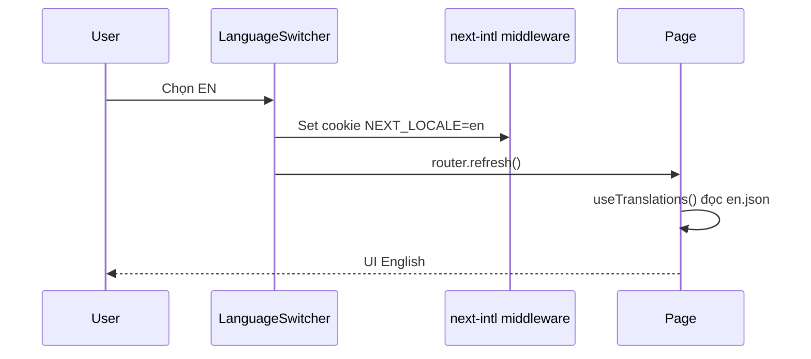

# PHASE 31: Localization Foundation + Shell/Admin (Wave A+B)

## Execution spec maturity

- **Mức hiện tại:** **95% Execution-Ready** (`rp3` 2026-07-21 — plan brain **9.4/10**, 0 blind spot)
- **Đánh giá:** Option **B**; §26.4 + §28. `rp3` khóa plugin request, switcher vị trí, namespace, batch B1–B6, showApiError pattern.
- **Điều kiện nâng thêm (không chặn execute):** tool extract strings nếu catalog phình.
- **Trạng thái triển khai:** ⬜ Chưa bắt đầu — **rp3 PASS** — chờ `` `tt `` / `/18-auto-execute` / `/04-do-plan`.

### Quyết định khóa (mặc định an toàn — override trước execute)

| Câu hỏi | Quyết định |
|---|---|
| Thư viện FE | **`next-intl`** (App Router Next 16) |
| Locale | **`vi` (default)**, **`en`** |
| URL strategy | **Không** đổi path. Locale qua cookie `NEXT_LOCALE` + `Accept-Language` fallback |
| Backend message | Contract `errorCode` machine EN + localize `errorCodeLabel`/`message` — **skeleton Errors** trong P31; catalogs đầy đủ + close ở **P33** |
| Dữ liệu DB | **Không** dịch master data / reason code / permission code |
| Phạm vi P31 | Wave **A+B** only — foundation + shell + **mọi** `admin/**` + `page.tsx` / `login` / `health-ui`. **Out P31:** `master-data/**` → P32; `mobile/**` + AC-09/10 → P33 |
| Chuỗi phase | **FOUNDER decide B:** P31 → P32 → P33; Milestone 5 sau **P33** |

---

## 1. Mục tiêu

Thiết lập nền i18n (**next-intl**, cookie locale, switcher, catalogs skeleton) và localize **100%** shell + toàn bộ trang **admin** + login/home/health-ui — shippable độc lập trước P32/P33.

## 2. Phạm vi

### In scope

- Cài `next-intl` + provider/middleware cookie locale.
- Catalog `frontend/messages/vi.json` + `en.json` (Common, Sidebar, Language, Errors skeleton, namespaces Admin.*).
- LanguageSwitcher trên **root/admin layout** + **master-data layout** (wire sẵn). **Mobile:** chưa có `mobile/layout.tsx` — **không** tạo layout mobile ở P31; switcher mobile → **P33** (cookie locale vẫn global từ root).
- **44 pages:** mọi `admin/**/page.tsx` (41) + `page.tsx` + `login/page.tsx` + `health-ui/page.tsx` (list §26.2).
- Sidebar + common chrome 100% `t()`.
- Shared `frontend/src/features/**` và components user-facing **được import bởi** pages P31: phải i18n trong P31 (không chỉ file `page.tsx`).
- `api-error-i18n.ts` + mở rộng `http-error.ts` / `toast` path: admin toast dùng `codeLabel`+`message`.
- Errors skeleton **đủ 8 codes** (§7 + §18).
- Verify P31: parity; inventory **44/44**; grep gate phạm vi P31.
### Non-negotiable output

- Switcher VI/EN OK, cookie giữ locale.
- Sidebar 100% i18n.
- **44/44** pages P31 inventory **0 hardcode** user-facing; **0 backlog** trong phạm vi P31.
- **Checklist §26.4** (pages + shell + features + foundation) dùng để validate đóng phase.
- Parity VI/EN cho keys đã thêm ở P31.
- Không đổi API routes/DB schema.

### Out of scope (ghi rõ)

- `master-data/**` → **Phase 32**.
- `mobile/**`, AC-09/10 product-wide 59/59, Errors catalogs đầy đủ, BE Accept-Language → **Phase 33**.
- Dịch DB / log / Hangfire / Swagger / WinUI desktop / RTL / locale thứ 3.

## 3. Điều kiện đầu vào

### Readiness checklist

- Phase 01–30 ✅ (Module DoD) theo `IMPLEMENTATION_PLAN.md`.
- Frontend Next 16 App Router chạy được (`npm run dev` port 3003).
- Không có i18n framework sẵn — greenfield setup được phép.
- FOUNDER xác nhận: default `vi`, URL không prefix locale (đã khóa bảng trên).

## 4. Setup

### Cấu trúc thư mục mới

```
frontend/
  messages/
    vi.json
    en.json
  src/
    middleware.ts         # đọc cookie NEXT_LOCALE (không rewrite path)
    i18n/
      request.ts          # next-intl getRequestConfig + import messages
      routing.ts          # locales=['vi','en'], defaultLocale='vi'
      config.ts           # LOCALE_COOKIE = 'NEXT_LOCALE'
    components/
      language-switcher.tsx
    lib/
      api-error-i18n.ts   # resolveApiError → { code, codeLabel, message }
      http-error.ts       # mở rộng: dùng resolve khi có t() / hoặc trả payload cho caller
```

### Wiring next-intl (không path-prefix) — bắt buộc đủ để code

1. `npm i next-intl`
2. `src/i18n/request.ts`: `getRequestConfig` đọc cookie `NEXT_LOCALE`, fallback `vi`, `import(\`../../messages/${locale}.json\`)`.
3. `src/middleware.ts`: dùng helper next-intl **hoặc** middleware mỏng chỉ validate cookie (không `localePrefix: 'always'`).
4. `src/app/layout.tsx`: bọc `NextIntlClientProvider`; set `<html lang={locale}>` (hiện hardcode `lang="en"` → đổi theo locale).
5. Plugin/request config theo docs next-intl App Router **without** `[locale]` segment.

### Pseudo — `i18n/request.ts`

```ts
import { getRequestConfig } from 'next-intl/server';
import { cookies } from 'next/headers';

export default getRequestConfig(async () => {
  const store = await cookies();
  const raw = store.get('NEXT_LOCALE')?.value;
  const locale = raw === 'en' || raw === 'vi' ? raw : 'vi';
  return {
    locale,
    messages: (await import(`../../messages/${locale}.json`)).default
  };
});
```

### Quy chuẩn mã nguồn

- Mọi chuỗi UI user-facing: `useTranslations('Namespace')` / `getTranslations`.
- Key: `Namespace.section.item` (ví dụ `Sidebar.groups.inventory`, `Common.actions.save`).
- Không nối chuỗi bằng `+` với từ đã dịch (dùng ICU / rich text khi cần).
- Comment code: tiếng Việt; UI copy: EN/VI trong JSON.

### Package

```bash
cd frontend && npm i next-intl
```

Không thêm i18n backend NuGet trong P31 (BE optional → **P33**).

## 5. Permissions

Không seed permission mới. Language switcher hiển thị cho user đã đăng nhập (và trang login public).

| Permission | Thay đổi |
|---|---|
| — | Không có |

## 6. Database

**Không migration.** Locale lưu:

| Cơ chế | Chi tiết |
|---|---|
| Cookie | `NEXT_LOCALE=vi\|en` (HttpOnly=false để FE đọc nếu cần; Prefer next-intl middleware set) |
| localStorage (optional mirror) | `nexustock:locale` — sync khi switch |
| User profile DB | **Defer** — không bắt buộc P31 |

## 7. Backend & API Contract

### Không đổi endpoint nghiệp vụ.

### Contract hỗ trợ (optional soft)

| Method | Path | Mục đích |
|---|---|---|
| — | Client gửi `Accept-Language: vi\|en` | BE optional điền `errorCodeLabel`/`message`; FE vẫn tự map từ catalogs (không phụ thuộc BE) |

### Error localization strategy (bắt buộc) — `up` 2026-07-21

> Quyết định cũ “`errorCode` giữ English — không localize code” **được thay thế**: FOUNDER yêu cầu **errorCode cũng localized** (phần hiển thị cho người dùng).

#### Wire JSON (machine + localized)

```json
{
  "errorCode": "CUTOVER_FROZEN",
  "errorCodeLabel": "Đang khóa ghi cutover",
  "message": "Các API ghi nghiệp vụ kho đang bị đóng băng trong cutover.",
  "traceId": "00-..."
}
```

| Field | Ngôn ngữ | Quy tắc |
|---|---|---|
| `errorCode` | Machine EN | Ổn định cho `if`/verify/log — **không** đổi thành chuỗi đã dịch |
| `errorCodeLabel` | VI/EN theo locale | **Bắt buộc localize** — nhãn ngắn của mã lỗi |
| `message` | VI/EN theo locale | **Bắt buộc localize** — mô tả chi tiết |

#### FE — nguồn chính (DoD bắt buộc)

```ts
// Pseudo — api-error-i18n.ts
export function resolveApiError(error, t): { code: string; codeLabel: string; message: string } {
  const code = error?.response?.data?.errorCode ?? 'UNKNOWN';
  const codeKey = `Errors.codes.${code}`;
  const msgKey = `Errors.messages.${code}`;
  return {
    code,
    codeLabel: t.has(codeKey) ? t(codeKey) : (error?.response?.data?.errorCodeLabel || code),
    message: t.has(msgKey) ? t(msgKey) : (error?.response?.data?.message || t('Errors.messages.generic'))
  };
}
```

Toast/dialog/UI lỗi: hiển thị **`codeLabel` + `message`** (không chỉ raw machine `errorCode`).

#### BE — wave D (khuyến nghị)

- Khi trả lỗi: có thể điền `errorCodeLabel` + `message` theo `Accept-Language` từ dictionary C# mirror catalogs.
- **Cấm** gán `errorCode` = chuỗi đã dịch.
- Không bắt buộc IStringLocalizer toàn hệ thống nếu FE map đủ keys.

#### Catalog tối thiểu (cặp codes + messages)

`Errors.codes.*` và `Errors.messages.*` cho **đủ 8 codes:** `CUTOVER_FROZEN`, `READINESS_DISABLED`, `READINESS_UNAUTHORIZED`, `CUTOVER_FREEZE_DENIED`, `TASK_INTERLEAVING_DISABLED`, `UNAUTHORIZED`, `FORBIDDEN`, `UNKNOWN`, + `Errors.messages.generic`.

~~Dòng cũ: `errorCode` giữ English — không localize code.~~ → **Superseded bởi `up` 2026-07-21.**

## 8. Frontend / Mobile / RF

### UX

- Switcher: `VI | EN` compact trên header/sidebar footer.
- Đổi locale → set cookie → `router.refresh()` (không full logout).
- Trạng thái: loading catalog không block shell (next-intl sync load OK).

### Wave thực thi trong P31 (4–5 ngày)

| Wave | Phạm vi | DoD wave |
|---|---|---|
| **A — Foundation** | next-intl, middleware, catalogs skeleton, LanguageSwitcher, Common + Sidebar | Build + switcher; Sidebar 100% `t()` |
| **B — Shell & admin** | layouts admin + master-data (switcher); login, home, health-ui; **mọi** `admin/**/page.tsx` + shared features dùng bởi admin | **44/44** pages; **0** hardcode user-facing trên phạm vi P31 |

Wave C → Phase 32. Wave D → Phase 33.


### Test IDs

- `language-switcher`
- `language-option-vi`
- `language-option-en`

## 9. Execution Flow



### Pseudo-code switcher

```tsx
'use client';
import { useLocale } from 'next-intl';
import { useRouter } from 'next/navigation';

export function LanguageSwitcher() {
  const locale = useLocale();
  const router = useRouter();
  function setLocale(next: 'vi' | 'en') {
    document.cookie = `NEXT_LOCALE=${next};path=/;max-age=31536000`;
    router.refresh();
  }
  return (
    <div data-testid="language-switcher">
      <button data-testid="language-option-vi" onClick={() => setLocale('vi')} aria-pressed={locale==='vi'}>VI</button>
      <button data-testid="language-option-en" onClick={() => setLocale('en')} aria-pressed={locale==='en'}>EN</button>
    </div>
  );
}
```

## 10. Validation & Business Rules

- Default locale = `vi` khi cookie thiếu.
- Locale không hợp lệ → fallback `vi`.
- Permission / API path / feature flag **không** phụ thuộc locale.
- Tenant isolation không đổi.
- Không store translated string vào DB audit (giữ raw/errorCode).

## 11. Exception Handling

| Tình huống | Hành vi |
|---|---|
| Thiếu key trong catalog | next-intl fallback / show key trong Dev; Prod: fallback locale `vi` rồi raw key — verify parity ngăn thiếu key |
| Cookie bị xóa | Fallback `vi` |
| JSON catalog invalid | Build fail (import JSON) |
| API message EN + thiếu Errors map | Hiển thị `Errors.messages.generic` + log code |

## 12. Observability & KPI

- Không KPI nghiệp vụ mới.
- Optional log client: `i18n.locale_changed` (console/debug only) — không bắt buộc.
- Trace ID API không đổi.

## 13. Test Plan

| Nhóm | Nội dung |
|---|---|
| Unit | Helper `resolveApiError` map code (≥8 skeleton) |
| Integration | `tests/verify_i18n.ps1 -Phase 31`: parity VI/EN; inventory **44/44**; grep gate `admin/**` + shell pages |
| E2E manual | Switcher VI→EN→VI trên sidebar + **1 admin page** (readiness hoặc home) — **không** bắt buộc mobile ở P31 |
| Negative | Locale `fr` → fallback vi |
| Regression | Login, readiness probe, freeze cutover vẫn chạy |

### verify_i18n.ps1 — mode **Phase 31** (matrix)

1. `vi.json` / `en.json` tồn tại.
2. Flatten keys parity (PowerShell compare).
3. Frontend build hoặc `node` script validate JSON.
4. (Optional) HTTP homepage 200 với cookie `NEXT_LOCALE=en`.
5. Inventory P31 = **44** paths (§26.2) tất cả DONE — **không** assert 59 ở P31 (59 = P33).
6. Assert Errors skeleton ≥8 machine code keys (tên key EN, value VI/EN).
7. Grep gate hardcode phạm vi P31 (allowlist tối thiểu, có comment).

## 14. Acceptance Criteria

| ID | Criteria | Evidence |
|---|---|---|
| AC-01 | next-intl wired; default `vi` | Screenshot + cookie |
| AC-02 | Switcher VI/EN hoạt động, refresh giữ locale | Video ngắn / walkthrough |
| AC-03 | Sidebar 100% i18n | Code review `app-sidebar.tsx` |
| AC-04 | Catalogs VI/EN key parity (keys P31) | `verify_i18n.ps1` PASS (mode P31) |
| AC-05 | Errors skeleton ≥8 codes: `Errors.codes.*` + `Errors.messages.*`; toast admin dùng `codeLabel`+`message` | List keys + screenshot |
| AC-05b | Wire `errorCode` vẫn machine EN | Diff + assert |
| AC-05c | `resolveApiError` path dùng `codeLabel`+`message` (không raw code làm copy chính) | Code review + unit |
| AC-07 | Không đổi API routes/DB schema | Diff review |
| AC-08 | Lint frontend 0 error trên file đổi | `npm run lint` |
| AC-09-P31 | **44/44** pages inventory P31 DONE + **§26.4** checklist file liên quan đã tick đủ | Checklist §26.4 + verify |
| AC-10-P31 | **0 backlog** trong phạm vi P31 (mọi mục §26.4 A–H = `[x]`) | Sign-off |
| AC-11-P31 | **`rp1`:** Không còn file user-facing in-scope P31 ngoài §26.4 (nếu phát sinh file mới giữa chừng → bổ sung checklist trước đóng) | Diff vs §26.4 |
> AC-06 / AC-09 product / AC-10 product → **Phase 33**. AC master-data → **Phase 32**.

### Definition of Done

- Wave A+B hoàn tất 100%; inventory 44/44 DONE; 0 backlog P31.
- **Checklist §26.4** — mọi dòng `[ ]` trong phạm vi P31 đã tick `[x]` (validate đóng phase).
- Verify P31 PASS (parity + inventory + grep gate phạm vi P31).
- README mục Language (foundation) cập nhật.
- Phase note + master plan: P31 ✅; P32/P33 vẫn ⬜.

## 15. Out of Scope

- Phase 32/33 scopes (master-data, mobile, product AC-09/10).
- Dịch dữ liệu master / reason / product name.
- Swagger/Hangfire full i18n.
- Backend resource files toàn hệ thống (optional P33).
- Locale theo user profile server-side.
- Auto-extract CI bắt buộc.

## 16. Downstream Dependencies

- **P32** phụ thuộc P31 foundation (next-intl + catalogs + switcher).
- **P33** phụ thuộc P31+P32; khóa Milestone 5.
- Mọi UI mới sau P33: bắt buộc key VI+EN cùng PR.
- Không phá Phase 30 readiness UI — nằm trong Wave B / P31.

## 17. Maintenance & Rollback

### Maintenance

- Thêm string: cập nhật **cả** `vi.json` và `en.json`.
- PR checklist: parity keys.
- Namespace mới theo module (`Inbound.*`, `Wave.*`).

### Rollback

1. Tắt LanguageSwitcher (ẩn component).
2. Xóa/ignore middleware locale → luôn `vi`.
3. Revert package `next-intl` nếu cần (git revert PR).
4. Không DB rollback.

```powershell
# Khẩn cấp: xóa cookie client
# DevTools → Application → Cookies → NEXT_LOCALE delete
```

## 18. Catalog namespace tối thiểu (Mock structure)

```json
{
  "Common": {
    "actions": { "save": "Lưu", "cancel": "Hủy", "refresh": "Làm mới", "search": "Tìm kiếm" },
    "states": { "loading": "Đang tải…", "empty": "Không có dữ liệu", "error": "Đã xảy ra lỗi" }
  },
  "Sidebar": {
    "groups": { "overview": "Tổng quan", "inventory": "Tồn kho", "system": "Hệ thống & Quyền" },
    "links": { "home": "Trang chủ", "readiness": "Readiness", "cutover": "Cutover" }
  },
  "Errors": {
    "codes": {
      "CUTOVER_FROZEN": "Đang khóa ghi cutover",
      "READINESS_DISABLED": "Readiness đang tắt",
      "READINESS_UNAUTHORIZED": "Không đủ quyền readiness",
      "CUTOVER_FREEZE_DENIED": "Từ chối thao tác freeze",
      "TASK_INTERLEAVING_DISABLED": "Task interleaving đang tắt",
      "UNAUTHORIZED": "Không có quyền",
      "FORBIDDEN": "Bị từ chối truy cập",
      "UNKNOWN": "Lỗi không xác định"
    },
    "messages": {
      "CUTOVER_FROZEN": "Các API ghi nghiệp vụ kho đang bị đóng băng trong cutover.",
      "READINESS_DISABLED": "Module readiness đang tắt bởi feature flag.",
      "READINESS_UNAUTHORIZED": "Tài khoản không có quyền thao tác readiness.",
      "CUTOVER_FREEZE_DENIED": "Không thể thay đổi trạng thái freeze cutover.",
      "TASK_INTERLEAVING_DISABLED": "Tính năng gợi ý việc tiếp theo đang tắt.",
      "UNAUTHORIZED": "Phiên đăng nhập không hợp lệ hoặc hết hạn.",
      "FORBIDDEN": "Bạn không được phép thực hiện thao tác này.",
      "UNKNOWN": "Đã xảy ra lỗi không xác định.",
      "generic": "Yêu cầu thất bại."
    }
  },
  "Language": { "vi": "Tiếng Việt", "en": "English" }
}
```

`en.json` mirror cùng key, value English.

---

## 19. Auto-critique & maturity (Bước 4–5 planner)

### Critique checklist

| # | Câu hỏi | Kết luận |
|---|---|---|
| 1 | Write concurrency? | N/A — không ghi DB locale |
| 2 | Hardware failure? | N/A — UI only |
| 3 | Network outage? | Cookie local; catalogs bundle trong build — offline vẫn có string |
| 4 | Third-party? | Không phụ thuộc dịch vụ dịch thuật ngoài |

### Rủi ro đã khóa

| Rủi ro | Mitigation |
|---|---|
| 59 pages quá lớn 1 PR | **Mitigated Option B:** P31 chỉ **44**; product 59/59 khóa **P33** |
| Path locale phá bookmark | **Không** dùng `/en/...` prefix |
| Lệch key VI/EN | verify parity bắt buộc |
| API message / errorCode lẫn ngôn ngữ | Localize **label + message**; machine `errorCode` giữ EN trên wire |
| Shared `features/**` hardcode | P31: mọi component user-facing **được import bởi** pages P31 phải qua `t()` (không chỉ `page.tsx`) |


### Maturity score

**95% Execution-Ready** — đủ stack, contract catalogs, waves, verify, rollback để 1 Developer code ngay.

---

## 20. Implementation order (executor)

1. `npm i next-intl` + `i18n/request.ts` + `middleware.ts` + (plugin nếu cần) `next.config.ts`.
2. `messages/vi.json` + `en.json` (Common, Sidebar, Language, Errors **8 codes**).
3. Root layout: `NextIntlClientProvider` + `lang={locale}`; LanguageSwitcher trên admin + master-data layout.
4. Refactor `app-sidebar.tsx` → `t('Sidebar.*')`.
5. Wave B: 44 pages §26.2 + shared `features/**` import bởi admin.
6. `api-error-i18n.ts` + wire `http-error` / `toast` (admin).
7. `tests/verify_i18n.ps1 -Phase 31` (parity + 44 inventory + grep).
8. README Language + cập nhật phase/master plan P31 ✅.

**Lệnh execute:** `` `tt `` / `/18-auto-execute` / `/04-do-plan`.

---

## 21. rp index snapshot (2026-07-21)

| Phát hiện | Chi tiết |
|---|---|
| i18n lib | Không có trong `package.json` |
| messages/locales | 0 file |
| Pages | ~59 `page.tsx` |
| Sidebar | Hardcode VI + vài EN |
| Backend | `errorCode` machine EN; **`up`:** localize `errorCodeLabel` + `message` |
| Calendar | `locale` prop day-picker — tái sử dụng khi format |

---

## 22. FOUNDER decision log (`up` 2026-07-21)

| ID | Trước | Sau |
|---|---|---|
| Error display | Chỉ map message; raw `errorCode` EN trên UI | **Localize cả nhãn errorCode (`errorCodeLabel` / `Errors.codes.*`) và message (`Errors.messages.*`)** |
| Wire `errorCode` | EN | **Vẫn EN** (programmatic) — không phá client/verify |
| BE optional | Không | Soft field `errorCodeLabel`; FE tự đủ DoD |

**Trạng thái sau `up` errorCode:** Maturity **95% Ready**. §7 / AC-05 / §20 đã đồng bộ.

## 23. FOUNDER decision log (`up` AC/DoD 2026-07-21)

| ID | Trước | Sau |
|---|---|---|
| Page coverage | ≥ 1 page đại diện / wave | **59/59 `page.tsx` + shell/components user-facing** |
| Backlog DoD | Cho phép low-traffic list file | **0 backlog** — không đóng phase nếu còn “làm sau” |
| Mobile AC-06 | ≥ 1 flow | **100% `mobile/**/page.tsx`** |
| Errors AC-05 | ≥ 8 machine codes | **Toàn bộ** `errorCode` FE đang map + AC-05c bắt buộc `codeLabel` |
| Verify | Parity + optional HTTP | + page inventory + grep gate + machine code assert |
| Wave DoD | Spot-check / soft | Wave B–D = **0 hardcode** trên phạm vi wave; đóng phase = AC-09 + AC-10 |

**Trạng thái sau `up` AC/DoD:** Maturity vẫn **95% Ready** (siết DoD, không đổi stack). Execute phải inventory freeze số `page.tsx` ngày start (baseline 59 @ 2026-07-21).

## 24. `/30-auto-project-planner` — Có nên tách phase? (chờ quyết định FOUNDER)

**Ngày:** 2026-07-21  
**Inventory:** admin **41** · master-data **8** · mobile **7** · other **3** (home/login/health-ui) = **59**  
**Effort P31 monolithic (sau siết DoD):** ước **8–11** ngày → **vượt trần 7 ngày/phase**.

### Critique checklist (Bước 4)

| # | Câu hỏi | Kết luận |
|---|---|---|
| 1 | Write concurrency? | N/A — UI/i18n |
| 2 | Hardware failure? | N/A |
| 3 | Network outage? | Catalogs bundle; cookie local — OK |
| 4 | Third-party? | Không MT pipeline |

### Options (consult — chờ `decide`)

| ID | Phương án | Ước ngày | Khuyến nghị |
|---|---|---|---|
| **A** | Giữ 1 Phase 31 (4 wave nội bộ) | 8–11 | Không — vượt trần, all-or-nothing |
| **B** | **Tách 3 phase** | P31 4–5d · P32 3–4d · P33 3–4d | **Có — khuyến nghị** |
| **C** | Tách 4 phase = đúng 4 wave | P31A ~1d + … | Không — dưới sàn 3d / overhead |

### Option B chi tiết (nếu FOUNDER chọn)

| Phase | Phạm vi | Pages DoD | Dev-days |
|---|---|---|---|
| **31** Localization Foundation + Shell/Admin | Wave A+B: next-intl, switcher, sidebar, login/home/health-ui, **mọi** `admin/**` | ~44 | 4–5 |
| **32** Localization Master-data + WMS còn lại | Wave C: **mọi** `master-data/**` + leftover admin WMS nếu còn | phần còn lại tới đủ MD | 3–4 |
| **33** Localization Mobile + Errors + Product close | Wave D: **mọi** `mobile/**`, Errors catalogs đầy đủ, verify **59/59 + 0 backlog** (AC-09/10) | 7 mobile + đóng toàn product | 3–4 |

Milestone 5 chuyển: **sau Phase 33**.  
`phase_31` hiện tại giữ làm **umbrella / baseline contract**; khi decide B → sinh `phase_32_*` + `phase_33_*` (18 mục) + sync Gantt — **không xóa** lịch sử §22–§23.

**Chờ FOUNDER:** ~~trả lời **A / B / C**~~ → **ĐÃ QUYẾT ĐỊNH: B** (xem §25).

## 25. FOUNDER `consult_decide` Option B (2026-07-21)

| Field | Giá trị |
|---|---|
| Option | **B** — Tách 3 phase |
| DecidedBy | FOUNDER |
| Artifact | `docs/it-factory/00-consult.md` |

| Phase | Spec | Dev-days | Pages DoD |
|---|---|---|---|
| **31** | File này (Wave A+B) | 4–5 | **44** (41 admin + 3 shell) |
| **32** | `phase_32_localization_master_data.md` | 3–4 | **8** master-data |
| **33** | `phase_33_localization_mobile_errors.md` | 3–4 | **7** mobile + đóng **59/59** + Errors full |

Milestone 5: **sau Phase 33**.  
Maturity chuỗi: **95% Ready** từng phase.

## 26. `rp1` gate — sẵn sàng execute? (2026-07-21)

### Kết luận

| Hạng mục | Trước rp1 | Sau vá |
|---|---|---|
| Đồng bộ Option B vs AC/DoD | Lệch §13 (còn assert 59 + E2E mobile) | **Đã vá** — verify mode P31 = 44 |
| Inventory file list | Chỉ đếm 44, chưa list | **§26.2** đủ 44 path |
| next-intl wiring | Thiếu pseudo request/layout | **§4 wiring** + pseudo |
| Shared `features/**` | Mơ hồ | **In scope** nếu import bởi pages P31 |
| Mobile switcher | “wire mobile layout” nhưng **không có** layout | **Defer P33**; cookie global từ root |
| Errors ≥8 vs mock 4 | Lệch | **§18** đủ 8 codes + messages |
| `http-error.ts` hiện tại | Chỉ `message` | P31 mở rộng qua `api-error-i18n` / toast |
| Master plan | P31–33 OK | Đồng bộ ghi chú rp1 |

**Verdict:** Phase 31 **đủ chuẩn execute (95% → giữ 95%, gap đã khóa)**. FOUNDER gọi `` `tt `` / `/18-auto-execute`.

### 26.1 Checklist rp1 (không xóa lịch sử §22–§25)

- [x] 18 mục chuẩn còn đủ
- [x] Phạm vi P31 ≠ product 59/59
- [x] AC-09-P31 / AC-10-P31 rõ
- [x] Downstream P32/P33 / Milestone 5 đúng
- [x] IMPLEMENTATION_PLAN Gantt + bảng tiến độ khớp

### 26.2 Inventory P31 freeze (44) — baseline 2026-07-21

**Shell (3)**

1. `page.tsx`
2. `login/page.tsx`
3. `health-ui/page.tsx`

**Admin (41)**

4. `admin/allocation/page.tsx`
5. `admin/audit/page.tsx`
6. `admin/cross-docking/page.tsx`
7. `admin/cross-docking/[id]/page.tsx`
8. `admin/cutover/page.tsx`
9. `admin/exceptions/page.tsx`
10. `admin/genealogy/page.tsx`
11. `admin/genealogy/[lotNo]/page.tsx`
12. `admin/inbound/page.tsx`
13. `admin/inbound/[id]/receive/page.tsx`
14. `admin/integrations/import/page.tsx`
15. `admin/integrations/mappings/page.tsx`
16. `admin/integrations/messages/page.tsx`
17. `admin/inventory/page.tsx`
18. `admin/inventory/stocktakes/page.tsx`
19. `admin/inventory/stocktakes/new/page.tsx`
20. `admin/inventory/stocktakes/[id]/page.tsx`
21. `admin/labor/page.tsx`
22. `admin/labor/sessions/page.tsx`
23. `admin/local-agent/page.tsx`
24. `admin/lots/page.tsx`
25. `admin/lpn/page.tsx`
26. `admin/observability/page.tsx`
27. `admin/observability/alerts/page.tsx`
28. `admin/observability/timeline/page.tsx`
29. `admin/outbound/page.tsx`
30. `admin/putaway/page.tsx`
31. `admin/qc/page.tsx`
32. `admin/readiness/page.tsx`
33. `admin/replenishment/page.tsx`
34. `admin/rma/page.tsx`
35. `admin/roles/page.tsx`
36. `admin/rules/page.tsx`
37. `admin/serial/page.tsx`
38. `admin/task-interleaving/page.tsx`
39. `admin/users/page.tsx`
40. `admin/waves/page.tsx`
41. `admin/waves/[id]/page.tsx`
42. `admin/waves/[id]/put-wall/page.tsx`
43. `admin/webhooks/subscriptions/page.tsx`
44. `admin/webhooks/deliveries/page.tsx`

> Prefix đầy đủ: `frontend/src/app/`. Nếu freeze lúc execute lệch số → ghi evidence + cập nhật AC-09-P31 (không im lặng).

### 26.3 Touchpoint code hiện có (rp index)

| File | Việc P31 |
|---|---|
| `frontend/src/lib/http-error.ts` | Mở rộng payload / integrate `resolveApiError` |
| `frontend/src/lib/toast.ts` | Nhận `codeLabel`+`message` hoặc helper showApiError |
| `frontend/src/app/layout.tsx` | `NextIntlClientProvider` + `lang={locale}` |
| `frontend/src/components/app-sidebar.tsx` | 100% `t('Sidebar.*')` |
| `frontend/src/app/admin/layout.tsx` | Gắn LanguageSwitcher |
| `frontend/src/app/master-data/layout.tsx` | Gắn LanguageSwitcher (pages MD vẫn P32) |
| `frontend/next.config.ts` | Theo docs next-intl nếu cần `createNextIntlPlugin` |

### 26.4 Checklist validate đóng Phase 31 (`rp1` 2026-07-21 — chi tiết mọi file)

> **Cách dùng:** Executor tick `[x]` khi file đã: (1) không còn hardcode user-facing VI/EN lẫn, (2) chuỗi qua `t()` / catalogs, (3) key có đủ trong `vi.json` **và** `en.json`.  
> **Đóng P31 chỉ khi:** mọi mục **A–H** = `[x]` + `verify_i18n.ps1 -Phase 31` PASS.  
> Prefix trừ khi ghi absolute: `frontend/src/`.  
> **Không** tick mục **I** (out of scope) trong DoD P31.

**Tổng in-scope P31:** 44 pages + 3 admin components + 10 feature UI + 7 shell/lib/layout + 8 foundation/catalog ≈ **72** hạng mục file (không đếm `components/ui/*` primitives).

---

#### A. Foundation / catalogs (tạo mới hoặc cấu hình) — 8

- [ ] `messages/vi.json`
- [ ] `messages/en.json` (parity keys với `vi.json`)
- [ ] `src/i18n/request.ts`
- [ ] `src/i18n/routing.ts`
- [ ] `src/i18n/config.ts`
- [ ] `src/middleware.ts`
- [ ] `src/components/language-switcher.tsx` (`data-testid`: language-switcher / language-option-vi / language-option-en)
- [ ] `src/lib/api-error-i18n.ts` (`resolveApiError`)
- [ ] `next.config.ts` (plugin next-intl nếu docs yêu cầu — tick khi đã cấu hình hoặc N/A có comment trong PR)

#### B. Shell / chrome / providers — 7

- [ ] `src/app/layout.tsx` (`NextIntlClientProvider`, `<html lang={locale}>`)
- [ ] `src/app/admin/layout.tsx` (LanguageSwitcher)
- [ ] `src/app/master-data/layout.tsx` (LanguageSwitcher only — **không** localize pages MD)
- [ ] `src/components/app-sidebar.tsx`
- [ ] `src/components/breadcrumb-nav.tsx` (map label segment → `t()`; segment master-data có thể dùng key sẵn cho P32)
- [ ] `src/components/auth-guard.tsx` (vd. “Đang kiểm tra bảo mật…”)
- [ ] `src/lib/confirm-dialog.tsx` (default “Đồng ý” / “Hủy”)

#### C. Error / toast helpers — 2

- [ ] `src/lib/http-error.ts`
- [ ] `src/lib/toast.ts` (hoặc helper `showApiError` dùng `codeLabel`+`message`)

#### D. Pages shell (3/44)

- [ ] `src/app/page.tsx`
- [ ] `src/app/login/page.tsx`
- [ ] `src/app/health-ui/page.tsx`

#### E. Pages admin (41/44)

- [ ] `src/app/admin/allocation/page.tsx`
- [ ] `src/app/admin/audit/page.tsx`
- [ ] `src/app/admin/cross-docking/page.tsx`
- [ ] `src/app/admin/cross-docking/[id]/page.tsx`
- [ ] `src/app/admin/cutover/page.tsx`
- [ ] `src/app/admin/exceptions/page.tsx`
- [ ] `src/app/admin/genealogy/page.tsx`
- [ ] `src/app/admin/genealogy/[lotNo]/page.tsx`
- [ ] `src/app/admin/inbound/page.tsx`
- [ ] `src/app/admin/inbound/[id]/receive/page.tsx`
- [ ] `src/app/admin/integrations/import/page.tsx`
- [ ] `src/app/admin/integrations/mappings/page.tsx`
- [ ] `src/app/admin/integrations/messages/page.tsx`
- [ ] `src/app/admin/inventory/page.tsx`
- [ ] `src/app/admin/inventory/stocktakes/page.tsx`
- [ ] `src/app/admin/inventory/stocktakes/new/page.tsx`
- [ ] `src/app/admin/inventory/stocktakes/[id]/page.tsx`
- [ ] `src/app/admin/labor/page.tsx`
- [ ] `src/app/admin/labor/sessions/page.tsx`
- [ ] `src/app/admin/local-agent/page.tsx`
- [ ] `src/app/admin/lots/page.tsx`
- [ ] `src/app/admin/lpn/page.tsx`
- [ ] `src/app/admin/observability/page.tsx`
- [ ] `src/app/admin/observability/alerts/page.tsx`
- [ ] `src/app/admin/observability/timeline/page.tsx`
- [ ] `src/app/admin/outbound/page.tsx`
- [ ] `src/app/admin/putaway/page.tsx`
- [ ] `src/app/admin/qc/page.tsx`
- [ ] `src/app/admin/readiness/page.tsx`
- [ ] `src/app/admin/replenishment/page.tsx`
- [ ] `src/app/admin/rma/page.tsx`
- [ ] `src/app/admin/roles/page.tsx`
- [ ] `src/app/admin/rules/page.tsx`
- [ ] `src/app/admin/serial/page.tsx`
- [ ] `src/app/admin/task-interleaving/page.tsx`
- [ ] `src/app/admin/users/page.tsx`
- [ ] `src/app/admin/waves/page.tsx`
- [ ] `src/app/admin/waves/[id]/page.tsx`
- [ ] `src/app/admin/waves/[id]/put-wall/page.tsx`
- [ ] `src/app/admin/webhooks/subscriptions/page.tsx`
- [ ] `src/app/admin/webhooks/deliveries/page.tsx`

#### F. Admin colocated components — 3

- [ ] `src/app/admin/labor/components/labor-charts.tsx`
- [ ] `src/app/admin/task-interleaving/components/recommendation-kpis.tsx`
- [ ] `src/app/admin/task-interleaving/components/recommendation-table.tsx`

#### G. Features UI import bởi admin (user-facing) — 10

- [ ] `src/features/outbound/components/create-dialog.tsx`
- [ ] `src/features/outbound/components/pick-dialog.tsx`
- [ ] `src/features/outbound/components/pack-dialog.tsx`
- [ ] `src/features/printing/components/print-label-dialog.tsx` (qua pack-dialog)
- [ ] `src/features/printing/components/reprint-label-dialog.tsx`
- [ ] `src/features/printing/components/print-job-status-badge.tsx`
- [ ] `src/features/inventory/components/move-dialog.tsx`
- [ ] `src/features/inventory/components/lock-dialog.tsx`
- [ ] `src/features/qc/components/qc-result-dialog.tsx`
- [ ] `src/features/qc/components/hold-release-dialog.tsx`

> `features/*/api.ts` + `types.ts`: **không** bắt buộc i18n (không UI copy).  
> `features/outbound/hooks/*`, `features/printing/hooks/*`: chỉ localize nếu có chuỗi user-facing; mặc định N/A.

#### H. Gate verify / docs — 4

- [ ] `tests/verify_i18n.ps1` hỗ trợ `-Phase 31` (parity + 44 inventory + grep A–G)
- [ ] Evidence: bảng tick §26.4 (PR / walkthrough / file evidence)
- [ ] `README.md` mục Language (foundation)
- [ ] `planning/IMPLEMENTATION_PLAN.md` + phase note P31 → ✅ sau khi đủ A–H

#### I. Out of scope P31 (không tick để đóng P31) — tham chiếu

| File / nhóm | Phase |
|---|---|
| `src/app/master-data/**/page.tsx` (8) | **P32** |
| `src/features/master-data/master-data-crud.tsx` | **P32** |
| `src/app/mobile/**` + `components/mobile/*` | **P33** |
| Errors catalogs **đầy đủ** mọi code FE (ngoài skeleton 8) | **P33** |
| `components/ui/*` (shadcn primitives) | N/A trừ khi inject copy user-facing |
| BE Accept-Language dictionary | **P33** optional |

#### J. Công thức đóng phase (validator)

```
PASS_P31 =
  (all A–H checked)
  AND verify_i18n.ps1 -Phase 31 PASS
  AND AC-01…AC-05c, AC-07, AC-08, AC-09-P31, AC-10-P31, AC-11-P31
  AND backlog_P31_count == 0
```

**`rp1` bổ sung checklist:** 2026-07-21 — đủ file để validate sau hoàn thành P31.

## 27. `rp2` + `/17-auto-plan` — Execute plan (2026-07-21)

| Artifact | Path |
|---|---|
| Function index | `C:\Users\mes\.gemini\antigravity\brain\17cf2960-4583-44a5-918a-5eb1c709dc96\function_index_phase31_i18n.md` |
| Implementation plan | `...\implementation_plan.md` (**9.2/10** sau refine) |
| Critic | `...\critic_report.md` (pre-refine 8.4) |

### Khóa kỹ thuật từ pipeline

| Quyết định | Chi tiết |
|---|---|
| next-intl | **Không** `app/[locale]` — cookie + `getRequestConfig` + `NextIntlClientProvider` |
| Tasks | EP0 → EP1 (A) → EP2 → EP3 (features) → EP4 batches B1–B6 → EP5 |
| Micro-gate | Parity sau mỗi batch admin |
| Login | LanguageSwitcher **bắt buộc** trên `/login` |
| Đóng | §26.4 A–H + verify + README + CHANGELOG |

**Trạng thái:** Execute-ready **100% theo plan brain**. Spec phase vẫn **95% Ready** (chưa code).  
**Lệnh:** `` `tt `` / `/18-auto-execute` / `/04-do-plan` theo `implementation_plan.md`.

## 28. `rp3` — Điểm mù đã khóa (2026-07-21)

| ID | Điểm mù | Khóa |
|---|---|---|
| BS-1 | `getLocale` không wire | **Bắt buộc** `createNextIntlPlugin('./src/i18n/request.ts')` — vẫn cấm `[locale]` |
| BS-2 | Pseudo request.ts thiếu | Có trong brain plan RP3 |
| BS-3 | Switcher ở đâu | Sidebar footer + login + health-ui |
| BS-4 | toast + hook | `resolveApiError` rồi `showApiError(string, string)` |
| BS-5 | Namespace loạn | `Features.*` dialogs; `Admin.<area>.*` pages |
| BS-6 | Home server vs client | Home = `getTranslations`; admin/login/health = `useTranslations` |
| BS-7 | Batch file mơ hồ | B1…B6 list cứng trong brain plan (41 files) |
| BS-8 | verify script | Skeleton 5 bước trong brain plan |
| BS-9 | SEO prefix | Phase riêng — cấm tự làm ở P31 |
| BS-10 | Version changelog | Cập nhật **v1.4.0** cùng ngày |

**Verdict rp3:** Đủ chi tiết xuyên suốt — **0 điểm mù chặn execute**. Score plan **9.4/10**.

---
