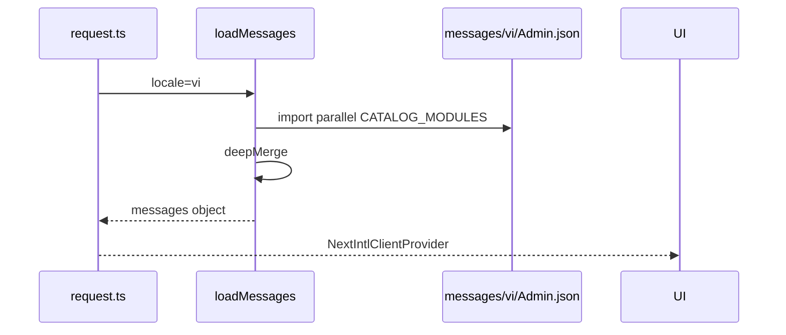

# PHASE 31a: i18n Catalog Modules (Split + Merge at Load)

## Execution spec maturity

- **Mức hiện tại:** **Module DoD 100%** — `rp4`+`rp5` PASS 2026-07-21
- **Đánh giá:** Catalogs module PascalCase + `loadMessages` static merge; hygiene Breadcrumb 6 keys; verify `-Phase 31a` + `-Phase 31` PASS (1855 keys); dbm 0 pageerror.
- **Trạng thái triển khai:** ✅ Hoàn thành 2026-07-21 (`rp5` đóng tài liệu).

### Quyết định khóa

| Câu hỏi | Quyết định |
|---|---|
| Chiến lược catalogs | **B — Tách file theo domain/module + deep-merge trong `getRequestConfig`** |
| **Tên file** | **Option 1 — 1:1 namespace, PascalCase** (`Common.json` ↔ root `Common`) |
| **Tên key** | **Option 1 — Semantic sections + camelCase** (áp dụng key **mới**; legacy P31 flat giữ parity khi migrate) |
| Namespace root | Giữ `Common`, `Admin`, `Features`, … — zero churn `useTranslations('Admin.inbound')` **area path** |
| Monolith cũ | Migrate xong → xóa `messages/vi.json` / `en.json` (chỉ còn `vi/` `en/`) |
| P32/P33 | Chỉ `messages/{locale}/{Namespace}.json` — **cấm** monolith; key mới **bắt buộc** semantic |
| URL / next-intl | Không đổi cookie; **không** `[locale]` |

### Changelog plan (giữ lịch sử)

| Ngày | Thay đổi |
|---|---|
| 2026-07-21 | Khóa Option B split+merge; draft file kebab (`common.json`, `master-data.json`, …) |
| 2026-07-21 | **up `/30-auto-project-planner`:** File **Option 1 PascalCase 1:1**; Key **Option 1 semantic sections**; P32/P33 sync |
| 2026-07-21 | **`rp1`:** Khóa hygiene Breadcrumb (6 key kebab) + mapper URL→camelCase; **cấm** dynamic `import(\`${name}\`)` — dùng static import map; skeleton `verify_i18n -Phase 31a`; path migrate script |
| 2026-07-21 | **`rp2` `/17-auto-plan`:** Function index + implementation_plan EP0–EP4 (score **9.6/10**); critic C1–C3 đã refine; đủ chuẩn execute |
| 2026-07-21 | **`rp3`:** Khóa BS-31a-7…14 (parity rename, gitignore bak, Set eq, cấm build EP2–EP3, path evidence, idempotent migrate, single-root assert); score plan **9.7/10** — **0 điểm mù** |

---

## 1. Mục tiêu

Tái cấu trúc catalogs i18n thành **nhiều file PascalCase = namespace**, load bằng **merge**, chuẩn hóa **quy tắc đặt tên key** cho maintain, ownership rõ cho P32 (`MasterData.json`) và P33 (`Mobile.json` + `Errors.json`).

## 2. Phạm vi

### In scope

- Tạo cây (tên file = root namespace):
  ```
  frontend/messages/
    vi/
      Common.json
      Language.json
      Sidebar.json
      Breadcrumb.json
      Errors.json
      Home.json
      Login.json
      HealthUi.json
      Admin.json
      Features.json
    en/
      … mirror cùng tên file (PascalCase) …
  ```
- Helper `loadMessages(locale)`: import song song + **deepMerge**.
- Đổi `src/i18n/request.ts` dùng loader mới.
- Script migrate: monolith → `{Namespace}.json` (1 root key / file).
- Hygiene khi migrate: **6** key kebab trong `Breadcrumb` (baseline inventory 2026-07-21) → camelCase + patch `breadcrumb-nav.tsx` (map URL segment → key). Danh sách khóa §9.1.
- **Không** big-bang flatten→semantic cho toàn bộ `Admin.*` trong P31a (giữ flat legacy để AC parity runtime + tránh churn 44 pages).
- Cập nhật `tests/verify_i18n.ps1`: thêm `-Phase 31a` (giữ `-Phase 31` monolith parity cho regression lịch sử **hoặc** Phase 31 đọc merged modules sau migrate — xem §13).
- Script migrate một lần: `frontend/scripts/migrate-i18n-catalogs.mjs` (Node).
- Evidence: `planning/evidence/phase_31a/keys_before.txt` + `keys_after.txt` + `hygiene_rename.json`.
- README: cấu trúc file + **bảng quy tắc key** R-F*/R-K*.
- Sync docs P32/P33 (đã sync; rp1 xác nhận).

### Non-negotiable output

- Sau migrate: flatten keys runtime ≈ monolith (trừ hygiene kebab đã khóa).
- Callers: chỉ đổi nếu đụng kebab fix; còn lại `t()` path giữ.
- Verify `-Phase 31a` PASS.
- Spec P32/P33 khóa `MasterData.json` / `Mobile.json` / `Errors.json` + semantic keys cho nội dung mới.

### Out of scope

- Localize MD/mobile pages (P32/P33).
- Big-bang rename toàn bộ leaf `Admin.inbound.createOrder` → `…actions.createOrder` trong P31a.
- SEO `/en`, per-page JSON, BE IStringLocalizer.
- Tách một namespace ra nhiều file (phá rule 1:1) — **cấm** trong P31a+.

## 3. Điều kiện đầu vào

- Phase **31** ✅.
- Tồn tại `frontend/messages/vi.json` + `en.json`.
- FOUNDER: Option B catalogs + Option 1 file + Option 1 key (2026-07-21).

## 4. Setup

### Cấu trúc thư mục đích

```
frontend/
  messages/
    vi/{Namespace}.json
    en/{Namespace}.json
  src/
    i18n/
      request.ts
      load-messages.ts
      merge-messages.ts
      catalog-modules.ts    # danh sách PascalCase = tên file không .json
  docs/ (README Language section)
```

### Quy chuẩn — Tên file (Option 1) — KHÓA

| Rule | Chi tiết |
|---|---|
| R-F1 | `FileName` (không `.json`) **===** root JSON key **===** entry trong `CATALOG_MODULES` |
| R-F2 | PascalCase đúng như namespace hiện có: `HealthUi.json` (không `health-ui.json`, không `healthUI.json` lệch) |
| R-F3 | Mỗi file shape: `{ "<Namespace>": { … } }` — đúng một root key |
| R-F4 | Windows case-insensitive: **cấm** hai file chỉ khác hoa/thường |
| R-F5 | Thêm domain: tạo cặp `vi/X.json` + `en/X.json` + 1 dòng `CATALOG_MODULES` |
| R-F6 | **Cấm** split `Admin` thành nhiều file; một `Admin.json` duy nhất |

### Quy chuẩn — Tên key (Option 1) — KHÓA

Đường dẫn: `{Namespace}.{area?}.{section}.{leaf…}` với **camelCase** mọi segment (trừ `Errors.codes.*`).

#### Sections bắt buộc (key mới)

| Section | Mục đích | Ví dụ path |
|---|---|---|
| `page` | title / subtitle / empty | `MasterData.products.page.title` |
| `actions` | nút / CTA | `MasterData.products.actions.create` |
| `fields` | label + placeholder | `MasterData.products.fields.sku.label` |
| `columns` | header cột bảng | `MasterData.products.columns.sku` |
| `status` | nhãn trạng thái UI | `MasterData.products.status.active` |
| `toast` | toast success/error copy | `MasterData.products.toast.createSuccess` |
| `errors` | validation / form error copy | `MasterData.products.errors.skuRequired` |
| `dialog` | tiêu đề/mô tả dialog cục bộ | `MasterData.products.dialog.create.title` |

#### Rule key cứng

| ID | Rule |
|---|---|
| R-K1 | Mọi segment **camelCase**; **cấm kebab** (`masterData` không `master-data`) |
| R-K2 | `Errors.codes.*` = **SCREAMING_SNAKE** map 1:1 machine `errorCode` |
| R-K3 | `Errors.messages.*` = camelCase mô tả người dùng |
| R-K4 | Shared UI → `Common.actions.*` / `Common.states.*` — **không** copy “Lưu/Hủy” vào từng page |
| R-K5 | Dialog dùng chung module Features → `Features.{module}.{section}.*` |
| R-K6 | **Key mới** (P32/P33 và mọi PR sau khóa) **bắt buộc** đủ section trong bảng trên |
| R-K7 | **Legacy P31** (`Admin.inbound.createOrder`, `colOrderNo`, …): giữ nguyên khi split file; **migrate semantic lazy** khi chạm page đó (P32+ hoặc PR UI cùng trang) — không block P31a |
| R-K8 | Khi lazy-migrate một area: đổi JSON + mọi `t('…')` cùng PR; không để dual-key lâu dài |

### Package

Không bắt buộc package mới. Deep merge tự viết trong repo.

## 5. Permissions

| Permission | Thay đổi |
|---|---|
| — | Không có |

## 6. Database

**Không migration.**

## 7. Backend & API Contract

**Không đổi.**

## 8. Frontend

### UX

Không đổi UX. Switcher / cookie giữ nguyên.

### Mapping file ↔ namespace (khóa — thay draft kebab)

| File | Root namespace |
|---|---|
| `Common.json` | `Common` |
| `Language.json` | `Language` |
| `Sidebar.json` | `Sidebar` |
| `Breadcrumb.json` | `Breadcrumb` |
| `Errors.json` | `Errors` |
| `Home.json` | `Home` |
| `Login.json` | `Login` |
| `HealthUi.json` | `HealthUi` |
| `Admin.json` | `Admin` |
| `Features.json` | `Features` |

**P32:** `MasterData.json` → `MasterData` (key semantic từ đầu)  
**P33:** `Mobile.json` → `Mobile`; mở rộng `Errors.json`

### Pseudo — `catalog-modules.ts`

```ts
/** Tên file PascalCase = root namespace — single source of truth */
export const CATALOG_MODULES = [
  'Common',
  'Language',
  'Sidebar',
  'Breadcrumb',
  'Errors',
  'Home',
  'Login',
  'HealthUi',
  'Admin',
  'Features',
] as const;

export type CatalogModule = (typeof CATALOG_MODULES)[number];
```

## 9. Execution Flow



### Pseudo — `merge-messages.ts`

```ts
export function deepMerge(target: Record<string, unknown>, source: Record<string, unknown>) {
  for (const [k, v] of Object.entries(source)) {
    if (v && typeof v === 'object' && !Array.isArray(v) &&
        target[k] && typeof target[k] === 'object' && !Array.isArray(target[k])) {
      deepMerge(target[k] as Record<string, unknown>, v as Record<string, unknown>);
    } else {
      target[k] = v;
    }
  }
  return target;
}
```

### Pseudo — `load-messages.ts` (**webpack-safe** — KHÓA sau `rp1`)

> **Điểm mù đã khóa:** `import(\`../../messages/${locale}/${name}.json\`)` với `name` động **không** đảm bảo webpack/Turbopack bundle đủ JSON. Bắt buộc **static import map**.

```ts
import { deepMerge } from './merge-messages';
import type { AppLocale } from './config';

import viCommon from '../../messages/vi/Common.json';
import viLanguage from '../../messages/vi/Language.json';
import viSidebar from '../../messages/vi/Sidebar.json';
import viBreadcrumb from '../../messages/vi/Breadcrumb.json';
import viErrors from '../../messages/vi/Errors.json';
import viHome from '../../messages/vi/Home.json';
import viLogin from '../../messages/vi/Login.json';
import viHealthUi from '../../messages/vi/HealthUi.json';
import viAdmin from '../../messages/vi/Admin.json';
import viFeatures from '../../messages/vi/Features.json';

import enCommon from '../../messages/en/Common.json';
import enLanguage from '../../messages/en/Language.json';
import enSidebar from '../../messages/en/Sidebar.json';
import enBreadcrumb from '../../messages/en/Breadcrumb.json';
import enErrors from '../../messages/en/Errors.json';
import enHome from '../../messages/en/Home.json';
import enLogin from '../../messages/en/Login.json';
import enHealthUi from '../../messages/en/HealthUi.json';
import enAdmin from '../../messages/en/Admin.json';
import enFeatures from '../../messages/en/Features.json';

const CATALOGS: Record<AppLocale, Record<string, unknown>[]> = {
  vi: [viCommon, viLanguage, viSidebar, viBreadcrumb, viErrors, viHome, viLogin, viHealthUi, viAdmin, viFeatures],
  en: [enCommon, enLanguage, enSidebar, enBreadcrumb, enErrors, enHome, enLogin, enHealthUi, enAdmin, enFeatures],
};

export function loadMessages(locale: AppLocale) {
  return CATALOGS[locale].reduce(
    (acc, part) => deepMerge(acc, part as Record<string, unknown>),
    {} as Record<string, unknown>
  );
}
```

**Khi P32/P33 thêm module:** thêm import tĩnh `viMasterData` / `enMasterData` (và Mobile) vào map + `CATALOG_MODULES` (dùng cho verify/docs; runtime map là nguồn thật).

> Ghi chú lịch sử: bản draft trước `rp1` dùng `Promise.all(CATALOG_MODULES.map(import dynamic))` — **đã hủy**, không execute theo draft đó.

### Pseudo — `request.ts`

```ts
messages: loadMessages(locale)
// CẤM: import(`../../messages/${locale}.json`)
// CẤM: file kebab (common.json, master-data.json, …)
```

### 9.1 Hygiene kebab — danh sách khóa (baseline 1855 keys)

`Breadcrumb` lookup hiện dùng `t(urlSegment)` — URL có kebab (`/master-data`, `/health-ui`). **Không** giữ kebab trong JSON (R-K1). Rename + mapper:

| Key cũ | Key mới |
|---|---|
| `Breadcrumb.master-data` | `Breadcrumb.masterData` |
| `Breadcrumb.health-ui` | `Breadcrumb.healthUi` |
| `Breadcrumb.put-wall` | `Breadcrumb.putWall` |
| `Breadcrumb.cross-docking` | `Breadcrumb.crossDocking` |
| `Breadcrumb.local-agent` | `Breadcrumb.localAgent` |
| `Breadcrumb.task-interleaving` | `Breadcrumb.taskInterleaving` |

Pseudo — `breadcrumb-nav.tsx` `labelFor`:

```ts
function segmentToKey(seg: string) {
  // master-data → masterData
  return seg.replace(/-([a-z])/g, (_, c: string) => c.toUpperCase());
}
const labelFor = (seg: string) => {
  try {
    return t(segmentToKey(seg) as never);
  } catch {
    return seg.replace(/-/g, " ").replace(/\b\w/g, (c) => c.toUpperCase());
  }
};
```

### Pseudo — migrate script `frontend/scripts/migrate-i18n-catalogs.mjs`

1. Đọc monolith `messages/vi.json` + `en.json`.
2. Assert roots === `CATALOG_MODULES` (10 keys baseline).
3. Ghi `messages/{locale}/{K}.json` = `{ [K]: monolith[K] }` (pretty 2 spaces).
4. Áp hygiene §9.1 trên cả vi/en `Breadcrumb`.
5. Ghi evidence `planning/evidence/phase_31a/keys_before.txt` / `keys_after.txt` / `hygiene_rename.json`.
6. Copy monolith → `messages/_backup/vi.json.bak` + `en.json.bak` rồi **xóa** `messages/vi.json` + `en.json`.
7. Exit 1 nếu flatten lệch ngoài hygiene.

## 10. Validation & Business Rules

- 1 file = 1 namespace; deepMerge vẫn đúng nếu sau này lỡ import trùng (không khuyến khích).
- Locale invalid → `vi`.
- Verify fail nếu tồn tại `messages/vi/*.json` tên không khớp `/^[A-Z][A-Za-z0-9]*\.json$/` (PascalCase).
- Verify fail nếu phát hiện segment key chứa `-` (trừ giá trị string, không phải path key) trong flatten keys sau hygiene.

## 11. Exception Handling

| Tình huống | Hành vi |
|---|---|
| Thiếu 1 module file | Build/runtime import fail rõ |
| Lệch key sau migrate | Rollback `.bak` monolith |
| Trùng tên khác case | Cấm — Windows |
| PR thêm key flat kiểu P31 vào MasterData/Mobile | Review reject — bắt buộc section |

## 12. Observability & KPI

- Không KPI mới.
- Optional dev: log số module loaded.

## 13. Test Plan

| Nhóm | Nội dung |
|---|---|
| Unit | `deepMerge` nested |
| Integration | `verify_i18n.ps1 -Phase 31a` |
| Regression | Switcher; login; 1 admin page |
| Negative | Thiếu `Admin.json` → fail rõ |
| Convention | File PascalCase; không kebab key path (sau hygiene) |

### verify matrix Phase 31a

`tests/verify_i18n.ps1` — mở rộng:

```powershell
[ValidateSet("31", "31a", "32", "33")]
```

**Phase 31a checks (bắt buộc):**

1. Tồn tại `messages/vi/{M}.json` + `en/{M}.json` cho đủ 10 module baseline (và không thiếu root trong file).
2. Tên file khớp `/^[A-Z][A-Za-z0-9]*\.json$/`.
3. Flatten(merge vi) ↔ Flatten(merge en) parity; count = baseline − 0 (hygiene chỉ rename, không xóa key).
4. Flatten path **không** còn segment chứa `-`.
5. `request.ts` chứa `loadMessages` và **không** match `messages/\$\{locale\}\.json` / `messages/vi.json`.
6. Không còn `frontend/messages/vi.json` / `en.json` monolith.
7. Tồn tại `src/i18n/load-messages.ts` + `merge-messages.ts` + `catalog-modules.ts`.
8. `breadcrumb-nav.tsx` có `segmentToKey` (hoặc tương đương) — không `t(seg)` trực tiếp URL kebab.
9. Evidence folder `planning/evidence/phase_31a/` có keys_before/after (tạo lúc execute).

**Phase 31 (sau migrate):** vẫn PASS bằng cách parity trên **merged** modules (không đọc monolith) — cập nhật script cùng PR P31a để không gãy CI lịch sử.

## 14. Acceptance Criteria

| ID | Criteria | Evidence |
|---|---|---|
| AC-31a-01 | `loadMessages` + `deepMerge` wired | Code |
| AC-31a-02 | File PascalCase 1:1 namespace đủ bảng §8 | Tree + verify |
| AC-31a-03 | Key parity (+ hygiene kebab đã duyệt) | Diff |
| AC-31a-04 | UI không regress switcher / sidebar / login / 1 admin | Spot |
| AC-31a-05 | `verify_i18n.ps1 -Phase 31a` PASS | Script |
| AC-31a-06 | P32/P33 docs: `MasterData.json` / `Mobile.json` + semantic keys | Diff docs |
| AC-31a-07 | README ghi R-F* và R-K* | README |
| AC-31a-08 | Lint 0 trên file đổi | lint |
| AC-31a-09 | Hygiene 6 Breadcrumb keys + `segmentToKey` | Diff JSON + breadcrumb-nav |
| AC-31a-10 | `loadMessages` dùng static import map (không dynamic name) | Code review |
| AC-31a-11 | Evidence `planning/evidence/phase_31a/*` | Files |
| AC-31a-12 | CHANGELOG v1.4.0 (cùng ngày) + README Language cập nhật cấu trúc catalog | Docs |

### Definition of Done

- Monolith không còn nguồn runtime.
- Quy tắc file + key khóa trong spec + README.
- P31a ✅; P32/P33 ⬜ nhưng contract catalog đã khóa.

## 15. Out of Scope

- Dịch MD/mobile.
- SEO prefix.
- Big-bang semantic migrate toàn `Admin.*` / `Features.*` legacy.
- Auto-extract CI bắt buộc.

## 16. Downstream Dependencies

- **P32** phụ thuộc **P31a**; chỉ ghi `MasterData.json` + semantic sections.
- **P33** phụ thuộc P32; `Mobile.json` + `Errors.json` semantic (codes vẫn SCREAMING).
- Mọi PR i18n: đúng file PascalCase + R-K*.

## 17. Maintenance & Rollback

### Maintenance

| Việc | Path |
|---|---|
| String Admin | `messages/vi/Admin.json` + `en/Admin.json` |
| Domain mới | `{Namespace}.json` + `CATALOG_MODULES` |
| Lazy semantic một page Admin | Đổi nested + callers cùng PR (R-K8) |

### Rollback

1. Khôi phục `vi.json`/`en.json` từ `.bak`.
2. Revert `request.ts` → import monolith.
3. Không DB.

## 18. Catalog mock

`messages/vi/Common.json`:
```json
{
  "Common": {
    "actions": { "save": "Lưu", "cancel": "Hủy" },
    "states": { "loading": "Đang tải…" }
  }
}
```

`messages/vi/Errors.json`:
```json
{
  "Errors": {
    "codes": { "UNKNOWN": "Lỗi không xác định" },
    "messages": { "generic": "Yêu cầu thất bại." }
  }
}
```

`messages/vi/MasterData.json` (P32 — mẫu semantic, chưa tạo ở P31a):
```json
{
  "MasterData": {
    "products": {
      "page": { "title": "Sản phẩm", "empty": "Không có sản phẩm" },
      "actions": { "create": "Tạo sản phẩm" },
      "columns": { "sku": "Mã SKU", "name": "Tên" },
      "fields": {
        "sku": { "label": "Mã SKU", "placeholder": "Nhập SKU" }
      },
      "toast": { "createSuccess": "Đã tạo sản phẩm" },
      "errors": { "skuRequired": "SKU bắt buộc" }
    }
  }
}
```

---

## 19. Auto-critique

| # | Kết luận |
|---|---|
| Write concurrency | N/A DB |
| Hardware | N/A |
| Network | Bundle catalogs — OK |
| Third-party | Không |

| Rủi ro | Mitigation |
|---|---|
| Migrate lệch key | Snapshot + verify |
| Dev nhầm kebab file | Verify PascalCase + README R-F* |
| Legacy flat + semantic lẫn | R-K6/K7: mới = semantic; cũ = lazy |
| Windows case clash | R-F4 |

**Maturity: 95% Execution-Ready.**

## 20. Implementation order

1. Snapshot keys monolith → `planning/evidence/phase_31a/keys_before.txt`.
2. `catalog-modules.ts` + `merge-messages.ts` + `load-messages.ts` (**static import map** — files có thể tạo sau migrate hoặc migrate trước rồi wire).
3. Chạy `frontend/scripts/migrate-i18n-catalogs.mjs` (tạo `vi/` `en/` + hygiene + backup + xóa monolith).
4. Wire `request.ts` → `loadMessages`; patch `breadcrumb-nav.tsx` `segmentToKey`.
5. Hoàn thiện static imports trong `load-messages.ts` trỏ đúng file mới.
6. `verify_i18n.ps1 -Phase 31a` (+ cập nhật `-Phase 31` đọc merge).
7. README R-F*/R-K* + CHANGELOG v1.4.0 cùng ngày; cập nhật phase/master P31a ✅.

**Lệnh:** `` `tt `` / `/18-auto-execute` / `/04-do-plan`.

---

## 21. `rp1` — Rà soát sẵn sàng execute (2026-07-21)

### Checklist 18 mục planner

| # | Mục | rp1 |
|---|---|---|
| 1 | Maturity | ✅ 95% + điểm mù đã khóa |
| 2 | Mục tiêu | ✅ |
| 3 | Scope / NNO | ✅ |
| 4 | Readiness | ✅ P31 + monolith tồn tại |
| 5 | Setup + R-F/R-K | ✅ |
| 6 | Permissions | ✅ N/A |
| 7 | Database | ✅ N/A |
| 8 | API | ✅ N/A |
| 9 | Frontend | ✅ |
| 10 | Execution + pseudo | ✅ (static map sau rp1) |
| 11 | Validation | ✅ |
| 12 | Exceptions | ✅ |
| 13 | Observability | ✅ N/A đủ |
| 14 | Test / verify | ✅ skeleton Phase 31a |
| 15 | AC / DoD | ✅ + AC-31a-09…12 |
| 16 | Out of scope | ✅ |
| 17 | Downstream | ✅ P32/P33 |
| 18 | Maintenance / rollback | ✅ |

### Điểm mù đã phát hiện & khóa (không xóa quyết định cũ)

| ID | Điểm mù | Khóa |
|---|---|---|
| BS-31a-1 | `Breadcrumb` dùng URL kebab làm `t(seg)` — rename key thuần sẽ gãy label | Hygiene 6 key §9.1 + `segmentToKey` trong `breadcrumb-nav.tsx` |
| BS-31a-2 | Dynamic `import(\`${name}\`)` bundler miss JSON | Static import map trong `load-messages.ts` |
| BS-31a-3 | `verify_i18n.ps1` chỉ `ValidateSet("31")` | Mở rộng `31a`; Phase 31 đọc merge sau migrate |
| BS-31a-4 | Path migrate / evidence chưa cố định | `frontend/scripts/migrate-i18n-catalogs.mjs` + `planning/evidence/phase_31a/` |
| BS-31a-5 | Roots monolith vs CATALOG_MODULES | Inventory xác nhận **10 roots khớp 100%**, 1855 keys, đúng 6 kebab path |
| BS-31a-6 | P32 thêm file phá static map | Rule: mỗi phase thêm import tĩnh vào `load-messages.ts` (ghi rõ P32/P33) |

### Master plan sync

- Gantt: `p31 → p31a → p32 → p33` ✅
- Status bảng: P31a ⬜ **95% Ready — rp1 PASS** ✅
- Milestone 5 chuỗi catalogs module ✅

### Verdict `rp1`

**ĐỦ chuẩn 100% để thực thi** (`/18-auto-execute` / `` `tt ``). Không còn điểm mù chặn code.

**Không** execute trong lượt `rp1` này.

---

## 22. `rp2` — Function index + plan execute chi tiết (`/17-auto-plan` 2026-07-21)

### Artifacts brain

| File | Nội dung |
|---|---|
| `function_index_phase31a_i18n_catalogs.md` | AS-IS/TO-BE runtime map, Breadcrumb coupling, failure paths |
| `implementation_plan.md` | EP0–EP4 atomic tasks + FINAL VALIDATION CHECKLIST — **score 9.6/10** |
| `critic_report.md` | C1/C2/C3 + refine log |

### Luồng execute (tóm tắt — chi tiết trong brain plan)

```
EP0 Snapshot keys_before + hygiene_rename
 → EP1 deepMerge + CATALOG_MODULES
 → EP2 migrate-i18n-catalogs.mjs (split + hygiene + backup + xóa monolith)
 → EP3 load-messages static map + request.ts + breadcrumb segmentToKey
 → EP4 verify 31a/31 + README/CHANGELOG + đóng master ✅
```

### Đồng bộ maintenance

| Việc sau P31a | File đụng |
|---|---|
| Thêm string Admin | `messages/{vi\|en}/Admin.json` |
| Thêm domain (P32) | `MasterData.json` + `catalog-modules.ts` + **static import** `load-messages.ts` |
| Thêm domain (P33) | `Mobile.json` + mở rộng `Errors.json` + static import |
| Key mới | Semantic sections (R-K6); legacy Admin flat = lazy (R-K7) |

### Master plan

- Status: P31a ⬜ **95% Ready — rp1+rp2 PASS** (chờ execute)
- Executor handoff: brain `implementation_plan.md` FINAL VALIDATION CHECKLIST

### Verdict `rp2`

**Plan toàn diện, atomic, đồng bộ P32/P33, đủ chuẩn 100% execute.** Không code trong lượt `rp2`.

**Next:** `` `tt `` / `/18-auto-execute`.

---

## 23. `rp3` — Điểm mù xuyên suốt (2026-07-21)

### Checklist “đủ chi tiết để execute end-to-end?”

| Hạng mục | Kết quả |
|---|---|
| Thứ tự EP0→EP4 không đảo | ✅ |
| Pseudo / path file tuyệt đối đủ | ✅ |
| Failure recovery từng task | ✅ |
| Verify gate máy được | ✅ |
| P32/P33 không bị phá contract | ✅ |
| Điểm mù mới sau rp2 | ✅ Đã khóa BS-7…14 |

### Điểm mù bổ sung (`rp3`) — không xóa BS-1…6

| ID | Điểm mù | Khóa trong brain plan |
|---|---|---|
| BS-31a-7 | So keys before/after sau rename → fail oan | `keys_after === applyRename(keys_before)` |
| BS-31a-8 | Import `.ts` trong node thiếu tsx | Validate deepMerge bằng JS one-liner |
| BS-31a-9 | Commit `_backup/*.bak` | gitignore `frontend/messages/_backup/` |
| BS-31a-10 | `Object.keys ===` lệch thứ tự | Set equality |
| BS-31a-11 | `build` giữa EP2–EP3 | Cấm đến hết EP3 |
| BS-31a-12 | Path evidence từ `frontend/scripts` | `frontendRoot=join(scriptDir,'..')`; `repoRoot=join(frontendRoot,'..')` → `planning/evidence/phase_31a` |
| BS-31a-13 | Re-run migrate | Idempotent exit 1 nếu không còn monolith |
| BS-31a-14 | JSON sai shape | Assert 1 root key === filename |

### Verdict `rp3`

**ĐỦ chi tiết, rõ ràng, xuyên suốt — 0 điểm mù chặn execute.**  
Brain plan score **9.7/10**.  

**Không** execute trong lượt `rp3`. Next: `` `tt `` / `/18-auto-execute`.

---

## 24. `/18-auto-execute` hoàn thành (2026-07-21)

| Hạng mục | Kết quả |
|---|---|
| Migrate | 20 file `messages/{vi\|en}/{Namespace}.json`; monolith → `_backup/` (gitignore) |
| Loader | `load-messages.ts` static map + `deepMerge`; `request.ts` wired |
| Hygiene | 6 Breadcrumb keys camelCase + `segmentToKey` |
| Verify | `verify_i18n.ps1 -Phase 31a` **PASS**; `-Phase 31` **PASS** (1855 keys) |
| Docs | README Language + CHANGELOG v1.4.0 cùng ngày |

**Module DoD P31a:** ✅  
**Downstream:** P32 Master-data · P33 Mobile+Errors còn ⬜ (phụ thuộc P31a ✅)

## 25. `dbm` browser + MCP (2026-07-21)

| Gate | Kết quả |
|---|---|
| Playwright login VI↔EN | PASS — cookie `NEXT_LOCALE`, `html[lang]`, copy đổi |
| P31a no pageerror | PASS (module catalogs) |
| `verify_i18n` 31a + 31 | PASS 1855 keys |
| MCP `itfactory_quality_record_result` | attested |
| Evidence | `planning/evidence/phase_31_31a_dbm/` + video `.webm` |

Walkthrough: [`walkthrough.md`](file:///d:/1_Project/48_Nexustock/planning/evidence/phase_31_31a_dbm/walkthrough.md)

## 26. `dbm` full pages — admin README (2026-07-21)

| Metric | Value |
|---|---|
| Account | `admin@nexustock.com` |
| Inventory §26.2 | 44 routes |
| Result | **83 PASS / 4 SKIP / 0 FAIL** |
| SKIP | `cross-docking/[id]`, `genealogy/[lotNo]` — không có data |
| Evidence | [`phase_31_31a_dbm_pages/walkthrough.md`](file:///d:/1_Project/48_Nexustock/planning/evidence/phase_31_31a_dbm_pages/walkthrough.md) |
| Script | `tests/helpers/dbm_phase31_all_pages.mjs` |

**Xác nhận:** P31a catalogs ổn định trên toàn bộ page đã visit (0 pageerror).

## 27. `rp4` + `rp5` — Đóng Module DoD (2026-07-21)

### Reindex đối chiếu plan ↔ code

| Hạng mục P31a | Disk / Evidence | rp5 |
|---|---|---|
| 10×2 PascalCase modules | `messages/vi|en/*.json` | ✅ |
| Monolith removed | không còn `vi.json`/`en.json` | ✅ |
| `loadMessages` static map | `load-messages.ts` + `request.ts` | ✅ |
| Hygiene Breadcrumb + `segmentToKey` | JSON + breadcrumb-nav | ✅ |
| `verify_i18n -Phase 31a` | PASS | ✅ |
| Evidence keys_before/after | `planning/evidence/phase_31a/` | ✅ |
| dbm 0 pageerror | full pages crawl | ✅ |
| Big-bang semantic Admin | Out of scope (R-K7) | ✅ N/A |

### Verdict

**`rp4`:** Đủ chuẩn → đóng tài liệu hoàn thành.  
**`rp5`:** Module DoD **100%**. Downstream: P32 (`MasterData.json`).

---
