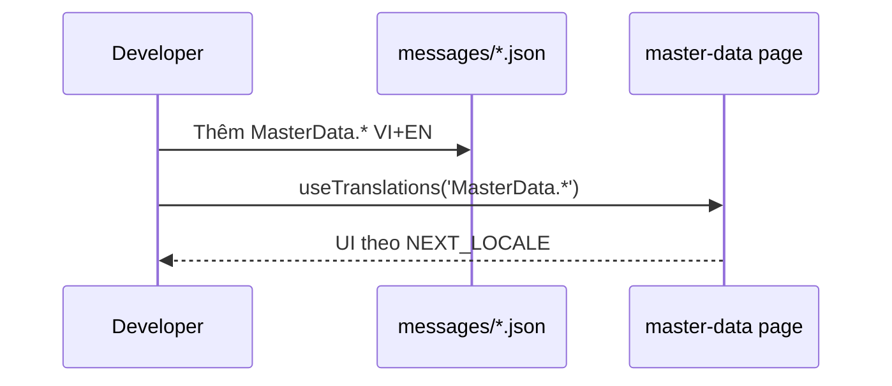

# PHASE 32: Localization Master-data (Wave C)

## Execution spec maturity

- **Mức hiện tại:** **95% Execution-Ready** (`consult_decide` Option **B** 2026-07-21)
- **Đánh giá:** Phụ thuộc P31 foundation. Phạm vi **8/8** `master-data/**/page.tsx` + layout/components MD — **0 backlog** trong P32. Product 59/59 khóa ở P33.
- **Trạng thái triển khai:** ⬜ Chưa bắt đầu — chờ P31 ✅ rồi `tt` / `/18-auto-execute`.

### Quyết định khóa

| Câu hỏi | Quyết định |
|---|---|
| Stack | Kế thừa **next-intl** + cookie `NEXT_LOCALE` từ P31 — **không** cài lại framework |
| Catalog | Mở rộng `messages/vi.json` + `en.json` namespace `MasterData.*` |
| Phạm vi | **Mọi** `frontend/src/app/master-data/**/page.tsx` (8) + layout master-data user-facing |
| Out | Admin (P31), Mobile/Errors full/AC-09-10 (P33), DB content, WinUI |

---

## 1. Mục tiêu

Localize 100% giao diện **master-data** (products, UoM, warehouses, zones, locations, partners, reasons, import) trên nền i18n P31.

## 2. Phạm vi

### In scope

- Refactor **8** pages dưới `master-data/**` sang `t()`.
- Layout / shared components chỉ dùng bởi master-data (nếu còn hardcode).
- Namespace catalogs: `MasterData.products`, `MasterData.uoms`, `MasterData.warehouses`, `MasterData.zones`, `MasterData.locations`, `MasterData.partners`, `MasterData.reasons`, `MasterData.import`, + form labels/actions dùng chung MD.
- Verify mode P32: parity keys mới; inventory **8/8** DONE; grep gate `master-data/**`.

### Non-negotiable output

- **8/8** pages MD i18n; **0 backlog** P32.
- Parity VI/EN cho keys P32.
- Switcher (từ P31) hoạt động trên layout MD.
- Không đổi API/DB.

### Out of scope

- `admin/**`, `mobile/**`, Errors full inventory, AC-09/10 product.
- Dịch tên sản phẩm / reason trong DB.

## 3. Điều kiện đầu vào

- Phase **31** ✅ (next-intl, switcher, catalogs, sidebar).
- Inventory freeze: 8 file MD (baseline 2026-07-21).

### Inventory P32 (freeze)

1. `master-data/products/page.tsx`
2. `master-data/uoms/page.tsx`
3. `master-data/warehouses/page.tsx`
4. `master-data/zones/page.tsx`
5. `master-data/locations/page.tsx`
6. `master-data/partners/page.tsx`
7. `master-data/reasons/page.tsx`
8. `master-data/import/page.tsx`

## 4. Setup

- **Không** package mới.
- Chỉ mở rộng JSON catalogs + refactor pages.
- Comment: tiếng Việt; UI copy trong JSON.

## 5. Permissions

| Permission | Thay đổi |
|---|---|
| — | Không có |

## 6. Database

**Không migration.**

## 7. Backend & API Contract

**Không đổi.** FE tiếp tục map lỗi qua `api-error-i18n` từ P31 (skeleton).

## 8. Frontend

### UX

- Giữ LanguageSwitcher layout master-data.
- Loading/empty/error dùng `Common.*` / `MasterData.*`.
- Form labels, table headers, dialogs, toast MD → `t()`.

### DoD wave C

| Hạng mục | DoD |
|---|---|
| 8 pages | 0 hardcode user-facing |
| Layout MD | 0 hardcode |
| Catalogs | parity VI/EN |

### Test IDs

- Tái dùng `language-switcher` / `language-option-vi` / `language-option-en`.

## 9. Execution Flow



### Pseudo — pattern trang MD

```tsx
'use client';
import { useTranslations } from 'next-intl';

export default function ProductsPage() {
  const t = useTranslations('MasterData.products');
  const tc = useTranslations('Common.actions');
  return (
    <main>
      <h1>{t('title')}</h1>
      <button>{tc('save')}</button>
    </main>
  );
}
```

## 10. Validation & Business Rules

- Tenant / permission / API path không phụ thuộc locale.
- Không dịch giá trị nghiệp vụ từ API (SKU, tên SP DB).

## 11. Exception Handling

| Tình huống | Hành vi |
|---|---|
| Thiếu key | verify parity fail trước merge; Dev fallback locale `vi` |
| Cookie xóa | fallback `vi` (P31) |

## 12. Observability & KPI

- Không KPI mới.

## 13. Test Plan

| Nhóm | Nội dung |
|---|---|
| Integration | `verify_i18n.ps1 -Phase 32`: 8/8 inventory + parity |
| E2E manual | Switcher trên products + partners |
| Regression | CRUD MD vẫn gọi API đúng |

## 14. Acceptance Criteria

| ID | Criteria | Evidence |
|---|---|---|
| AC-32-01 | 8/8 `master-data/**/page.tsx` dùng `t()` | Checklist |
| AC-32-02 | 0 backlog P32 | Sign-off |
| AC-32-03 | Parity keys VI/EN (keys P32) | verify PASS |
| AC-32-04 | Layout MD không hardcode user-facing | Grep gate |
| AC-32-05 | Lint 0 error file đổi | `npm run lint` |
| AC-32-06 | Không đổi API/DB | Diff |

### Definition of Done

- Inventory 8/8 DONE; verify P32 PASS; phase/master plan cập nhật P32 ✅.

## 15. Out of Scope

- Mobile, Errors full, product AC-09/10 (P33).
- DB translation.

## 16. Downstream Dependencies

- P33 cần P32 ✅ để cộng dồn inventory tiến tới 59/59.
- Namespace `MasterData.*` ổn định cho PR sau.

## 17. Maintenance & Rollback

- Thêm string MD: cập nhật cả `vi.json` + `en.json`.
- Rollback: git revert PR P32; P31 foundation giữ nguyên.

## 18. Catalog mock (tối thiểu)

```json
{
  "MasterData": {
    "products": { "title": "Sản phẩm", "sku": "Mã SKU", "empty": "Chưa có sản phẩm" },
    "uoms": { "title": "Đơn vị tính" },
    "warehouses": { "title": "Kho" },
    "zones": { "title": "Zone" },
    "locations": { "title": "Vị trí" },
    "partners": { "title": "Đối tác" },
    "reasons": { "title": "Lý do" },
    "import": { "title": "Import", "upload": "Tải tệp lên" }
  }
}
```

---

## 19. Auto-critique

| # | Kết luận |
|---|---|
| Write concurrency | N/A |
| Hardware | N/A |
| Network | Catalogs bundle — OK |
| Third-party | Không |

**Maturity: 95% Execution-Ready.**

## 20. Implementation order

1. Xác nhận P31 ✅ + đọc catalogs hiện có.
2. Thêm namespace `MasterData.*` VI+EN.
3. Refactor 8 pages + layout MD.
4. `verify_i18n.ps1 -Phase 32`.
5. Cập nhật phase/master plan.

**Lệnh:** `` `tt `` / `/18-auto-execute` (sau P31).

---
