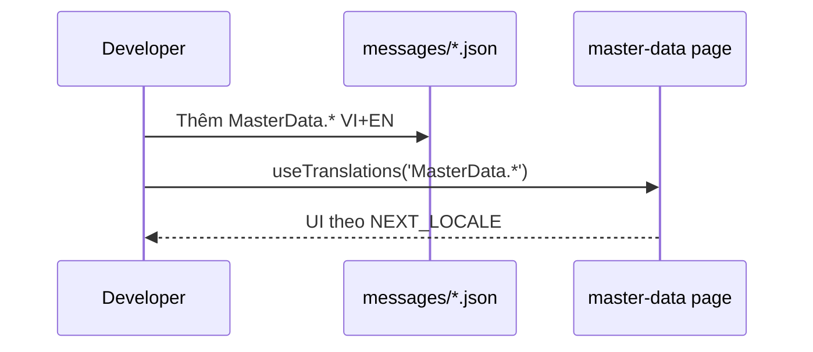

# PHASE 32: Localization Master-data (Wave C)

## Execution spec maturity

- **Mức hiện tại:** **Module DoD 100%** — `rp4`+`rp5` PASS 2026-07-21
- **Đánh giá:** Master-data **8/8** pages + CRUD + import i18n; `MasterData.json` VI/EN; verify `-Phase 32` PASS (2018 keys); regression 31a/31 PASS; **dbm 16/16** VI/EN.
- **Trạng thái triển khai:** ✅ **Hoàn thành** 2026-07-21 (`/18-auto-execute` + `dbm` + `rp4`/`rp5`).

### Quyết định khóa

| Câu hỏi | Quyết định |
|---|---|
| Stack | Kế thừa **next-intl** + cookie `NEXT_LOCALE` từ P31 — **không** cài lại framework |
| Catalog | **Chỉ** `messages/{vi\|en}/MasterData.json` (PascalCase 1:1 — P31a Option 1). **Cấm** monolith / kebab file |
| Key mới | **Semantic sections + camelCase** (P31a Option 1): `MasterData.{area}.{page\|actions\|fields\|columns\|status\|toast\|errors\|dialog}.*` |
| Shared CRUD | `features/master-data/master-data-crud.tsx` → `MasterData.common.*` (chrome) + page truyền label đã `t()` |
| Loader | **Bắt buộc** static import `MasterData` trong `load-messages.ts` + `CATALOG_MODULES` (BS-31a-6) |
| Phạm vi | **8** `master-data/**/page.tsx` + crud shared + import page; layout MD chỉ shell (đã có sidebar i18n) |
| Out | Admin (P31), Mobile/Errors full/AC-09-10 (P33), DB content, WinUI |

### Changelog plan (giữ lịch sử)

| Ngày | Thay đổi |
|---|---|
| 2026-07-21 | Khóa Wave C 8/8 MD; catalogs monolith namespace `MasterData.*` |
| 2026-07-21 | **up:** bắt buộc catalog modules (P31a); path draft `master-data.json` |
| 2026-07-21 | **up `/30`:** file `MasterData.json`; key semantic sections bắt buộc từ đầu P32 |
| 2026-07-21 | **`rp1`:** Khóa `master-data-crud` + import page; pseudo `page.title`; verify `-Phase 32` skeleton; static import; readiness P31a ✅ |
| 2026-07-21 | **`rp1 update 100%`:** Full string map CRUD/import; checklist file; verify Phase 32 chi tiết; maturity **100% Ready** |
| 2026-07-21 | **`rp2`:** Function index + `/17-auto-plan` EP0–EP5 + critic **9.7/10**; brain `implementation_plan.md` execute-ready |
| 2026-07-21 | **`rp3`:** Blind-spot audit PASS — BS-32-14…19 khóa; score **9.8/10**; sẵn `` `tt `` |
| 2026-07-21 | **`/18-auto-execute` ✅:** MasterData.json VI/EN; CRUD+8 pages i18n; verify Phase 32/31a/31 PASS (2018 keys) |
| 2026-07-21 | **`dbm` PASS:** 16/16 VI/EN · evidence `phase_32_dbm/` |
| 2026-07-21 | **`rp4`+`rp5`:** Module DoD **100%** — đóng tài liệu phase/plan |

---

## 1. Mục tiêu

Localize 100% giao diện **master-data** (products, UoM, warehouses, zones, locations, partners, reasons, import) trên nền i18n P31.

## 2. Phạm vi

### In scope

- Refactor **8** pages dưới `master-data/**` sang `t()` (semantic).
- **`frontend/src/features/master-data/master-data-crud.tsx`**: chrome UI (search, create, edit, delete, save, cancel, toast, confirm) → `MasterData.common.*` hoặc `Common.*` nếu đã có.
- **`master-data/import/page.tsx`**: localize toàn bộ copy (không dùng CRUD shell).
- Catalog: `messages/vi/MasterData.json` + `en/MasterData.json`; `'MasterData'` trong `CATALOG_MODULES` **và** static imports trong `load-messages.ts`.
- Areas khóa: `common`, `products`, `uoms`, `warehouses`, `zones`, `locations`, `partners`, `reasons`, `import`.
- Keys: `MasterData.products.page.title`, `…fields.code.label`, `…columns.name`, `…toast.createSuccess`, …
- Verify: `verify_i18n.ps1 -Phase 32` — inventory 8/8; parity; file `MasterData.json`; `load-messages` chứa MasterData; không kebab trong `MasterData.*`.

### Non-negotiable output

- **8/8** pages MD i18n + shared CRUD + import page; **0 backlog** P32.
- Parity VI/EN cho keys P32.
- Switcher (sidebar layout MD) hoạt động.
- Không đổi API/DB.

### Out of scope

- `admin/**`, `mobile/**`, Errors full inventory, AC-09/10 product.
- Dịch tên sản phẩm / reason trong DB.

## 3. Điều kiện đầu vào

- Phase **31** ✅ (next-intl, switcher, sidebar).
- Phase **31a** ✅ (`loadMessages` + `messages/{locale}/*.json` — **không** monolith runtime).
- Inventory freeze: 8 file MD (baseline 2026-07-21).

### Inventory P32 (freeze)

1. `master-data/products/page.tsx`
2. `master-data/uoms/page.tsx`
3. `master-data/warehouses/page.tsx`
4. `master-data/zones/page.tsx`
5. `master-data/locations/page.tsx`
6. `master-data/partners/page.tsx`
7. `master-data/reasons/page.tsx`
8. `master-data/import/page.tsx`

## 4. Setup

- **Không** package mới.
- Tạo **chỉ** `frontend/messages/vi/MasterData.json` + `en/MasterData.json` (shape `{ "MasterData": { ... } }`).
- Thêm `'MasterData'` vào `src/i18n/catalog-modules.ts` **và** static imports `viMasterData`/`enMasterData` trong `load-messages.ts` (P31a BS-31a-6).
- Refactor 8 pages + layout MD: `useTranslations('MasterData.products')` + `t('page.title')` / `t('actions.create')` …
- **Cấm** flat kiểu P31 (`createOrder` top-level không có section) trong namespace `MasterData`.
- Comment: tiếng Việt; UI copy trong JSON.

## 5. Permissions

| Permission | Thay đổi |
|---|---|
| — | Không có |

## 6. Database

**Không migration.**

## 7. Backend & API Contract

**Không đổi.** FE tiếp tục map lỗi qua `api-error-i18n` từ P31 (skeleton).

## 8. Frontend

### UX

- Giữ LanguageSwitcher layout master-data.
- Loading/empty/error dùng `Common.*` / `MasterData.*`.
- Form labels, table headers, dialogs, toast MD → `t()`.

### DoD wave C

| Hạng mục | DoD |
|---|---|
| 8 pages | 0 hardcode user-facing |
| Layout MD | 0 hardcode |
| Catalogs | parity VI/EN |

### Test IDs

- Tái dùng `language-switcher` / `language-option-vi` / `language-option-en`.

## 9. Execution Flow



### Pseudo — pattern trang MD (semantic — khóa `rp1`)

```tsx
'use client';
import { useTranslations } from 'next-intl';
import MasterDataCrudPage, { type CrudField } from '@/features/master-data/master-data-crud';

export default function ProductsPage() {
  const t = useTranslations('MasterData.products');
  const fields: CrudField<...>[] = [
    { name: 'code', label: t('fields.code.label'), type: 'text', required: true, placeholder: t('fields.code.placeholder') },
  ];
  return (
    <MasterDataCrudPage
      title={t('page.title')}
      searchPlaceholder={t('page.searchPlaceholder')}
      endpoint="/master-data/products"
      fields={fields}
      columns={[{ key: 'code', label: t('columns.code'), render: ... }]}
      ...
    />
  );
}
```

### Pseudo — CRUD chrome

```tsx
const tc = useTranslations('MasterData.common');
const ta = useTranslations('Common.actions');
// toast: tc('toast.loadFailed') / tc('toast.createSuccess') / tc('toast.updateSuccess')
// buttons: ta('create') / ta('save') / ta('delete') — ưu tiên Common nếu đã có
```

### Pseudo — wire loader (P31a BS-31a-6)

```ts
// catalog-modules.ts: thêm 'MasterData'
// load-messages.ts: import viMasterData / enMasterData → đẩy vào CATALOGS.vi / CATALOGS.en
```
## 10. Validation & Business Rules

- Tenant / permission / API path không phụ thuộc locale.
- Không dịch giá trị nghiệp vụ từ API (SKU, tên SP DB).

## 11. Exception Handling

| Tình huống | Hành vi |
|---|---|
| Thiếu key | verify parity fail trước merge; Dev fallback locale `vi` |
| Cookie xóa | fallback `vi` (P31) |

## 12. Observability & KPI

- Không KPI mới.

## 13. Test Plan

| Nhóm | Nội dung |
|---|---|
| Integration | `verify_i18n.ps1 -Phase 32` |
| Unit-ish | Grep `master-data/**` + `master-data-crud.tsx` không còn chuỗi user-facing VI hardcode (allowlist tối thiểu) |
| E2E manual / dbm | Switcher trên `/master-data/products` + `/master-data/import` VI↔EN |
| Regression | CRUD MD vẫn gọi API đúng |

### verify matrix Phase 32 (`rp1` khóa)

Mở rộng `ValidateSet("31","31a","32")`:

1. Tồn tại `messages/vi/MasterData.json` + `en/MasterData.json`; 1 root `MasterData`.
2. `CATALOG_MODULES` chứa `MasterData`; `load-messages.ts` import static cả vi/en.
3. Flatten merge parity VI/EN (toàn catalog, gồm MasterData).
4. Inventory: đúng **8** file `master-data/**/page.tsx`.
5. Không kebab segment trong keys dưới `MasterData.*`.
6. (Optional) Grep fail nếu `MasterData.json` thiếu area `products|uoms|…|import|common`.

## 14. Acceptance Criteria

| ID | Criteria | Evidence |
|---|---|---|
| AC-32-01 | 8/8 `master-data/**/page.tsx` dùng `t()` semantic | Checklist + code |
| AC-32-02 | `master-data-crud.tsx` + `import/page.tsx` i18n | Code review |
| AC-32-03 | 0 backlog P32 | Sign-off |
| AC-32-04 | Parity VI/EN keys (gồm MasterData) | `verify -Phase 32` PASS |
| AC-32-05 | Static import MasterData trong `load-messages.ts` | Grep |
| AC-32-06 | Layout MD không thêm hardcode (shell OK) | Review layout |
| AC-32-07 | Lint 0 error file đổi | `npm run lint` |
| AC-32-08 | Không đổi API/DB | Diff |

### Definition of Done

- Inventory 8/8 DONE; CRUD+import DONE; verify P32 PASS; phase/master plan P32 ✅.

## 15. Out of Scope

- Mobile, Errors full, product AC-09/10 (P33).
- DB translation.

## 16. Downstream Dependencies

- P33 cần P32 ✅ để cộng dồn inventory tiến tới 59/59.
- Namespace `MasterData.*` ổn định cho PR sau.

## 17. Maintenance & Rollback

- Thêm string MD: cập nhật cả `messages/vi/MasterData.json` + `en/MasterData.json` (semantic sections).
- Rollback: git revert PR P32; P31a catalogs giữ nguyên.

## 18. Catalog mock (tối thiểu — semantic)

```json
{
  "MasterData": {
    "common": {
      "actions": { "create": "Tạo mới", "edit": "Sửa", "delete": "Xóa" },
      "toast": {
        "loadFailed": "Không thể tải dữ liệu.",
        "createSuccess": "Tạo dữ liệu thành công.",
        "updateSuccess": "Cập nhật dữ liệu thành công.",
        "saveFailed": "Không thể lưu dữ liệu.",
        "deleteSuccess": "Đã xóa bản ghi."
      },
      "dialog": {
        "deleteTitle": "Xóa bản ghi",
        "deleteDescription": "Bạn có chắc chắn muốn xóa bản ghi này? Thao tác không thể hoàn tác."
      },
      "page": { "searchPlaceholder": "Tìm kiếm..." }
    },
    "products": {
      "page": { "title": "Vật tư", "searchPlaceholder": "Tìm kiếm mã, tên, barcode...", "empty": "Chưa có sản phẩm" },
      "columns": { "code": "Mã", "name": "Tên" },
      "fields": {
        "code": { "label": "Mã", "placeholder": "PROD-001" },
        "name": { "label": "Tên", "placeholder": "Tên vật tư" }
      },
      "actions": { "create": "Tạo vật tư" }
    },
    "uoms": { "page": { "title": "Đơn vị tính" } },
    "warehouses": { "page": { "title": "Kho" } },
    "zones": { "page": { "title": "Zone" } },
    "locations": { "page": { "title": "Vị trí" } },
    "partners": { "page": { "title": "Đối tác" } },
    "reasons": { "page": { "title": "Lý do" } },
    "import": {
      "page": { "title": "Import" },
      "actions": { "upload": "Tải tệp lên", "preview": "Xem trước", "commit": "Ghi nhận" }
    }
  }
}
```

---

## 19. Auto-critique

| # | Kết luận |
|---|---|
| Write concurrency | N/A |
| Hardware | N/A |
| Network | Catalogs bundle — OK |
| Third-party | Không |

**Maturity: 100% Ready to Execute** (`rp1 update 100%`).

## 20. Implementation order

1. Xác nhận P31 ✅ + **P31a ✅** + đọc `messages/{locale}/*.json` PascalCase.
2. Thêm `'MasterData'` vào `CATALOG_MODULES` + static imports `load-messages.ts` (vi+en).
3. Viết `MasterData.json` VI/EN đủ `common` (§22.1) + 8 areas (§22.2–22.3).
4. Refactor `master-data-crud.tsx` → `useTranslations('MasterData.common')` (+ `Common.actions` nếu tái dùng).
5. Refactor 7 CRUD pages: props `title`/`fields`/`columns`/`searchPlaceholder` từ `t()`.
6. Refactor `import/page.tsx` → `MasterData.import.*`.
7. Mở rộng `verify_i18n.ps1 -Phase 32` theo §22.4 → PASS.
8. Spot VI↔EN `/master-data/products` + `/master-data/import`; cập nhật phase/master ✅.

**Lệnh:** `` `tt `` / `/18-auto-execute`.

---

## 21. `rp1` — Rà soát sẵn sàng execute (2026-07-21)

### Inventory freeze vs disk

| # | Path | Disk |
|---|---|---|
| 1–8 | products…import | ✅ đủ 8 |
| Shared | `features/master-data/master-data-crud.tsx` | ✅ tồn tại — **bắt buộc i18n** |
| Layout | `master-data/layout.tsx` | ✅ chỉ shell (sidebar đã i18n) |
| Catalog | `MasterData.json` | ⬜ chưa tạo (đúng — P32) |

### Điểm mù đã khóa (không xóa cũ)

| ID | Điểm mù | Khóa |
|---|---|---|
| BS-32-1 | Pseudo dùng `t('title')` lệch semantic | Đổi → `t('page.title')` / fields/columns |
| BS-32-2 | `master-data-crud.tsx` hardcode VI toast/dialog | In scope + `MasterData.common.*` |
| BS-32-3 | `import/page.tsx` không qua CRUD | In scope riêng |
| BS-32-4 | `verify -Phase 32` chưa có trong script | Skeleton §13; execute mở `ValidateSet` |
| BS-32-5 | Quên static import loader | AC-32-05 + setup §4 |
| BS-32-6 | Status “chờ P31a” lạc hậu | P31a ✅ — sẵn execute |
| BS-32-7 | Areas naming | Khóa `common`+8 areas §2 |

### Checklist 18 mục planner

| # | rp1 |
|---|---|
| 1–18 | ✅ đủ (N/A DB/API/permissions) |

### Verdict `rp1` (bản đầu)

**ĐỦ chuẩn để thực thi** — sau đó nâng **`rp1 update 100%`** (§22) để khóa full string inventory.

---

## 22. `rp1 update 100%` — Khóa execute-ready tuyệt đối (2026-07-21)

### 22.1 `MasterData.common` — inventory cứng từ `master-data-crud.tsx`

| Key path | VI baseline (hiện hardcode) |
|---|---|
| `common.page.subtitle` | Quản lý tạo mới, chỉnh sửa, tìm kiếm và xóa dữ liệu nền. |
| `common.actions.add` | Thêm mới |
| `common.actions.search` | Tìm kiếm |
| `common.actions.edit` | Sửa |
| `common.actions.delete` | Xóa |
| `common.actions.cancel` | Hủy |
| `common.actions.close` | Đóng |
| `common.actions.save` | Lưu dữ liệu |
| `common.actions.saving` | Đang lưu... |
| `common.actions.prev` | Trước |
| `common.actions.next` | Sau |
| `common.columns.actions` | Thao tác |
| `common.states.loading` | Đang tải... |
| `common.states.emptyTitle` | Chưa có dữ liệu |
| `common.states.emptyHint` | Thêm bản ghi đầu tiên để bắt đầu sử dụng danh mục. |
| `common.states.resultCount` | `{count} kết quả` (ICU / `{count}`) |
| `common.dialog.createTitle` | Thêm mới dữ liệu |
| `common.dialog.editTitle` | Chỉnh sửa dữ liệu |
| `common.dialog.selectPlaceholder` | Chọn dữ liệu |
| `common.dialog.deleteTitle` | Xóa bản ghi |
| `common.dialog.deleteDescription` | Bạn có chắc chắn muốn xóa bản ghi này? Thao tác không thể hoàn tác. |
| `common.toast.loadFailed` | Không thể tải dữ liệu. |
| `common.toast.createSuccess` | Tạo dữ liệu thành công. |
| `common.toast.updateSuccess` | Cập nhật dữ liệu thành công. |
| `common.toast.saveFailed` | Không thể lưu dữ liệu. |
| `common.toast.deleteSuccess` | Xóa dữ liệu thành công. |
| `common.toast.deleteFailed` | Không thể xóa dữ liệu. |
| `common.toast.deleteCancelled` | Đã hủy thao tác xóa. |

> Ưu tiên `Common.actions.*` / `Common.states.*` nếu key đã có — không duplicate vô ích; còn thiếu thì nằm trong `MasterData.common`.

### 22.2 Status labels (mọi CRUD page)

| Key | VI |
|---|---|
| `common.status.active` | Hoạt động |
| `common.status.inactive` | Vô hiệu |
| `common.status.locked` | Đã khóa |
| `common.status.open` | Mở |

Enum máy (`VENDOR`, `STORAGE`, `zoneType` values) **giữ EN** trên UI option value; label option có thể = value (không bắt dịch mã máy).

### 22.3 Per-page contract (fields/columns tối thiểu)

| Area | `page.title` (VI) | Fields chính | Columns chính |
|---|---|---|---|
| products | Vật tư | code, name, barcode, baseUomId, description, isActive | code, name, (+status) |
| uoms | Đơn vị tính | code, name, isActive | code, name, status |
| warehouses | Kho / Nhà kho | (theo page) | … |
| zones | Vùng kho | warehouseId, code, name, zoneType, temperatureLimit, isLocked | code, name, warehouse, zoneType, isLocked |
| locations | Vị trí | (theo page + zone select) | … |
| partners | Đối tác | code, name, partnerType, address, taxCode, isActive | code, name, partnerType, taxCode, status |
| reasons | Lý do | (theo page) | … |
| import | Nhập dữ liệu | xem §22.3b | — |

Execute: đọc từng `page.tsx` và map **đủ** label/placeholder đang hardcode — không bỏ sót field.

### 22.3b `MasterData.import` — inventory cứng

| Key | VI baseline |
|---|---|
| `import.page.title` | Nhập dữ liệu |
| `import.page.subtitle` | Hỗ trợ tải lên file CSV… |
| `import.help.itemsTitle` | Cấu trúc file ITEMS (Vật tư): |
| `import.help.locationsTitle` | Cấu trúc file LOCATIONS (Vị trí kệ): |
| `import.help.partnersTitle` | Cấu trúc file PARTNERS (Đối tác): |
| `import.fields.importType` | Loại master data |
| `import.fields.file` | Chọn file CSV |
| `import.options.items` | Sản phẩm (ITEMS) |
| `import.options.locations` | Vị trí kệ (LOCATIONS) |
| `import.options.partners` | Đối tác (PARTNERS) |
| `import.actions.preview` | Tải lên kiểm tra (Preview) |
| `import.actions.commit` | Duyệt import vào hệ thống (Commit) |
| `import.actions.downloadErrors` | Tải file lỗi (CSV) |
| `import.states.processing` | Đang xử lý dữ liệu... |
| `import.result.title` | Kết quả kiểm tra (Batch ID: {id}) |
| `import.result.total` | Tổng số dòng |
| `import.result.valid` | Hợp lệ |
| `import.result.errors` | Lỗi |
| `import.result.errorDetail` | Chi tiết lỗi dòng |
| `import.columns.row` | Dòng |
| `import.columns.raw` | Chi tiết dữ liệu |
| `import.columns.message` | Thông báo lỗi |
| `import.toast.previewOk` | Kiểm tra dữ liệu thành công… |
| `import.toast.previewHasErrors` | Phát hiện {count} dòng dữ liệu lỗi. |
| `import.toast.uploadFailed` | Không thể tải lên file. |
| `import.toast.commitOk` | Duyệt nhập dữ liệu thành công. |
| `import.toast.commitFailed` | Duyệt nhập dữ liệu thất bại. |

CSV header examples trong `<code>`: **không dịch** (contract file).

### 22.4 File checklist execute (DoD)

- [x] `src/i18n/catalog-modules.ts` (+ MasterData)
- [x] `src/i18n/load-messages.ts` (static vi/en MasterData)
- [x] `messages/vi/MasterData.json`
- [x] `messages/en/MasterData.json`
- [x] `features/master-data/master-data-crud.tsx`
- [x] `app/master-data/products/page.tsx`
- [x] `app/master-data/uoms/page.tsx`
- [x] `app/master-data/warehouses/page.tsx`
- [x] `app/master-data/zones/page.tsx`
- [x] `app/master-data/locations/page.tsx`
- [x] `app/master-data/partners/page.tsx`
- [x] `app/master-data/reasons/page.tsx`
- [x] `app/master-data/import/page.tsx`
- [x] `tests/verify_i18n.ps1` (`ValidateSet` + Phase 32)
- [x] phase_32 + IMPLEMENTATION_PLAN ✅

### 22.5 verify Phase 32 — bước máy (execute)

```powershell
# ValidateSet thêm "32"
# 1) MasterData.json vi/en tồn tại, root = MasterData
# 2) load-messages.ts match 'MasterData'
# 3) catalog-modules chứa MasterData
# 4) merge parity VI/EN
# 5) Count master-data/**/page.tsx = 8
# 6) Flatten MasterData.* không có segment '-'
# 7) Areas bắt buộc: common,products,uoms,warehouses,zones,locations,partners,reasons,import
```

### 22.6 Điểm mù bổ sung (`rp1 update 100%`)

| ID | Điểm mù | Khóa |
|---|---|---|
| BS-32-8 | CRUD còn nhiều chrome string ngoài toast | §22.1 full map |
| BS-32-9 | import page copy dày | §22.3b |
| BS-32-10 | zones/locations option labels | Enum máy giữ EN; status dùng common.status.* |
| BS-32-11 | `resultCount` cần param | `t('states.resultCount', { count })` |
| BS-32-12 | File checklist mơ hồ | §22.4 |
| BS-32-13 | verify Phase 32 thiếu bước máy | §22.5 |

### Verdict `rp1 update 100%`

**100% Ready to Execute** — 1 developer đọc §20–§22 là code được ngay, không hỏi thêm nghiệp vụ/key map.

**Không** execute trong lượt này. Next: `` `tt `` / `/18-auto-execute`.

---

## 23. `rp2` — Function index + `/17-auto-plan` (2026-07-21)

### 23.1 Artifacts (brain)

| File | Vai trò |
|---|---|
| `function_index_phase32_master_data_i18n.md` | AS-IS/TO-BE coupling 8 pages + CRUD + import |
| `implementation_plan.md` | EP0–EP5 atomic + FINAL CHECKLIST score **9.7/10** |
| `critic_report.md` | Critic C1–C3 / H1–H2 / M1 → đã nhúng refine |
| `task_tracking.md` / `execution_state.md` | Tracking chờ execute |

### 23.2 EP map (execute order)

| EP | Mục tiêu | Risk |
|---|---|---|
| **EP0.1** | Inventory 8/8 pages | LOW |
| **EP1.1–1.3** | `CATALOG_MODULES` + `MasterData.json` VI/EN + static import `load-messages` | MEDIUM |
| **EP2.1** | `master-data-crud.tsx` → `MasterData.common.*` | MEDIUM |
| **EP3.1–3.7** | 7 CRUD pages → `MasterData.{area}.*` | MEDIUM |
| **EP4.1** | `import/page.tsx` → `MasterData.import.*` | LOW–MEDIUM |
| **EP5.1–5.3** | `verify_i18n.ps1 -Phase 32` + regression 31a + spot + docs | LOW |

### 23.3 Critic locks (bắt buộc khi execute)

| ID | Lock |
|---|---|
| C1 | **EP1 trước EP2** — catalogs load trước refactor CRUD |
| C2 | **EP3.5 locations** tách riêng — nhiều fields |
| C3 | EP5.1: `-Phase 32` PASS **và** `-Phase 31a` vẫn PASS |
| H1 | `resultCount` ICU `{ count }` |
| H2 | CSV schema code blocks **không** dịch |
| M1 | dbm full 8 optional; DoD tối thiểu spot products + import VI↔EN |

### 23.4 Verdict `rp2`

**APPROVED — Ready to Execute (score 9.7/10).**  
Spec §20–§22 = string SoT; brain `implementation_plan.md` = execution SoT.

**Không** execute trong lượt `rp2`. Next: `` `tt `` / `/18-auto-execute` / `/04-do-plan`.

---

## 24. `rp3` — Blind-spot gate (2026-07-21)

### 24.1 Câu hỏi gate

> Plan đã đủ chi tiết, rõ ràng để thực hiện **xuyên suốt** và **không còn điểm mù** chưa?

### 24.2 Blind spots phát hiện → khóa (không xóa cũ)

| ID | Severity | Điểm mù | Khóa execute |
|---|---|---|---|
| BS-32-14 | CRITICAL | Nhiều page khai báo `fields`/`columns` **module-level** — không gọi được `t()` | EP3 pattern: **bắt buộc** đưa vào trong component |
| BS-32-15 | CRITICAL | Verify parity chỉ merge list cứng 10 modules trong `merge_i18n_catalogs.js` + `$CATALOG_MODULES` | EP1.1 + EP5.1: sync **4 chỗ** (`catalog-modules` · `load-messages` · merge helper · verify) → **11×2** |
| BS-32-16 | HIGH | Import toast `Phát hiện N dòng…` thiếu trong §22.3b | Key `import.toast.previewHasErrors` + `{count}` |
| BS-32-17 | HIGH | §18 mock title lệch disk (`Kho` vs `Nhà kho`, …) | **Disk SoT** titles (warehouses=Nhà kho, locations=Vị trí kệ, reasons=Mã lý do, zones=Vùng kho) |
| BS-32-18 | MEDIUM | `Common.actions.save`="Lưu" ≠ CRUD "Lưu dữ liệu" | Reuse Common chỉ khi copy khớp; MD save/add/empty → `MasterData.common` |
| BS-32-19 | LOW | `console.error` VI trong locations | Non-UI — giữ nguyên |

### 24.3 Cross-check 3 nguồn

| Nguồn | Vai trò sau rp3 |
|---|---|
| Spec §20–§22 + §24 | String + inventory + blind-spot locks |
| Brain `implementation_plan.md` | EP atomic + pattern EP3 + checklist score **9.8/10** |
| `IMPLEMENTATION_PLAN.md` | Status tracker |

### 24.4 Verdict `rp3`

**PASS — 0 điểm mù chặn execute xuyên suốt.** Score **9.8/10**.

**Không** execute trong lượt `rp3`. Next: `` `tt `` / `/18-auto-execute` / `/04-do-plan`.

---

## 25. Execution close (`/18-auto-execute` 2026-07-21)

### Đã ship

| Hạng mục | Kết quả |
|---|---|
| `messages/{vi\|en}/MasterData.json` | ✅ semantic areas 9 |
| `catalog-modules` + `load-messages` + `merge_i18n_catalogs.js` | ✅ MasterData (11×2) |
| `master-data-crud.tsx` | ✅ `MasterData.common.*` |
| 7 CRUD pages + import | ✅ `useTranslations` + fields-in-component |
| `verify_i18n.ps1 -Phase 32` | ✅ PASS (parity 2018 keys) |
| Regression `-Phase 31a` / `-Phase 31` | ✅ PASS |

### DoD

- Inventory **8/8** MD i18n + shared CRUD + import — **0 backlog P32**.
- Phase/master plan ✅.

**Next:** Phase 33 (Mobile + Errors + 59/59).

---

## 26. DBM close (`dbm` 2026-07-21)

### Verdict: **PASS**

| Check | Result |
|---|---|
| Spot products + import VI↔EN | ✅ |
| Full 8 MD × 2 locales (h1 title) | ✅ **16/16** |
| Cookie `NEXT_LOCALE` | ✅ |
| `verify_i18n -Phase 32` | ✅ |
| Evidence walkthrough | `planning/evidence/phase_32_dbm/walkthrough.md` |
| Video | `…/walkthrough-master-data-i18n.webm` |
| Script | `tests/helpers/dbm_phase32_master_data_browser.mjs` |

Self-heal: wait AuthGuard trước assert h1.

---

## 27. `rp4` + `rp5` — Module DoD 100% (2026-07-21)

### 27.1 Đối chiếu plan ↔ disk

| AC / DoD | Evidence | Verdict |
|---|---|---|
| AC-32-01 8/8 pages `t()` | 8 `page.tsx` + `useTranslations` | ✅ |
| AC-32-02 CRUD + import | `master-data-crud.tsx` + `import/page.tsx` | ✅ |
| AC-32-03 0 backlog P32 | Inventory freeze = disk | ✅ |
| AC-32-04 Parity VI/EN | `verify -Phase 32` 2018 keys | ✅ |
| AC-32-05 Static import | `load-messages.ts` + merge helper + catalog-modules | ✅ |
| AC-32-06 Layout shell | Không hardcode mới | ✅ |
| AC-32-07 Lint file đổi | eslint MD + i18n loader **exit 0** | ✅ |
| AC-32-08 No API/DB | Diff FE-only | ✅ |
| EP0–EP5 checklist | brain `implementation_plan.md` toàn `[x]` | ✅ |
| DBM EP5.2+ | **16/16** + walkthrough + video | ✅ |

### 27.2 Verdict

| Gate | Result |
|---|---|
| **`rp5`** (đúng đủ chuẩn 100%?) | **PASS** |
| **`rp4`** (đủ → đóng tài liệu) | **PASS** — Module DoD **100%** |

**Không** còn gap P32. Next wave: **Phase 33** (Mobile + Errors → 59/59).

---
