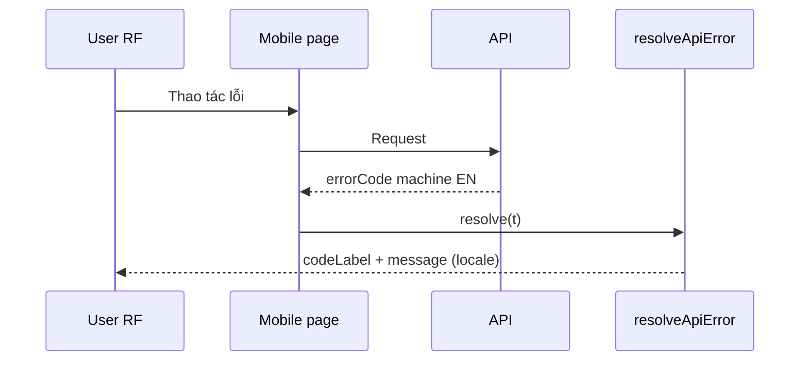

# PHASE 33: Localization Mobile + Errors + Product Close (Wave D)

## Execution spec maturity

- **Mức hiện tại:** **95% Execution-Ready** (`consult_decide` Option **B** 2026-07-21; **catalog modules** khóa theo P31a Option B `/30-auto-project-planner` 2026-07-21)
- **Đánh giá:** Phase khóa **Milestone 5**. Phạm vi: **7/7** mobile pages + Errors catalogs **đầy đủ** + verify **59/59 + 0 backlog** toàn product Web. Optional BE `Accept-Language`. Catalogs theo **module files** (P31a).
- **Trạng thái triển khai:** ⬜ Chờ P31 + **P31a** + P32 ✅.

### Quyết định khóa

| Câu hỏi | Quyết định |
|---|---|
| Stack | Kế thừa next-intl P31 + loader merge P31a |
| Catalog | **Mobile** → `messages/{vi\|en}/Mobile.json`; **Errors** → mở rộng `Errors.json`. **Cấm** monolith / kebab |
| Key mới | Semantic sections + camelCase (`Mobile.{area}.page|actions|…`); `Errors.codes` = SCREAMING_SNAKE |
| Errors | Localize **errorCodeLabel + message**; wire `errorCode` machine EN |
| Product DoD | **AC-09 + AC-10:** 59/59 pages + 0 backlog (cộng dồn P31+P31a+P32+P33) |
| BE | Optional dictionary `errorCodeLabel` theo `Accept-Language` — không bắt buộc nếu FE map đủ |

### Changelog plan (giữ lịch sử)

| Ngày | Thay đổi |
|---|---|
| 2026-07-21 | Khóa Wave D mobile+Errors+Milestone 5 |
| 2026-07-21 | **up:** bắt buộc draft `mobile.json` + `errors.json` (P31a) |
| 2026-07-21 | **up `/30`:** `Mobile.json` / `Errors.json` PascalCase; Mobile keys semantic |

---

## 1. Mục tiêu

Localize toàn bộ **mobile/RF**, hoàn thiện catalogs **Errors**, format ngày/số theo locale, và **đóng** chuỗi Localization với verify product-wide **59/59 + 0 backlog**.

## 2. Phạm vi

### In scope

- **7** pages `mobile/**/page.tsx` + layout mobile.
- `Errors.codes.*` + `Errors.messages.*` phủ **toàn bộ** machine `errorCode` FE toast/dialog đang map.
- AC-05c: toast path bắt buộc `codeLabel` + `message`.
- Date/number format theo locale (`Intl` / `date-fns` locale).
- Leftover shared components còn hardcode sau P31/P32.
- `verify_i18n.ps1 -Phase 33` (full): parity + **59** inventory + grep gate + machine code assert.
- Optional: BE soft field `errorCodeLabel` theo `Accept-Language`.
- README Language hoàn chỉnh; Milestone 5.

### Non-negotiable output

- Mobile **7/7** i18n; **0 backlog** P33 và **0 backlog** product.
- Inventory product **59/59** DONE.
- Errors full + wire `errorCode` EN ổn định.
- Verify full PASS.

### Out of scope

- WinUI desktop, DB content, Swagger/Hangfire/log full, RTL, locale thứ 3, MT CI.

## 3. Điều kiện đầu vào

- Phase **31** ✅, **31a** ✅ (catalog modules + merge), **32** ✅.
- Freeze inventory tổng = số `page.tsx` ngày start P33 (baseline **59** @ 2026-07-21; nếu lệch → ghi evidence + cập nhật AC-09).

### Inventory P33 (mobile)

1. `mobile/page.tsx`
2. `mobile/picking/page.tsx`
3. `mobile/movement/page.tsx`
4. `mobile/replenishment/page.tsx`
5. `mobile/lpn/page.tsx`
6. `mobile/serial/page.tsx`
7. `mobile/tasks/next/page.tsx`

## 4. Setup

- Không bắt buộc package mới (trừ locale `date-fns` nếu chưa có).
- Tạo `messages/vi/Mobile.json` + `en/Mobile.json` (`{ "Mobile": { ... } }` — **semantic sections**); đăng ký `'Mobile'` trong `CATALOG_MODULES` **và** static imports trong `load-messages.ts`.
- Mở rộng **`messages/{vi|en}/Errors.json`** (`Errors.codes` SCREAMING + `Errors.messages` camelCase) — không monolith.
- Refactor 7 mobile pages + leftover shared; **cấm** flat key không section trong `Mobile.*`.

## 5. Permissions

| Permission | Thay đổi |
|---|---|
| — | Không có |

## 6. Database

**Không migration.**

## 7. Backend & API Contract

### Wire (không đổi semver programmatic)

```json
{
  "errorCode": "CUTOVER_FROZEN",
  "errorCodeLabel": "Cutover write freeze",
  "message": "Warehouse write APIs are frozen during cutover.",
  "traceId": "00-..."
}
```

| Field | Quy tắc |
|---|---|
| `errorCode` | Machine EN — **cấm** dịch |
| `errorCodeLabel` / `message` | VI/EN — FE catalogs bắt buộc; BE optional |

### Pseudo FE (bắt buộc)

```ts
export function resolveApiError(error, t) {
  const code = error?.response?.data?.errorCode ?? 'UNKNOWN';
  return {
    code,
    codeLabel: t.has(`Errors.codes.${code}`)
      ? t(`Errors.codes.${code}`)
      : (error?.response?.data?.errorCodeLabel || code),
    message: t.has(`Errors.messages.${code}`)
      ? t(`Errors.messages.${code}`)
      : (error?.response?.data?.message || t('Errors.messages.generic'))
  };
}
```

### BE optional

- Dictionary C# mirror catalogs; đọc `Accept-Language`.
- Không bắt buộc IStringLocalizer toàn hệ thống.

## 8. Frontend / Mobile / RF

### UX

- Switcher trên mobile layout.
- Touch-friendly labels; empty/error qua `t()`.
- Toast: **codeLabel + message**.

### DoD Wave D

| Hạng mục | DoD |
|---|---|
| Mobile 7/7 | 0 hardcode |
| Errors full | mọi code FE map có cặp codes+messages |
| Product | 59/59 + 0 backlog |
| Format | date/number theo locale |

### Test IDs

- `language-switcher`, `language-option-vi`, `language-option-en`
- Optional: `mobile-next-task-title`

## 9. Execution Flow



## 10. Validation & Business Rules

- Locale không ảnh hưởng permission / feature flag / tenant.
- Audit/log giữ raw `errorCode`.

## 11. Exception Handling

| Tình huống | Hành vi |
|---|---|
| Code chưa có trong Errors | `Errors.messages.generic` + log code; **không** đóng P33 nếu còn code đang dùng trên FE |
| Locale `fr` | fallback `vi` |

## 12. Observability & KPI

- Không KPI mới. Optional debug `i18n.locale_changed`.

## 13. Test Plan

| Nhóm | Nội dung |
|---|---|
| Unit | `resolveApiError` map code |
| Integration | `verify_i18n.ps1 -Phase 33` full matrix |
| E2E | Mobile picking + next-task switcher VI↔EN |
| Regression | Login, readiness freeze toast vẫn hiện label đã dịch |

### verify_i18n.ps1 — Phase 33 matrix

1. Parity VI/EN toàn catalogs.
2. Inventory **59** `page.tsx` tất cả DONE.
3. Grep gate hardcode (allowlist tối thiểu).
4. Assert machine `errorCode` keys không bị đổi tên sang VI.
5. (Optional) HTTP 200 với cookie `NEXT_LOCALE=en`.

## 14. Acceptance Criteria

| ID | Criteria | Evidence |
|---|---|---|
| AC-06 | 100% `mobile/**/page.tsx` dùng `t()` | Checklist 7/7 |
| AC-05 | Errors phủ **toàn bộ** machine code FE map | Inventory codes |
| AC-05b | Wire `errorCode` machine EN | Assert |
| AC-05c | Toast dùng `codeLabel`+`message` | Code + screenshot |
| AC-09 | **59/59** pages product i18n | verify inventory |
| AC-10 | **0 backlog** product | Sign-off |
| AC-33-01 | Date/number format theo locale | Spot-check |
| AC-33-02 | Lint 0 error file đổi | `npm run lint` |
| AC-33-03 | Không đổi API routes/DB schema | Diff |

### Definition of Done

- Wave D 100%; verify full PASS; README Language hoàn chỉnh.
- Milestone 5 đạt; `IMPLEMENTATION_PLAN` P31–P33 ✅.
- Phase notes cập nhật hoàn thành.

## 15. Out of Scope

- Desktop WinUI, DB i18n, Swagger/Hangfire/log, RTL, MT CI.

## 16. Downstream Dependencies

- Mọi UI mới sau P33: **bắt buộc** VI+EN cùng PR.
- Không phá P30 readiness/cutover.

## 17. Maintenance & Rollback

- Thêm string: `Mobile.json` / `Errors.json` cả VI+EN (semantic cho Mobile).
- Rollback khẩn: ẩn switcher / force `vi`; git revert PR P33 (giữ P31/P31a/P32 nếu ổn).

```powershell
# Xóa cookie NEXT_LOCALE → fallback vi
```

## 18. Catalog mock (module files)

`Errors.json`:
```json
{
  "Errors": {
    "codes": {
      "CUTOVER_FROZEN": "Đang khóa ghi cutover",
      "READINESS_DISABLED": "Readiness đang tắt",
      "UNAUTHORIZED": "Không có quyền",
      "UNKNOWN": "Lỗi không xác định"
    },
    "messages": {
      "CUTOVER_FROZEN": "Các API ghi nghiệp vụ kho đang bị đóng băng trong cutover.",
      "generic": "Yêu cầu thất bại."
    }
  }
}
```

`Mobile.json` (semantic):
```json
{
  "Mobile": {
    "home": { "page": { "title": "Thao tác kho" } },
    "picking": { "page": { "title": "Picking" } },
    "tasks": {
      "page": { "title": "Công việc" },
      "actions": { "next": "Việc tiếp theo" }
    }
  }
}
```

`en/` mirror cùng key path.

---

## 19. Auto-critique

| # | Kết luận |
|---|---|
| Write concurrency | N/A |
| Hardware | N/A — RF Web; offline copy vẫn từ bundle |
| Network | OK |
| Third-party | Không MT |

**Maturity: 95% Execution-Ready.**

## 20. Implementation order

1. Xác nhận P31a ✅ (PascalCase modules) + P32 ✅; inventory freeze 59 + list Errors codes từ FE.
2. Thêm `'Mobile'` vào `CATALOG_MODULES`; tạo `Mobile.json` VI/EN (semantic); mở rộng `Errors.json`.
3. Refactor 7 mobile pages + layout.
4. Wire toast toàn app qua `resolveApiError`.
5. Date/number locale.
6. Optional BE dictionary.
7. `verify_i18n.ps1 -Phase 33` full → README → đóng Milestone 5.

**Lệnh:** `` `tt `` / `/18-auto-execute` (sau P32).

---
