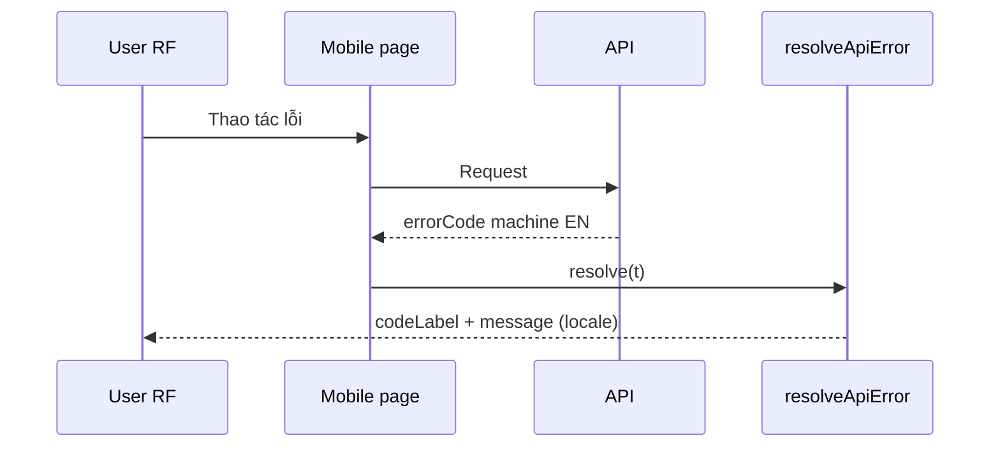

# PHASE 33: Localization Mobile + Errors + Product Close (Wave D)

## Execution spec maturity

- **Mức hiện tại:** **Module DoD 100%** (`rp4`+`rp5` 2026-07-22)
- **Đánh giá:** Upstream **P31–P32 ✅**. Execute + dbm ✅. Reindex disk ↔ plan **FAIL_COUNT=0**.
- **Trạng thái triển khai:** ✅ Hoàn thành — verify 33 + regression; DBM **14/14**; Milestone 5 **59/59**; **`rp4`/`rp5` PASS**.

### Quyết định khóa

| Câu hỏi | Quyết định |
|---|---|
| Stack | Kế thừa next-intl P31 + loader merge P31a |
| Catalog | **Mobile** → `messages/{vi\|en}/Mobile.json`; **Errors** → mở rộng `Errors.json`. **Cấm** monolith / kebab |
| Key mới | Semantic sections + camelCase (`Mobile.{area}.page|actions|…`); `Errors.codes` = SCREAMING_SNAKE |
| Errors | Localize **errorCodeLabel + message**; wire `errorCode` machine EN |
| Product DoD | **AC-09 + AC-10:** 59/59 pages + 0 backlog (cộng dồn P31+P31a+P32+P33) |
| BE | Optional dictionary `errorCodeLabel` theo `Accept-Language` — không bắt buộc nếu FE map đủ |

### Changelog plan (giữ lịch sử)

| Ngày | Thay đổi |
|---|---|
| 2026-07-21 | Khóa Wave D mobile+Errors+Milestone 5 |
| 2026-07-21 | **up:** bắt buộc draft `mobile.json` + `errors.json` (P31a) |
| 2026-07-21 | **up `/30`:** `Mobile.json` / `Errors.json` PascalCase; Mobile keys semantic |
| 2026-07-21 | **`rp1`:** Upstream P32 ✅; inventory freeze **59**; khóa MobileShell+switcher; sync 4 chỗ Mobile; Errors expand + toast AC-05c; verify `-Phase 33` skeleton; maturity **98% Ready** |
| 2026-07-21 | **`rp1 update 100%`:** Full string map shell/home/7 pages + Errors baseline + file checklist + toast wire; maturity **100% Ready** |
| 2026-07-21 | **`rp2`:** Function index + `/17-auto-plan` EP0–EP6 + critic **9.7/10**; brain `implementation_plan.md` execute-ready |
| 2026-07-21 | **`rp3` PASS:** BS-33-16…20 (scan-input, disk titles, tasks full EN, EP4 scope); score **9.8/10** |
| 2026-07-21 | **`/18-auto-execute` ✅:** Mobile 7/7 + Errors nest `integration`/`validation` + verify 33 + spot + Milestone 5 |
| 2026-07-21 | **`dbm` PASS:** 7×2=**14/14**; video + walkthrough `phase_33_dbm`; MCP quality attested |
| 2026-07-22 | **`rp4`+`rp5` PASS:** Reindex disk ↔ plan DoD **100%**; FAIL_COUNT=0; master plan đóng |

---

## 1. Mục tiêu

Localize toàn bộ **mobile/RF**, hoàn thiện catalogs **Errors**, format ngày/số theo locale, và **đóng** chuỗi Localization với verify product-wide **59/59 + 0 backlog**.

## 2. Phạm vi

### In scope

- **7** pages `mobile/**/page.tsx` + **`components/mobile/mobile-shell.tsx`** (chrome + **LanguageSwitcher** — không có `mobile/layout.tsx`).
- `Errors.codes.*` + `Errors.messages.*` phủ **stable machine codes** FE/BE surface (§21.3).
- AC-05c: toast path bắt buộc `codeLabel` + `message` (`resolveApiError` + `showApiErrorToast`).
- Date/number format theo locale (`Intl` / `date-fns` — **đã có** trong `package.json`).
- Leftover shared: ưu tiên **MobileShell** + mobile hardcode; admin chrome đã P31.
- `verify_i18n.ps1 -Phase 33` (full): parity + **59** inventory + Mobile module + machine code assert.
- Optional: BE soft field `errorCodeLabel` theo `Accept-Language` — **không** critical path.
- README Language hoàn chỉnh; Milestone 5.

### Non-negotiable output

- Mobile **7/7** i18n; **0 backlog** P33 và **0 backlog** product.
- Inventory product **59/59** DONE.
- Errors full + wire `errorCode` EN ổn định.
- Verify full PASS.

### Out of scope

- WinUI desktop, DB content, Swagger/Hangfire/log full, RTL, locale thứ 3, MT CI.

## 3. Điều kiện đầu vào

- Phase **31** ✅, **31a** ✅, **32** ✅ (**Module DoD 100%** — `rp4`/`rp5` 2026-07-21).
- Freeze inventory tổng = **59** `page.tsx` @ 2026-07-21 disk: admin **41** + master-data **8** + mobile **7** + shell **3** (`/`, `login`, `health-ui`).

### Inventory P33 (mobile) — freeze vs disk ✅

| # | Path | Disk |
|---|---|---|
| 1 | `mobile/page.tsx` | ✅ |
| 2 | `mobile/picking/page.tsx` | ✅ |
| 3 | `mobile/movement/page.tsx` | ✅ |
| 4 | `mobile/replenishment/page.tsx` | ✅ |
| 5 | `mobile/lpn/page.tsx` | ✅ |
| 6 | `mobile/serial/page.tsx` | ✅ |
| 7 | `mobile/tasks/next/page.tsx` | ✅ |
| Shared | `components/mobile/mobile-shell.tsx` | ✅ — **bắt buộc i18n + LanguageSwitcher** |
| Catalog | `Mobile.json` | ✅ |
| Catalog | `Errors.json` | ✅ skeleton (mở rộng P33) |

## 4. Setup

- Không package mới (`date-fns` đã có).
- Tạo `messages/vi/Mobile.json` + `en/Mobile.json` (`{ "Mobile": { ... } }` — **semantic sections**); đăng ký `'Mobile'` trong `CATALOG_MODULES` **và** static imports trong `load-messages.ts` **và** `merge_i18n_catalogs.js`.
- Mở rộng **`messages/{vi|en}/Errors.json`** (`Errors.codes` SCREAMING + `Errors.messages`) — không monolith.
- Refactor 7 mobile pages + MobileShell; **cấm** flat key không section trong `Mobile.*`.

## 5. Permissions

| Permission | Thay đổi |
|---|---|
| — | Không có |

## 6. Database

**Không migration.**

## 7. Backend & API Contract

### Wire (không đổi semver programmatic)

```json
{
  "errorCode": "CUTOVER_FROZEN",
  "errorCodeLabel": "Cutover write freeze",
  "message": "Warehouse write APIs are frozen during cutover.",
  "traceId": "00-..."
}
```

| Field | Quy tắc |
|---|---|
| `errorCode` | Machine EN — **cấm** dịch |
| `errorCodeLabel` / `message` | VI/EN — FE catalogs bắt buộc; BE optional |

### Pseudo FE (bắt buộc)

```ts
export function resolveApiError(error, t) {
  const code = error?.response?.data?.errorCode ?? 'UNKNOWN';
  return {
    code,
    codeLabel: t.has(`Errors.codes.${code}`)
      ? t(`Errors.codes.${code}`)
      : (error?.response?.data?.errorCodeLabel || code),
    message: t.has(`Errors.messages.${code}`)
      ? t(`Errors.messages.${code}`)
      : (error?.response?.data?.message || t('Errors.messages.generic'))
  };
}
```

### BE optional

- Dictionary C# mirror catalogs; đọc `Accept-Language`.
- Không bắt buộc IStringLocalizer toàn hệ thống.

## 8. Frontend / Mobile / RF

### UX

- Switcher trên mobile layout.
- Touch-friendly labels; empty/error qua `t()`.
- Toast: **codeLabel + message**.

### DoD Wave D

| Hạng mục | DoD |
|---|---|
| Mobile 7/7 | 0 hardcode |
| Errors full | mọi code FE map có cặp codes+messages |
| Product | 59/59 + 0 backlog |
| Format | date/number theo locale |

### Test IDs

- `language-switcher`, `language-option-vi`, `language-option-en`
- Optional: `mobile-next-task-title`

## 9. Execution Flow



## 10. Validation & Business Rules

- Locale không ảnh hưởng permission / feature flag / tenant.
- Audit/log giữ raw `errorCode`.

## 11. Exception Handling

| Tình huống | Hành vi |
|---|---|
| Code chưa có trong Errors | `Errors.messages.generic` + log code; **không** đóng P33 nếu còn code đang dùng trên FE |
| Locale `fr` | fallback `vi` |

## 12. Observability & KPI

- Không KPI mới. Optional debug `i18n.locale_changed`.

## 13. Test Plan

| Nhóm | Nội dung |
|---|---|
| Unit | `resolveApiError` map code |
| Integration | `verify_i18n.ps1 -Phase 33` full matrix |
| E2E | Mobile picking + next-task switcher VI↔EN |
| Regression | Login, readiness freeze toast vẫn hiện label đã dịch |

### verify_i18n.ps1 — Phase 33 matrix

1. Parity VI/EN toàn catalogs.
2. Inventory **59** `page.tsx` tất cả DONE.
3. Grep gate hardcode (allowlist tối thiểu).
4. Assert machine `errorCode` keys không bị đổi tên sang VI.
5. (Optional) HTTP 200 với cookie `NEXT_LOCALE=en`.

## 14. Acceptance Criteria

| ID | Criteria | Evidence |
|---|---|---|
| AC-06 | 100% `mobile/**/page.tsx` dùng `t()` | Checklist 7/7 |
| AC-05 | Errors phủ **toàn bộ** machine code FE map | Inventory codes |
| AC-05b | Wire `errorCode` machine EN | Assert |
| AC-05c | Toast dùng `codeLabel`+`message` | Code + screenshot |
| AC-09 | **59/59** pages product i18n | verify inventory |
| AC-10 | **0 backlog** product | Sign-off |
| AC-33-01 | Date/number format theo locale | Spot-check |
| AC-33-02 | Lint 0 error file đổi | `npm run lint` |
| AC-33-03 | Không đổi API routes/DB schema | Diff |

### Definition of Done

- Wave D 100%; verify full PASS; README Language hoàn chỉnh.
- Milestone 5 đạt; `IMPLEMENTATION_PLAN` P31–P33 ✅.
- Phase notes cập nhật hoàn thành.

## 15. Out of Scope

- Desktop WinUI, DB i18n, Swagger/Hangfire/log, RTL, MT CI.

## 16. Downstream Dependencies

- Mọi UI mới sau P33: **bắt buộc** VI+EN cùng PR.
- Không phá P30 readiness/cutover.

## 17. Maintenance & Rollback

- Thêm string: `Mobile.json` / `Errors.json` cả VI+EN (semantic cho Mobile).
- Rollback khẩn: ẩn switcher / force `vi`; git revert PR P33 (giữ P31/P31a/P32 nếu ổn).

```powershell
# Xóa cookie NEXT_LOCALE → fallback vi
```

## 18. Catalog mock (module files)

`Errors.json`:
```json
{
  "Errors": {
    "codes": {
      "CUTOVER_FROZEN": "Đang khóa ghi cutover",
      "READINESS_DISABLED": "Readiness đang tắt",
      "UNAUTHORIZED": "Không có quyền",
      "UNKNOWN": "Lỗi không xác định"
    },
    "messages": {
      "CUTOVER_FROZEN": "Các API ghi nghiệp vụ kho đang bị đóng băng trong cutover.",
      "generic": "Yêu cầu thất bại."
    }
  }
}
```

`Mobile.json` (semantic):
```json
{
  "Mobile": {
    "home": { "page": { "title": "Thao tác kho" } },
    "picking": { "page": { "title": "Picking" } },
    "tasks": {
      "page": { "title": "Công việc" },
      "actions": { "next": "Việc tiếp theo" }
    }
  }
}
```

`en/` mirror cùng key path.

---

## 19. Auto-critique

| # | Kết luận |
|---|---|
| Write concurrency | N/A |
| Hardware | N/A — RF Web; offline copy vẫn từ bundle |
| Network | OK |
| Third-party | Không MT |

**Maturity: 100% Ready to Execute** (`rp1 update 100%`).

## 20. Implementation order

1. Xác nhận P31a ✅ + **P32 ✅**; inventory freeze **59**; đọc §22 string maps.
2. Thêm `'Mobile'` vào `CATALOG_MODULES` + **merge helper** + static imports `load-messages` + `verify` list (11→**12** modules).
3. Tạo `Mobile.json` VI/EN theo §22.1–22.3; mở rộng `Errors.json` theo §22.5.
4. Refactor **MobileShell** (+ LanguageSwitcher) + 7 mobile pages (fields/toasts trong component).
5. Wire toast §22.4; migrate leftover `getHttpErrorMessage`.
6. Date/number locale helper nếu cần (AC-33-01).
7. `verify_i18n.ps1 -Phase 33` full → README → đóng Milestone 5.
8. Optional BE dictionary — **sau** FE DoD.

**Lệnh:** `` `tt `` / `/18-auto-execute` (sau `rp2`/`rp3` nếu muốn EP atomic).

---

## 21. `rp1` — Rà soát sẵn sàng execute (2026-07-21)

### 21.1 Upstream / inventory

| Check | Kết quả |
|---|---|
| P31 / P31a / P32 | ✅ / ✅ / ✅ |
| Product pages | **59** = 41+8+7+3 |
| Mobile 7/7 disk | ✅ khớp §3 |
| `Mobile.json` | ⬜ |
| `Errors.json` | ✅ có — cần expand |
| `date-fns` | ✅ đã cài |

### 21.2 Điểm mù → khóa (không xóa cũ)

| ID | Điểm mù | Khóa |
|---|---|---|
| BS-33-1 | Không có `mobile/layout.tsx`; **MobileShell không có LanguageSwitcher** | In scope: gắn `LanguageSwitcher` vào `mobile-shell.tsx` (+ i18n online/offline/header) |
| BS-33-2 | Status “chờ P32” lạc hậu | P32 ✅ — sẵn execute sau plan refine |
| BS-33-3 | Sync module quên merge/verify (P32 lesson) | 4 chỗ: `catalog-modules` · `load-messages` · `merge_i18n_catalogs.js` · `verify_i18n.ps1` → **12×2** |
| BS-33-4 | `Errors.json` chỉ 8 codes; BE có nhiều `errorCode` | Expand stable SCREAMING (+ integration.* đã dùng); **dynamic** `ex.Message` làm code → fallback `generic` + payload.message (không block DoD) |
| BS-33-5 | Mobile dùng `getHttpErrorMessage` + hardcode VI | Bắt buộc `resolveApiError` + `showApiErrorToast` trên 7 pages |
| BS-33-6 | AC-05c product-wide vs chỉ mobile | **Must:** mobile + mọi call site đã import `resolveApiError` phải `showApiErrorToast`. **Should:** migrate leftover `getHttpErrorMessage` toast sang resolve path trong P33 (0 backlog toast) |
| BS-33-7 | “Leftover shared” mơ hồ | Ưu tiên MobileShell; không mở rộng WinUI/DB |
| BS-33-8 | Optional BE dictionary | **Không** critical path; làm sau FE verify PASS |
| BS-33-9 | `verify -Phase 33` chưa có | Skeleton §21.4 |
| BS-33-10 | Home mobile trộn EN/VI hardcode | Semantic `Mobile.home.items.*` |

### 21.3 Errors expand — baseline tối thiểu (execute bổ sung từ BE grep)

Giữ skeleton hiện có + thêm tối thiểu khi gặp trên FE toast path, ví dụ:

`CONCURRENCY_CONFLICT`, `LOCATION_OVER_CAPACITY`, `FEATURE_DISABLED`, `CANDIDATE_NOT_FOUND`, `FEATURE_FLAG_*`, `TASK_RECOMMENDATION_CONFLICT`, các `integration.*` / `validation.*` ổn định.

Execute: `rg 'errorCode\s*=' backend` → merge vào `Errors.codes` + `Errors.messages` VI/EN parity.

### 21.4 verify Phase 33 — bước máy (execute)

```powershell
# ValidateSet thêm "33"
# 1) Mobile.json vi/en tồn tại, root = Mobile
# 2) CATALOG_MODULES + load-messages + merge helper chứa Mobile (12 modules)
# 3) Inventory page.tsx = 59
# 4) Parity VI/EN toàn catalog
# 5) Không kebab dưới Mobile.*
# 6) Errors.codes keys = SCREAMING / stable (không đổi sang VI)
# 7) Areas Mobile tối thiểu: home|picking|movement|replenishment|lpn|serial|tasks|shell
```

### 21.5 Checklist 18 mục planner

| # | rp1 |
|---|---|
| 1–18 | ✅ đủ (N/A DB/permissions; BE optional) |

### 21.6 Verdict `rp1`

**ĐỦ chuẩn để tiếp tục pipeline** — maturity **98% Ready to Execute**.

Khuyến nghị trước `` `tt ``: `` `rp2 `` (EP atomic + string map Mobile giống P32 §22) hoặc `` `rp1 update 100% `` nếu cần inventory cứng từng label mobile.

**Không** execute trong lượt `rp1`.

---

## 22. `rp1 update 100%` — Khóa execute-ready tuyệt đối (2026-07-21)

### 22.0 Namespace / areas (khóa)

```
Mobile.shell.*
Mobile.home.*
Mobile.picking.*
Mobile.movement.*
Mobile.replenishment.*
Mobile.lpn.*
Mobile.serial.*
Mobile.tasks.*
```

Semantic sections: `page` | `actions` | `fields` | `labels` | `states` | `toast` | `dialog` | `items` (home menu).

### 22.1 `Mobile.shell` — từ `mobile-shell.tsx`

| Key path | VI baseline |
|---|---|
| `shell.status.offline` | Mất kết nối mạng! Hệ thống chuyển sang lưu offline. |
| `shell.status.online` | Hệ thống trực tuyến |
| `shell.header.title` | NEXUSTOCK Handheld |
| `shell.header.userLabel` | User: {user} (param; mặc định `NV-KHO` nếu chưa có auth display) |

**Bắt buộc UI:** gắn `LanguageSwitcher` (`data-testid` giữ P31) trong header shell.

### 22.2 `Mobile.home` — từ `mobile/page.tsx`

| Key | VI baseline |
|---|---|
| `home.page.title` | Danh mục chức năng |
| `home.page.subtitle` | Chọn nhiệm vụ thao tác kho cầm tay |
| `home.items.nextTask.title` | Việc tiếp theo |
| `home.items.nextTask.description` | Gợi ý công việc kho tối ưu tiếp theo |
| `home.items.inbound.title` | Nhận hàng (Inbound) |
| `home.items.inbound.description` | Nhập kho thực tế từ PO |
| `home.items.movement.title` | Dịch chuyển (Movement) |
| `home.items.movement.description` | Chuyển vị trí kệ tồn kho |
| `home.items.picking.title` | Lấy hàng (Picking) |
| `home.items.picking.description` | Lấy hàng xuất từ đơn xuất |
| `home.items.replenishment.title` | Bổ sung (Replenishment) |
| `home.items.replenishment.description` | Bổ sung hàng kệ Pick Face hụt |
| `home.items.lpn.title` | Di chuyển Pallet (LPN) |
| `home.items.lpn.description` | Quét di chuyển nguyên khối Pallet |
| `home.items.serial.title` | Nhận mã Serial |
| `home.items.serial.description` | Quét nhận serial cho vật tư |
| `home.items.counting.title` | Kiểm kê (Cycle count) |
| `home.items.counting.description` | Thực hiện kiểm đếm thực tế |
| `home.items.packing.title` | Đóng gói (Packing) |
| `home.items.packing.description` | Đóng thùng dán tem xuất |

> Item disabled vẫn localize label (inbound/counting/packing).

### 22.3 Per-page contract (titles + chrome tối thiểu)

| Area | `page.title` (VI) | Ghi chú |
|---|---|---|
| picking | Lấy hàng xuất kho (Picking) | claim ready, scan loc/lot, complete |
| movement | (đọc h2 disk / “Dịch chuyển”) | steps 1–4 + offline sync |
| replenishment | (đọc h2 disk) | claim + 3 scan + qty |
| lpn | (đọc h2 disk) | scan LPN → target → confirm |
| serial | (đọc h2 disk) | product → location → serial |
| tasks | Suggested next task → dịch VI: Gợi ý việc tiếp theo | hiện hardcode EN |

Execute: map **đủ** label/placeholder/toast đang hardcode trong từng `page.tsx` — pattern giống P32 (keys trong component).

### 22.3a Toast / actions mẫu (bắt buộc có trong catalog)

**Picking**

| Key | VI |
|---|---|
| `picking.states.readyTitle` | Sẵn sàng nhận nhiệm vụ |
| `picking.states.readyHint` | Hệ thống sẽ tự động giao việc có vị trí kệ gần nhất với bạn |
| `picking.fields.userLocation` | Khai báo vị trí hiện tại của bạn (Tùy chọn): |
| `picking.fields.userLocationPlaceholder` | Ví dụ: LOC-A-01 |
| `picking.actions.claim` | Nhận việc tiếp theo |
| `picking.actions.claiming` | Đang nhận việc... |
| `picking.actions.complete` | Xác nhận hoàn thành lấy hàng |
| `picking.labels.currentTask` | Nhiệm vụ đang làm |
| `picking.toast.noTask` | Không có nhiệm vụ nào sẵn sàng. |
| `picking.toast.claimFailed` | Không thể lấy nhiệm vụ mới. |
| `picking.toast.locOk` | Xác nhận vị trí kệ thành công! |
| `picking.toast.locBad` | Vị trí kệ không hợp lệ! |
| `picking.toast.lotOk` | Xác nhận số lô hàng thành công! |
| `picking.toast.lotBad` | Lô hàng không tồn tại trong kho! |
| `picking.toast.completeOk` | Hoàn thành nhiệm vụ lấy hàng! |
| `picking.toast.completeFailed` | Lỗi hoàn tất nhiệm vụ. |

**Movement / replenishment / lpn / serial / tasks** — execute đọc file và điền đủ `toast.*` + `fields.*` + `actions.*` theo hardcode hiện tại (movement có offline queue strings; tasks hiện EN: `Finding optimal next task...`, `Task accepted successfully!`, `Please select a reason to skip.`, `Skip recorded.`).

ICU params khi cần: `{code}`, `{lpn}`, `{count}`, `{expected}`.

### 22.4 Toast wire (AC-05c) — cứng

```ts
const tErrors = useTranslations('Errors');
// catch:
const { codeLabel, message } = resolveApiError(err, tErrors);
showApiErrorToast(codeLabel, message || t('toast.xxxFailed'));
```

| Rule | Khóa |
|---|---|
| Mobile 7 pages | **Cấm** `showError(getHttpErrorMessage(...))` cho API errors |
| Validation local (qty≤0, …) | `showError(t('toast....'))` OK |
| Admin đã `resolveApiError` | Phải `showApiErrorToast` |
| Leftover `getHttpErrorMessage` toast | Migrate trong P33 (0 backlog toast) |

### 22.5 Errors expand — inventory cứng tối thiểu

**Giữ** skeleton hiện có (8 codes + generic).

**Thêm tối thiểu** (parity VI/EN):

| code |
|---|
| `CONCURRENCY_CONFLICT` |
| `LOCATION_OVER_CAPACITY` |
| `FEATURE_DISABLED` |
| `CANDIDATE_NOT_FOUND` |
| `FEATURE_FLAG_INVALID` |
| `FEATURE_FLAG_NOT_FOUND` |
| `TASK_RECOMMENDATION_CONFLICT` |
| `integration.idempotencyKeyRequired` |
| `integration.contractVersionRetired` |
| `integration.payloadHashMismatch` |
| `integration.serverError` |
| `validation.orderAlreadyProcessed` |

Execute: `rg "errorCode\s*=" backend` → bổ sung mọi **stable** literal còn thiếu. Dynamic `ex.Message` làm code → **không** catalog; fallback `generic` + payload.message.

### 22.6 Date/number (AC-33-01)

- Helper nhỏ `formatDateLocale(date, locale)` / `formatNumberLocale` dùng `date-fns` + `next-intl` locale.
- Áp dụng chỗ mobile/admin còn hardcode format nếu gặp khi scan; không bắt buộc rewrite toàn admin nếu không có date string UI.

### 22.7 File checklist execute (DoD)

- [x] `src/i18n/catalog-modules.ts` (+ Mobile)
- [x] `src/i18n/load-messages.ts` (static vi/en Mobile)
- [x] `tests/helpers/merge_i18n_catalogs.js` (+ Mobile)
- [x] `messages/vi/Mobile.json` + `en/Mobile.json`
- [x] `messages/vi/Errors.json` + `en/Errors.json` (expand; nest `integration`/`validation`)
- [x] `components/mobile/mobile-shell.tsx` (+ LanguageSwitcher)
- [x] `components/mobile/scan-input.tsx`
- [x] `app/mobile/page.tsx`
- [x] `app/mobile/picking/page.tsx`
- [x] `app/mobile/movement/page.tsx`
- [x] `app/mobile/replenishment/page.tsx`
- [x] `app/mobile/lpn/page.tsx`
- [x] `app/mobile/serial/page.tsx`
- [x] `app/mobile/tasks/next/page.tsx`
- [x] Toast migrate leftover `getHttpErrorMessage` (user-facing mobile)
- [x] `tests/verify_i18n.ps1` (`ValidateSet` + Phase 33)
- [x] README Language + Milestone 5 + phase/master ✅

### 22.8 verify Phase 33 — bước máy chi tiết

```powershell
# ValidateSet("31","31a","32","33")
# Modules count = 12 ( + Mobile )
# 1) Mobile.json vi/en root Mobile; areas: common,shell,home,picking,movement,replenishment,lpn,serial,tasks
# 2) load-messages + catalog-modules + merge helper chứa Mobile
# 3) page.tsx count = 59
# 4) Parity VI/EN
# 5) No kebab under Mobile.*
# 6) Errors.codes không chứa value tiếng Việt làm key; keys stable
# 7) Optional: Grep mobile/** không còn showError(getHttpErrorMessage
```

### 22.9 Điểm mù bổ sung (`rp1 update 100%`)

| ID | Điểm mù | Khóa |
|---|---|---|
| BS-33-11 | tasks/next hardcode EN + không MobileShell | Bọc MobileShell hoặc cùng switcher; full `Mobile.tasks.*` |
| BS-33-12 | Toast ICU `{barcode}` / `{lpn}` | Param trong catalog |
| BS-33-13 | Placeholder disabled menu vẫn cần i18n | §22.2 |
| BS-33-14 | User header `NV-KHO` | `shell.header.userLabel` + param |
| BS-33-15 | File checklist / verify chi tiết | §22.7–22.8 |

### 22.10 Verdict `rp1 update 100%`

**100% Ready to Execute** — 1 developer đọc §20–§22 là code được ngay (string map + wire + verify), không hỏi thêm nghiệp vụ.

Khuyến nghị: `` `rp2 `` EP atomic (tùy) → `` `tt `` / `/18-auto-execute`.

**Không** execute trong lượt này.

---

## 23. `rp2` — Function index + `/17-auto-plan` (2026-07-21)

### 23.1 Artifacts (brain)

| File | Vai trò |
|---|---|
| `function_index_phase33_mobile_errors_i18n.md` | AS-IS/TO-BE MobileShell + 7 pages + Errors + toast |
| `implementation_plan.md` | EP0–EP6 atomic + FINAL CHECKLIST score **9.7/10** |
| `critic_report.md` | C1–C3 / H1–H2 / M1–M2 |
| `task_tracking.md` / `execution_state.md` | Tracking chờ execute |

### 23.2 EP map (execute order)

| EP | Mục tiêu | Risk |
|---|---|---|
| **EP0.1** | Inventory freeze **59** | LOW |
| **EP1.1–1.4** | Mobile register 4 chỗ + Mobile.json + Errors expand + load-messages | MEDIUM |
| **EP2.1** | MobileShell + LanguageSwitcher | MEDIUM |
| **EP3.1–3.7** | 7 pages (`tasks/next` bọc Shell) | MEDIUM–HIGH |
| **EP4.1** | Toast AC-05c migrate leftover | MEDIUM |
| **EP5.1** | Date/number locale (OK/N/A) | LOW |
| **EP6.1–6.3** | verify-33 + regression + spot + Milestone 5 | LOW |

### 23.3 Critic locks

| ID | Lock |
|---|---|
| C1 | **EP1 trước EP2** |
| C2 | **EP3.7** bọc `MobileShell` |
| C3 | EP6.1: `-Phase 33` + regression `32`/`31a`/`31` |
| H1 | EP4 grep sạch API toast |
| H2 | Dynamic errorCode → generic |
| M1 | EP5 optional |
| M2 | BE dictionary out of path |

### 23.4 Verdict `rp2`

**APPROVED — Ready to Execute (score 9.7/10).**  
Spec §22 = string SoT; brain plan = execution SoT.

**Không** execute trong lượt `rp2`. Next: `` `rp3 `` (blind-spot gate) / `` `tt `` / `/18-auto-execute`.

---

## 24. `rp3` — Blind-spot gate (2026-07-21)

### 24.1 Câu hỏi gate

> Plan đã đủ chi tiết, rõ ràng để thực hiện **xuyên suốt** và **không còn điểm mù** chưa?

### 24.2 Blind spots → khóa (không xóa cũ)

| ID | Severity | Điểm mù | Khóa execute |
|---|---|---|---|
| BS-33-16 | CRITICAL | `scan-input.tsx` hardcode placeholder + `Focus` | EP2.2 + `Mobile.common.scan.*` |
| BS-33-17 | HIGH | §22.3 title “(đọc disk)” mơ hồ | Disk SoT: picking=`Lấy hàng xuất kho (Picking)`; movement=`Dịch chuyển kho (Movement)`; replenishment=`Bổ sung Pick Face`; lpn=`Di chuyển Pallet LPN`; serial=`Nhận mã Serial`; tasks=`Gợi ý việc tiếp theo` |
| BS-33-18 | HIGH | tasks/next còn nhiều EN (empty/reason/labels) ngoài toast | EP3.7 full UI map; reason **value** giữ EN |
| BS-33-19 | MEDIUM | EP4 tưởng “toàn admin” | Disk: `getHttpErrorMessage` chủ yếu **mobile**; MD giữ nếu fallback đã `t()` |
| BS-33-20 | LOW | Areas thiếu `common` | Mobile areas += `common`; verify list cập nhật |

### 24.3 Cross-check 3 nguồn

| Nguồn | Vai trò sau rp3 |
|---|---|
| Spec §20–§22 + §24 | String + AC + blind-spot locks |
| Brain `implementation_plan.md` | EP + EP2.2 + checklist **9.8/10** |
| `IMPLEMENTATION_PLAN.md` | Status tracker |

### 24.4 Verdict `rp3`

**PASS — 0 điểm mù chặn execute xuyên suốt.** Score **9.8/10**.

**Không** execute trong lượt `rp3`. Next: `` `tt `` / `/18-auto-execute` / `/04-do-plan`.

---

## 25. `/18-auto-execute` close (2026-07-21)

### 25.1 Delivered

| Mục | Kết quả |
|---|---|
| Mobile.json VI/EN | ✅ areas common/shell/home/picking/movement/replenishment/lpn/serial/tasks |
| Errors expand | ✅ + nest `integration`/`validation` (next-intl cấm `.` trong key leaf) |
| MobileShell + ScanInput | ✅ LanguageSwitcher + `Mobile.common.scan.*` |
| 7 mobile pages | ✅ `useTranslations` + `resolveApiError`/`showApiErrorToast` |
| verify `-Phase 33` | ✅ + regression 32/31a/31 |
| Spot browser | ✅ `planning/evidence/phase_33_spot/` |
| Milestone 5 | ✅ **59/59** · **0 backlog** product i18n |

### 25.2 Self-heal

| Issue | Fix |
|---|---|
| SWC native corrupt → WASM panic | Reinstall `@next/swc-win32-x64-msvc` |
| `INVALID_KEY` dotted Errors codes | Nest JSON; machine `errorCode` vẫn `integration.*` |

### 25.3 Verdict

**Module DoD 100% — Phase 33 ✅ · Milestone 5 ✅**

---

## 26. `dbm` close (2026-07-21)

### 26.1 Browser evidence

| Mục | Kết quả |
|---|---|
| Script | `tests/helpers/dbm_phase33_mobile_browser.mjs` |
| Spot DoD | home + picking + tasks/next VI↔EN ✅ |
| Full | **7/7 × 2 = 14/14** title + LanguageSwitcher ✅ |
| Cookie | `NEXT_LOCALE=en` ✅ |
| Video | `planning/evidence/phase_33_dbm/walkthrough-mobile-i18n.webm` |
| Walkthrough | `planning/evidence/phase_33_dbm/walkthrough.md` |
| verify | `-Phase 33` PASS (re-run trong DBM) |
| MCP | `quality_record_result` attested · `gate_critique` quality **passed** |

### 26.2 Verdict `dbm`

**PASS — 100% plan/phase P33 confirmed with ảnh + video.**

---

## 27. `rp4` + `rp5` — Module DoD 100% (2026-07-22)

### 27.1 Đối chiếu plan ↔ disk (reindex)

| AC / DoD | Evidence | Verdict |
|---|---|---|
| Inventory **59/59** | `page.tsx` count = 59 (41+8+7+3) | ✅ |
| AC-06 Mobile **7/7** `t()` | 7 pages + shell + scan-input | ✅ |
| AC-05 / 05b Errors expand | `Errors.json` VI/EN + nest `integration`/`validation` | ✅ |
| AC-05c toast path | mobile `getHttpErrorMessage` = 0; `resolveApiError` wired | ✅ |
| AC-09 / AC-10 Milestone 5 | **59/59** + **0 backlog** product i18n | ✅ |
| Sync 4 chỗ Mobile | catalog-modules + load-messages + merge helper + verify | ✅ |
| Areas Mobile (9) | common/shell/home/picking/movement/replenishment/lpn/serial/tasks | ✅ |
| page.title disk SoT | VI titles khớp BS-33-17 | ✅ |
| EP0–EP6 checklist | brain `implementation_plan.md` toàn `[x]` | ✅ |
| verify `-Phase 33` | PASS (2252 keys) | ✅ |
| Regression 32/31a/31 | PASS | ✅ |
| DBM | **14/14** + walkthrough + video `phase_33_dbm` | ✅ |
| AC-33-01 format locale | N/A (không hardcode date/number trên mobile) | ✅ |
| AC-33-03 No API/DB | FE-only | ✅ |
| Optional BE | Documented skipped | ✅ |

**FAIL_COUNT (disk matrix):** **0**

### 27.2 Verdict

| Gate | Result |
|---|---|
| **`rp5`** (đúng đủ chuẩn 100%?) | **PASS** |
| **`rp4`** (đủ → đóng tài liệu) | **PASS** — Module DoD **100%** |

**Không** còn gap Phase 33. Localization product wave **P31→P33 đóng**.

---
