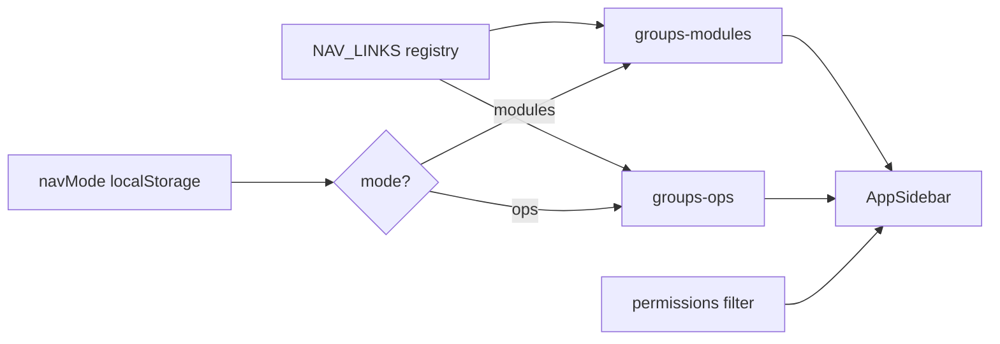

# PHASE 35: Admin Nav — Ops ↔ Modules Lens (+ IA Polish)

## Execution spec maturity

- **Mức hiện tại:** **✅ Module DoD 100%** (`rp4`+`rp5` 2026-07-22 · Option **B**)
- **Đánh giá:** Disk reindex **FILE_FAIL=0 / CONTENT_FAIL=0**. verify_nav_lens PASS · i18n 31a PASS · dbm **14/14** + video.
- **Trạng thái triển khai:** ✅ **ĐÓNG** Phase 35 — evidence `planning/evidence/phase_35_dbm/`

### Quyết định khóa (FOUNDER chọn Option B)

| Câu hỏi | Quyết định |
|---|---|
| Mode mặc định | **Modules** (IA hiện tại + polish) cho mọi user; nhớ preference user |
| Default theo role? | **Optional P1:** nếu có claim/role `WarehouseOperator` → Ops; else Modules. P0: chỉ `localStorage` |
| Đổi URL khi switch mode? | **Không** — chỉ đổi grouping sidebar |
| Nhân đôi page/route? | **Không** |
| Mobile shell nav? | **Out of scope** Phase 35 (chỉ `AppSidebar` — không đụng `/mobile/*`) |
| Tách Part/Shipping product? | **Không** |
| Mount surfaces | `app/page.tsx` + `admin/layout.tsx` + `master-data/layout.tsx` — **cùng** component (toggle hiện cả 3) |
| SSR / hydration | SSR luôn render **modules**; client `useEffect` đọc `localStorage` rồi set mode (tránh mismatch) |
| Collapse key | **Prefix bắt buộc** `{mode}:{titleKey}`; không migrate key cũ (orphan harmless) |
| Key `utilities` i18n | **Giữ** trong JSON (unused) — không xóa P0 (tránh churn verify_i18n) |

### Changelog plan

| Ngày | Thay đổi |
|---|---|
| 2026-07-22 | `/30-auto-project-planner`: Phase 35 từ `rcm` Option B (Ops↔Modules + polish A) |
| 2026-07-22 | **`rp1` 100% Ready:** Disk freeze 44 links / 3 mounts; hydration; i18n EN/VI exact; opsOther expand; verify checklist; §21 |
| 2026-07-22 | **`rp2` /17-auto-plan:** Function reindex §A–G; brain EP0–EP5 atomic; critic **9.8**; refine collapse/key/verify; §22 |
| 2026-07-22 | **`rp3` PASS:** Đóng BS-R3-01…18; copy-paste groups+collapse+toggle; residual OOS 15/16; §23 |
| 2026-07-22 | **`/18-auto-execute`:** EP0–EP5; registry+lens; i18n; verify PASS; dbm 6/6; CHANGELOG 1.5.0; §24 |
| 2026-07-22 | **`dbm` đầy đủ:** 14/14 + video `walkthrough-nav-lens.webm` + shots 01–06; §25 |
| 2026-07-22 | **`rp4`+`rp5`:** Disk reindex FAIL=0; Module DoD **100%**; đóng tài liệu phase/master/brain §26–§27 |

---

## 1. Mục tiêu

1. Cho phép chuyển **Modules** ↔ **Ops** trên Admin sidebar (cùng link, khác cách gom).  
2. **Polish IA (Option A):** tách Labor & Productivity; RMA khỏi Partners; gộp Utilities.  
3. Giảm nhiễu cho operator kho (nghĩ Nhập / Xuất / Quản kho) khi cutover GCM.

---

## 2. Phạm vi

### In scope

| # | Deliverable |
|---|---|
| 1 | Toggle UI trên sidebar (Modules \| Ops) |
| 2 | Persist `localStorage` key `nexustock:sidebar:navMode` = `modules` \| `ops` |
| 3 | Hai map grouping từ **cùng** `LinkItem` registry |
| 4 | Polish Modules: Labor group; RMA → outbound/returns; merge utilities → materials |
| 5 | Ops groups: `opsInbound`, `opsOutbound`, `opsInventory`, `opsOther` |
| 6 | i18n `Sidebar.json` VI/EN keys mới |
| 7 | `tests/verify_nav_lens.ps1` + optional `dbm_phase35_nav_browser.mjs` |
| 8 | Evidence `planning/evidence/phase_35_dbm/` khi dbm |

### Out of scope

- Persona packs (Option C)  
- Mobile nav redesign  
- Backend API / permission schema mới  
- Feature flag bắt buộc (optional `FF_NAV_OPS_LENS` default **on** nếu seed — P1; P0 không cần FF)  
- Đổi href / tạo page mới  

### Non-negotiable output

- Mọi link hiện có vẫn reachable ở **cả hai** mode (sau permission filter).  
- Không regression permission hide.  
- UI labels English catalogs; comments code tiếng Việt.

---

## 3. Điều kiện đầu vào

- [x] Phase 31–33 Sidebar i18n ✅  
- [x] `app-sidebar.tsx` + `messages/{vi,en}/Sidebar.json` ✅  
- [x] Phase 34 đóng (không block)  
- [x] FOUNDER chốt Option B ✅  

---

## 4. Setup / cấu trúc

```text
frontend/src/components/
  app-sidebar.tsx              # EXTEND — mode toggle + dual grouping
  nav/
    nav-registry.ts            # NEW — single source LinkItem[]
    nav-groups-modules.ts      # NEW — Modules grouping (+ polish A)
    nav-groups-ops.ts          # NEW — Ops grouping
    nav-mode.ts                # NEW — load/save navMode
frontend/messages/{vi,en}/Sidebar.json   # EXTEND
tests/verify_nav_lens.ps1                # NEW
tests/helpers/dbm_phase35_nav_browser.mjs  # NEW optional
planning/phases/phase_35_admin_nav_ops_modules_lens.md
planning/function_index_phase35_admin_nav_lens.md
```

### Quy chuẩn code

- Không hardcode label UI — chỉ `useTranslations("Sidebar")`.  
- Tách file registry khỏi component (maintainability).  
- Giữ collapse state `nexustock:sidebar:collapsed` theo `titleKey` mode-aware (prefix `modules:` / `ops:` **hoặc** reset collapse khi đổi mode — **default: prefix mode**).

---

## 5. Permissions

**Không** seed permission mới.  
SoT permission 1:1 = bảng **A** trong `planning/function_index_phase35_admin_nav_lens.md` (freeze disk `app-sidebar.tsx` 2026-07-22 · **44** links).

---

## 6. Database

**Không** migration.  
Optional P1: không lưu navMode server-side.

---

## 7. Backend / API

**Không** endpoint mới Phase 35 P0.

---

## 8. Frontend

### 8.1 Registry (pseudo)

```ts
// nav-registry.ts
export type NavLinkDef = {
  id: string;           // ổn định: "qc", "inbound", ...
  href: string;
  labelKey: string;     // Sidebar.links.*
  icon: LucideIcon;
  permission?: string;
};

export const NAV_LINKS: NavLinkDef[] = [ /* toàn bộ link hiện có + id */ ];
```

### 8.2 Modules grouping (sau polish A)

| Group key | Links (ids) |
|---|---|
| overview | home, healthUi |
| materials | products, uoms, **import** (gộp utilities) |
| warehouse | warehouses, zones, locations |
| partners | partners, reasons |
| inbound | inbound, lots, qc, putaway |
| outbound | outbound, allocation, waves, crossDocking, **rma** |
| inventory | inventory, stocktakes, exceptions, replenishment, lpn, serial, genealogy |
| labor | labor, laborSessions, taskInterleaving |
| integration | integration* , webhook* |
| system | users, roles, rules, audit, localAgent, observability*, readiness, cutover |

**Xóa** group `utilities` riêng.

### 8.3 Ops grouping

| Group key | Mục đích | Links (ids) |
|---|---|---|
| opsInbound | Nhập hàng | inbound, lots, qc, putaway |
| opsOutbound | Xuất hàng | outbound, allocation, waves, crossDocking, rma |
| opsInventory | Quản kho | inventory, stocktakes, replenishment, lpn, serial, genealogy, exceptions |
| opsOther | Cấu hình & khác | materials+warehouse+partners links, labor*, integration*, system*, overview |

Empty groups sau permission filter → ẩn (giữ logic hiện tại).

### 8.4 Toggle UX

- Vị trí: dưới brand “Nexustock WMS”, trên danh sách group.  
- Control: 2 segmented buttons / tabs nhỏ: **Modules** | **Ops**.  
- `data-testid="nav-mode-modules"` / `nav-mode-ops`.  
- Active mode: emerald accent (đồng bộ design system hiện tại).  
- Đổi mode: `setNavMode` + re-render groups; **không** `router.push`.

### 8.5 i18n keys — exact copy (VI/EN)

| Key path | EN | VI |
|---|---|---|
| `navMode.modules` | Modules | Modules |
| `navMode.ops` | Ops | Vận hành |
| `navMode.ariaLabel` | Sidebar grouping mode | Chế độ nhóm sidebar |
| `groups.labor` | Labor & Productivity | Lao động & Năng suất |
| `groups.opsInbound` | Inbound ops | Nhập hàng |
| `groups.opsOutbound` | Outbound ops | Xuất hàng |
| `groups.opsInventory` | Inventory ops | Quản kho |
| `groups.opsOther` | Config & other | Cấu hình & khác |

JSON shape (PascalCase module `Sidebar.json`):

```json
{
  "Sidebar": {
    "navMode": { "modules": "...", "ops": "...", "ariaLabel": "..." },
    "groups": { "labor": "...", "opsInbound": "...", "opsOutbound": "...", "opsInventory": "...", "opsOther": "..." }
  }
}
```

`groups.utilities` **giữ nguyên** (unused). Parity VI/EN bắt buộc.

### 8.6 States

| State | UI |
|---|---|
| Loading auth | Giữ sidebar hiện tại (permissions []) |
| Mode Modules | Groups polish A |
| Mode Ops | 4 groups ops* |
| No links in group | Group không render |

---

## 9. Luồng thực thi

```text
User mở Admin
  → load navMode từ localStorage (default "modules")
  → build groups = f(mode, NAV_LINKS, permissions)
  → User bấm Ops
      → save "ops" → rebuild groups → collapse keys prefixed
  → User bấm Modules
      → save "modules" → rebuild
  → Click link → điều hướng bình thường (URL không phụ thuộc mode)
```



---

## 10. Validation & business rules

1. **Permission:** filter giống hiện tại — thiếu quyền → ẩn link.  
2. **Parity:** mọi `href` trong Modules xuất hiện đúng 1 lần trong Ops (trừ duplicate cố ý — **cấm duplicate**).  
3. **Active path:** `isGroupActive` / link active không đổi theo mode.  
4. **Tenant:** không đụng.  
5. **XSS:** không `dangerouslySetInnerHTML`.

### Pseudo-code parity check (verify script)

```pseudocode
modulesHrefs = flatten(modulesGroups).hrefs.toSet()
opsHrefs = flatten(opsGroups).hrefs.toSet()
assert modulesHrefs == opsHrefs
assert noDuplicates(modulesHrefs)
assert noDuplicates(opsHrefs)
```

---

## 11. Exception handling

| Case | Behavior |
|---|---|
| localStorage bị chặn | Default `modules`; không crash |
| JSON corrupt | Reset default `modules` |
| Unknown mode value | Coerce → `modules` |
| i18n key thiếu | next-intl error — chặn bằng verify_i18n parity |

**Không** errorCode API mới.

---

## 12. Observability

- Optional `console` debug: không ship production log.  
- Không metric bắt buộc.  
- Audit: không.

---

## 13. Test plan

| Layer | Nội dung |
|---|---|
| Static | `verify_nav_lens.ps1` — registry exists; parity href; Sidebar keys VI/EN; RMA not under partners in modules map; labor group exists |
| Unit (optional) | Pure fn `buildGroups(mode, links, perms)` |
| UI / dbm | Login → toggle Ops → thấy opsInbound; toggle Modules → labor group; deep-link `/admin/qc` active đúng cả 2 mode |
| Regression | `verify_i18n.ps1` (Sidebar module vẫn PASS) |
| Permission | User thiếu `Qc.Queue.View` → QC ẩn cả 2 mode |

---

## 14. Acceptance Criteria

| ID | AC | Verify |
|---|---|---|
| AC-35-01 | Toggle Modules/Ops hiện trên sidebar Admin | UI/dbm |
| AC-35-02 | Preference persist sau F5 | localStorage |
| AC-35-03 | Đổi mode không đổi URL | Manual |
| AC-35-04 | Parity href Modules ≡ Ops | verify script |
| AC-35-05 | Modules: Labor group tách; RMA trong outbound; import trong materials | Code review + verify |
| AC-35-06 | Ops: đủ 3 cụm Nhập/Xuất/Quản kho + Other | UI |
| AC-35-07 | Permission filter không regress | Spot role |
| AC-35-08 | Sidebar VI/EN keys mới parity | verify_i18n / script |
| AC-35-09 | Không đụng mobile shell nav | Diff scope |
| AC-35-10 | dbm evidence ≥ toggle + 2 mode shots | phase_35_dbm |

---

## 15. Critic locks (auto-critique)

| ID | Risk | Lock |
|---|---|---|
| C1 | Duplicate links 2 mode lệch | Assert set equality |
| C2 | Collapse key đụng nhau 2 mode | Prefix `modules:`/`ops:` |
| C3 | Quên i18n VI | Parity keys bắt buộc |
| C4 | Scope creep persona packs | Out of scope C |
| C5 | max-h-96 cắt group dài opsOther | Tăng `max-h` hoặc scroll trong group (`max-h-[28rem] overflow-y-auto`) |
| H1 | Active group highlight sai sau đổi mode | Recompute `isGroupActive` |
| M1 | Default Ops cho mọi user gây shock admin | Default **modules** |

**Score plan:** **9.6 / 10** → **95% Execution-Ready**.  
**Sau `rp1` §21:** **9.7 / 10** → **✅ 100% Ready to Execute**.

---

## 16. Out of scope (nhắc lại)

Option C persona · Mobile nav · Server-side nav preference · New pages · FF bắt buộc P0 · ja/zh.

---

## 17. Downstream

- Training sheet cutover GCM: cập nhật “sidebar có chế độ Ops”.  
- Không ảnh hưởng API contracts.  
- Phase sau (reporting) chỉ thêm `NAV_LINKS` + gán group 2 maps.

---

## 18. Maintenance & Rollback

| Sự cố | Xử lý |
|---|---|
| Toggle gây blank sidebar | Xóa `localStorage.nexustock:sidebar:navMode` |
| Rollback code | Revert `app-sidebar` + `nav/*`; giữ Sidebar.json keys (harmless) |
| Hotfix | Feature: tạm hardcode `mode="modules"` 1 dòng |

---

## 19. EP map (execute)

| EP | Goal | Risk |
|---|---|---|
| EP0 | Extract `NAV_LINKS` registry từ sidebar hiện tại | LOW |
| EP1 | Modules polish A grouping | LOW |
| EP2 | Ops grouping + parity assert | LOW |
| EP3 | Toggle UI + localStorage + collapse prefix | MEDIUM |
| EP4 | i18n VI/EN + verify_nav_lens | LOW |
| EP5 | dbm + đóng phase docs | LOW |

---

## 20. File checklist DoD

- [ ] `nav-registry.ts`  
- [ ] `nav-groups-modules.ts` / `nav-groups-ops.ts` / `nav-mode.ts`  
- [ ] `app-sidebar.tsx` dùng registry + toggle  
- [ ] Sidebar.json VI/EN  
- [ ] `tests/verify_nav_lens.ps1` PASS  
- [ ] dbm evidence  
- [ ] IMPLEMENTATION_PLAN P35 ✅  

---

**Chữ ký plan:** JARVIS · `/30-auto-project-planner` · Option B · 2026-07-22

---

## 21. `rp1` update 100% (2026-07-22) — không xóa §1–§20

### 21.1 Câu hỏi gate

> Plan/phase đã đúng đủ chuẩn **100%** để thực hiện chưa?

### 21.2 Disk freeze — mount & link count

| Surface | Path | Có `AppSidebar`? | P35 impact |
|---|---|---|---|
| Home shell | `frontend/src/app/page.tsx` | ✅ | Toggle hiện |
| Admin | `frontend/src/app/admin/layout.tsx` | ✅ | Toggle hiện |
| Master-data | `frontend/src/app/master-data/layout.tsx` | ✅ | Toggle hiện |
| Mobile | `frontend/src/app/mobile/**` | ❌ | **Không đụng** |

| Metric | Giá trị freeze |
|---|---|
| Link count registry | **44** (`function_index` §A) |
| Modules groups sau polish | **10** (bỏ `utilities`) |
| Ops groups | **4** |
| Parity Modules ≡ Ops | **44 = 44** (assert verify) |

### 21.3 Blind spots → khóa

| ID | Severity | Điểm mù | Khóa execute |
|---|---|---|---|
| BS-35-01 | HIGH | SSR hydration mismatch `localStorage` | SSR/default state = `modules`; `useEffect` mới `setNavMode(load())` |
| BS-35-02 | HIGH | Collapse key cũ (`inbound`) vs prefix mới | Chỉ đọc/ghi `{mode}:{titleKey}`; orphan key cũ bỏ qua |
| BS-35-03 | HIGH | opsOther wildcard không đủ để code | Expand full id list §21.4 + function_index §C |
| BS-35-04 | MEDIUM | Permission table phase placeholder | SoT = function_index §A |
| BS-35-05 | MEDIUM | i18n chỉ liệt kê key, thiếu copy | §8.5 exact EN/VI |
| BS-35-06 | MEDIUM | `max-h-96` cắt opsOther (~28 links) | EP3: open group dùng `max-h-[min(28rem,70vh)] overflow-y-auto` |
| BS-35-07 | LOW | `pathname.startsWith('/admin/inventory')` active cả stocktakes | **Residual pre-existing** — không đổi P35; optional P1 sort longer href first |
| BS-35-08 | LOW | Verify script chưa có skeleton | §21.5 checklist bắt buộc EP4 |
| BS-35-09 | LOW | Toggle trên home `/` có cần không? | **Có** — cùng component; chấp nhận (FOUNDER Option B) |

### 21.4 Ops `opsOther` — expand đầy đủ (SoT)

```text
home, healthUi,
products, uoms, import,
warehouses, zones, locations,
partners, reasons,
labor, laborSessions, taskInterleaving,
integrationMessages, integrationMappings, integrationImport,
webhookSubscriptions, webhookDeliveries,
users, roles, rules, audit, localAgent,
observability, alerts, timeline, readiness, cutover
```

**= 28 ids.** Tổng Ops = 4+5+7+28 = **44**.

### 21.5 `verify_nav_lens.ps1` — checklist DoD (EP4)

| # | Assert |
|---|---|
| 1 | Tồn tại `frontend/src/components/nav/nav-registry.ts` (+ groups-modules/ops + nav-mode) |
| 2 | `app-sidebar.tsx` import registry; **không** còn hardcode `navGroupDefs` inline dài (hoặc chỉ re-export) |
| 3 | Parse modules map + ops map → set(href) equal; count = 44; no duplicate href trong từng mode |
| 4 | Modules: `rma` **không** trong group `partners`; **có** trong `outbound` |
| 5 | Modules: group `labor` chứa labor, laborSessions, taskInterleaving |
| 6 | Modules: `import` trong `materials`; **không** còn group `utilities` trong code map |
| 7 | `Sidebar.json` VI + EN có đủ 8 keys §8.5; leaf string non-empty |
| 8 | Grep `/mobile` không import `nav-mode` / không đổi mobile layout |
| 9 | (Optional) `verify_i18n.ps1` Sidebar module vẫn PASS |

### 21.6 Pseudo-code hydration (EP3 must)

```tsx
// PSEUDO — app-sidebar / nav-mode
const [navMode, setNavMode] = useState<NavMode>("modules"); // SSR-safe

useEffect(() => {
  setNavMode(loadNavMode()); // localStorage → modules|ops
}, []);

function onSelectMode(next: NavMode) {
  setNavMode(next);
  saveNavMode(next);
}

function collapseKey(mode: NavMode, titleKey: string) {
  return `${mode}:${titleKey}`;
}
```

```ts
// PSEUDO — loadNavMode
export function loadNavMode(): "modules" | "ops" {
  try {
    const v = localStorage.getItem("nexustock:sidebar:navMode");
    return v === "ops" ? "ops" : "modules";
  } catch {
    return "modules";
  }
}
```

### 21.7 EP adjustments (`rp1` — không xóa EP cũ)

| EP | Bổ sung `rp1` |
|---|---|
| EP0 | Freeze 44 links đúng function_index §A; export `id` trên mỗi link |
| EP1 | Modules 10 groups; assert không `utilities` |
| EP2 | Ops 4 groups; opsOther = §21.4 exact |
| EP3 | Hydration §21.6; collapseKey prefix; max-h scroll opsOther; testid toggle |
| EP4 | i18n exact §8.5; `verify_nav_lens.ps1` đủ §21.5 |
| EP5 | dbm: shot modules + ops + localStorage persist; đóng docs |

### 21.8 File checklist bổ sung (DoD)

- [ ] 44 ids registry khớp function_index  
- [ ] Hydration SSR-safe  
- [ ] opsOther 28 ids exact  
- [ ] i18n 8 keys EN/VI exact  
- [ ] verify_nav_lens §21.5 PASS  
- [ ] Không đụng `app/mobile/**`  

### 21.9 Verdict `rp1`

**PASS — 100% Ready to Execute** sau khi khóa §21.  
Score **9.7/10** (BS đóng; residual BS-35-07 không chặn DoD).

Next: `` `rp3 `` (tuỳ) → `` `tt `` / `/18-auto-execute` / `/04-do-plan`.

**Không** execute trong lượt `rp1`.

---

## 22. `rp2` /17-auto-plan (2026-07-22) — không xóa §1–§21

### 22.1 Pipeline đã chạy

| Phase pipeline | Output |
|---|---|
| 0 — Function index | `planning/function_index_phase35_admin_nav_lens.md` — §A–G + icon map + runtime + MUST NOT |
| 1 — Create plan | Brain `implementation_plan.md` — EP0–EP5 · Task 0.1–5.2 atomic |
| 2 — Critic | Brain `critic_report.md` — **9.8/10** PASS |
| 3 — Refine | R2-35-01…05 nhúng EP3/EP4 (collapse khi đổi mode; Link key=`id`; verify parse `linkIds`; dbm port) |

### 22.2 Insight disk (`rp2`)

| ID | Finding | Khóa execute |
|---|---|---|
| R2-ASB | Sidebar vẫn monolit `navGroupDefs` 11 groups | EP0 extract trước mọi UI |
| R2-ICON | Icon gắn inline — dễ lệch khi tách | function_index §A2 SoT icon |
| R2-COL | `useEffect([permissions, pathname, navGroups])` reset collapse | EP3: đổi mode → init prefix mới; đổi path → giữ logic active-open |
| R2-PAR | Parity chỉ mô tả prose | EP2 + verify set equality 44 |
| R2-I18N | 8 keys chưa có trên disk | EP4 exact §8.5 trước/verify cùng lúc |

### 22.3 Execute order (Flash-safe)

```text
EP0 registry+icons → EP1 modules polish → EP2 ops+parity
  → EP3 sidebar wire (hydration/collapse/toggle/max-h)
  → EP4 i18n + verify_nav_lens → EP5 dbm + đóng docs
```

SoT execute: brain `implementation_plan.md` + phase §21–§22.  
Critic locks: brain `critic_report.md`.

### 22.4 File checklist bổ sung DoD (`rp2`)

- [ ] function_index §A2 icons khớp registry  
- [ ] `resolveLinks` throw nếu thiếu id  
- [ ] Collapse prefix khi **đổi mode** (R2-35-02)  
- [ ] Link React `key={id}`  
- [ ] verify parse `linkIds` ổn định  

### 22.5 Verdict `rp2`

**PASS — 100% Ready to Execute** (critic **9.8/10**).  
Đồng bộ: function index ↔ phase §21/§22 ↔ brain plan ↔ master P35.

Next: `` `rp3 `` (tuỳ) → `` `tt `` / `/18-auto-execute` / `/04-do-plan`.

**Không** execute trong lượt `rp2`.

---

## 23. `rp3` — đủ chi tiết xuyên suốt? (2026-07-22)

### 23.1 Câu hỏi gate

> Plan đã đủ chi tiết, rõ ràng để thực hiện xuyên suốt và **không còn điểm mù** chưa?

### 23.2 Ma trận điểm mù → khóa (PASS)

| ID | Điểm mù tiềm ẩn | Verdict | Khóa execute |
|---|---|---|---|
| BS-R3-01 | Collapse state vẫn dùng `titleKey` thô → đụng Modules/Ops | **CLOSED** | Mọi đọc/ghi/toggle dùng `ck = \`${navMode}:${titleKey}\``; `isOpen = !collapsed[ck]`; §23.3 |
| BS-R3-02 | `useEffect([pathname, navGroups])` xóa preference collapse mỗi navigate | **CLOSED** | Tách 2 effect: (A) mount+đổi **navMode** → seed collapsed từ storage+active; (B) đổi pathname/permissions → chỉ **bổ sung** key thiếu, không ghi đè key đã có. §23.3 |
| BS-R3-03 | React `key={titleKey}` tái dùng DOM khi đổi mode | **CLOSED** | Group `key={\`${navMode}:${titleKey}\`}`; Link `key={link.id}` |
| BS-R3-04 | `NavLinkDef` thiếu `id` trên runtime LinkItem | **CLOSED** | Registry có `id`; resolve giữ `id` xuyên map/filter |
| BS-R3-05 | Executor không biết literal groups | **CLOSED** | Copy-paste §23.4 MODULES_GROUPS / OPS_GROUPS |
| BS-R3-06 | Toggle UI markup mơ hồ | **CLOSED** | §23.5 JSX tối thiểu |
| BS-R3-07 | `nav-*.ts` có cần `"use client"`? | **CLOSED** | **Không** — chỉ `app-sidebar.tsx` là client; nav modules pure data/helpers |
| BS-R3-08 | Barrel `nav/index.ts`? | **CLOSED** | **Không bắt buộc** — import path trực tiếp |
| BS-R3-09 | Verify parse multiline `linkIds` | **CLOSED** | Mỗi group: `linkIds: ["a", "b", ...]` **một dòng**; verify: đếm id trong MODULES + OPS files + so href qua registry regex |
| BS-R3-10 | Registry verify không cần tsc | **CLOSED** | Export thêm `export const NAV_LINK_COUNT = 44` và comment `// @nav-registry-count 44`; verify assert file contains + count `id:` fields = 44 |
| BS-R3-11 | i18n `t("navMode.modules")` namespace | **CLOSED** | Keys dưới root `Sidebar` trong JSON → `t("navMode.modules")` / `t("groups.labor")` đúng next-intl |
| BS-R3-12 | Empty permissions lúc load | **CLOSED** | Giữ filter hiện tại — groups rỗng tạm; không đổi auth |
| BS-R3-13 | CHANGELOG version | **CLOSED** | Cùng ngày version hiện tại (1.5.x): **patch note** user-facing khi ship; EP5 chỉ cập nhật phase/master trừ FOUNDER gọi save-brain |
| BS-R3-14 | dbm khi FE down | **CLOSED** | Script fail rõ; DoD dbm cần FE+login; static verify_nav_lens **đủ** gate code trước dbm |
| BS-R3-15 | Active inventory/stocktakes | **RESIDUAL OOS** | BS-35-07 — không fix P35 |
| BS-R3-16 | Default Ops theo role | **RESIDUAL OOS** | P1 optional — P0 localStorage only |
| BS-R3-17 | `health-ui` vs `/health-ui` path | **CLOSED** | href giữ `/health-ui` (disk) |
| BS-R3-18 | Task 1.2 `buildModuleGroups` thừa? | **CLOSED** | Có thể inline `MODULES_GROUPS` + `resolveLinks` trong sidebar `useMemo` — **không** bắt buộc hàm riêng nếu EP1 export const groups |

### 23.3 Collapse — pseudo bắt buộc (thay logic hiện tại)

```tsx
// PSEUDO EP3 — collapse keyed by mode
function ck(mode: NavMode, titleKey: string) {
  return `${mode}:${titleKey}`;
}

// Effect A: navMode thay đổi (kể cả hydrate từ localStorage)
useEffect(() => {
  const saved = loadCollapsed();
  const initial: Record<string, boolean> = { ...collapsed }; // hoặc merge
  const next: Record<string, boolean> = {};
  for (const g of navGroups) {
    const k = ck(navMode, g.titleKey);
    if (k in saved) next[k] = saved[k];
    else next[k] = !isGroupActive(g, pathname, permissions);
  }
  setCollapsed((prev) => ({ ...prev, ...next }));
  saveCollapsed({ ...loadCollapsed(), ...next });
}, [navMode]); // intentional: mode switch / hydrate

// Effect B: pathname hoặc permissions — chỉ fill key thiếu
useEffect(() => {
  setCollapsed((prev) => {
    const saved = loadCollapsed();
    let changed = false;
    const next = { ...prev };
    for (const g of navGroups) {
      const k = ck(navMode, g.titleKey);
      if (!(k in next)) {
        next[k] = k in saved ? saved[k] : !isGroupActive(g, pathname, permissions);
        changed = true;
      }
    }
    if (changed) saveCollapsed({ ...saved, ...next });
    return changed ? next : prev;
  });
}, [pathname, permissions, navGroups, navMode]);

const toggle = (titleKey: string) => {
  const k = ck(navMode, titleKey);
  setCollapsed((prev) => {
    const next = { ...prev, [k]: !prev[k] };
    saveCollapsed({ ...loadCollapsed(), ...next });
    return next;
  });
};
```

### 23.4 Copy-paste groups (SoT code)

```ts
// nav-groups-modules.ts — MODULES_GROUPS (mỗi linkIds 1 dòng)
export const MODULES_GROUPS: NavGroupSpec[] = [
  { titleKey: "overview", linkIds: ["home", "healthUi"] },
  { titleKey: "materials", linkIds: ["products", "uoms", "import"] },
  { titleKey: "warehouse", linkIds: ["warehouses", "zones", "locations"] },
  { titleKey: "partners", linkIds: ["partners", "reasons"] },
  { titleKey: "inbound", linkIds: ["inbound", "lots", "qc", "putaway"] },
  { titleKey: "outbound", linkIds: ["outbound", "allocation", "waves", "crossDocking", "rma"] },
  { titleKey: "inventory", linkIds: ["inventory", "stocktakes", "exceptions", "replenishment", "lpn", "serial", "genealogy"] },
  { titleKey: "labor", linkIds: ["labor", "laborSessions", "taskInterleaving"] },
  { titleKey: "integration", linkIds: ["integrationMessages", "integrationMappings", "integrationImport", "webhookSubscriptions", "webhookDeliveries"] },
  { titleKey: "system", linkIds: ["users", "roles", "rules", "audit", "localAgent", "observability", "alerts", "timeline", "readiness", "cutover"] },
];

// nav-groups-ops.ts — OPS_GROUPS
export const OPS_GROUPS: NavGroupSpec[] = [
  { titleKey: "opsInbound", linkIds: ["inbound", "lots", "qc", "putaway"] },
  { titleKey: "opsOutbound", linkIds: ["outbound", "allocation", "waves", "crossDocking", "rma"] },
  { titleKey: "opsInventory", linkIds: ["inventory", "stocktakes", "replenishment", "lpn", "serial", "genealogy", "exceptions"] },
  { titleKey: "opsOther", linkIds: ["home", "healthUi", "products", "uoms", "import", "warehouses", "zones", "locations", "partners", "reasons", "labor", "laborSessions", "taskInterleaving", "integrationMessages", "integrationMappings", "integrationImport", "webhookSubscriptions", "webhookDeliveries", "users", "roles", "rules", "audit", "localAgent", "observability", "alerts", "timeline", "readiness", "cutover"] },
];
```

### 23.5 Toggle JSX tối thiểu

```tsx
<div
  role="group"
  aria-label={t("navMode.ariaLabel")}
  className="mb-4 flex gap-1 rounded-lg border border-zinc-800 p-1"
>
  <button
    type="button"
    data-testid="nav-mode-modules"
    onClick={() => onSelectMode("modules")}
    className={clsx(
      "flex-1 rounded-md px-2 py-1.5 text-xs font-semibold",
      navMode === "modules" ? "bg-emerald-500/15 text-emerald-400" : "text-zinc-500 hover:text-zinc-300"
    )}
  >
    {t("navMode.modules")}
  </button>
  <button
    type="button"
    data-testid="nav-mode-ops"
    onClick={() => onSelectMode("ops")}
    className={clsx(
      "flex-1 rounded-md px-2 py-1.5 text-xs font-semibold",
      navMode === "ops" ? "bg-emerald-500/15 text-emerald-400" : "text-zinc-500 hover:text-zinc-300"
    )}
  >
    {t("navMode.ops")}
  </button>
</div>
```

Đặt **sau** brand Link, **trước** danh sách groups.

### 23.6 EP task stubs đã đủ? (đóng)

| Task | rp3 note |
|---|---|
| 0.1 | + `NAV_LINK_COUNT = 44` + icons §A2 |
| 0.2 | Có thể gộp vào 1.1/2.1 — không chặn |
| 1.1 | Dùng §23.4 literal |
| 2.1 | Dùng §23.4 literal |
| 3.2 | Thay collapse bằng §23.3; toggle §23.5; max-h scroll |
| 4.2 | Assert `NAV_LINK_COUNT` / 44 `id:`; single-line linkIds; parity flatten |
| 5.1 | FE port confirm; testid click |

### 23.7 Verdict `rp3`

**PASS — đủ chi tiết xuyên suốt, không điểm mù chặn W1.**  
Score giữ **9.8/10** (residual BS-R3-15/16 OOS).

SoT execute: brain `implementation_plan.md` + phase **§21–§23**.

Next: `` `tt `` / `/18-auto-execute` / `/04-do-plan`.

**Không** execute trong lượt `rp3`.

---

## 24. `/18-auto-execute` — đóng phase (2026-07-22)

### 24.1 Kết quả

| Gate | Kết quả |
|---|---|
| EP0–EP5 code | ✅ |
| `verify_nav_lens.ps1` | ✅ ALL PASS |
| `verify_i18n.ps1 -Phase 31a` | ✅ PASS |
| dbm `dbm_phase35_nav_browser.mjs` | ✅ **6/6** PASS |
| CHANGELOG / README | ✅ cập nhật cùng ngày **1.5.0** |

### 24.2 File đã giao

- `frontend/src/components/nav/*` (registry, modules, ops, mode)
- `frontend/src/components/app-sidebar.tsx`
- `frontend/messages/{en,vi}/Sidebar.json`
- `tests/verify_nav_lens.ps1`
- `tests/helpers/dbm_phase35_nav_browser.mjs`
- Evidence: `planning/evidence/phase_35_dbm/`

### 24.3 Verdict

**PASS — Module DoD 100%** (static + dbm). Residual BS-35-07 / BS-R3-15–16 không chặn.

Phase 35 **ĐÓNG**.

---

## 25. `dbm` evidence đầy đủ (2026-07-22) — không xóa §24

### 25.1 Kết quả browser

| Metric | Value |
|---|---|
| Browser checks | **14/14 PASS** |
| Static `verify_nav_lens` | **ALL PASS** |
| Video | `planning/evidence/phase_35_dbm/walkthrough-nav-lens.webm` |
| Shots | 01–06 (+ legacy 01–03) |
| Walkthrough | `planning/evidence/phase_35_dbm/walkthrough.md` |
| FE / API | `:3003` / `:5024` |

### 25.2 AC coverage live

AC-35-01…03, 05…08, 10 + DEEP + MOUNT **PASS**. AC-35-04/09 = static. Residual inventory active-path OOS.

### 25.3 Verdict `dbm`

**PASS — bằng chứng ảnh + video đủ chuẩn plan/phase 100%.**

---

## 26. `rp4` — reindex + đóng tài liệu (2026-07-22)

### 26.1 Câu hỏi gate

> Đã triển khai đúng đủ chuẩn **100%** plan/phase chưa? Nếu đủ → cập nhật hoàn thành tài liệu.

### 26.2 Disk reindex — FILE matrix

| Path (SoT function_index §G) | Exists | Verdict |
|---|---|---|
| `frontend/src/components/nav/nav-registry.ts` | ✅ | PASS |
| `frontend/src/components/nav/nav-groups-modules.ts` | ✅ | PASS |
| `frontend/src/components/nav/nav-groups-ops.ts` | ✅ | PASS |
| `frontend/src/components/nav/nav-mode.ts` | ✅ | PASS |
| `frontend/src/components/app-sidebar.tsx` | ✅ | PASS |
| `frontend/messages/en/Sidebar.json` | ✅ | PASS |
| `frontend/messages/vi/Sidebar.json` | ✅ | PASS |
| `tests/verify_nav_lens.ps1` | ✅ | PASS |
| `tests/helpers/dbm_phase35_nav_browser.mjs` | ✅ | PASS |
| `planning/evidence/phase_35_dbm/walkthrough.md` | ✅ | PASS |
| `planning/evidence/phase_35_dbm/walkthrough-nav-lens.webm` | ✅ | PASS |
| Shots 01–06 | ✅ | PASS |

**FILE_FAIL = 0**

### 26.3 Disk reindex — CONTENT matrix

| Check | Evidence | Verdict |
|---|---|---|
| Không còn `navGroupDefs` inline | grep app-sidebar | PASS |
| `NAV_LINK_COUNT=44` + parity Modules≡Ops | verify_nav_lens | PASS |
| Polish A: labor / rma outbound / import materials / no utilities | verify + code | PASS |
| Toggle testid + hydration + `collapseKey` | app-sidebar | PASS |
| Mounts page/admin/master-data | grep AppSidebar | PASS |
| Mobile OOS | grep mobile = 0 hits | PASS |
| i18n 8 keys VI/EN | verify_nav_lens + verify_i18n 31a | PASS |
| dbm 14/14 + video | results.json | PASS |
| CHANGELOG 1.5.0 + README + master ✅ | disk | PASS |

**CONTENT_FAIL = 0**

### 26.4 AC DoD đóng

| AC | Status |
|---|---|
| AC-35-01…03, 05…08, 10 | ✅ live/dbm |
| AC-35-04, 09 | ✅ static |
| Residual BS-35-07 / role-default Ops | OOS — không chặn |

### 26.5 Tài liệu hoàn thành (`rp4`)

- [x] phase_35 maturity **Module DoD 100%** + §26  
- [x] IMPLEMENTATION_PLAN P35 ✅ + link dbm  
- [x] function_index §I rp4/rp5  
- [x] brain task_tracking / execution_state  

### 26.6 Verdict `rp4`

**PASS — triển khai đúng đủ 100%; tài liệu phase/plan đã cập nhật hoàn thành.**

---

## 27. `rp5` — reindex xác nhận lần 2 (2026-07-22)

### 27.1 Câu hỏi gate

> Reindex lại: đã triển khai đúng đủ chuẩn **100%** plan/phase chưa?

### 27.2 Re-run gates (cùng phiên)

| Gate | Kết quả |
|---|---|
| `verify_nav_lens.ps1` | ✅ ALL PASS (re-run) |
| `verify_i18n.ps1 -Phase 31a` | ✅ ALL PASS (re-run) |
| Evidence dbm on disk | ✅ 14/14 · webm · shots |
| Code mounts / mobile OOS | ✅ khớp §21.2 |

### 27.3 Verdict `rp5`

**PASS — xác nhận độc lập Module DoD 100%.**  
Không phát sinh gap mới so với §26. Residual OOS giữ nguyên.

**Phase 35 KHÓA ĐÓNG** (`rp4`+`rp5`).
